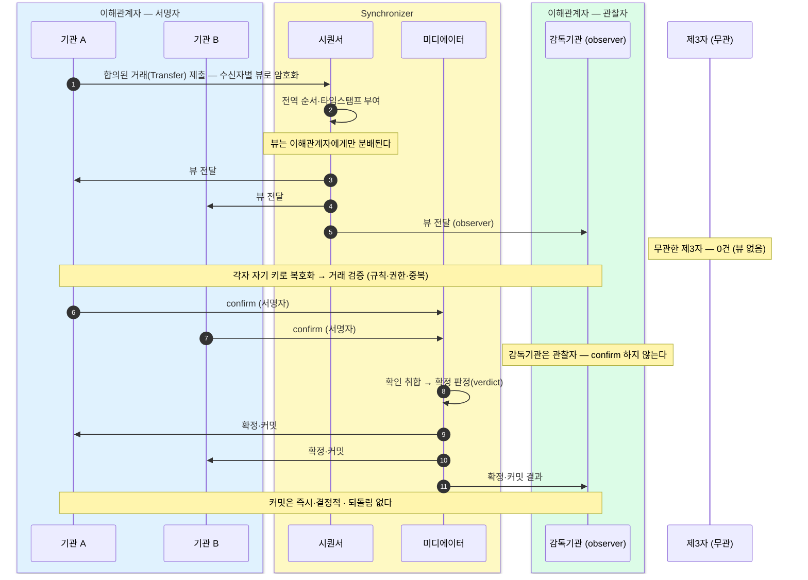

같은 거래인데 노드마다 받는 게 다르다 — 한 거래가 제출·순서화·뷰 전달·확인·커밋을 지나는 전 과정을 미리보기로 펼친다.
뷰는 이해관계자에게만 가고, 그 이해관계자는 컨트랙트의 signatory·observer 선언이 정한다 — 서명자만 confirm 하고 관찰자는 열람만 한다.

## 한 거래가 처리되는 전 과정 (미리보기)

앞 장의 **세 기둥**(파티 · Synchronizer · 원장)이 한 거래에서 실제로 어떻게 도는지, 처리 단계까지 펼치면 아래처럼 된다. **지금 전부 이해할 필요는 없다** — 제출·순서화·뷰 전달·확인·커밋의 각 조각은 뒤 장(8장·9장)에서 하나씩 푼다. 우선 **"같은 거래인데 노드마다 받는 게 다르다"**만 눈에 담으면 된다.



한 거래는 **이해관계자에게만** 뷰가 전달된다. 기관 A 가 합의된 거래를 제출하면 시퀀서가 **전역 순서·타임스탬프**를 붙이고, 그 뷰를 A·B·감독기관에게만 나눠 준다 — 무관한 제3자는 **0건**이다. 각자 자기 키로 복호화해 거래를 검증한 뒤, **서명자인 A·B만 confirm** 한다. 미디에이터가 확인을 취합해 확정 판정(verdict)을 내리면 결과가 **커밋**된다 — 즉시·결정적이라 되돌림이 없다. 감독기관은 뷰만 받고 결과만 통지받을 뿐 **confirm 은 하지 않는다.**

**①에서 제출되는 것** — A·B 가 합의한 거래(Transfer)다. 두 서명자 컨트랙트는 한쪽이 단독으로 못 만들어 **propose-accept(제안-수락)** 로 합의한다(A 제안 → B 수락; 제안·수락 단계는 9장 정산에서). 합의된 거래가 제출되면 제출 노드가 이를 **수신자별 뷰로 암호화**해 시퀀서에 보낸다.

**가시성은 선택이다** — 위에서 감독기관은 observer(관찰자)로 지정돼 자기 뷰를 받지만, 거래에 무관한 제3자는 0건이다. "제3자는 무조건 못 본다"가 아니라 **누가 볼지를 명시적으로 정한다**는 게 핵심 — 기본은 비공개, 공개는 열어 주는 것이다.

## 뷰(view)란?

**뷰는 한 거래에서 내가 이해관계자로 적혀 있어 받게 되는 부분**이다. 거래 전체가 통째로 오는 게 아니라, 자신과 관련된 조각만 받는다. "누가 이해관계자인가"는 컨트랙트의 **signatory(서명자)·observer(관찰자)** 선언이 정한다 — 거기 적힌 파티만 뷰를 받고, 없는 제3자는 0건이다.

## 개발자 시점 — 뷰는 누가 받나 (signatory / observer)

급하지 않으면 건너뛰어도 된다. 위 다이어그램은 사실 이 선언을 그린 것이다. `signatory`·`observer` 에 적힌 파티만 이 컨트랙트의 뷰를 받는다.

```daml
template Transfer with
    payer     : Party      -- 기관 A
    payee     : Party      -- 기관 B
    amount    : Decimal
    regulator : Party      -- 감독기관
  where
    signatory payer, payee     -- A·B 둘 다 서명자 → 둘 다 동의·confirm
    observer  regulator        -- 감독기관: 열람만
    -- 여기 없는 제3자 → 뷰 없음 (0건)
```

payer(A)·payee(B)·regulator(감독기관)가 이해관계자라 각자 자기 뷰를 받는다. 감독기관을 `observer` 에서 빼면 그 순간 감독기관도 0건이 된다 — **가시성은 이 선언으로 정해진다.**

**왜 A·B 둘 다 서명자인가?** 이 거래는 양쪽의 동의가 필요한 합의라 `signatory payer, payee` — A·B 모두 권한자다. 그래서 **A·B 둘 다 confirm** 한다. 다만 두 서명자 컨트랙트는 한쪽이 단독으로 못 만드니, A 가 제안하고 B 가 수락하는 **propose-accept** 로 합의해 생성한다(9장 정산의 `SettlementProposal`: `signatory approvers` + `_Accept` 가 승인자를 추가하는 구조).

반면 **감독기관은 observer** 라 뷰는 받지만 **confirm 하지 않는다** — 확인은 권한이 필요한 서명자만 한다. 그래서 다이어그램에서 A·B 는 confirm 하고, 감독기관은 결과만 받는다.

그래서 A·B·감독기관이 실제로 받는 뷰는 같은 컨트랙트이고, **역할만** 다르다:

| 받는 파티 | 받는 내용 | 내 역할 |
|---|---|---|
| **기관 A** | `Transfer @00a1f2e7…` (payer = 나) | **signatory** — 동의·confirm |
| **기관 B** | 같은 컨트랙트 (payee = 나) | **signatory** — 동의·confirm |
| **감독기관** | 같은 컨트랙트 (regulator = 나) | **observer** — 열람·감독 |
| **제3자** | — | 뷰 없음 (0건) |

**주의** — 이 거래는 컨트랙트 하나라 A·B·감독기관이 받는 내용은 같고 **역할만** 다르다(A·B 는 서명자=동의·confirm, 감독기관은 관찰자=열람). 제3자는 이 컨트랙트 자체를 못 받는다. 여러 단계 거래(예: 보관+생성, 정산의 두 다리)에선 각자 받는 **부분이 실제로 달라진다** — 9장 정산·프라이버시에서 본다.

## 뷰를 받은 다음은?

뷰 전달로 끝이 아니다. 뷰를 받은 **이해관계자 노드가 그 거래를 검증**하고(규칙·권한·중복 확인), 미디에이터에 **"유효함"을 confirm** 한 뒤, 확정되면 **커밋**된다 — 옛 컨트랙트는 보관되고 새 컨트랙트가 생긴다. 즉시·결정적이라 되돌림이 없다.

제출부터 커밋까지 전체 흐름은 **8장 트랜잭션 흐름**에서 한 단계씩 따라가고, propose-accept 의 제안·수락 상세는 **9장 정산**에서 본다. 이 한 가지 원리가 아키텍처·원장·프라이버시·신뢰 모델 전부를 끌고 간다.
