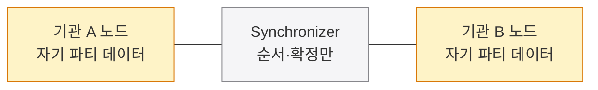
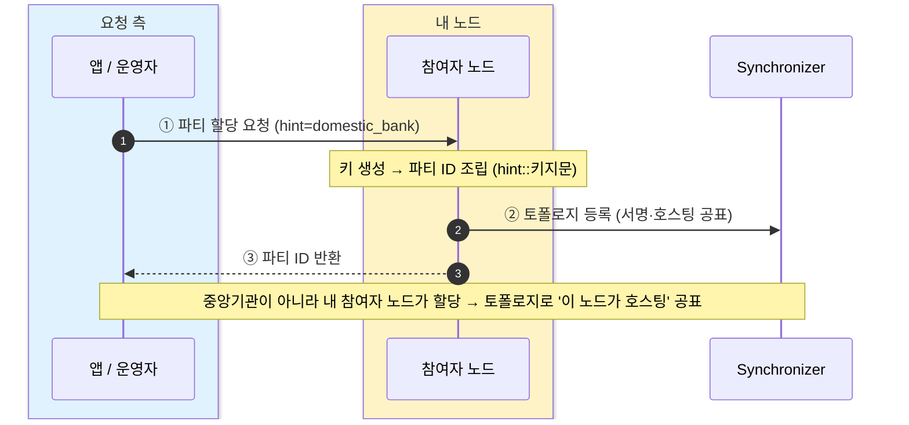

Canton은 단일 체인이 아니라 참여자 노드들과 Synchronizer로 이뤄진 망이며, 이 망을 이루는 네 구성요소(파티·밸리데이터·Synchronizer·스마트 컨트랙트)를 정리한다.
파티는 전용 장이 없어 여기서 식별·생성까지 다루고, 파티 ID 구조·생성 절차·토폴로지·HD 월렛 적용 여부를 개발자 시점으로 짚는다.

## 네 가지 구성요소, 하나의 망

Canton은 거대한 단일 체인이 아니라 **참여자 노드들과 Synchronizer로 이뤄진 망**이다. 각 노드는 자기 파티의 데이터만 들고, Synchronizer는 그 사이의 순서·확정만 맞춘다. 상태도 자산도 Synchronizer에 쌓이지 않는다.



단일 글로벌 체인이 아니다. 노드마다 자기 파티 것만 저장하고, 그 노드들을 잇는 건 Synchronizer뿐이다. Synchronizer는 거래의 순서와 확정만 담당하고 상태·자산은 쥐지 않는다 — 전체 사본을 든 주체가 어디에도 없다.

## 구성요소 넷

| 구성요소 | 축 | 역할 |
|---|---|---|
| **파티 (Party)** | WHO · 권한 주체 | 권한과 데이터 가시성의 단위. 기관·사람·서비스가 될 수 있고, 한 파티를 여러 노드가 함께 호스팅할 수도 있다(복원력). 할 수 있는 건 셋 — **검증**(자기 컨트랙트에 영향 주는 거래 확인) · **제어**(choice 실행) · **관찰**(상태 열람). |
| **밸리데이터(참여자 노드)** | WHERE · 저장 | 파티를 호스팅하고 **자기 파티가 이해관계자인 컨트랙트만** 저장·검증한다. 전체 사본은 어디에도 없다. |
| **Synchronizer** | ORDER · 조율 | **시퀀서**(전역 순서) + **미디에이터**(확인 취합). 사설/글로벌 두 종류가 있고, 상태·자산은 저장하지 않는다. |
| **스마트 컨트랙트(템플릿)** | RULES · 규칙 | 비즈니스 규칙을 **Daml 템플릿**으로 작성한다. 컨트랙트는 한번 생성되면 불변이다. |

각 구성요소의 **개발 상세는 전용 장**에 있다 — 스마트 컨트랙트는 5장(Daml), 밸리데이터·Synchronizer는 6장(아키텍처). 파티는 전용 장이 없어 식별·생성까지 여기서 다룬다.

## 개발자 시점 1 — 파티는 어떻게 식별되나

파티 ID는 사람이 읽는 **hint**와, 그 파티를 만든 **키의 지문**이 `::`로 이어진 문자열이다. 이더리움 주소가 키에서 파생되듯, 파티 ID에도 소유 주체의 키가 박혀 있다.

```
domestic_bank_3f…::1220abcd…(64자리 16진 키 지문)
└── hint ──┘   └──── 네임스페이스 = 키 지문 ────┘
```

**로컬 파티**는 키를 노드가 보관(`isLocal=true`)해 운영이 단순하다. **외부 파티**는 키를 본인이 직접 쥔다(자기수탁) — 노드를 신뢰하지 않아도 된다. 데모에선 hint 접두로 역할을 가린다: `domestic_bank_…`(기관 A) · `overseas_bank_…`(기관 B) · `DSO::…`(자산 발행자).

## 개발자 시점 2 — 파티는 어떻게 생성되나

파티는 중앙 등록기관이 만들어 주는 게 아니다. **내가 통제하는 참여자 노드에 "파티를 할당해줘"라고 요청**하면, 그 노드가 키를 만들어 파티 ID(`hint::키지문`)를 조립하고, **토폴로지**로 "이 파티는 이 노드가 호스팅한다"를 Synchronizer에 등록(서명)해 네트워크가 알게 한다.



중앙기관이 아니라 내 노드가 파티를 만든다. 노드가 키를 뽑아 ID를 조립하고, 그 호스팅 사실을 토폴로지에 서명해 올리면 네트워크가 이 파티의 존재와 위치를 알게 된다.

**토폴로지(topology)란?** 네트워크의 **신원·키·호스팅 상태**다 — 어떤 파티가 있고, 어느 노드가 그 파티를 호스팅하며, 어떤 키를 쓰는지. 비즈니스 거래(원장 데이터)와는 **별개의 층**이고, **서명된 토폴로지 트랜잭션**으로 갱신·공유된다. 일종의 네트워크 주소록 + 공개키 등록부(PKI)에 해당한다 — 이것이 있어야 남들이 이 파티와 거래할 때 어느 노드로 뷰(view)를 보내고 어떤 키로 검증할지 안다.

```
POST /v2/parties  {"partyIdHint":"domestic_bank", "identityProviderId":""}
  → {"party":"domestic_bank_…::1220…", "isLocal":true}
```

**외부 파티**는 키를 외부에서 들고 와 토폴로지로 온보딩한다(노드가 키를 못 봄). 그래서 "내 밸리데이터를 신뢰"가 신뢰 모델의 1번 영역(11장)인 것과 직접 이어진다 — 내 파티를 만들고 호스팅하는 게 바로 그 노드다.

## 개발자 시점 3 — HD 월렛(BIP32) 구조도 되나?

**부분적으로 가능하지만, 보통 그렇게 안 한다.** 한 시드에서 여러 파티 키를 계층적으로 파생하는 것 자체는 **SLIP-0010**(Ed25519·P-256용 HD 파생)으로 가능하다 — 외부 파티(자기수탁)라면 키 관리 계층에서 쓸 수 있다. 단 Canton은 비트코인의 `secp256k1`/BIP32를 직접 쓰지 않고 **Ed25519·ECDSA P-256/P-384**를 쓴다.

그리고 비트코인 HD의 본래 목적(거래마다 새 주소를 뽑아 프라이버시 확보)은 Canton엔 불필요하다 — 프라이버시는 주소 회전이 아니라 **뷰 분해**(3장)에서 온다. 파티는 토폴로지에 등록되는 **안정적 신원**이라 일회성 주소 모델이 아니다. 그래서 "HD 월렛"이라는 내장 개념은 없고, 외부 파티 키는 보통 KMS·외부 서명으로 관리한다.
