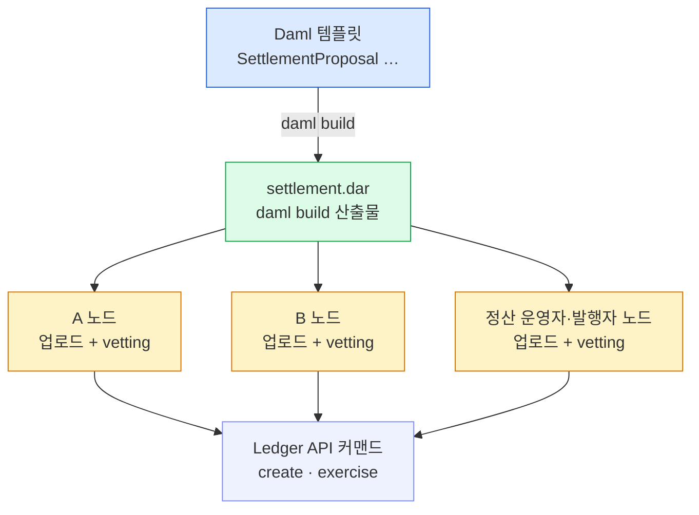

비즈니스 규칙은 Daml 템플릿이 되고, 템플릿은 컨트랙트가 담는 데이터와 누가 무엇을 할 수 있는지의 choice 를 함께 정의한다.
권한이 함수 본문이 아니라 타입에 박히는 게 솔리디티와의 결정적 차이이고, 이 규칙은 작성 → 빌드 → 배포(vetting) → 사용 순으로 원장 위에서 살아 움직인다.

## 규칙은 템플릿이 된다 — data + choice

비즈니스 규칙은 Daml **템플릿**이 된다. 템플릿은 두 가지를 정의한다.

- **데이터** — 컨트랙트가 담는 값. 누가 보내는지, 얼마인지.
- **choice** — 누가 무엇을 할 수 있는지.

배포된 템플릿이 **틀**이고, 원장 위의 데이터 한 줄이 **컨트랙트 한 건**이다. 같은 템플릿에서 컨트랙트가 여러 건 만들어진다 — 틀은 하나, 그 틀로 찍힌 실제 계약이 여럿이다.

## 권한이 타입에 박힌다 — 솔리디티와의 차이

권한은 함수 본문이 아니라 **타입에 박힌다**. 이게 솔리디티와의 결정적 차이다.

| | 솔리디티 | Daml |
|---|---|---|
| 호출 | 누구나 함수를 호출할 수 있다 | choice 는 지정된 controller 만 실행 |
| 검사 | 본문에서 `require(msg.sender==…)` 로 직접 검사 | 선언(signatory·controller)으로 강제 |
| 위치 | 규칙이 함수 코드 안에 흩어진다 | 규칙이 타입 선언에 모인다 |

솔리디티는 문을 열어 두고 본문에서 걸러내지만, Daml 은 타입 수준의 **선언으로 강제**한다. 규칙을 코드로 검사하는 게 아니라, 규칙 자체가 타입이 된다.

## signatory · observer · controller

권한 선언은 세 가지다.

- **signatory(서명자)** — 컨트랙트가 존재·소멸하려면 동의가 필요한 주된 권한자. 한 명이 아니라 **리스트**일 수 있어 다자 동의가 자연스럽다.
- **observer(관찰자)** — 동의권은 없지만 볼 수 있는 파티. 이 선언이 곧 **가시성의 출처**다.
- **controller** — 특정 choice 를 실행할 수 있는 파티. **choice 마다 지정**한다.

signatory 가 컨트랙트의 존재를 떠받치고, observer 가 누가 볼 수 있는지를 정하고, controller 가 각 choice 의 실행 주체를 정한다. 세 선언이 곧 그 컨트랙트의 권한·가시성 규칙 전부다.

### 개발자 시점 — 실제 정산 패키지의 템플릿

정산 패키지(`Settlement.FxDvp`)의 `SettlementProposal`. 서명자가 리스트(`approvers`)라 여러 당사자가 함께 권한자이고, `_Accept` 는 **소비형**이라 호출 시 제안서를 보관하고 승인자를 추가한 새 제안서를 만든다 — "보관 + 재생성"으로 다자 동의가 한 명씩 쌓인다. 이 propose-accept(제안-수락) 패턴은 9장 정산에서 다시 쓴다.

```daml
template SettlementProposal with
    venue        : Party              -- 정산 운영자(정산에서만 등장)
    transferLegs : TextMap TransferLeg
    approvers    : [Party]
  where
    signatory approvers
    observer  venue, tradingParties transferLegs

    choice SettlementProposal_Accept : ContractId SettlementProposal
      with approver : Party
      controller approver
      do ...   -- 옛 제안서 보관 + 승인자 추가해 재생성
```

서명자가 리스트라 승인자 전원이 함께 컨트랙트를 떠받치고, `venue` 와 각 leg 의 tradingParties 는 observer 로 열람만 한다. `_Accept` 를 실행할 수 있는 건 그 호출의 `approver` 뿐이다 — controller 가 choice 안에 못 박혀 있기 때문이다.

## 이 코드는 어떻게 배포·사용되나

템플릿을 썼다고 끝이 아니다. **작성 → 빌드 → 배포(업로드 + 승인) → 사용** 순으로 원장 위에서 살아 움직인다. 핵심은 배포 단계다 — DAR(빌드 산출물)은 그 거래에 참여하는 **모든 이해관계자 노드**에 올라가 **vetting(승인)** 돼야 한다. 한 노드만 갖고 있으면 그 패키지로 만든 거래는 검증·커밋되지 않는다.



같은 DAR 을 A·B(·정산 운영자·발행자) 노드가 **모두** 갖고 승인해야, 그 위에서 만든 컨트랙트·choice 가 양쪽에서 동일하게 검증된다. 한 노드만 DAR 을 가지면 나머지 노드가 그 패키지를 몰라 거래가 검증·커밋되지 않는다 — vetting 은 모든 이해관계자가 같은 규칙을 공유한다는 합의다.

### 개발자 시점 — Daml 패키지 수명주기

```
1. 작성·빌드   daml build  →  settlement.dar   (패키지)
2. 배포        DAR을 참여하는 모든 이해관계자 노드에 업로드 + 각 노드가 vetting(승인)
              └ 한 노드만 가지면 그 거래는 검증·커밋 안 됨
3. 사용        앱 → Ledger API 커맨드:
                create   Transfer {payer, payee, amount, regulator}     -- 컨트랙트 생성
                exercise SettlementProposal_Accept ...                  -- choice 실행
4. 조회        /v2/state/active-contracts (ACS) · offset으로 변경 추적
```

앱은 직접 원장을 건드리지 않고 **Ledger API 로 커맨드**만 보낸다 — `create` 로 컨트랙트를 만들고 `exercise` 로 choice 를 실행한다. 지금 살아 있는 컨트랙트는 ACS(활성 컨트랙트 집합)로 훑고, 그 뒤 변경은 offset 으로 이어 추적한다. 커맨드가 나간 뒤의 순서·확인·커밋은 6장 아키텍처와 8장 트랜잭션 흐름에서 본 그 흐름이다.
