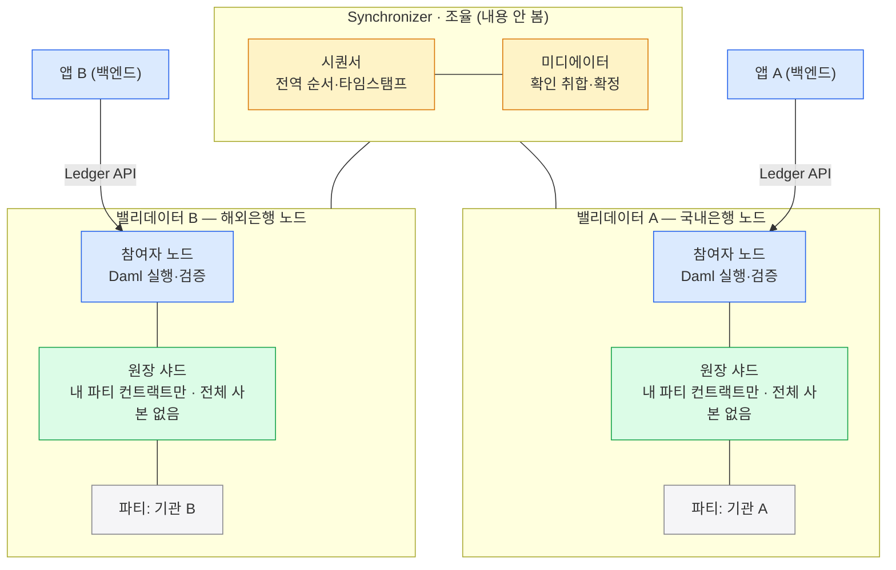
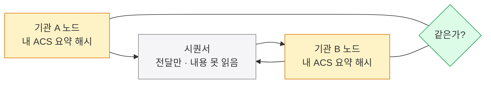
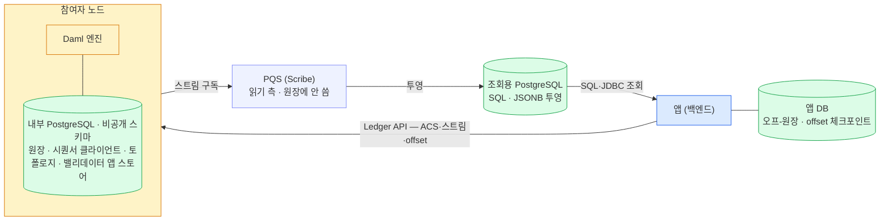

Canton은 거래의 조율(Synchronizer)과 자산·상태의 저장(밸리데이터)을 서로 다른 주체에게 맡긴다.
Synchronizer는 순서·확정만 책임지고 내용은 보지 않으며, 원장은 당사자별 노드 DB에 흩어진 샤드로 영속된다.

## 조율과 저장을 나눈다

Canton의 핵심 설계는 **조율**과 **저장**을 다른 주체에게 맡긴 것이다. 자산과 컨트랙트는 참여자 노드에 머물고, Synchronizer는 거래의 순서·확정만 책임진다. 이 분리 덕분에 Synchronizer는 내용을 몰라도 합의를 이끌 수 있다 — 2장 "가시성 없는 동기화"가 가능한 이유다.

조율(Synchronizer)과 저장(밸리데이터)이 갈린다. 각 노드는 자기 **원장 샤드**(내 파티가 이해관계자인 컨트랙트만 · 전체 사본은 어디에도 없음)를 들고, Synchronizer는 암호화된 거래의 **순서만** 맞춘다. 앱은 Ledger API로 자기 노드에 붙는다. 한 노드가 여러 파티를 호스팅할 수도 있다.

## 조율 vs 저장 — 내용과 순서의 분리

자산·상태는 노드에, 순서·확정만 Synchronizer에 둔다. 둘이 하는 일은 겹치지 않는다.

| 구분 | Synchronizer (조율·내용 안 봄) | 밸리데이터(참여자 노드) (저장·검증) |
|---|---|---|
| 받는 것 | 거래를 **암호화된 채로** 받음 | 자기 파티 관련 컨트랙트만 보관 |
| 하는 일 | 시퀀서가 전역 순서·타임스탬프 부여 | 거래 유효성을 직접 검증 |
| 확정 | 미디에이터가 이해관계자 확인을 취합·확정 | 공유 컨트랙트는 양쪽이 같은 사본 |
| 상태 | 상태를 저장하지 않음 / 내용 해독 불가 | 같은 사본이라 **기관끼리 잔액을 맞춰 보는 업무 대조가 없다**. 다만 프로토콜은 사본이 어긋나지 않았는지 주기적으로 대조한다 (아래 절) |

## 개발자 시점 — 무엇을 띄우고 어떻게 붙나

앱은 **온-원장 Daml 패키지**(정산 규칙, 모두가 공유·강제)와 **오프-원장 백엔드**(매칭·외부연동·UI, 각자 운영)로 나뉜다. 백엔드는 **Ledger API**로 노드에 요청을 보낸다. 데모에선 포트가 곧 노드다.

| 포트 | 노드 |
|---|---|
| **2975** | 기관 A 참여자 노드 (JSON Ledger API v2) |
| **3975** | 기관 B 참여자 노드 |
| **4975** | 제3자 노드 — 프라이버시 0건 확인용 |

주요 API는 활성 컨트랙트 조회 `/v2/state/active-contracts`, 커맨드 제출 `/v2/commands/submit-and-wait`, offset 조회 `/v2/state/ledger-end` 셋이다.

**DAR / vetting(승인)**: 정산 패키지(DAR)는 참여하는 **모든 이해관계자 노드**에 업로드·승인돼야 트랜잭션이 검증·커밋된다. 운영 형태는 자체호스팅(통제력↑) vs NaaS(부담↓)로 갈리며, 위탁해도 키는 외부 파티로 직접 쥘 수 있다.

## 네트워크 토폴로지 — 셋 중에 고른다

참여자 노드를 어떤 Synchronizer에 어떻게 연결하느냐는 고정이 아니다. 한 참여자가 **여러 Synchronizer에 동시에** 붙을 수도 있다.

| 형태 | 성격 | 쓰임 |
|---|---|---|
| **단일 Synchronizer** | 단순 | 단일 배포 · 테스트 · 단일 조직 앱 |
| **다중 Synchronizer** | 엔터프라이즈 | 워크플로별 분리 · 규제 분리 · 컨소시엄 거버넌스. 한 노드가 둘 다 연결 가능 |
| **글로벌 Synchronizer** | 퍼블릭 | 퍼블릭 Canton Network · 조직 간 워크플로. 여러 독립 슈퍼 밸리데이터(SV)가 분산 운영 |

## 코드는 어디에 둘까 — 온-원장 vs 오프-원장

핵심 합의는 **원장(Daml)**, 편의 기능은 **백엔드**에 둔다. 둘을 **조합**해 앱을 만든다 — 8장 트랜잭션 흐름의 지갑·앱·노드 3층이 바로 이 구분이다.

| 구분 | 온-원장 · Daml | 오프-원장 · 백엔드 |
|---|---|---|
| 무엇을 | 돈·계약·권한 — 여럿이 공유·합의·강제할 핵심 | 외부 API·복잡 로직·고빈도 연산·UI — 나 혼자 처리하는 편의 |
| 성질 | 다자 합의(필수) · 권한 강제(권장) · 감사 추적(내장) | 각자 운영 · Daml은 외부 인터넷을 호출하지 못한다 |
| 결과 | 원장에 올리면 모두에게 자동 강제·기록 | 외부 연동·무거운 연산은 내 백엔드가 맡는다 |

### 코드는 어디서 돌고, 무엇으로 붙나

구성요소별 **실행 위치**와 그 사이를 잇는 **API**를 정리하면 이렇다.

| 구성요소 | 실행 위치 | 무엇 |
|---|---|---|
| 스마트 컨트랙트(템플릿) | 참여자 노드 · Daml | 비즈니스 로직·권한·프라이버시 규칙 |
| 백엔드 서비스 | 내 인프라 · 임의 언어(TS·Java·Python) | 오프-원장 자동화·통합 |
| 프론트엔드 | 브라우저/모바일 · 임의 프레임워크 | UI |
| 쿼리 | 참여자(Ledger API) 또는 PQS(SQL) | 조회 |

| API | 쓰임 |
|---|---|
| **Ledger API (gRPC)** | 고성능 백엔드 통합 |
| **Ledger API (JSON)** | 더 단순·브라우저 친화 (데모가 이걸 씀) |
| **Admin API** | 노드·파티 관리 |
| **PQS (SQL)** | 복잡한 쿼리·리포팅 |

## 원장은 어디에 남나 — 영속(persistence)

위 큰 그림의 "저장(밸리데이터)"을 한 겹 더 들여다본다 — 이 원장은 어디에 저장돼 남는가. 한 곳의 거대한 장부가 아니라, **당사자별 노드 DB에 흩어진 샤드들의 합**으로 영속된다. 세 가지가 받친다.

- **참여자 노드 DB** — 각 노드가 **PostgreSQL** 등에 자기 샤드를 durable(디스크에 영구)하게 저장한다. **ACS(활성 컨트랙트 집합)** + **이벤트 로그** + **offset** 이 들어간다. 상태 변경이 보관+생성이라 append-only 이력으로 쌓인다.
- **이해관계자가 같은 사본** — 공유 컨트랙트는 당사자 노드 모두에 동일 사본으로 남는다. 전체본을 가진 노드는 없지만 모든 거래는 그 당사자 전원이 보관한다 → 한 노드가 죽어도 남는다. 복원력엔 다중 호스팅을 쓴다.
- **시퀀서 스트림** — 시퀀서가 **암호화된 순서 스트림**을 영속한다(내용은 못 읽음). 오프라인이던 노드는 자기 **offset 이후를 재생(catch-up)**해 따라잡는다 — 순서의 정본이다.

**확정되면 불변**이다. 미디에이터 평결로 커밋된 순간 각 노드 DB에 durable하게 기록되고 되돌림이 없다(결정적 확정). 디스크 절약을 위해 오래된 보관(archived) 이벤트는 pruning할 수 있지만, 활성 컨트랙트(ACS)는 남는다. 어디에도 전체본은 없지만, 모든 거래는 그 당사자들에게 영속된다.

## 노드끼리 어긋나면 어떻게 아나 — ACS 대조

전체본이 없고 노드마다 자기 샤드를 든다면, 같은 컨트랙트를 공유하는 두 노드의 사본이 어긋났을 때 그걸 누가 발견하는가. Canton은 노드들이 **자기 ACS를 요약한 값을 주기적으로 주고받아** 스스로 확인하게 한다.

각 참여자 노드는 일정 간격마다 자기 ACS에서 **해시 하나**를 뽑아 시퀀서를 통해 상대 노드에 보낸다. 상대도 같은 구간에 대해 같은 것을 보낸다. 둘이 같으면 그 구간까지 두 노드의 공유 상태가 같다는 뜻이고, 다르면 **fork**(사본이 갈라짐)로 잡아 경보를 올린다. 내용을 주고받는 게 아니라 요약값만 비교하므로 프라이버시는 그대로다.

두 노드가 같은 구간의 요약값을 교환해 맞춰 본다. 같으면 공유 상태가 일치한 것이고, 다르면 fork로 잡는다.

이 대조는 두 가지를 한다.

- **어긋남을 드러낸다.** 내 노드의 DB를 누가 손대 공유 컨트랙트가 달라졌다면 다음 대조에서 상대와 값이 갈린다. 원장의 권위가 각 노드의 DB가 아니라 **당사자들이 서로 확인한 결과**에 있다는 것이 여기서 다시 드러난다.
- **과거를 지울 수 있게 한다.** 참여자는 **모든 상대와 값이 일치한 시점까지만** 자기 이력을 지운다(pruning). 상태가 같다는 확인 없이는 과거를 정리하지 못한다.

대조 주기와 경보 종류, 어긋났을 때 쓰는 조사 도구는 운영 영역이다 — [참여자 노드 운영](../운영%20검토/00-participant-node-operations.md) 에 정리했다.

## 노드 DB 구조 — 내부 스토어 vs PQS

그 영속을 실제 DB에서 보면 둘로 나뉜다. 참여자 노드의 **내부 PostgreSQL**(상태 영속, 비공개 스키마)과, 조회용으로 따로 두는 **PQS**(SQL로 읽는 읽기 측)다.

앱은 **Ledger API**로 참여자에 커맨드·조회를 보내고, 참여자가 내부 PostgreSQL에 영속한다(비공개 스키마, protobuf blob — Protocol Buffers로 직렬화된 이진 덩어리). **PQS**가 그 트랜잭션 스트림을 구독해 **조회용 PostgreSQL**에 투영하면, 앱이 **SQL(JDBC)**로 조회한다. 내부 DB는 직접 건드리지 않는다.

참여자 노드의 내부 PostgreSQL은 네 개의 스토어로 나뉜다.

| 내부 스토어 | 담는 것 |
|---|---|
| **원장 스토어** | 커밋된 트랜잭션 + **ACS(활성 컨트랙트 집합)** |
| **시퀀서 클라이언트 스토어** | Synchronizer에서 받은 (암호화) 메시지 |
| **토폴로지 스토어** | 신원 매핑 · 키 등록 · 파티↔참여자 할당 |
| **밸리데이터 앱 스토어** | Validator App 운영 상태 (Splice 계층은 추가 스키마 사용) |

내부 스토어 스키마는 Flyway 마이그레이션(버전별 스크립트로 스키마를 관리하는 도구)으로 **버전마다 바뀌는 구현 세부**이고, 대부분 직렬화된 protobuf blob이라 **직접 쿼리하지 않는다.** SQL로 다룰 땐 컨트랙트 페이로드를 JSONB로 색인하는 **PQS**나 Ledger API를 쓴다. 정확한 스키마는 내부가 Canton 소스의 Flyway, 조회용이 PQS 문서에 있다.

그럼 앱은 어떻게 읽고, 저장은 어디에 하나. 요약하면:

- **읽기** — 앱은 내부 DB가 아니라 **Ledger API**로 읽는다 — ACS 조회(활성 컨트랙트 스냅샷) · 업데이트 스트림(생성·보관 이벤트 구독) · ledger-end(offset).
- **무거운 쿼리** — 페이로드 필터·조인 같은 무거운 SQL은 PQS로 넘긴다. 읽기 투영이 필요하면 직접 만들지 말고 PQS로 간다.
- **저장** — **원장 자체는 앱이 저장하지 않는다**(참여자가 정본). 앱 DB엔 오프-원장 업무 데이터와, 스트림을 이어받기 위한 마지막 offset 체크포인트만 둔다.
- **정리** — **쓰기는 Ledger API, 읽기는 PQS로 나누는 CQRS**(쓰기·읽기 경로를 분리해 각각 최적화하는 패턴)다.
