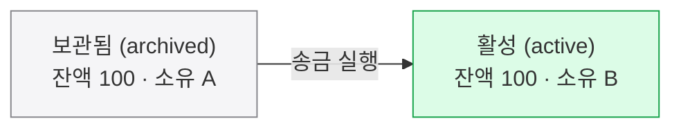
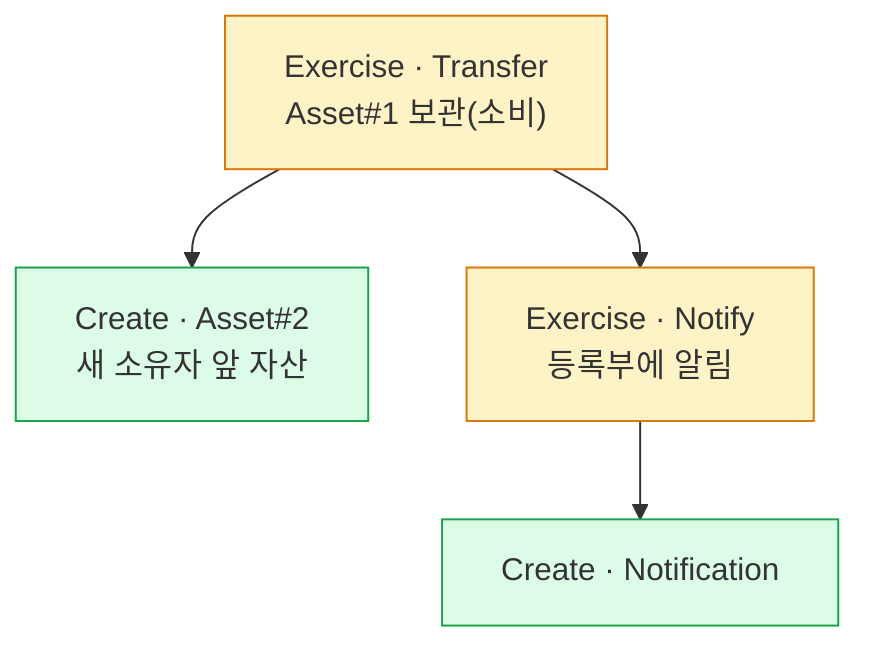

Canton 원장은 덮어쓰지 않는 불변 컨트랙트의 모음(eUTXO)이라, 상태 변경은 옛 컨트랙트를 보관하고 새 컨트랙트를 만드는 일이며 같은 컨트랙트는 한 번만 소비돼 이중지불이 구조적으로 막힌다.
ACS·offset·signatory/observer 로 원장을 읽고, 트랜잭션은 액션의 트리로 원자적 커밋되며, 개발자는 컨트랙트 키와 원장 시간을 쓴다.

## 컨트랙트는 고쳐 쓰지 않는다

Canton 원장은 **불변 컨트랙트**의 모음이다 — UTXO 와 비슷하게 상태를 덮어쓰지 않고 소비·생성한다(이 확장된 형태를 이 글에서 편의상 'eUTXO' 라 부른다. Canton/Daml의 공식 명칭은 아니다). 상태를 바꾼다는 건 값을 덮어쓰는 게 아니라 **옛 컨트랙트를 보관(archive)하고 새 컨트랙트를 만드는** 일이다. 같은 컨트랙트는 한 번만 소비할 수 있으므로, 같은 자산을 두 번 쓰는 이중지불이 구조적으로 막힌다.



소유 A 의 컨트랙트를 덮어써서 소유 B 로 바꾸는 게 아니다. 옛 컨트랙트는 **보관됨**으로 남고, 같은 잔액을 담은 새 컨트랙트가 소유 B 앞으로 **활성** 상태로 생긴다 — 상태 변경 = 옛것 보관 + 새것 생성이다.

## ACS · offset · 가시성

노드가 보관 중인 "현재 유효한 컨트랙트 전체"가 **ACS(활성 컨트랙트 집합)**다. 거래를 처리할 때마다 ACS 에서 옛 컨트랙트가 빠지고 새것이 들어온다. "원장의 어디까지 봤나"는 단조 증가하는 **offset** 으로 가리킨다(DB 변경 로그의 위치 같은 개념). 각 컨트랙트의 **signatory(서명자)**·**observer(관찰자)** 선언이 곧 누가 그것을 보고 승인하는지를 정한다.

## 일반 UTXO(비트코인)와 무엇이 다른가

eUTXO 는 비트코인의 **UTXO**(미사용 거래 출력)를 일반화한 것이다. UTXO 의 "동전"을 **임의의 상태·규칙·다자 권한을 담은 컨트랙트**로 확장(extended)한 것이다.

| | 일반 UTXO · 비트코인 | eUTXO · Canton/Daml |
|---|---|---|
| 주고받는 것 | 동전(coin) | 컨트랙트(상태 + 규칙) |
| 출력이 담는 것 | **금액**뿐 | 임의 데이터 + choice(규칙) + signatory/observer(다자 권한) |
| 잠금·표현력 | 스크립트(대개 서명 검증), 가치 이전 위주 | 임의 워크플로 표현 |
| 열람 | 공개된다 | 이해관계자만 열람 |

**공통점** — 둘 다 상태가 **불변 단위의 집합**이고, 각 단위는 **딱 한 번만 소비**된다(그래서 이중지불이 구조적으로 막힌다). eUTXO 는 거기에 "동전 → 컨트랙트"로 **표현력·다자 권한·프라이버시**를 더한 것이다. 계정 모델인 이더리움이 가변 잔액을 덮어쓰는 것과도 다르다 — eUTXO 는 덮어쓰지 않고 보관 + 생성한다.

## 왜 UTXO 인가 — 계정 모델과 비교

비트코인과의 차이가 "동전 vs 컨트랙트"였다면, 이더리움식 **계정(Account) 모델**과의 차이는 "물건(UTXO) vs 잔액 숫자(계정)"에서 갈린다. 네 가지가 따라온다:

- **병렬성** — 독립 컨트랙트는 서로 안 겹치면 **동시 처리**(빠름). 계정은 같은 잔액을 동시에 못 건드려 **잠그고 줄 세운다**(느림).
- **프라이버시** — 컨트랙트마다 이해관계자가 정해져 "그들만" 보면 된다 → 분리가 자연스럽다. 계정은 거래가 한 칸에 **다 쌓여(집계)** 떼어내기 어렵다.
- **조합 가능성** — 독립 컨트랙트들을 한 거래로 **레고처럼 묶어** 전부 아니면 전무로 처리한다(DvP(정산)의 근간). 계정은 직접 설계해야 한다.
- **이중지불 방지** — 컨트랙트는 **한 번만 소비**돼 구조적으로 막힌다. 계정은 **논스(순번)**로 따로 막아야 한다.

## 트랜잭션은 액션의 트리다

트랜잭션 하나는 단일 동작이 아니라 **액션들의 나무**다. 한 동작이 연쇄 결과(consequences)를 낳고, 그 **전체가 한 트랜잭션으로 원자적**으로 커밋된다 — 도미노처럼 줄줄이 일어나되 다 같이 성공하거나 아예 안 일어난다.



Transfer 를 실행하면 옛 자산(Asset#1)이 보관되고, 그 연쇄로 새 소유자 앞 자산(Asset#2) 생성과 등록부 알림(Notify) 실행이 갈라져 나오며, Notify 는 다시 Notification 생성을 낳는다 — 이 트리 전체가 하나의 트랜잭션으로 전부 아니면 전무로 커밋된다.

액션은 3종이다.

- **Create** — 생성.
- **Exercise** — 실행, 소비형이면 보관.
- **Fetch** — 읽기, 상태 불변.

소비형 choice 는 컨트랙트를 보관하고, **비소비형**(nonconsuming)은 활성으로 남겨 조회·알림에 쓴다.

## 개발자 시점 — 컨트랙트 키 & 원장 시간

**컨트랙트 키**: 컨트랙트 ID 를 몰라도 `(은행, 계좌번호)` 같은 키로 컨트랙트를 조회한다. 키마다 그것을 책임지는 **maintainer** 가 있고, maintainer 는 그 컨트랙트의 signatory 여야 한다. 키는 템플릿의 선택 기능이라 **Daml-LF 2.3 이상을 컴파일 대상으로 명시**해야 쓸 수 있다 — `daml.yaml` 의 `build-options` 에 `--target=2.3` 을 넣는다. 이 설정을 바꾸면 패키지 ID 가 달라지므로 버전도 함께 올린다.

```daml
key (bank, accountNumber) : (Party, Text)
maintainer key._1   -- bank가 키를 유지
```

**주의 — 키는 유일하지 않다.** Canton 3.x 에서는 **같은 키를 가진 활성 컨트랙트가 여럿 있을 수 있다.** 키의 유일성은 Daml 엔진이 아니라 그 바깥(업무 로직이나 백엔드의 계좌번호·전표번호 채번)에서 보장한다는 전제다. 그래서 `fetchByKey` · `lookupByKey` · `exerciseByKey` 는 "그 키의 컨트랙트"가 아니라 정해진 조회 순서의 **첫 번째** 컨트랙트를 돌려준다. 조회 순서는 ① 이번 트랜잭션에서 생성된 것(최근 것부터) ② 커맨드에 명시적으로 실어 보낸(disclosed) 컨트랙트(커맨드에 실은 순서대로) ③ 참여자가 알고 있는 나머지(순서 보장 없음)다. 한 키에 여러 건이 있을 수 있는 업무라면 `DA.ContractKeys` 의 `lookupNByKey`(최대 n건)·`lookupAllByKey`(전부)를 쓴다 — 이 둘은 기본 import 가 아니라 `import DA.ContractKeys` 가 필요하다. 성능은 "키당 0~1건"이 흔한 경우에 맞춰 최적화돼 있어, 한 키에 많은 컨트랙트가 몰리면 느려진다.

**원장 시간(ledger time)**: Synchronizer 가 부여하고 Synchronizer 별로 **단조 증가**한다. 마감·만기 같은 시간 기반 로직에 쓴다(예: `assertDeadlineExceeded` 로 마감 경과 확인).

## 이 페이지의 출처

- **컨트랙트 키** — Canton 공식 문서 [Reference: Contract Keys](https://docs.canton.network/appdev/modules/m3-contract-keys) (CF-DOCS-CONTRACT-KEYS-001, 확인 2026-09-17). 컴파일 대상(Daml-LF 2.3)·키 비유일성·조회 순서·`DA.ContractKeys` 는 이 문서를 따른다.
- 나머지 원장 모델 서술(불변 컨트랙트·ACS·offset·액션 트리)은 이 세트의 다른 장과 같은 개념 설명이라 별도 출처 표기를 두지 않았다.
