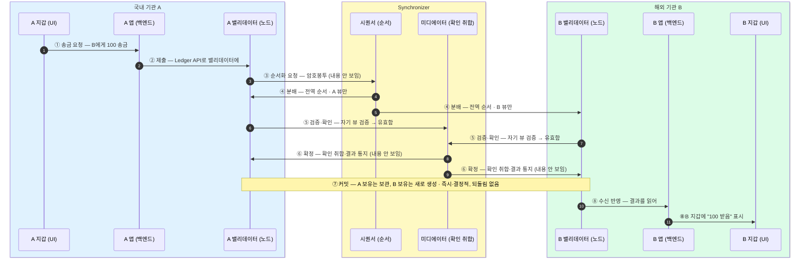

국내 기관 A가 해외 기관 B에게 100을 보내는 한 건이 지갑·앱·밸리데이터·Synchronizer를 어떻게 지나 커밋되는지 8단계로 따라간다.
시퀀서·미디에이터는 암호봉투로 순서와 확인만 다뤄 금액·상대를 못 읽고, 커밋은 즉시·결정적이라 되돌림이 없다.

## 세 층, 그리고 가운데 Synchronizer

각 기관은 세 층을 둔다. 6장의 온-원장/오프-원장 구분이 실제로 이 세 층으로 나타난다.

- **지갑 (UI)** — 사용자 접점. 송금을 요청하고 결과를 표시한다. 오프-원장.
- **앱 (백엔드)** — 기관의 업무 로직. 지갑 요청을 받아 밸리데이터에 제출하고, 확정 결과를 읽어 지갑에 되돌린다. 오프-원장.
- **밸리데이터(참여자 노드)** — 온-원장. 거래를 암호봉투로 순서화 요청하고, 자기 뷰(view)를 검증·확인하고, 커밋으로 원장 상태를 갱신한다.

가운데에는 **Synchronizer**가 있다. 두 부품으로 나뉜다 — **시퀀서**는 전역 순서를 매기고, **미디에이터**는 밸리데이터들의 확인을 취합해 확정한다. 국내 기관 A와 해외 기관 B는 각자 세 층을 두고, Synchronizer 하나가 그 사이의 순서와 확정을 맞춘다.

## 한 건이 흐르는 길 — 지갑에서 커밋까지

A 사용자가 지갑에서 "B에게 100 송금"을 누른 한 건이 여덟 단계를 지난다.

요약하면 한 건은 여덟 단계를 이렇게 지난다.

- **①②** 거래는 A 지갑의 한 번의 요청에서 출발해, 오프-원장(지갑·앱)을 지나 A 밸리데이터에서 온-원장으로 올라간다.
- **③** A 밸리데이터는 거래를 통째로 넘기지 않고 **암호봉투**로 봉해 시퀀서에 순서화만 요청한다.
- **④** 시퀀서는 전역 순서를 매겨 이해관계자인 A·B 밸리데이터에 뿌리되 **각자 자기 뷰만** 준다.
- **⑤** 두 밸리데이터는 자기 뷰를 검증해 미디에이터에 "유효함"을 확인한다.
- **⑥** 미디에이터가 그 확인을 취합해 확정 결과를 통지한다.
- **⑦** 확정이 내려오면 양쪽 노드가 동시에 커밋해 원장 상태가 바뀐다.
- **⑧** B 앱이 그 결과를 읽어 B 지갑에 "100 받음"을 표시하면 한 건이 끝난다.

## 가운데는 암호봉투만 본다

시퀀서와 미디에이터는 거래를 **암호봉투**로만 다룬다. 시퀀서는 순서를 매기고 미디에이터는 확인을 세지만, 봉투 안의 **금액도 상대도 못 읽는다**. 순서와 확정이라는 공용 기능을 맡으면서도 거래 내용은 이해관계자에게만 남는 구조다 — 이것이 캔톤의 선택적 신뢰다(뷰 분배는 3장, 프라이버시는 9장).

커밋(⑦)은 **즉시·결정적**이다. 미디에이터의 확정이 내려온 순간 양쪽 노드의 원장이 확정 상태로 바뀌며, 이후 되돌림이 없다.

## 각 주체가 하는 일

| 주체 | 층 | 하는 일 |
|---|---|---|
| **지갑 (UI)** | 오프-원장 | 사용자 접점. 송금을 요청하고 결과를 표시한다. |
| **앱 (백엔드)** | 오프-원장 | 지갑 요청을 받아 Ledger API로 밸리데이터에 제출하고, 확정 결과를 읽어 지갑에 되돌린다. |
| **밸리데이터(참여자 노드)** | 온-원장 | 거래를 암호봉투로 순서화 요청하고, 자기 뷰를 검증·확인하고, 커밋으로 원장을 갱신한다. |
| **시퀀서** | Synchronizer | 전역 순서만 매겨 이해관계자에 분배한다. 암호봉투라 내용은 못 읽는다. |
| **미디에이터** | Synchronizer | 밸리데이터들의 확인을 취합해 확정을 통지한다. 암호봉투라 내용은 못 읽는다. |

## 커밋은 보관 + 생성이다

⑦의 커밋에서 원장 상태가 바뀌는 방식은 단순한 잔액 감가가 아니다 — **A의 보유는 보관되고, B의 보유는 새로 생성된다**. 상태 변경이 곧 기존 것의 보관과 새것의 생성이라는 원장 모델은 7장에서 다룬다. 여기서는 한쪽이 보내면 다른 쪽에 그만큼 생긴다는 **한 방향 이전**을 봤고, 두 자산을 서로 맞교환하며 어느 한쪽만 성립하는 일이 없도록 묶는 **정산(DvP)**은 9장에서 이어진다.
