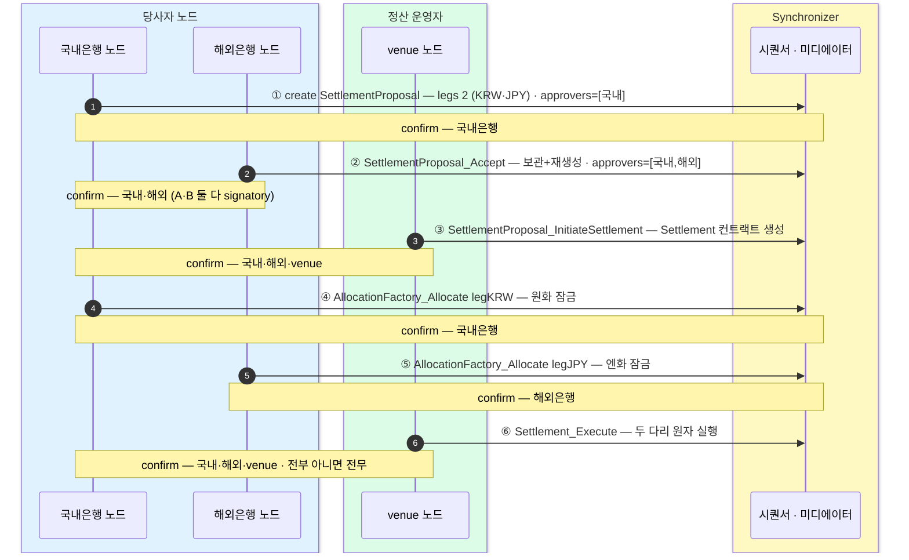
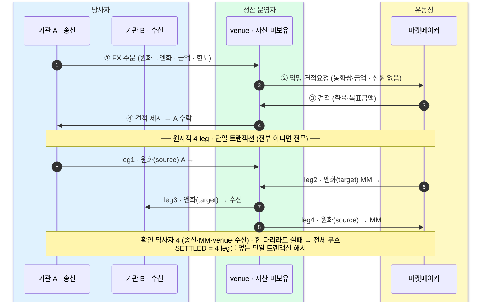

송금은 한 방향이지만 정산은 A의 원화와 B의 엔화를 맞바꾸는 양방향 거래여서, 한쪽만 가면 떼이는 카운터파티 리스크가 생긴다.
Canton은 중앙 정산기관이 주던 보장을 중앙 보관자 없이 한 트랜잭션의 전부-아니면-전무 원자성으로 주고, 2-leg(직접 상대)와 4-leg(마켓메이커 경유) 흐름을 원자성·프라이버시·되돌림 없는 확정 관점에서 정리한다.

## 왜 정산은 송금보다 어려운가 — 카운터파티 리스크

송금은 한 방향이라 단순했다. 정산은 다르다. **A가 원화를, B가 엔화를 맞바꾼다** — 이것이 DvP(정산, Delivery vs Payment)다. 다리가 둘이라, 한쪽만 건너가고 상대가 파산하면 반대쪽을 못 받는 **카운터파티 리스크**가 생긴다. 외환에서는 이를 **Herstatt 리스크**라 부른다 — 시차 탓에 한쪽 통화 결제가 끝난 뒤 상대가 무너져 반대쪽을 못 받는 결제 리스크로, 1974년 Herstatt 은행 파산에서 나온 이름이다.

전통 금융은 이 문제를 중앙 정산기관으로 푼다.

- **CLS** — 외환 거래를 동시 맞교환(PvP, Payment vs Payment)으로 정산해 Herstatt 리스크를 없애는 다통화 정산 기관.
- **CSD** — 증권을 집중 예탁·결제하는 중앙예탁기관.

이들은 두 지급을 동시·원자적으로 처리해 "한쪽만 가는" 일을 막는다. 대신 **중앙 보관자**가 자산을 쥐고 서는 구조다. Canton은 **같은 보장을 한 트랜잭션 안에서, 중앙 보관자 없이** 준다 — **전부 아니면 전무(원자성)**.

## 정산 운영자(venue)는 매칭·실행만 — 자산은 보관하지 않는다

중간의 **정산 운영자(venue)**는 매칭과 실행을 맡되 **자산은 한순간도 보관하지 않는다**. 양쪽이 각자 자기 다리를 잠그면 venue는 실행 버튼만 누른다.

원자성·잠금·조합성 자체는 다른 체인도 한다. Canton의 차별점은 그것을 **프라이버시 + 다자 네이티브 권한 + 되돌림 없는 확정**과 함께 준다는 결합이다. 아래 2-leg 흐름이 이를 한 단계씩 보여준다.

## 2-leg 정산 흐름 — 제안서부터 실행까지 (6단계)

직접 상대가 있는 경우다. 실제 정산 패키지 `Settlement.FxDvp`(2-leg FX DvP)의 6개 choice를 순서대로 따라간다. 각 단계는 어느 노드가 **confirm(검증·서명)**하는지가 다르고, 자산이 실제로 움직이는 것은 마지막 한 번뿐이다.

- **①** 국내은행이 `SettlementProposal` 을 **create** — 다리 둘(원화·엔화), `approvers = [국내]`. confirm: 국내은행.
- **②** 해외은행이 **`SettlementProposal_Accept`** 를 exercise — 제안을 보관(archive)하고 재생성, `approvers = [국내, 해외]`. 이제 A·B 둘 다 signatory(서명자)다. confirm: 국내·해외.
- **③** venue가 **`SettlementProposal_InitiateSettlement`** 를 exercise — `Settlement` 컨트랙트가 생성된다. confirm: 국내·해외·venue.
- **④** 국내은행이 (레지스트리를 통해) **`AllocationFactory_Allocate`** 로 `legKRW` 를 잠근다(원화 잠금). confirm: 국내은행.
- **⑤** 해외은행이 **`AllocationFactory_Allocate`** 로 `legJPY` 를 잠근다(엔화 잠금). 두 다리가 다 묶였다. confirm: 해외은행.
- **⑥** venue가 **`Settlement_Execute`** 를 exercise — 두 다리를 **원자적으로 동시 실행**. confirm: 국내·해외·venue.

제안(①②)은 propose-accept(제안-수락)으로 A·B의 합의를 잠그고, 개시(③)는 잠글 대상인 `Settlement` 컨트랙트를 세운다. 잠금(④⑤)은 각자 자기 다리를 거는 단계라 confirm이 그 은행 하나로 좁고, 실행(⑥)은 두 다리를 한 번에 여는 단계라 세 노드가 함께 확인한다. 자산은 ①~⑤ 내내 움직이지 않고 오직 ⑥에서만 이동한다.

## 핵심 둘 — 원자성과 프라이버시

**원자성.** 자산이 실제로 움직이는 것은 마지막 `Settlement_Execute` 한 번뿐이고, 그것이 전부/전무다. 한 다리라도 잠기지 않으면 실행 자체가 성립하지 않는다 — 한쪽만 떼이는 일이 구조적으로 없다.

**프라이버시.** 이 정산도 당사자(A·B·venue)만 받고, 무관한 제3자는 **0건**이다. 0건은 막아서가 아니라 그 뷰(view)가 그 노드에 **도착하지 않아서**다. 주의할 점 — 제3자 노드가 텅 빈 게 아니다. 그 노드도 자기 사업 계약은 따로 갖고 있고, 단지 **이 정산**이 그중에 없을 뿐이다. 제3자라도 observer(관찰자)로 지정하면(예: 감독기관) 받는다. 가시성은 명시적 선택이다.

## 데모의 뉘앙스 — KRW·JPY는 Canton Coin의 개념상 대역

이 흐름·choice·다리 키(`legKRW`/`legJPY`)는 실제 정산 패키지 `Settlement.FxDvp`(2-leg FX DvP)와 테스트 그대로다. 단, LocalNet 데모에는 토큰이 **Amulet(Canton Coin(CC)) 하나뿐**이다. 그래서 두 다리 모두 CC로 두고, **KRW·JPY는 개념상 대역**이다 — 방향만 반대인 FX 스왑을 흉내 낸 것이다. 실제 운영에서는 각 다리에 별도 발행자(레지스트리)의 통화 토큰이 들어간다(→ 10장).

## 통화가 다를 때 — 마켓메이커를 거치는 4-leg DvP

위 2-leg는 A·B가 서로 원하는 통화를 **직접 맞바꿀** 때다. 하지만 받는 쪽(B)에게 보낼 통화가 A의 보유 통화와 다르고 **직접 카운터파티가 없으면**, 유동성을 대는 **마켓메이커(MM)**를 끼운다. 그러면 자산 이동이 **네 다리(4-leg)**로 늘지만 — 여전히 **한 트랜잭션·전부 아니면 전무**이고, venue는 자산을 한순간도 보관하지 않는다. MM에게 가는 견적요청은 **익명**(통화쌍·금액만, 송수신자 신원 없음)이라 프라이버시도 그대로 유지된다.

요약하면:

- **견적요청(①②)** — 주문이 들어오면 venue는 MM에게 **익명 견적요청**을 던진다 — 통화쌍과 금액만 실려 MM은 송수신자가 누구인지 못 본다.
- **수락·실행(③④)** — MM의 견적을 A가 수락하면, 네 다리가 하나의 트랜잭션으로 원자적으로 움직인다.
- **자산 흐름** — 원화는 A에서 나와(leg1) MM으로(leg4) 흐르고, 엔화는 MM에서 나와(leg2) B로(leg3) 흐른다. venue는 라우팅만 할 뿐 어느 다리도 보관하지 않는다.
- **원자성** — 확인 당사자는 넷(송신·MM·venue·수신)이고, 한 다리라도 실패하면 전체가 무효다. 성공하면 SETTLED — 4개 다리를 모두 덮는 **단일 트랜잭션 해시**다.

## 2-leg vs 4-leg

- **2-leg** — 직접 상대가 있을 때(A↔B). 원하는 통화를 서로 바로 맞바꾼다.
- **4-leg** — 통화·상대가 안 맞아 유동성이 필요할 때(A↔MM↔B). 마켓메이커를 끼워 다리가 넷으로 는다.

**원자성·프라이버시·되돌림 없는 확정은 둘 다 동일**하고, 다리 수만 늘 뿐이다. MM은 견적요청이 익명이라 송수신자 신원을 못 본 채 유동성만 댄다.
