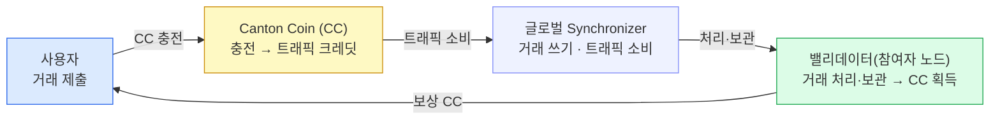

글로벌 Synchronizer에 거래를 올릴 때마다 트래픽(traffic) 수수료가 들고, 그 결제 통화가 Canton Coin(CC)이다.
CC는 수수료뿐 아니라 밸리데이터 보상·거버넌스 스테이킹까지 받치는 네이티브 유틸리티 토큰이며, 이 장은 수수료를 쓰는 쪽·버는 쪽·토크노믹스·환경별 획득법·데모(Amulet) 연결을 정리한다.

## 거래에는 값이 든다

9장의 6개 choice는 공짜가 아니다. 글로벌 Synchronizer에 거래를 올릴 때마다 **수수료**를 낸다. Canton은 이 수수료를 **트래픽(traffic)** 이라 부른다 — Synchronizer에 쓰기를 요청할 때 소비하는 자원이고, 결제 통화는 **Canton Coin(CC)** 이다.

이더리움의 가스에 해당하지만 다른 점이 하나 있다 — **잔액까지 비공개**다. CC는 수수료 외에 밸리데이터(참여자 노드) 보상과 슈퍼 밸리데이터의 거버넌스 스테이킹에도 쓰이는, 네트워크의 **네이티브 유틸리티 토큰**이다.

## 수수료를 쓰는 쪽 — 충전·소비·프라이버시

CC를 트래픽으로 바꿔 거래마다 소비한다. 세 가지를 기억하면 된다.

| 단계 | 하는 일 | 주의·연결 |
|---|---|---|
| **1 · 충전** | CC를 트래픽 크레딧으로 바꿔 밸리데이터의 **트래픽 예산**에 채운다. | 크레딧은 **양도 불가** — 한번 트래픽이 되면 수수료에만 쓴다. |
| **2 · 소비** | 거래를 제출하면 예산에서 깎인다. 비용은 **크기·연산 복잡도·네트워크 수요**에 따라 달라진다. | 예산이 바닥나면 거래 실패 — **자동 충전(auto-top-up)** 으로 방지한다. |
| **프라이버시** | 공개 잔액·rich list이 있는 다른 체인과 달리, CC 잔액은 나와 권한 있는 파티에게만 보인다. | 8·9장의 프라이버시가 **수수료 토큰에도 그대로 적용**된다. |

CC는 트래픽으로 소비되기 전까지는 이전 가능한 자산이지만, 트래픽 크레딧으로 충전되는 순간 용도가 수수료로 고정된다. 잔액 비공개는 예외가 아니라 8·9장에서 본 프라이버시 모델이 수수료 토큰까지 일관되게 이어진 결과다.

## 수수료를 버는 쪽 — 닫힌 경제 루프

수수료의 반대편을 본다 — **그 CC는 누가 버나.** 사용자가 트래픽으로 CC를 **소비**하면, 그 거래를 처리·보관하는 **밸리데이터가 CC를 번다.** 한쪽의 비용이 다른 쪽의 수입이 되는 닫힌 경제 루프다.



사용자가 낸 트래픽 수수료가 곧 밸리데이터의 수입이 되어 다시 네트워크로 돈다 — 별도 인플레이션 발행에 기대지 않는 자기완결적 순환이다. 밸리데이터가 CC를 버는 길은 셋이다.

| 보상 | 조건 | 성격 |
|---|---|---|
| **라이브니스 보상** | 노드를 계속 띄워 **가용성**을 유지하는 것만으로 발생한다. | 거래 처리와 무관 — 상시 가동에 대한 보상. |
| **트랜잭션 보상** | 실제로 처리한 거래의 **트래픽 수수료 일부**를 가져간다. | 처리량에 비례. |
| **거버넌스 스테이킹** | 슈퍼 밸리데이터는 인프라 운영·**스테이크**에 대한 추가 보상을 받는다. | 거버넌스 참여·인프라 기여에 대한 보상. |

## 토크노믹스 — 이 보상 설계가 노리는 것

세 보상이 곧 **토크노믹스**다. 네 가지를 동시에 겨냥한다.

- **인프라 지속** — 운영자 보상으로 밸리데이터가 노드를 계속 돌릴 유인을 준다.
- **공정 가격** — 트래픽 비용을 **시장이 정하게** 해 수요에 맞는 가격을 맞춘다.
- **거버넌스 정렬** — 스테이크 기반 참여로 의사결정을 네트워크 이해와 맞춘다.
- **네트워크 성장** — 도입 인센티브로 참여자와 사용량을 끈다.

## CC는 환경마다 얻는 법이 다르다

같은 CC라도 어느 망에서 도느냐에 따라 손에 넣는 방법과 실가치가 다르다.

| 환경 | 획득 방법 | 성격 |
|---|---|---|
| **LocalNet** | 자동으로 테스트 CC 사용 가능 (데모가 이 경우). | 로컬 개발용 — 실가치 없음. |
| **DevNet · TestNet** | 포셋에서 "탭(tap)"해 무료 테스트 CC 수령. | **속도 제한 · 실가치 없음.** |
| **MainNet** | 거래소 구매 · 밸리데이터 운영 · 직접 이전으로 획득. | **실제 경제 가치.** |

## 데모와의 연결 — Amulet = CC

LocalNet엔 토큰이 **Amulet 하나뿐**인데, **Amulet은 Canton Coin의 온-레저(기술) 이름**이다. 그래서 9장의 두 다리가 CC를 대역으로 쓰는 동시에, 그 6개 choice의 트래픽도 CC로 낸다 — 데모에서는 정산 통화와 수수료 통화가 같은 토큰으로 겹쳐 보인다.

실제 운영에선 갈린다. 정산 통화(KRW·JPY 등)는 **별도 레지스트리(발행자)** 가 발행한 토큰이고, 그 거래의 수수료는 그 아래에서 여전히 **CC가 받친다.** 즉 정산 통화는 위층에서 바뀌어도, 트래픽 결제는 언제나 CC 한 층으로 통일된다.

## 개발자 시점 — Amulet = CC, 정산 통화는 별도 instrument

토큰표준에서 자산은 발행자 파티(`admin`)와 식별자(`id`)로 식별된다. 정산 패키지는 특정 토큰에 종속되지 않고(보유·잠금·이전 인터페이스만 사용), 각 다리(transferLeg)가 이 `instrumentId`를 담는다.

```haskell
instrumentId {
  admin : Party    -- 발행자(레지스트리) 파티. CC면 DSO
  id    : Text     -- "Amulet" = Canton Coin의 기술명
}
```

정산 통화는 CC와 **별개의 instrument**다 — 별도 레지스트리가 발행하고, 실행 시 그 발행자에게 맥락(choice context)을 묻는다.

```http
GET /registry/allocations/v1/<allocationCid>/choice-contexts/execute-transfer
```

`instrumentId`의 `admin`이 어떤 파티냐로 통화가 갈린다 — CC라면 DSO가 발행자이고, 정산 통화라면 그 통화의 레지스트리 파티가 발행자다. 정산 통화는 발행자에게 choice context를 질의해 실행하지만, 그 거래의 트래픽 수수료는 언제나 CC로 결제된다.
