글로벌 Synchronizer에 거래를 올릴 때마다 트래픽(traffic) 수수료가 들고, 그 결제 통화가 Canton Coin(CC)이다.
CC는 수수료뿐 아니라 인프라 운영자·앱 제공자 보상까지 받치는 네이티브 유틸리티 토큰이며, 이 장은 수수료를 쓰는 쪽·버는 쪽·토크노믹스·환경별 획득법·데모(Amulet) 연결을 정리한다.

## 거래에는 값이 든다

9장의 6개 choice는 공짜가 아니다. 글로벌 Synchronizer에 거래를 올릴 때마다 **수수료**를 낸다. Canton은 이 수수료를 **트래픽(traffic)** 이라 부른다 — Synchronizer에 쓰기를 요청할 때 소비하는 자원이고, 결제 통화는 **Canton Coin(CC)** 이다.

이더리움의 가스에 해당한다. CC는 수수료 외에 인프라 운영자(슈퍼 밸리데이터)·앱 제공자·밸리데이터 보상에도 쓰이는, 네트워크의 **네이티브 유틸리티 토큰**이다.

**주의 — CC 잔액은 비공개가 아니다.** 앞 장들의 프라이버시(당사자에게만)는 Daml 앱의 거래에 적용되는 성질이고, **CC 자체에는 적용되지 않는다.** CC 보유와 거래 이력은 네트워크의 **scan 서비스로 공개**된다. 8·9장의 프라이버시 모델을 수수료 토큰까지 그대로 밀어붙이면 안 된다.

## 수수료를 쓰는 쪽 — 트래픽과 보유

CC 수수료는 두 가지다. 예전에는 전송(transfer)·잠금(lock)에도 수수료가 있었지만 **CIP-0078로 사실상 폐지**돼, 지금 살아 있는 것은 **트래픽 수수료**와 **보유 수수료** 둘뿐이다.

| 수수료 | 언제 내나 | 주의·연결 |
|---|---|---|
| **트래픽(traffic)** | 거래를 제출해 Synchronizer에 쓸 때. CC를 트래픽 크레딧으로 **충전**해 두고 제출할 때마다 깎인다. | 크레딧은 **양도 불가** — 한번 트래픽이 되면 수수료에만 쓴다. 예산이 바닥나면 거래 실패라 **자동 충전(auto-top-up)** 을 권장한다. **같은 코인 컨트랙트를 두 건이 동시에 쓰려다 확인 요청이 실패해도 트래픽은 소비된다.** |
| **보유(holding)** | 코인 컨트랙트(UTXO) **한 개당·시간당** 고정액. 액면가와 무관하다. | 잔돈(dust)을 줄이려는 장치다 — 액면이 작을수록 먼저 채산이 안 맞는다. 전송에는 붙지 않고, 누적 보유 수수료가 액면을 넘긴 컨트랙트를 SV가 `Amulet_ExpireV2`로 소멸시킬 때만 실현된다. |

CC는 트래픽으로 소비되기 전까지는 이전 가능한 자산이지만, 트래픽 크레딧으로 충전되는 순간 용도가 수수료로 고정된다. 보유 수수료 때문에 지갑은 **잔돈을 큰 코인으로 합치는(merge)** 자동화를 돌린다 — CC 보유가 UTXO라서 생기는 운영 부담이다.

## 수수료를 버는 쪽 — 소각과 발행(burn-mint)

수수료의 반대편을 본다 — **그 CC는 누가 버나.** 여기서 흔한 오해 하나를 먼저 끊는다. 사용자가 낸 수수료가 그대로 누군가의 수입이 되는 게 **아니다.** 트래픽을 사면서 쓴 CC는 **소각(burn)** 돼 유통에서 사라지고, 보상 CC는 **새로 발행(mint)** 된다. 둘이 맞물려 공급이 오르내리는 구조를 **burn-mint 균형**이라 부른다 — 총량이 고정된 모델도, 수수료를 그대로 돌려주는 모델도 아니다.

```mermaid
flowchart LR
    USER["사용자<br/>거래 제출"]
    CC["Canton Coin (CC)<br/>충전 → 트래픽 크레딧"]
    SYNC["글로벌 Synchronizer<br/>거래 쓰기 · 트래픽 소비"]
    BURN["소각(burn)<br/>유통에서 제거"]
    MINT["발행(mint)<br/>라운드마다 최대 발행 곡선 안에서"]
    EARN["받는 쪽<br/>SV · 앱 제공자 · 밸리데이터"]

    USER -->|CC 충전| CC
    CC -->|트래픽 소비| SYNC
    SYNC --> BURN
    BURN -.->|소각량이 밸리데이터·앱 보상의 산정 근거| MINT
    MINT --> EARN

    classDef app fill:#dbeafe,stroke:#2563eb;
    classDef coin fill:#fef9c3,stroke:#ca8a04;
    classDef ext fill:#eef2ff,stroke:#818cf8;
    classDef data fill:#dcfce7,stroke:#16a34a;
    classDef gone fill:#f5f5f7,stroke:#86868b;
    class USER app
    class CC coin
    class SYNC ext
    class BURN gone
    class MINT coin
    class EARN data
```



발행은 **라운드(round)** 단위로 돈다. 네트워크에 가치를 더한 활동은 **활동 기록(activity record)** 으로 남고, 각 기록에는 그 라운드 발행량에서 차지할 몫인 **가중치**가 붙는다. 라운드는 기본 10분마다 시작하며 슈퍼 밸리데이터가 거버넌스 투표로 바꿀 수 있다. 기록을 만드는 일과 실제로 CC를 발행받는 일은 라운드 안의 다른 단계다.

발행을 받는 쪽은 셋이다.

| 받는 쪽 | 무엇으로 버나 | 주의 |
|---|---|---|
| **슈퍼 밸리데이터(SV)** | 시퀀서·미디에이터·거버넌스 등 **Synchronizer 인프라 운영**. | |
| **앱 제공자** | 앱이 만들어 낸 거래 활동. **featured(등재) 앱만** 받는다 — Canton Foundation 신청 후 토크노믹스 위원회 심사를 거친다. DevNet에서는 시험용으로 셀프 등재할 수 있다. | 등재되지 않은 앱은 어느 방식에서도 **0**이다. |
| **밸리데이터(참여자 노드)** | **자기가 소각시킨 수수료에 비례**해 발행 권리를 얻는다. 네트워크는 이 소각량을 그 노드가 만들어 낸 활동의 대리 지표로 본다. | |

**라이브니스 보상은 이제 없다.** 거래 처리와 무관하게 노드를 띄워 두는 것만으로 받던 보상은 **CIP-0096**으로 단계적으로 줄어 **2026-04-30부터 상한이 $0**이다. `ValidatorLivenessActivityRecord` 템플릿 자체는 남아 있지만 보상은 나오지 않는다. 오래된 자료에 이 항목이 밸리데이터 수입원으로 적혀 있으면 현재 기준이 아니다.

**앱 보상의 계산 방식은 망마다 다를 수 있다.** 현행은 **CIP-0104 트래픽 기반 보상**이다 — 앱 제공자의 확정된 거래가 실제로 태운 트래픽을 시퀀서·미디에이터 데이터로 원장 밖에서 계산하며, 앱 코드를 고칠 필요가 없다. 이전 방식은 앱 자동화가 활동 표식(`FeaturedAppActivityMarker`) 컨트랙트를 만들어 두면 SV 자동화가 보상 쿠폰으로 바꾸는 것으로, **CIP-0104를 아직 켜지 않은 망에서는 이 방식이 계속 쓰인다.** 두 방식은 금액 성격도 달라서, 옛 방식은 자격을 갖춘 라운드당 미화 약 1달러 상당을 목표로 했지만 트래픽 기반에서는 고정 목표액이 없다.

## 토크노믹스 — 이 보상 설계가 노리는 것

이 발행 구조가 곧 **토크노믹스**다. 네 가지를 동시에 겨냥한다.

- **인프라 지속** — 운영자 보상으로 SV·밸리데이터가 노드를 계속 돌릴 유인을 준다.
- **활동에 연동** — 띄워만 두는 것이 아니라 **실제로 태운 트래픽**에 보상을 건다(라이브니스 보상 폐지가 이 방향이다).
- **앱 유치** — 네트워크에 거래를 실어 오는 앱 제공자에게 발행 몫을 준다.
- **공급 조절** — 소각과 최대 발행 곡선으로 유통량을 묶는다.

## CC는 환경마다 얻는 법이 다르다

같은 CC라도 어느 망에서 도느냐에 따라 손에 넣는 방법과 실가치가 다르다.

| 환경 | 획득 방법 | 성격 |
|---|---|---|
| **LocalNet** | 자동으로 테스트 CC 사용 가능 (데모가 이 경우). | 로컬 개발용 — 실가치 없음. |
| **DevNet · TestNet** | 포셋에서 "탭(tap)"해 무료 테스트 CC 수령. | **속도 제한 · 실가치 없음.** |
| **MainNet** | 거래소 구매 · 밸리데이터 운영 · 직접 이전으로 획득. | **실제 경제 가치.** |

## 데모와의 연결 — Amulet = CC

LocalNet엔 토큰이 **Amulet 하나뿐**인데, **Amulet은 Canton Coin의 온-레저(기술) 이름**이다. 그래서 9장의 두 다리가 CC를 대역으로 쓰는 동시에, 그 6개 choice의 트래픽도 CC로 낸다 — 데모에서는 정산 통화와 수수료 통화가 같은 토큰으로 겹쳐 보인다.

실제 운영에선 갈린다. 정산 통화(KRW·JPY 등)는 **별도 레지스트리(발행자)** 가 발행한 토큰이고, 그 거래의 수수료는 그 아래에서 여전히 **CC가 받친다.** 즉 정산 통화는 위층에서 바뀌어도, 트래픽 결제는 언제나 CC 한 층으로 통일된다.

## 개발자 시점 — Amulet = CC, 정산 통화는 별도 instrument

토큰표준에서 자산은 발행자 파티(`admin`)와 식별자(`id`)로 식별된다. 정산 패키지는 특정 토큰에 종속되지 않고(보유·잠금·이전 인터페이스만 사용), 각 다리(transferLeg)가 이 `instrumentId`를 담는다.

```haskell
instrumentId {
  admin : Party    -- 발행자(레지스트리) 파티. CC면 DSO
  id    : Text     -- "Amulet" = Canton Coin의 기술명
}
```

정산 통화는 CC와 **별개의 instrument**다 — 별도 레지스트리가 발행하고, 실행 시 그 발행자에게 맥락(choice context)을 묻는다.

```http
POST /registry/allocations/v1/<allocationCid>/choice-contexts/execute-transfer
```

조회처럼 보이지만 **POST**다 — 본문에 `meta`를 실어 보내면 `choiceContextData`와 함께 실행에 필요한 **disclosed 컨트랙트 목록**을 받는다. 같은 v1 레지스트리 API에 회수(`.../choice-contexts/withdraw`)와 취소(`.../choice-contexts/cancel`)가 나란히 있고, 셋 다 POST다.

`instrumentId`의 `admin`이 어떤 파티냐로 통화가 갈린다 — CC라면 DSO가 발행자이고, 정산 통화라면 그 통화의 레지스트리 파티가 발행자다. 정산 통화는 발행자에게 choice context를 질의해 실행하지만, 그 거래의 트래픽 수수료는 언제나 CC로 결제된다.

**토큰 표준에는 V2가 있다** — 이 경로는 V1 기준이다. 9장 끝의 토큰 표준 V2 절을 함께 볼 것.

## 이 페이지의 출처

- **수수료·보상·발행** — Canton 공식 문서 [Canton Coin Tokenomics](https://docs.canton.network/overview/reference/canton-coin-tokenomics) (CF-DOCS-CC-TOKENOMICS-001, 확인 2026-09-17). 트래픽·보유 수수료, 전송·잠금 수수료 폐지([CIP-0078](https://github.com/canton-foundation/cips/blob/main/cip-0078/cip-0078.md)), 라이브니스 보상 상한 $0([CIP-0096](https://github.com/canton-foundation/cips/blob/main/cip-0096/cip-0096.md)), 트래픽 기반 앱 보상([CIP-0104](https://github.com/canton-foundation/cips/blob/main/cip-0104/cip-0104.md)), 라운드·활동 기록, CC 잔액의 scan 공개는 모두 이 문서를 따른다.
- **레지스트리 API 경로와 메서드** — 토큰 표준 Allocation V1 OpenAPI (CF-DOCS-ALLOCATION-V1-OPENAPI-001, 확인 2026-09-17).
- 환경별 CC 획득 방법과 LocalNet 데모 서술은 이 세트가 기준으로 삼은 데모 구성 설명이라 위 출처와 별개다.
