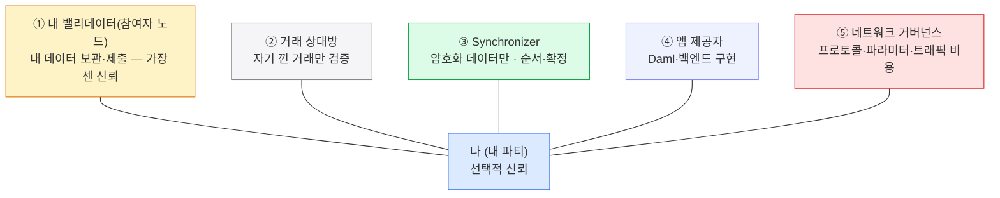

Canton의 신뢰는 "모두 신뢰"도 "아무도 불신"도 아닌 선택적 신뢰(selective trust)다 — 무엇을 위해 누구를 신뢰할지 내가 고른다.
한 덩어리가 아니라 다섯 영역으로 쪼개지고, 영역마다 신뢰함·안 믿어도 됨·완화책이 따로다.

## 선택적 신뢰 — 누구를 얼마나 믿나

9장이 "데이터가 **어떻게** 나뉘나(메커니즘)"였다면, 신뢰 모델은 "그래서 **누구를 얼마나** 믿어야 하나"다. Canton의 신뢰는 전부 아니면 전무가 아니다 — **무엇을 위해 누구를 신뢰할지 내가 고른다.** 그래서 한 덩어리가 아니라 다섯 영역으로 쪼개지고, 영역마다 **신뢰함 · 안 믿어도 됨 · 완화책**이 따로 붙는다.

가운데 "나(내 파티)"를 다섯 영역이 둘러싼다.

내 밸리데이터는 가장 가까이서 가장 많이 본다(그래서 가장 센 신뢰). 상대방·앱·거버넌스는 그보다 얇게, Synchronizer는 암호화된 것만 본다. 아래에서 다섯 영역을 하나씩 — 각 영역에 **[신뢰]** 무엇을 믿어야 하나, **[안 믿어도]** 안 믿어도 되는 것, **[완화]** 신뢰를 줄이는 수단으로 나눈다.

## 다섯 영역

### ① 내 밸리데이터(참여자 노드) — 가장 센 신뢰

- **[신뢰]** 내 컨트랙트 데이터를 안전하게 보관하고 쓸 수 있게 함 · RPC/거래 제출 허용 · 무단 노출 안 함 · 내 파티를 대신해 합의에 올바로 참여 · (로컬 파티면) 내 서명 키 취급.
- **[안 믿어도]** 내 거래 서명 — 외부 파티면 키는 내가 쥔다.
- **[완화]** 직접 운영 · 평판 있는 운영자 · 여러 밸리데이터로 다중 호스팅 · 외부 파티 키 · KMS/HSM.

### ② 거래 상대방

- **[신뢰]** 자기가 이해관계자인 거래를 정직히 검증해 확정되게 함 · 공유된 내 비공개 데이터를 누출 안 함.
- **[안 믿어도]** 원장 무결성·일관성 — **내 밸리데이터만 정직하면** 상대는 내가 낀 무효 거래를 확정 못 시킨다.
- **[완화]** Daml 권한 규칙으로 가능 행위·확인 지점 제한 · 중요 데이터는 신뢰 상대와만 공유 · 다중 서명 · 서명된 감사 추적.

### ③ Synchronizer

- **[신뢰]** 모든 밸리데이터에 일관된 순서로 전달 · 무한 검열 안 함 · 가용성 유지 · 확인 투표 올바로 집계 · 정확한 평결 전달.
- **[안 믿어도]** 프라이버시(내용 못 읽음 — 암호화) · 권한(위조 불가 — 서명 필요) · 적합성(무효 거래 승인 불가 — 이해관계자가 검증).
- **[완화]** 여러 독립 운영자를 둔 BFT Synchronizer · 자신의 Synchronizer 직접 운영.

### ④ 앱 제공자

- **[신뢰]** (사용자 대신 제출 시) 실제로 제출하고 검열 안 함 · 안전한 스마트컨트랙트 로직 구현 · 오프-원장 로직 올바로 구현 · (web2 로그인이면) 자격증명/세션 보호.
- **[완화]** 온-원장 권한(Daml) vs 오프-원장 구분 · 외부 파티 서명(거래마다 내가 승인) · 오픈소스/감사된 앱 · 내 밸리데이터로 준비·제출.

### ⑤ 네트워크 거버넌스

- **[신뢰]** 프로토콜 업그레이드가 내 앱·컨트랙트를 깨지 않음 · 네트워크 파라미터·트래픽(traffic) 비용이 공정하게 설정됨 · 분쟁 해결 절차.
- **[완화]** 투명한 거버넌스(CIP) · 이탈 권리(다른 Synchronizer로 이동) · 업그레이드를 예상한 컨트랙트 설계.

## 한눈에 — 전부가 아니라 부분

- **내 밸리데이터**는 내 모든 데이터를 보고 나를 차단할 수 있다 — 가장 센 신뢰.
- **거래 상대방**은 자기가 낀 컨트랙트만 보고, Daml·합의가 그 행위를 묶는다.
- **시퀀서·미디에이터**는 **암호화된 데이터만** — 잠시 지연은 시켜도 읽거나 위조는 못 한다.
- **앱 제공자·거버넌스**는 설계·구성에 따라 신뢰 수준이 달라진다.

## 탈중앙화는 계층마다 고른다

신뢰를 얼마나 분산할지도 한 번에 정하지 않고 계층마다 고른다.

- **밸리데이터** — 단일 운영자 신뢰 vs 여러 밸리데이터로 다중 호스팅해 분산.
- **Synchronizer** — 단일 운영자 vs BFT 시퀀서(노드 2/3만 정직하면 동작) vs 여러 Synchronizer 연결로 단일 장애점 제거.
- **글로벌 Synchronizer** — 최대 탈중앙화: 여러 독립 슈퍼 밸리데이터 + BFT 합의(임계값까지 비잔틴 견딤) + 투명한 CIP.

전통 블록체인이 "다수가 정직하다"에 거는 신뢰를, Canton은 "주로 내 밸리데이터"로 좁히고 나머지는 암호로 못 박는다.

## 여기까지가 통합 코스다

개념(프라이버시·원자성·신원/확정성·신뢰)과 그 코드(파티 ID·Daml·choice 시퀀스·포트·instrumentId)를 한 흐름에서 봤다. Canton이 강한 곳은 **기관 간(B2B) 정산**이고, 리테일·퍼블릭 DeFi엔 그 강점이 오히려 안 맞는다 — 도구를 용도에 맞게.
