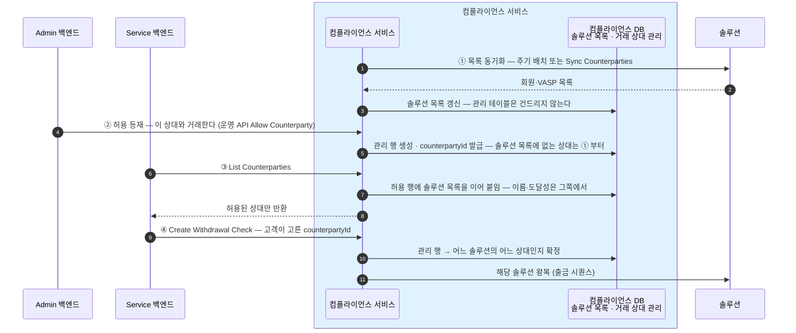
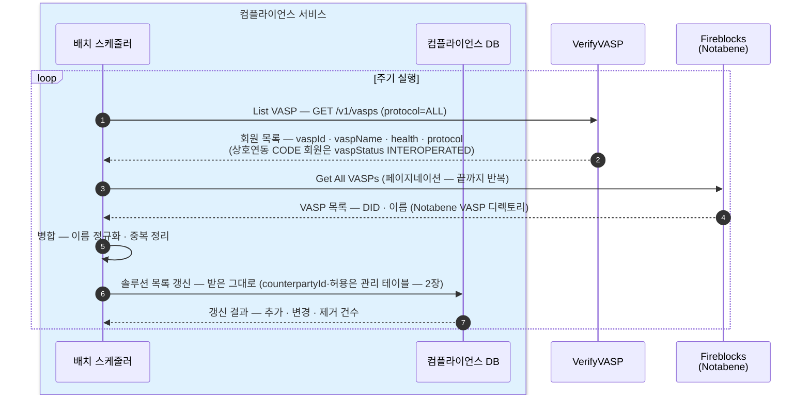
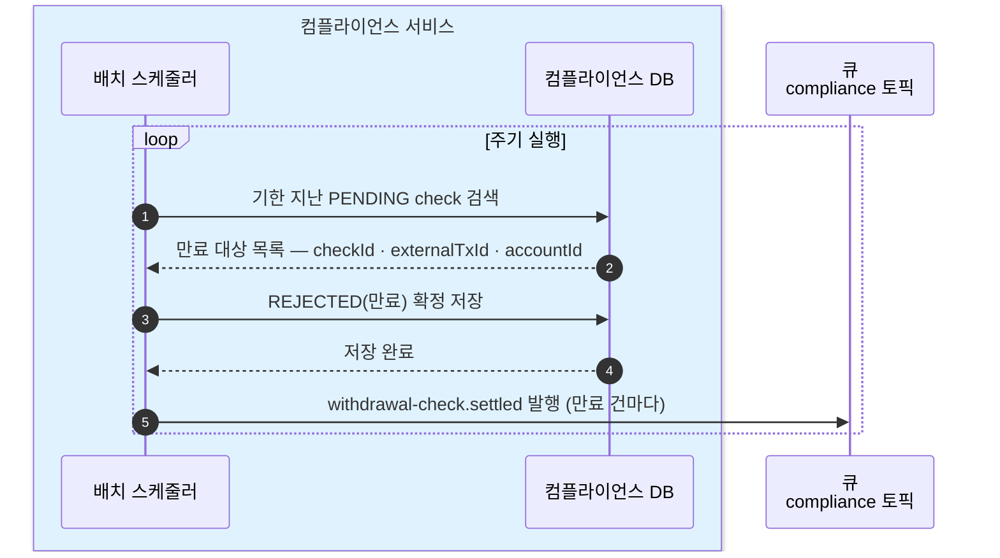
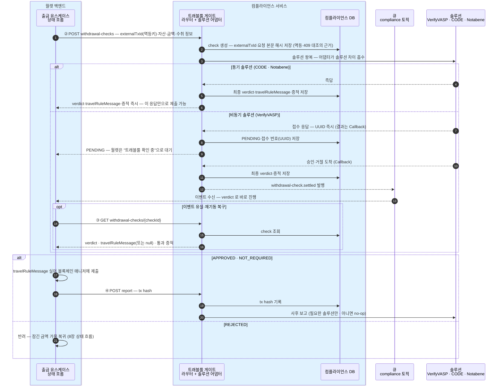
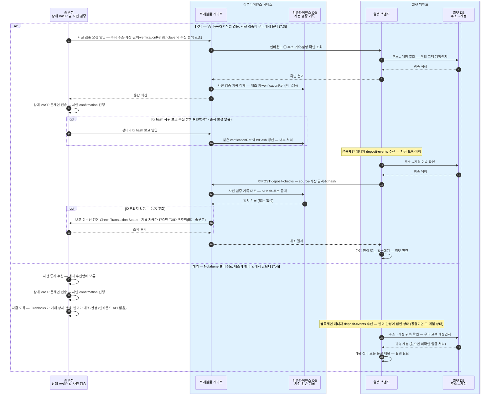

월렛 백엔드가 컴플라이언스 서비스를 호출하는 계약의 초안이다.
월렛은 어느 솔루션(VerifyVASP·CODE·Notabene)으로 처리되는지 몰라도 같은 호출 순서로 끝난다. 필드 타입은 이 문서가 아니라 API 문서에서 정의한다.

## 설계 원칙

- **비동기가 기본형** — 동기 솔루션(CODE·Notabene)은 "즉시 완료되는 비동기"로 접는다. 월렛의 처리 분기는 verdict 뿐이다.
- **멱등** — 멱등키는 `externalTxId`, 블록체인 매니저 제출에 쓰는 월렛의 출금 건 식별자 그대로다. 같은 키 재호출은 기존 check 를 돌려준다 (같은 키에 다른 내용이면 409).

## API — 월렛 → 컴플라이언스 (5개)

출금 확인 한 건은 **check** 리소스(WithdrawalCheck)로 만들어진다 — `checkId` 로 식별되고, 그 안에 verdict·travelRuleMessage·통과 증적이 담긴다. 2~4번이 이 리소스의 생성·조회·보고다.

| # | 엔드포인트 | 무엇 |
|---|---|---|
| 1 | `GET /compliance/travel-rule/counterparties` | **List Counterparties** — 출금 화면에서 고객에게 보여줄 수취 거래소 목록. **컴플라이언스 DB 의 거래소 목록에서 우리가 허용한 상대만** 답한다(솔루션 실시간 조회 아님 · 주기 동기화 · 허용은 운영이 켠다) |
| 2 | `POST /compliance/travel-rule/withdrawal-checks` | **Create Withdrawal Check** — 출금 확인 개시 (`externalTxId` = 멱등키). **거래소 선택 출금 전용** — 개인지갑 출금은 이 API 를 부르지 않는다(등록 지갑 확인은 월렛이 월렛 DB 의 등록 지갑 목록으로 자체 처리). 동기 솔루션은 최종 verdict·travelRuleMessage 까지 즉답 — 이 응답만으로 제출 가능. 비동기 솔루션은 PENDING |
| 3 | `GET /compliance/travel-rule/withdrawal-checks/{checkId}` | **Get Withdrawal Check** — 이벤트 유실 대비 폴링·재기동 복구 전용. 정상 흐름에서는 호출하지 않는다 |
| 4 | `POST /compliance/travel-rule/withdrawal-checks/{checkId}/report` | **Report Withdrawal Result** — 온체인 제출 후 tx hash 보고. 비차단 — 이 호출의 실패는 출금 흐름과 무관(재시도만 하면 된다) |
| 5 | `POST /compliance/travel-rule/deposit-checks` | **Create Deposit Check** — 입금 한 건의 트래블룰 확인. 서비스가 **보관 중인 사전 검증 기록과 대조**하고, 안 되면 능동 조회까지 해서 결과만 돌려준다. 호출 시점·판별 우선순위는 [트래블룰 8장](../../트래블룰/설계/08-gate-port.md), 귀속·가용 전이 판단은 월렛 몫 |

요청·응답 본문의 모양과 필드는 [API 문서](../API/api.md)에 정의한다.

경로를 `/compliance/travel-rule/...` 로 잡는 이유 — 다음 모듈(예: aml)이 생기면 `/compliance/aml/...` 로 나란히 붙는다.

## 운영 API — Admin → 컴플라이언스 (4개)

운영 API 는 등재 대상을 지칭해야 해서 솔루션 원어를 다룬다 — 월렛(Service) API 의 원어 비노출 규약과 구분된다.

| # | 엔드포인트 | 무엇 |
|---|---|---|
| 1 | `POST /compliance/travel-rule/counterparties/sync` | **Sync Counterparties** — VASP 목록 동기화를 즉시 실행 (주기 배치와 같은 일). 새 상대가 목록에 안 보일 때의 운영 대응 |
| 2 | `GET /compliance/travel-rule/counterparties/candidates?query=` | **List Counterparty Candidates** — 등재 후보를 솔루션 목록에서 검색 (미허용 포함) |
| 3 | `POST /compliance/travel-rule/counterparties` | **Allow Counterparty** — 허용 등재. 관리 행 생성 · counterpartyId 발급. 심사 기준은 컴플라이언스 부서 몫 |
| 4 | `DELETE /compliance/travel-rule/counterparties/{counterpartyId}` | **Disallow Counterparty** — 허용 해제. 행은 남기고 허용만 끈다 — List 에서 사라지고 새 출금 확인이 열리지 않는다 |

check 운영 조회·감사 기록 열람 등 나머지 운영 경로는 미설계([0장](00-scope.md) 열린 결정).

## VASP 목록의 처리 순서 — 동기화에서 출금 확인까지

VASP 목록은 테이블이 둘이다([2장](02-database.md)): 솔루션 목록(`cmpl_soln_vasp_m` — 동기화만 쓴다)과 허용 판단(`cmpl_vasp_m` — 운영만 쓴다). 순서는 **솔루션 목록이 먼저, 판단이 다음, 노출은 그 교집합**이다.



솔루션 목록에서 사라진 허용 상대는 ③의 이어 붙이기가 실패해 도달 불가로 노출된다 — 허용 판단은 관리 테이블에 있어 증발하지 않고, 재등장하면 그대로 복귀한다.

## 이벤트 — 컴플라이언스 → 월렛 (큐 · 확정)

비동기 확인의 결과 도착은 **메시지 큐 전용 토픽**으로 알린다 — 매니저→월렛이 큐인 기존 패턴과 동일하고, 파티션 키도 같은 규칙(계정 단위)이다.

- **토픽**: `compliance`
- **이벤트**: `withdrawal-check.settled`. settled = check 가 최종 결과(APPROVED·REJECTED — PENDING 만료 포함)에 도달해 더는 바뀌지 않는다

메시지 본문은 JSON 이다 — HTTP 응답과 달리 `data`/`meta` 봉투 없이 이 모양 그대로 실린다. 필드 정의는 [API 문서의 SettledEvent](../API/api.md).

```json
{
  "type": "withdrawal-check.settled",
  "checkId": "chk_01J9Z",
  "externalTxId": "WD-000123",
  "accountId": "acct_01H8X",
  "verdict": "APPROVED",
  "settledAt": "2026-07-16T04:05:06.789Z"
}
```
- **월렛은 이벤트의 verdict 로 바로 진행한다** — 비동기 경로(VerifyVASP)는 travelRuleMessage 가 없어(사전 승인 자체가 통과) 이벤트만으로 제출·반려가 가능하다. Get(3번)은 이벤트 유실 대비 폴링·재기동 복구 전용이고, 그마저 놓쳐도 PENDING 만료 규칙이 흐름을 끝낸다.
- travelRuleMessage 를 만드는 솔루션이 비동기로 붙는 날이 오면 — PII 라 이벤트에 싣지 않고, 그때 Get 을 정상 흐름에 되살린다 (지금 그런 조합은 없다).
- **PENDING 만료의 주인은 이 서비스** — 솔루션별 시간 규칙([트래블룰 4장](../../트래블룰/설계/04-policy-and-timing.md))을 알고 있는 쪽이 만료를 가려 REJECTED 로 settled 이벤트를 낸다.

## Verdict 타입

오른쪽 세 열은 각 솔루션이 돌려주는 상태·응답이고, 그것들이 왼쪽의 verdict 하나로 접혀서 월렛에 도달한다.

| TrVerdict | 뜻 | Notabene (해외 · Fireblocks 경유) | VerifyVASP (국내 · 비동기) | CODE (국내 직접 · 동기) |
|---|---|---|---|---|
| `NOT_REQUIRED` | 트래블룰 대상 아님<br/>· 금액이 한국 기준(원화 100만원) 미만이거나<br/>· 수취가 개인지갑 — 교환할 상대 VASP 없음 | validate/full 이 사유를 반환:<br/>· `BELOW_THRESHOLD` — 보내는 쪽 기준 미만<br/>· `NON_CUSTODIAL` — 개인지갑<br/>위 사유(또는 동일 VASP 내부 이전)로 판정되면<br/>Notabene 에 `Saved` 로 기록 — 전송 없이 사유만 남음 | 한국 기준(100만원) 미만<br/>— 보내는 쪽이 원화 환산가 필드<br/>(tradePrice·KRW)를 채워 보냄 | 한국 기준(100만원) 미만<br/>— 원화 환산가 필드 동일 |
| `APPROVED` | 통과 — 정보 교환·검증이 승인됐다 | 출금 — validate/full 검증 통과(`isValid`)<br/>입금 — 벤더 스크리닝 통과<br/>(`Completed` → Post-Screening Accept)로 도착 | User Verification 승인<br/>— Callback 도착 | Asset Transfer Authorization 승인<br/>— 동기 즉답 |
| `PENDING` | 아직 결과가 없다 — 결과가 나면<br/>큐 이벤트(`withdrawal-check.settled`)로 알린다 | —<br/>(동기 즉답이라 없음) | 접수 번호(UUID)만 즉시 반환,<br/>결과는 Callback 대기 | —<br/>(동기 즉답이라 없음) |
| `REJECTED` | 거절 — 상대 거절 또는 PENDING 만료 | — (검증 실패는 요청 오류로 응답)<br/>벤더 게이트의 `Rejected`·`Blocking Time Expired` 는 제출 뒤<br/>블록체인 매니저의 거래 상태 이벤트(REJECTED)로 온다 | 상대 거절<br/>· PENDING 만료 | 상대 거절 |

## 배치 — 서비스가 스스로 도는 두 주기 작업

월렛 호출 없이 서비스가 주기적으로 실행한다. 사전 검증 기록 보존 기간 만료(값 미정 — [트래블룰 4장](../../트래블룰/설계/04-policy-and-timing.md))도 확정되면 이 자리에 추가된다.

### 목록 동기화 — List Counterparties 가 답할 거래소 목록을 만든다

주기는 미정(0장 미확정). 주기 실행 외에 운영 API(Sync Counterparties)로도 즉시 실행된다. 목록 API 출처 — [VerifyVASP List VASP](https://docs.verifyvasp.com/reference/travelrule-list-vasp-ids)(`GET /v1/vasps` · 상호연동 CODE 회원 포함) · [Fireblocks Get All VASPs](https://developers.fireblocks.com/api-reference/travel-rule/get-all-vasps) · [Fireblocks TRLink List VASPs](https://developers.fireblocks.com/api-reference/trlink/list-vasps)(Notabene VASP 디렉토리 · 페이지네이션).



### PENDING 만료 스캔 — settled 이벤트의 REJECTED(만료) 를 만든다

시간 규칙은 [트래블룰 4장](../../트래블룰/설계/04-policy-and-timing.md).



## 시퀀스 — 출금 확인 한 사이클



## 인바운드 내부 API — 월렛이 구현, 컴플라이언스가 호출 (1개)

상대 VASP 의 사전 검증 요청(수신 질문)에 답하기 위한 계약. 수신 기록의 적재·tx hash 갱신은 컴플라이언스 DB 사전 검증 기록에서 내부 처리되므로, 월렛에는 아래 질문 하나만 온다.

| # | 계약 | 무엇 |
|---|---|---|
| 1 | **Verify Address Attribution** — 주소 귀속·실명 확인 조회 | "이 주소가 너희 고객 아무개 소유인가" — 주소↔계정은 월렛이, 실명 대조는 그 데이터를 가진 서비스에 이어 조회 |

## 시퀀스 — 입금 한 사이클



## 시나리오 워크스루 — 월렛의 호출 순서는 세 솔루션 모두 같다

| 단계 (월렛 관점) | 국내 VerifyVASP (7.1) | 국내 CODE 직접 (7.10) | 해외 Notabene (7.2) |
|---|---|---|---|
| 목록 (List Counterparties) | 컴플라이언스 DB 에서 반환 (원천: 회원 목록) | 컴플라이언스 DB 에서 반환 (원천: 회원 목록·상호연동) | 컴플라이언스 DB 에서 반환 (원천: VASP 목록) |
| 개시 (Create Withdrawal Check) | **PENDING** — 승인 왕복 진행 | APPROVED — 동기 즉답 | APPROVED — validate/full 판별·검증 즉답 |
| 결과 대기 | `compliance` 이벤트 수신으로 종료 (Get 불필요) | 불필요 — 개시 응답으로 바로 | 불필요 — 개시 응답으로 바로 |
| 제출 | travelRuleMessage null — 그대로 제출 | travelRuleMessage null — 그대로 제출 | **travelRuleMessage 동봉**해 제출 |
| 보고 (Report Withdrawal Result) | tx hash 보고 실행 | 실행 | no-op — 벤더가 이미 안다 |

가운데 열(CODE 직접)은 상호연동 실효 부족 시의 **대안**이다 — 빗썸 등 CODE 회원의 기본 경로는 상호연동(A.1)이라 왼쪽 VerifyVASP 열과 동일하게 돈다.

Notabene(Fireblocks) 경로 하나만 의미가 다른 지점 — **최종 게이트(Post-Screening)는 제출 뒤 벤더 안에서 한 번 더 돈다**([트래블룰 2장](../../트래블룰/설계/02-withdrawal.md)). 이 경로의 APPROVED 는 "검증 통과·travelRuleMessage 준비 완료"라는 뜻이고, 벤더 스크리닝에서 거절되면 그 결과는 컴플라이언스가 아니라 **매니저의 거래 상태(REJECTED)** 로 온다 — 기존 출금 실패 처리와 같은 자리다.

월렛 코드는 개시→제출→보고를 솔루션 구분 없이 같은 순서로 탄다 — 다른 것은 verdict 가 즉답이냐 PENDING 이냐, travelRuleMessage 가 null 이냐뿐이고 둘 다 값의 차이지 흐름의 차이가 아니다.

## 미확정 — 이 계약에 걸리는 것

- **원화 임계 판단의 위치** — 벤더가 원화 기준을 지원하는지 미확정([트래블룰 14장](../../트래블룰/설계/14-fireblocks-questions.md) 문의 1). 어느 쪽이든 이 서비스 안에서 흡수하고, 월렛 표면(verdict)은 바뀌지 않는다.
- **validate/full 1차 호출** — 수취인 정보 없이 `type` 판별을 돌려주는지 테스트로 확정([트래블룰 2장](../../트래블룰/설계/02-withdrawal.md)).
- **타입 정의** — 요청/응답 필드는 [API 문서](../API/api.md)에 한 곳에 정의한다. 이 문서는 계약의 모양까지만.
