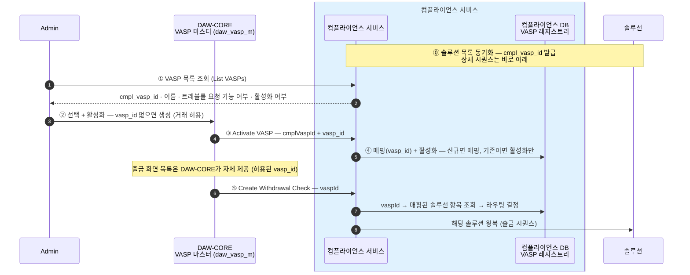
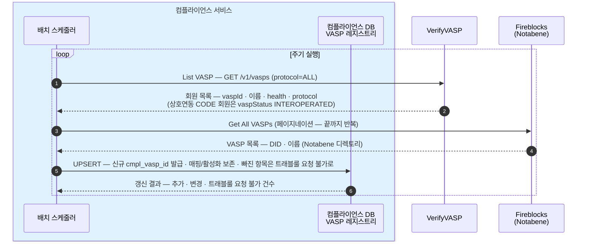
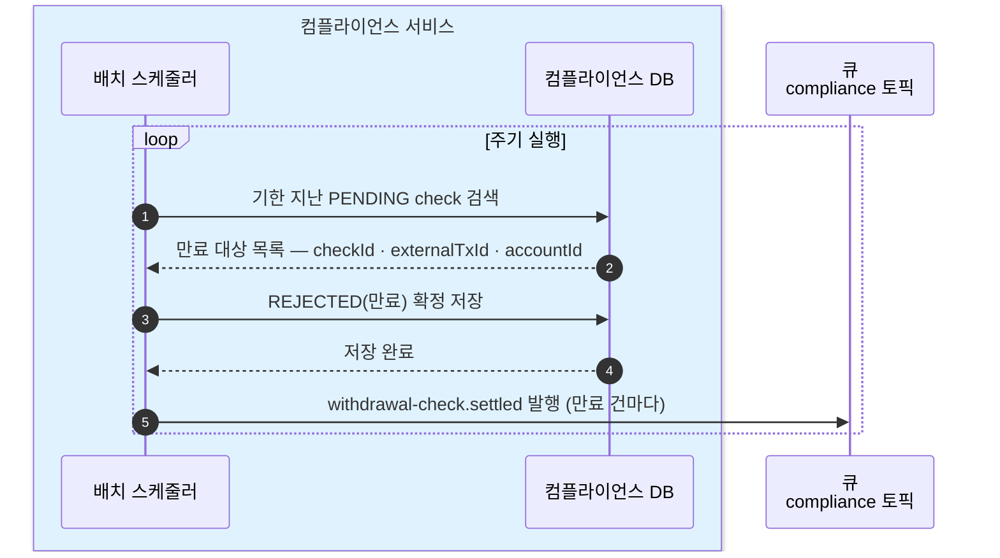
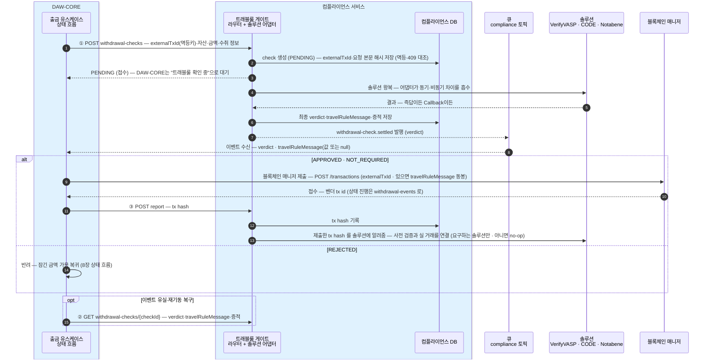
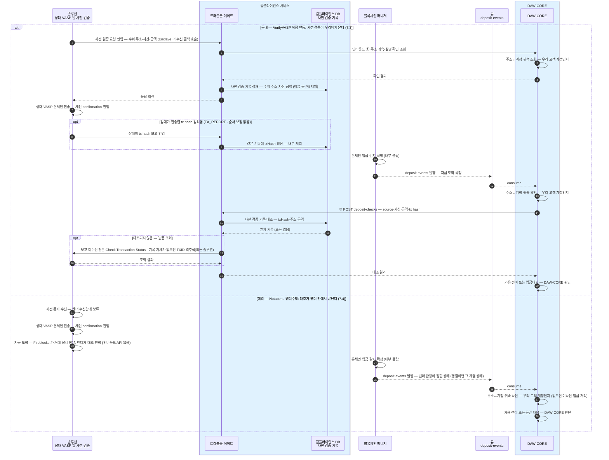

DAW-CORE가 컴플라이언스 서비스를 호출하는 계약의 초안이다.
DAW-CORE는 어느 솔루션(VerifyVASP·CODE·Notabene)으로 처리되는지 몰라도 같은 호출 순서로 끝난다. 필드 타입은 이 문서가 아니라 API 문서에서 정의한다.

## 설계 원칙

- **비동기가 기본형** — 동기 솔루션(CODE·Notabene)은 "즉시 완료되는 비동기"로 접는다. DAW-CORE의 처리 분기는 verdict 뿐이다.
- **멱등** — 멱등키는 `externalTxId`, 블록체인 매니저 제출에 쓰는 DAW-CORE의 출금 건 식별자 그대로다. 같은 키 재호출은 기존 check 를 돌려준다 (같은 키에 다른 내용이면 409).

## API — DAW-CORE → 컴플라이언스 (4개)

출금 확인 한 건은 **check** 리소스(WithdrawalCheck)로 만들어진다 — `checkId` 로 식별되고, 그 안에 verdict·travelRuleMessage·통과 증적이 담긴다. 1~3번이 이 리소스의 생성·조회·보고다.

| # | 엔드포인트 | 무엇 |
|---|---|---|
| 1 | `POST /compliance/travel-rule/withdrawal-checks` | **Create Withdrawal Check** — 출금 확인 개시 (`externalTxId` = 멱등키). 수취 거래소는 **`vaspId`(DAW-CORE가 발급한 VASP 식별자)로 지목**하고, 어느 솔루션으로 보낼지는 컴플라이언스가 스스로 정한다. **거래소 선택 출금 전용** — 개인지갑 출금은 이 API 를 부르지 않는다(등록 지갑 확인은 DAW-CORE가 DAW-CORE DB 의 등록 지갑 목록으로 자체 처리). **항상 `PENDING`(접수)으로 답하고, 최종 verdict 는 큐 이벤트로** — 동기 솔루션도 "즉시 완료되는 비동기"로 접는다 |
| 2 | `GET /compliance/travel-rule/withdrawal-checks/{checkId}` | **Get Withdrawal Check** — 이벤트 유실·재기동 복구 전용. 정상 흐름에서는 호출하지 않는다(이벤트가 verdict·travelRuleMessage 를 다 싣는다) |
| 3 | `POST /compliance/travel-rule/withdrawal-checks/{checkId}/report` | **Report Withdrawal Result** — 온체인 제출 후 tx hash 보고. 비차단 — 이 호출의 실패는 출금 흐름과 무관(재시도만 하면 된다) |
| 4 | `POST /compliance/travel-rule/deposit-checks` | **Create Deposit Check** — 입금 한 건의 트래블룰 확인. 서비스가 **보관 중인 사전 검증 기록과 대조**하고, 안 되면 능동 조회까지 해서 결과만 돌려준다. 호출 시점·판별 우선순위는 [트래블룰 8장](../../트래블룰/설계/08-gate-port.md), 귀속·가용 전이 판단은 DAW-CORE 몫 |

요청·응답 본문의 모양과 필드는 [API 문서](../API/api.md)에 정의한다.

**출금 화면의 거래소 목록은 이 서비스가 답하지 않는다** — 고객에게 보여줄 "거래할 수 있는 거래소" 목록은 DAW-CORE가 자기 VASP 마스터(`daw_vasp_m` — 거래 허용을 여기서 켠다)에서 직접 낸다. 컴플라이언스는 출금 확인이 들어온 순간에만, `vaspId` 를 받아 솔루션으로 라우팅하는 일만 한다.

경로를 `/compliance/travel-rule/...` 로 잡는 이유 — 다음 모듈(예: aml)이 생기면 `/compliance/aml/...` 로 나란히 붙는다.

## 운영 API — Admin → 컴플라이언스 (4개)

거래 허용·VASP 정체는 DAW-CORE의 VASP 마스터(`daw_vasp_m`)가 갖고, 컴플라이언스는 **VASP 를 온보딩(매핑·활성화)** 하는 운영을 맡는다. 컴플라이언스가 아는 VASP 는 각자 안정 id(`cmpl_vasp_id`)를 갖고, Admin 이 그중 하나를 골라 활성화하면 코어 `vasp_id` 와 매핑된다([2장](02-database.md)).

| # | 엔드포인트 | 무엇 |
|---|---|---|
| 1 | `POST /compliance/travel-rule/vasps/sync` | **Sync Solution VASPs** — 솔루션 VASP 목록 동기화를 즉시 실행. 신규 항목엔 `cmpl_vasp_id` 를 발급하고, 매핑·활성화는 보존한다(UPSERT) |
| 2 | `GET /compliance/travel-rule/vasps?query=` | **List VASPs** — Admin 이 온보딩 대상을 고르는 목록. `cmpl_vasp_id`·이름·솔루션·트래블룰 요청을 보낼 수 있는지·활성화·매핑된 `vasp_id` 를 준다 |
| 3 | `POST /compliance/travel-rule/vasps/{cmplVaspId}/activate` | **Activate VASP** — 코어가 만든 `vasp_id` 를 이 항목에 **매핑하고 활성화**한다. 이미 매핑돼 있으면 활성화만. **호출 주체는 Admin(코어) 백엔드** |
| 4 | `POST /compliance/travel-rule/vasps/{cmplVaspId}/deactivate` | **Deactivate VASP** — 활성화를 끈다. 매핑(`vasp_id`)은 남긴다 — 재활성화하면 그대로 |

check 운영 조회·감사 기록 열람 등 나머지 운영 경로는 미설계([0장](00-scope.md) 열린 결정).

## VASP 온보딩의 처리 순서 — 동기화에서 출금 확인까지

VASP 정체와 거래 허용은 DAW-CORE의 VASP 마스터(`daw_vasp_m`)에 있고, 컴플라이언스는 **솔루션 라우팅**을 맡는다. 온보딩은 Admin 이 컴플라이언스 목록에서 VASP 를 골라 활성화하는 순간, 코어가 `vasp_id` 를 만들어 컴플라이언스에 매핑하는 흐름이다. 그 뒤 출금 확인은 `vaspId` 하나만 실으면 되고, 어느 솔루션으로 보낼지는 컴플라이언스가 매핑을 보고 정한다.



Deactivate 하거나 솔루션 목록에서 사라진(트래블룰 요청을 보낼 수 없는) VASP 는 새 출금 확인이 열리지 않는다 — 매핑은 남아 있어 재활성화·재동기화하면 그대로 복구된다.

### ⓪ 솔루션 목록 동기화

주기는 미정(0장 미확정). 주기 실행 외에 운영 API(Sync Solution VASPs)로도 즉시 실행된다. 목록 API 출처 — [VerifyVASP List VASP](https://docs.verifyvasp.com/reference/travelrule-list-vasp-ids)(`GET /v1/vasps` · 상호연동 CODE 회원 포함) · [Fireblocks Get All VASPs](https://developers.fireblocks.com/api-reference/travel-rule/get-all-vasps) · [Fireblocks TRLink List VASPs](https://developers.fireblocks.com/api-reference/trlink/list-vasps)(Notabene VASP 디렉토리 · 페이지네이션).

동기화는 솔루션에서 받은 목록을 컴플라이언스 VASP 레지스트리에 **UPSERT** 한다 — 신규 항목엔 `cmpl_vasp_id` 를 발급하고, 이미 있는 항목은 이름·트래블룰 요청을 보낼 수 있는지만 갱신하며 **매핑(`vasp_id`)·활성화(`actv_yn`)는 보존**한다. 목록에서 빠진 항목은 지우지 않고 "트래블룰 요청을 보낼 수 없음"으로만 표시한다([2장](02-database.md)).



## 이벤트 — 컴플라이언스 → DAW-CORE (큐 · 확정)

비동기 확인의 결과 도착은 **메시지 큐 전용 토픽**으로 알린다 — 매니저→DAW-CORE가 큐인 기존 패턴과 동일하고, 파티션 키도 같은 규칙(계정 단위)이다.

- **토픽**: `compliance`
- **이벤트**: `withdrawal-check.settled`. settled = check 가 최종 결과(APPROVED·REJECTED — PENDING 만료 포함)에 도달해 더는 바뀌지 않는다

메시지 본문은 JSON 이다 — HTTP 응답과 달리 `data`/`meta` 봉투 없이 이 모양 그대로 실린다. 필드 정의는 [API 문서의 SettledEvent](../API/api.md).

```json
{
  "type": "withdrawal-check.settled",
  "checkId": "chk_01J9Z",
  "externalTxId": "WD-000123",
  "accountId": "acct_01H8X",
  "verdict": "APPROVED",
  "travelRuleMessage": "enc_9f3a...",
  "settledAt": "2026-07-16T04:05:06.789Z"
}
```
- **DAW-CORE는 이벤트만으로 진행한다** — 모든 솔루션이 이 한 경로로 통일된다(출금 확인은 항상 PENDING 접수 → 이벤트 확정). 이벤트에 verdict 와 **travelRuleMessage(값 또는 null)** 가 함께 오므로, APPROVED 면 값이 있으면 동봉해 바로 제출한다 — Get 왕복이 없다.
- **Get(2번)은 유실·재기동 복구 전용** — 이벤트를 놓쳤을 때 같은 내용을 다시 읽고, 그마저 놓쳐도 PENDING 만료 규칙이 흐름을 끝낸다.
- **PENDING 만료의 주인은 이 서비스** — 솔루션별 시간 규칙([트래블룰 4장](../../트래블룰/설계/04-policy-and-timing.md))을 알고 있는 쪽이 만료를 가려 REJECTED 로 settled 이벤트를 낸다.

## Verdict 타입

오른쪽 세 열은 각 솔루션이 돌려주는 상태·응답이고, 그것들이 왼쪽의 verdict 하나로 접혀서 DAW-CORE에 도달한다.

| TrVerdict | 뜻 | Notabene (해외 · Fireblocks 경유) | VerifyVASP (국내 · 비동기) | CODE (국내 직접 · 동기) |
|---|---|---|---|---|
| `NOT_REQUIRED` | 트래블룰 대상 아님<br/>· 금액이 한국 기준(원화 100만원) 미만이거나<br/>· 수취가 개인지갑 — 교환할 상대 VASP 없음 | validate/full 이 사유를 반환:<br/>· `BELOW_THRESHOLD` — 보내는 쪽 기준 미만<br/>· `NON_CUSTODIAL` — 개인지갑<br/>위 사유(또는 동일 VASP 내부 이전)로 판정되면<br/>Notabene 에 `Saved` 로 기록 — 전송 없이 사유만 남음 | 한국 기준(100만원) 미만<br/>— 보내는 쪽이 원화 환산가 필드<br/>(tradePrice·KRW)를 채워 보냄 | 한국 기준(100만원) 미만<br/>— 원화 환산가 필드 동일 |
| `APPROVED` | 통과 — 정보 교환·검증이 승인됐다 | 출금 — validate/full 검증 통과(`isValid`)<br/>입금 — 벤더 스크리닝 통과<br/>(`Completed` → Post-Screening Accept)로 도착 | User Verification 승인<br/>— Callback 도착 | Asset Transfer Authorization 승인<br/>— 동기 즉답 |
| `PENDING` | 아직 결과가 없다 — 결과가 나면<br/>큐 이벤트(`withdrawal-check.settled`)로 알린다 | —<br/>(동기 즉답이라 없음) | 접수 번호(UUID)만 즉시 반환,<br/>결과는 Callback 대기 | —<br/>(동기 즉답이라 없음) |
| `REJECTED` | 거절 — 상대 거절 또는 PENDING 만료 | — (검증 실패는 요청 오류로 응답)<br/>벤더 게이트의 `Rejected`·`Blocking Time Expired` 는 제출 뒤<br/>블록체인 매니저의 거래 상태 이벤트(REJECTED)로 온다 | 상대 거절<br/>· PENDING 만료 | 상대 거절 |

## 배치 — 서비스가 스스로 도는 두 주기 작업

DAW-CORE 호출 없이 서비스가 주기적으로 실행한다. 하나는 **목록 동기화**(위 처리 순서 절의 ①), 하나는 아래 PENDING 만료 스캔이다. 사전 검증 기록 보존 기간 만료(값 미정 — [트래블룰 4장](../../트래블룰/설계/04-policy-and-timing.md))도 확정되면 이 자리에 추가된다.

### PENDING 만료 스캔 — settled 이벤트의 REJECTED(만료) 를 만든다

시간 규칙은 [트래블룰 4장](../../트래블룰/설계/04-policy-and-timing.md).



## 시퀀스 — 출금 확인 한 사이클

모든 솔루션을 **비동기(큐)로 통일**한다 — 동기 솔루션(CODE·Notabene)도 컴플라이언스가 "즉시 완료되는 비동기"로 접어, Create 는 항상 `PENDING`(접수)으로 답하고 최종 verdict 는 `compliance` 이벤트로만 도착한다(설계 원칙). DAW-CORE는 응답 분기 없이 한 경로만 탄다.



이벤트가 **travelRuleMessage 를 그대로 싣는다** — 값을 만드는 솔루션(Notabene)이면 값이, 사전 승인이라 값이 없는 솔루션(VerifyVASP·CODE)이면 null 이 온다. DAW-CORE는 Get 없이 이벤트만으로 제출한다(값 있으면 동봉). Get 은 이벤트 유실·재기동 복구 전용으로 돌아간다.

## 인바운드 내부 API — DAW-CORE가 구현, 컴플라이언스가 호출 (1개)

상대 VASP 의 사전 검증 요청(수신 질문)에 답하기 위한 계약. 수신 기록의 적재·tx hash 갱신은 컴플라이언스 DB 사전 검증 기록에서 내부 처리되므로, DAW-CORE에는 아래 질문 하나만 온다.

| # | 계약 | 무엇 |
|---|---|---|
| 1 | **Verify Address Attribution** — 주소 귀속·실명 확인 조회 | "이 주소가 너희 고객 아무개 소유인가" — 주소↔계정은 DAW-CORE가, 실명 대조는 그 데이터를 가진 서비스에 이어 조회 |

## 시퀀스 — 입금 한 사이클



## 시나리오 워크스루 — DAW-CORE의 호출 순서는 세 솔루션 모두 같다

| 단계 (DAW-CORE 관점) | 국내 VerifyVASP (7.1) | 국내 CODE 직접 (7.10) | 해외 Notabene (7.2) |
|---|---|---|---|
| 목록 (거래소 선택) | DAW-CORE VASP 마스터에서 자체 제공 (허용된 VASP) | DAW-CORE VASP 마스터에서 자체 제공 | DAW-CORE VASP 마스터에서 자체 제공 |
| 개시 (Create Withdrawal Check — `vaspId`) | **PENDING** (접수) | **PENDING** (접수) | **PENDING** (접수) |
| 결과 대기 | `compliance` 이벤트 수신 | `compliance` 이벤트 수신 (즉시 도착) | `compliance` 이벤트 수신 (즉시 도착) |
| 제출 | travelRuleMessage null — 그대로 제출 | travelRuleMessage null — 그대로 제출 | 이벤트의 **travelRuleMessage 동봉**해 제출 |
| 보고 (Report Withdrawal Result) | tx hash 보고 실행 | 실행 | no-op — 벤더가 이미 안다 |

가운데 열(CODE 직접)은 상호연동 실효 부족 시의 **대안**이다 — 빗썸 등 CODE 회원의 기본 경로는 상호연동(A.1)이라 왼쪽 VerifyVASP 열과 동일하게 돈다.

Notabene(Fireblocks) 경로 하나만 의미가 다른 지점 — **최종 게이트(Post-Screening)는 제출 뒤 벤더 안에서 한 번 더 돈다**([트래블룰 2장](../../트래블룰/설계/02-withdrawal.md)). 이 경로의 APPROVED 는 "검증 통과·travelRuleMessage 준비 완료"라는 뜻이고, 벤더 스크리닝에서 거절되면 그 결과는 컴플라이언스가 아니라 **매니저의 거래 상태(REJECTED)** 로 온다 — 기존 출금 실패 처리와 같은 자리다.

DAW-CORE 코드는 개시(PENDING)→이벤트 수신→제출→보고를 솔루션 구분 없이 같은 순서로 탄다 — 다른 것은 이벤트가 즉시 오느냐 나중에 오느냐, travelRuleMessage 가 값이냐 null 이냐뿐이고 흐름의 차이가 아니다.
