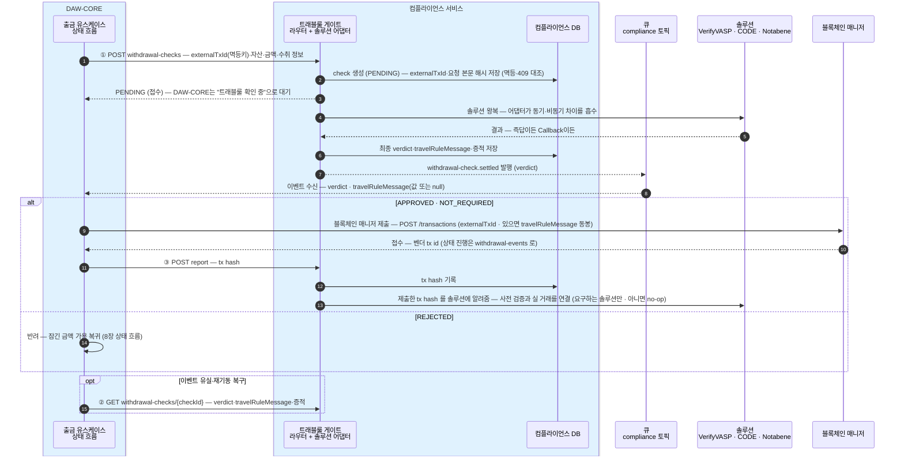
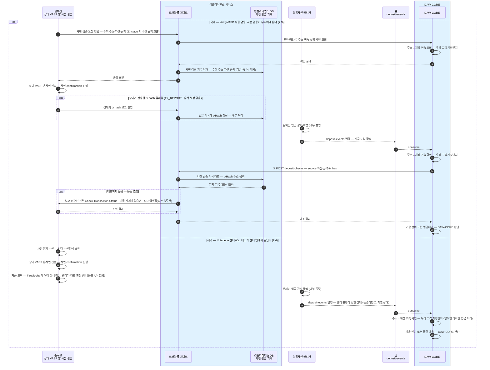

DAW-CORE가 컴플라이언스 서비스를 호출하는 계약의 초안이다.
DAW-CORE는 어느 솔루션(VerifyVASP·CODE·Notabene)으로 처리되는지 몰라도 같은 호출 순서로 끝난다. 필드 타입은 이 문서가 아니라 API 문서에서 정의한다.

## API — DAW-CORE → 컴플라이언스 (4개)

출금 확인 한 건은 **check** 리소스(WithdrawalCheck)로 만들어진다 — `checkId` 로 식별되고, 그 안에 verdict·travelRuleMessage·통과 증적이 담긴다. 1~3번이 이 리소스의 생성·조회·보고다.

| # | 엔드포인트 | 무엇 |
|---|---|---|
| 1 | `POST /compliance/travel-rule/withdrawal-checks` | **Create Withdrawal Check** — 출금 확인 개시. `externalTxId` 멱등, `vaspId` 로 수취 거래소 지목. 거래소 선택 출금 전용(개인지갑 제외). 항상 `PENDING` 접수 → verdict 는 큐 이벤트로 |
| 2 | `GET /compliance/travel-rule/withdrawal-checks/{checkId}` | **Get Withdrawal Check** — 이벤트 유실·재기동 복구 전용. 정상 흐름에서는 호출하지 않는다(이벤트가 verdict·travelRuleMessage 를 다 싣는다) |
| 3 | `POST /compliance/travel-rule/withdrawal-checks/{checkId}/report` | **Report Withdrawal Result** — 온체인 제출 후 tx hash 보고. 비차단 — 이 호출의 실패는 출금 흐름과 무관(재시도만 하면 된다) |
| 4 | `POST /compliance/travel-rule/deposit-checks` | **Create Deposit Check** — 입금 한 건의 트래블룰 확인. 서비스가 **보관 중인 사전 검증 기록과 대조**하고, 안 되면 능동 조회까지 해서 결과만 돌려준다. 호출 시점·판별 우선순위는 [트래블룰 8장](../../트래블룰/설계/08-gate-port.md), 귀속·가용 전이 판단은 DAW-CORE 몫 |

요청·응답 본문의 모양과 필드는 [API 문서](../API/api.md)에 정의한다.

**출금 화면의 거래소 목록은 이 서비스가 답하지 않는다** — 고객에게 보여줄 "거래할 수 있는 거래소" 목록은 DAW-CORE가 자기 VASP 마스터(`daw_vasp_m` — 거래 허용을 여기서 켠다)에서 직접 낸다. 컴플라이언스는 출금 확인이 들어온 순간에만, `vaspId` 를 받아 솔루션으로 라우팅하는 일만 한다.

경로를 `/compliance/travel-rule/...` 로 잡는 이유 — 다음 모듈(예: aml)이 생기면 `/compliance/aml/...` 로 나란히 붙는다.

VASP 온보딩(Admin 운영 API·매핑·활성화)과 주기 배치는 [3장 운영·내부](03-operations.md)로 뺐다 — 이 장은 DAW-CORE 통합 계약만 다룬다.

## 이벤트 — 컴플라이언스 → DAW-CORE (큐)

비동기 확인의 결과 도착은 **메시지 큐 전용 토픽**으로 알린다 — 매니저→DAW-CORE가 큐인 기존 패턴과 동일하고, 파티션 키도 같은 규칙(계정 단위)이다.

| 토픽 | 담는 이벤트 | 파티션 키 |
|---|---|---|
| `compliance` | 출금 확인 결과 (`withdrawal-check.settled`) | 계정 accountId |

settled = check 가 최종 결과(APPROVED·REJECTED — PENDING 만료 포함)에 도달해 더는 바뀌지 않는다.

메시지 본문은 JSON 이다 — HTTP 응답과 달리 `data`/`meta` 봉투 없이 이 모양 그대로 실린다. 필드 정의는 [API 문서의 SettledEvent](../API/api.md).

```json
{
  "type": "withdrawal-check.settled",
  "checkId": "chk_01J9Z",
  "externalTxId": "WD-000123",
  "accountId": "acct_01H8X",
  "verdict": "APPROVED",
  "travelRuleMessage": "enc_9f3a...",
  "settledAt": "2026-07-16T04:05:06.789Z"
}
```

## Verdict 타입

오른쪽 세 열은 각 솔루션이 돌려주는 상태·응답이고, 그것들이 왼쪽의 verdict 하나로 접혀서 DAW-CORE에 도달한다.

| TrVerdict | 뜻 | Notabene (해외 · Fireblocks 경유) | VerifyVASP (국내 · 비동기) | CODE (국내 직접 · 동기) |
|---|---|---|---|---|
| `NOT_REQUIRED` | 트래블룰 대상 아님<br/>· 금액이 한국 기준(원화 100만원) 미만이거나<br/>· 수취가 개인지갑 — 교환할 상대 VASP 없음 | validate/full 이 사유를 반환:<br/>· `BELOW_THRESHOLD` — 보내는 쪽 기준 미만<br/>· `NON_CUSTODIAL` — 개인지갑<br/>위 사유(또는 동일 VASP 내부 이전)로 판정되면<br/>Notabene 에 `Saved` 로 기록 — 전송 없이 사유만 남음 | 한국 기준(100만원) 미만<br/>— 보내는 쪽이 원화 환산가 필드<br/>(tradePrice·KRW)를 채워 보냄 | 한국 기준(100만원) 미만<br/>— 원화 환산가 필드 동일 |
| `APPROVED` | 통과 — 정보 교환·검증이 승인됐다 | 출금 — validate/full 검증 통과(`isValid`)<br/>입금 — 벤더 스크리닝 통과<br/>(`Completed` → Post-Screening Accept)로 도착 | User Verification 승인<br/>— Callback 도착 | Asset Transfer Authorization 승인<br/>— 동기 즉답 |
| `PENDING` | 아직 결과가 없다 — 결과가 나면<br/>큐 이벤트(`withdrawal-check.settled`)로 알린다 | —<br/>(동기 즉답이라 없음) | 접수 번호(UUID)만 즉시 반환,<br/>결과는 Callback 대기 | —<br/>(동기 즉답이라 없음) |
| `REJECTED` | 거절 — 상대 거절 또는 PENDING 만료 | — (검증 실패는 요청 오류로 응답)<br/>벤더 게이트의 `Rejected`·`Blocking Time Expired` 는 제출 뒤<br/>블록체인 매니저의 거래 상태 이벤트(REJECTED)로 온다 | 상대 거절<br/>· PENDING 만료 | 상대 거절 |

## 시퀀스 — 출금 확인 한 사이클

모든 솔루션을 **비동기(큐)로 통일**한다 — 동기 솔루션(CODE·Notabene)도 컴플라이언스가 "즉시 완료되는 비동기"로 접어, Create 는 항상 `PENDING`(접수)으로 답하고 최종 verdict 는 `compliance` 이벤트로만 도착한다(설계 원칙). DAW-CORE는 응답 분기 없이 한 경로만 탄다.



이벤트가 **travelRuleMessage 를 그대로 싣는다** — 값을 만드는 솔루션(Notabene)이면 값이, 사전 승인이라 값이 없는 솔루션(VerifyVASP·CODE)이면 null 이 온다. DAW-CORE는 Get 없이 이벤트만으로 제출한다(값 있으면 동봉). Get 은 이벤트 유실·재기동 복구 전용으로 돌아간다.

## 인바운드 내부 API — DAW-CORE가 구현, 컴플라이언스가 호출 (1개)

상대 VASP 의 사전 검증 요청(수신 질문)에 답하기 위한 계약. 수신 기록의 적재·tx hash 갱신은 컴플라이언스 DB 사전 검증 기록에서 내부 처리되므로, DAW-CORE에는 아래 질문 하나만 온다.

| # | 계약 | 무엇 |
|---|---|---|
| 1 | **Verify Address Attribution** — 주소 귀속·실명 확인 조회 | "이 주소가 너희 고객 아무개 소유인가" — 주소↔계정은 DAW-CORE가, 실명 대조는 그 데이터를 가진 서비스에 이어 조회 |

## 시퀀스 — 입금 한 사이클



