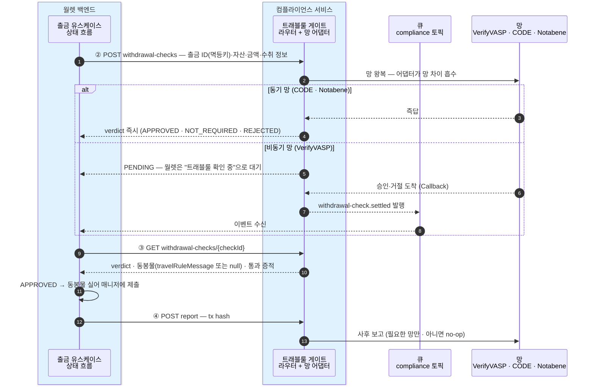
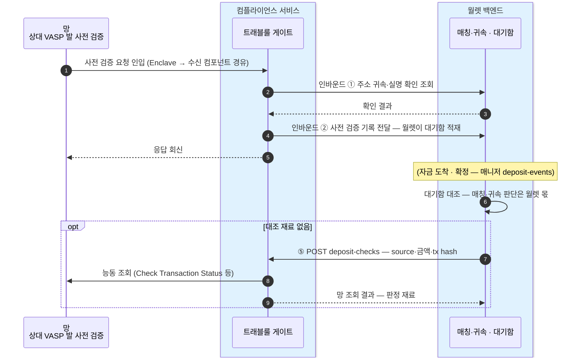

월렛 백엔드가 컴플라이언스 서비스를 호출하는 계약의 초안이다. 목표는 하나 — **망 세 개(VerifyVASP·CODE·Notabene)의 차이가 이 표면에 새어 나오지 않는 것.**
월렛은 어느 망으로 처리되는지 몰라도 같은 호출 순서로 끝난다. 필드 타입의 정본은 이 문서가 아니라 API 문서에서 정의한다.

## 설계 원칙

- **비동기가 기본형** — 동기 망(CODE·Notabene)은 "즉시 완료되는 비동기"로 접는다. 월렛의 처리 분기는 verdict 값뿐이다.
- **판정 어휘는 TrVerdict 넷** — NOT_REQUIRED / APPROVED / PENDING / REJECTED ([트래블룰 8장](../../트래블룰/설계/08-gate-port.md)). 망 원어는 응답에 싣지 않는다 — 감사 조회로만 연다.
- **멱등** — 월렛의 출금 ID 가 멱등키다. 같은 키 재호출은 새 확인을 만들지 않고 기존 확인을 돌려준다.

## API — 월렛 → 컴플라이언스 (5개)

| # | 엔드포인트 | 무엇 | 요청 요지 | 응답 요지 |
|---|---|---|---|---|
| 1 | `GET /compliance/travel-rule/counterparties?query=` | **Search Counterparties** — 수취 거래소 검색. **서비스 DB 의 명부 스냅샷**에서 답한다(망 실시간 조회 아님 · 주기 동기화) | 거래소 이름 | 후보 목록 — 표시명 · 도달 가능 여부(동기화 기준) · 처리 망 표시 |
| 2 | `POST /compliance/travel-rule/withdrawal-checks` | **Create Withdrawal Check** — 출금 확인 개시 | 출금 ID(멱등키) · 자산 · 금액 · 수취 주소 · 수취인 정보(이름·계좌·선택 거래소) | checkId · **verdict** — 동기 망은 즉답(APPROVED 등), 비동기 망은 PENDING |
| 3 | `GET /compliance/travel-rule/withdrawal-checks/{checkId}` | **Get Withdrawal Check** — 판정·동봉물 수령 (이벤트 유실 대비 폴링 겸용) | — | verdict · APPROVED 면 **동봉물**(`travelRuleMessage` — 없는 망은 null)과 통과 증적 |
| 4 | `POST /compliance/travel-rule/withdrawal-checks/{checkId}/report` | **Report Withdrawal Result** — 온체인 제출 후 tx hash 보고 | tx hash | 접수 — 실패해도 재시도만, 출금을 막지 않는다 |
| 5 | `POST /compliance/travel-rule/deposit-checks` | **Create Deposit Check** — 입금 판별의 망 조회 대행 | source 주소 · 금액 · tx hash | 망 조회 결과 — 능동 조회(Check Transaction Status)·등록부 확인·명부 확인. **대기함 대조는 월렛 몫**이라 여기 없다 |

경로를 `/compliance/travel-rule/...` 로 잡는 이유 — 다음 모듈(예: aml)이 생기면 `/compliance/aml/...` 로 나란히 붙는다.

## 이벤트 — 컴플라이언스 → 월렛 (큐 · 확정)

비동기 판정의 도착은 **메시지 큐 전용 토픽**으로 알린다 — 매니저→월렛이 큐인 기존 패턴과 동일하고, 파티션 키도 같은 규칙(계정 단위)이다.

- **토픽**: `compliance`
- **이벤트**: `withdrawal-check.settled` — checkId · 출금 ID · verdict(APPROVED/REJECTED) · APPROVED 면 동봉물 준비 완료 표시
- 월렛은 이벤트 수신 시 Get Withdrawal Check(3번)로 동봉물·증적을 가져간다. 이벤트가 유실돼도 폴링(3번)과 PENDING 만료 규칙이 흐름을 끝낸다.
- **PENDING 만료의 주인은 이 서비스** — 망별 시간 규칙([트래블룰 4장](../../트래블룰/설계/04-policy-and-timing.md))을 알고 있는 쪽이 만료를 판정해 REJECTED 로 settled 이벤트를 낸다.

## 인바운드 내부 API — 월렛이 구현, 컴플라이언스가 호출 (2개)

상대 VASP 의 사전 검증 요청(수신 질문)에 답하기 위한 계약 — 인바운드 사슬(Enclave → 수신 컴포넌트 → 컴플라이언스 서비스 → 월렛)의 마지막 구간이다.

| # | 계약 | 무엇 |
|---|---|---|
| 1 | 주소 귀속·실명 확인 조회 | "이 주소가 너희 고객 아무개 소유인가" — 주소↔계정은 월렛이, 실명 대조는 그 데이터를 가진 서비스에 이어 조회 |
| 2 | 사전 검증 기록 전달 | 수신한 트래블룰 정보(source·수취인·금액·이후 tx hash)를 월렛에 넘긴다 — 월렛이 대기함에 적재하고 도착 후 대조의 재료로 쓴다 |

## 시퀀스 — 출금 확인 한 사이클

월렛이 아는 것은 API 5개와 verdict 넷뿐이다 — 분기(동기/비동기)는 그림에 있지만 월렛 코드에는 없다: 즉답이면 이벤트를 기다리지 않을 뿐, 이후 단계(③→제출→④)는 동일하다.

## 시퀀스 — 입금 쪽 두 계약

## 시나리오 워크스루 — 월렛의 호출 순서는 세 망 모두 같다

| 단계 (월렛 관점) | 국내 VerifyVASP (7.1) | 국내 CODE 직접 (7.10) | 해외 Notabene (7.2) |
|---|---|---|---|
| ① 수취 거래소 검색 | 스냅샷에서 반환 (원천: 회원 명부) | 스냅샷에서 반환 (원천: 회원 명부·상호연동) | 스냅샷에서 반환 (원천: VASP 명부) |
| ② 확인 개시 (POST) | **PENDING** — 승인 왕복 진행 | APPROVED — 동기 즉답 | APPROVED — validate/full ①② 즉답 |
| ③ 판정 대기 | `compliance` 이벤트 수신 후 조회 | 즉시 다음 단계 | 즉시 다음 단계 |
| ④ 제출 | 동봉물 null — 그대로 제출 | 동봉물 null — 그대로 제출 | **travelRuleMessage 동봉**해 제출 |
| ⑤ 보고 (report) | tx hash 보고 실행 | 실행 | no-op — 벤더가 이미 안다 |

월렛 코드는 ②~⑤ 를 망 구분 없이 같은 순서로 탄다 — 다른 것은 verdict 가 즉답이냐 PENDING 이냐, 동봉물이 null 이냐뿐이고 둘 다 값의 차이지 흐름의 차이가 아니다.

## 미확정 — 이 계약에 걸리는 것

- **원화 임계 판정의 위치** — 벤더가 원화 기준을 지원하는지 미확정([트래블룰 14장](../../트래블룰/설계/14-fireblocks-questions.md) 문의 1). 어느 쪽이든 판정은 이 서비스 안에서 흡수하고, 월렛 표면(verdict)은 바뀌지 않는다.
- **validate/full 1차 호출** — 수취인 정보 없이 `type` 판별을 돌려주는지 테스트로 확정([트래블룰 2장](../../트래블룰/설계/02-withdrawal.md)).
- **타입 정본** — 요청/응답 필드는 [API 문서](../API/api.md)에 한 곳에 정의한다. 이 문서는 계약의 모양까지만.
