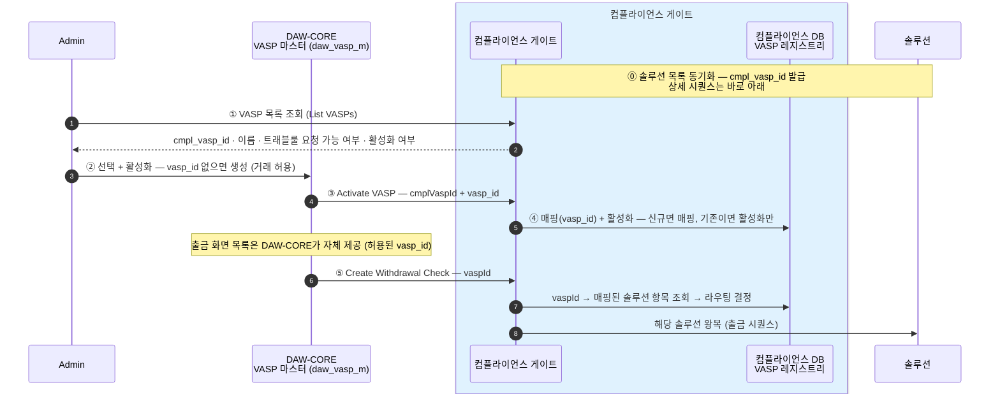
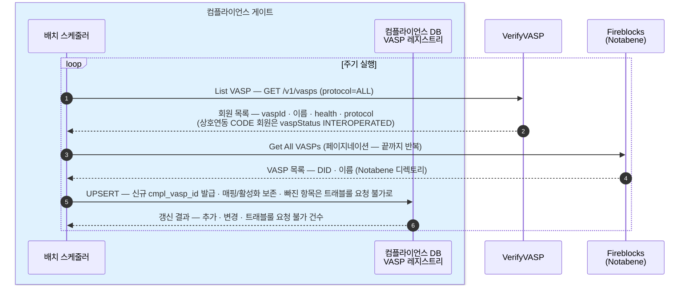
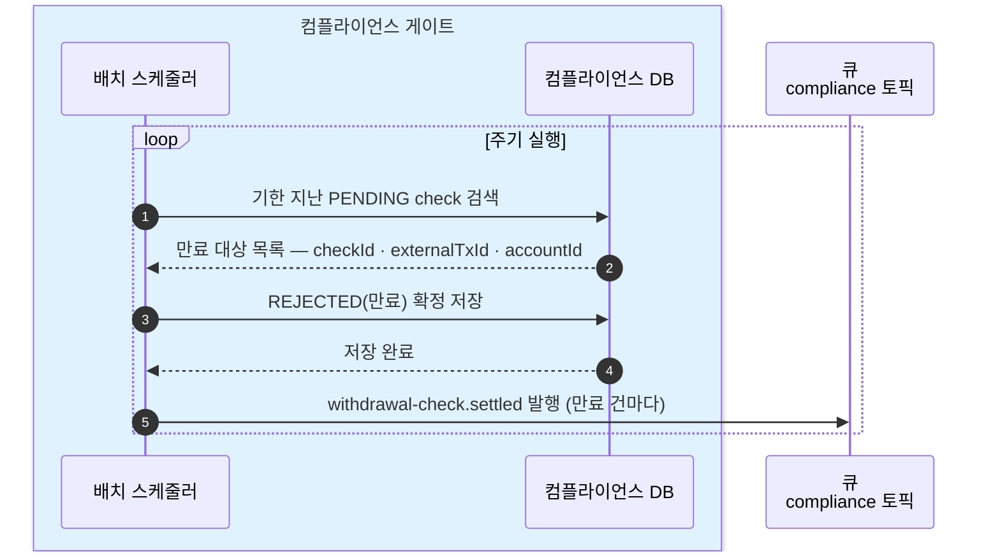

Admin 이 다루는 운영 API 와 서비스가 스스로 도는 내부 동작(VASP 온보딩·주기 배치)을 모은다. DAW-CORE 통합 계약(출금·입금 확인 API·이벤트)은 [1장](01-interface.md), 테이블은 [2장](02-database.md).

## 운영 API — Admin → 컴플라이언스 (4개)

거래 허용·VASP 정체는 DAW-CORE의 VASP 마스터(`daw_vasp_m`)가 갖고, 컴플라이언스는 **VASP 를 온보딩(매핑·활성화)** 하는 운영을 맡는다. 컴플라이언스가 아는 VASP 는 각자 안정 id(`cmpl_vasp_id`)를 갖고, Admin 이 그중 하나를 골라 활성화하면 코어 `vasp_id` 와 매핑된다([2장](02-database.md)).

| # | 엔드포인트 | 무엇 |
|---|---|---|
| 1 | `POST /compliance/travel-rule/vasps/sync` | **Sync Solution VASPs** — 솔루션 VASP 목록 동기화를 즉시 실행. 신규 항목엔 `cmpl_vasp_id` 를 발급하고, 매핑·활성화는 보존한다(UPSERT) |
| 2 | `GET /compliance/travel-rule/vasps?query=` | **List VASPs** — Admin 이 온보딩 대상을 고르는 목록. `cmpl_vasp_id`·이름·솔루션·트래블룰 요청을 보낼 수 있는지·활성화·매핑된 `vasp_id` 를 준다 |
| 3 | `POST /compliance/travel-rule/vasps/{cmplVaspId}/activate` | **Activate VASP** — 코어가 만든 `vasp_id` 를 이 항목에 **매핑하고 활성화**한다. 이미 매핑돼 있으면 활성화만. **호출 주체는 Admin(코어) 백엔드** |
| 4 | `POST /compliance/travel-rule/vasps/{cmplVaspId}/deactivate` | **Deactivate VASP** — 활성화를 끈다. 매핑(`vasp_id`)은 남긴다 — 재활성화하면 그대로 |

check 운영 조회·감사 기록 열람 등 나머지 운영 경로는 미설계([0장](00-scope.md) 열린 결정).

## VASP 온보딩의 처리 순서 — 동기화에서 출금 확인까지

VASP 정체와 거래 허용은 DAW-CORE의 VASP 마스터(`daw_vasp_m`)에 있고, 컴플라이언스는 **솔루션 라우팅**을 맡는다. 온보딩은 Admin 이 컴플라이언스 목록에서 VASP 를 골라 활성화하는 순간, 코어가 `vasp_id` 를 만들어 컴플라이언스에 매핑하는 흐름이다. 그 뒤 출금 확인은 `vaspId` 하나만 실으면 되고, 어느 솔루션으로 보낼지는 컴플라이언스가 매핑을 보고 정한다(출금 확인 계약은 [1장](01-interface.md)).

Deactivate 하거나 솔루션 목록에서 사라진(트래블룰 요청을 보낼 수 없는) VASP 는 새 출금 확인이 열리지 않는다 — 매핑은 남아 있어 재활성화·재동기화하면 그대로 복구된다.

### ⓪ 솔루션 목록 동기화

주기는 미정(0장 미확정). 주기 실행 외에 운영 API(Sync Solution VASPs)로도 즉시 실행된다. 목록 API 출처 — [VerifyVASP List VASP](https://docs.verifyvasp.com/reference/travelrule-list-vasp-ids)(`GET /v1/vasps` · 상호연동 CODE 회원 포함) · [Fireblocks Get All VASPs](https://developers.fireblocks.com/api-reference/travel-rule/get-all-vasps) · [Fireblocks TRLink List VASPs](https://developers.fireblocks.com/api-reference/trlink/list-vasps)(Notabene VASP 디렉토리 · 페이지네이션).

동기화는 솔루션에서 받은 목록을 컴플라이언스 VASP 레지스트리에 **UPSERT** 한다 — 신규 항목엔 `cmpl_vasp_id` 를 발급하고, 이미 있는 항목은 이름·트래블룰 요청을 보낼 수 있는지만 갱신하며 **매핑(`vasp_id`)·활성화(`actv_yn`)는 보존**한다. 목록에서 빠진 항목은 지우지 않고 "트래블룰 요청을 보낼 수 없음"으로만 표시한다([2장](02-database.md)).

## 배치 — 서비스가 스스로 도는 두 주기 작업

DAW-CORE 호출 없이 서비스가 주기적으로 실행한다. 하나는 **목록 동기화**(위 ⓪ 솔루션 목록 동기화), 하나는 아래 PENDING 만료 스캔이다. 사전 검증 기록 보존 기간 만료(값 미정 — [트래블룰 4장](../../트래블룰/설계/04-policy-and-timing.md))도 확정되면 이 자리에 추가된다.

### PENDING 만료 스캔 — settled 이벤트의 REJECTED(만료) 를 만든다

시간 규칙은 [트래블룰 4장](../../트래블룰/설계/04-policy-and-timing.md). settled 이벤트·verdict 정의는 [1장](01-interface.md).

