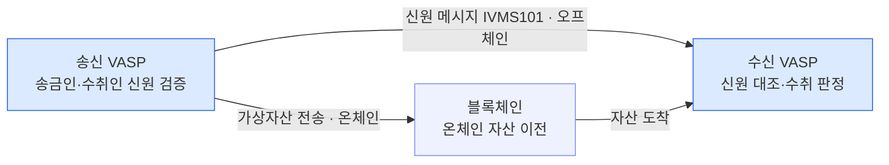

트래블룰은 일정액 이상의 가상자산을 이전할 때 송신·수신 VASP가 송금인·수취인의 검증된 신원정보를 서로 주고받도록 강제하는 규제다.
이 장은 정의·기원·목적·적용 대상·임계값·현황·일출 문제를 한 장에 요약하고, 이후 8개 장의 지도를 제시한다.

## 트래블룰이란

트래블룰은 일정액 이상의 가상자산을 이전할 때, 송신 VASP(가상자산사업자)와 수신 VASP가 송금인(originator)·수취인(beneficiary)의 **검증된 신원정보를 서로 주고받아야** 하는 규제다. 전통 은행권이 국경 간 전신송금(SWIFT)에서 송금인 정보를 함께 실어 보내던 의무를, 그대로 가상자산으로 확장한 것이다.

핵심은 **자산 이전과 신원 정보 이전을 짝지운다**는 데 있다. 가상자산은 지갑 주소만 보이고 그 뒤의 사람은 드러나지 않는다. 트래블룰은 그 익명의 이전에 검증된 신원이라는 꼬리표를 강제로 붙인다.

## 기원 — FATF 권고 16

규범의 뿌리는 FATF(국제자금세탁방지기구)의 **권고 16(Recommendation 16)**이다. 원래 은행 전신송금의 "송금인 정보 동행" 규칙이었는데, FATF가 2019년 이를 가상자산과 VASP로 적용 범위를 넓혔다. 이때부터 거래소·커스터디 같은 사업자도 은행과 같은 수준의 신원 동행 의무를 지게 됐다.

## 목적 — 익명 이전 차단

목적은 명확하다. **익명 이전을 막아 자금세탁·테러자금조달 방지(AML/CFT)를 추적 가능하게** 하는 것이다. 신원이 붙지 않은 이전은 자금의 출처와 종착지를 지우고, 그 공백이 세탁·제재 회피의 통로가 된다. 트래블룰은 이전마다 검증된 송금인·수취인 정보를 남겨 그 공백을 메운다.

## 적용 대상

- **직접 대상은 VASP** — 거래소·커스터디, 그리고 일부 지갑 사업자.
- **자기수탁 지갑(개인지갑) 간 개인 이전은 직접 대상이 아니다.** 규제는 사업자를 겨냥한다.
- 다만 그 이전에 **VASP가 한쪽이라도 끼면 의무가 생긴다.** 예컨대 개인지갑에서 거래소로 들어오거나, 거래소에서 개인지갑으로 나가는 경우가 그렇다. 자기수탁 지갑을 상대로 한 실무는 6장에서 다룬다.

## 임계값 — 나라마다 다른 기준선

의무가 발동되는 금액 기준선은 관할권마다 다르다.

| 관할권 | 임계값 |
|---|---|
| FATF 권장 | USD/EUR 1,000 |
| 한국 | 100만원 |
| EU | 0 (사실상 전액) |

기준선이 낮을수록 더 많은 이전이 규제망에 걸린다. EU는 임계값이 0이라 금액과 무관하게 전액이 대상이다. 관할권별 상세 비교와 한국 특금법(특정금융정보법)의 조문 수준 규정은 2장에서 다룬다.

## 현황

트래블룰은 이미 세계적 표준으로 자리잡았다.

- **85개 관할권**이 입법을 마쳤거나 진행 중이다.
- **70여 곳**이 실제 집행 단계에 있다.

## 일출 문제

문제는 나라마다 **시행 시점이 다르다**는 데 있다. 한쪽 VASP는 이미 트래블룰 의무를 지는데 상대 VASP의 관할권은 아직 시행 전이라, 한쪽만 의무를 지는 **비대칭 상황**이 생긴다. 이를 **일출 문제(sunrise issue)**라 부른다.

의무가 있는 VASP는 신원정보를 보내려는데 상대가 받을 준비도, 되돌려줄 의무도 없다. 글로벌 거래에서 트래블룰을 실무에 얹기 어렵게 만드는 대표적 난점이다.

## 신원은 자산과 다른 경로로 흐른다

트래블룰의 신원정보는 **자산이 흐르는 블록체인과 별개의 오프체인 경로**로 오간다. 온체인에는 가상자산만 이동하고, 송금인·수취인의 신원은 VASP 사이에서 IVMS101(interVASP Messaging Standard)이라는 표준 형식으로 따로 교환된다. 이 두 경로가 어긋나지 않게 묶는 것이 트래블룰 실무의 뼈대다. 신원 메시지 표준의 구조는 1장에서 자세히 다룬다.

## 이 문서 세트의 지도

트래블룰은 아홉 장으로 나뉜다.

- **0장 개요** — 지금 이 장. 정의·기원·목적·적용 대상·임계값·현황·일출 문제.
- **1장 IVMS101** — VASP 간 신원 메시지 표준의 구조.
- **2장 한국 특금법** — 특금법(특정금융정보법) 시행령 제10조의10 기준의 국내 규정과 관할권별 임계값 비교.
- **3장 솔루션 지형** — VerifyVASP · CODE · Notabene · TRISA · TRP · OpenVASP · TRUST.
- **4장 출금 실무** — 사전 대조 후 전파 흐름.
- **5장 입금 실무** — 대조 실패 시 입금대기(잔고 차단·락업).
- **6장 개인지갑** — 자기수탁 지갑(개인지갑)을 상대로 한 처리.
- **7장 2026 개정** — 규정 변화.
- **8장 설계·Canton 관계** — 블록체인매니저 설계의 입금·출금 흐름과 캔톤네트워크의 정산·프라이버시(선택적 공개·규제기관 옵저버)에 트래블룰을 얹는 관계.
