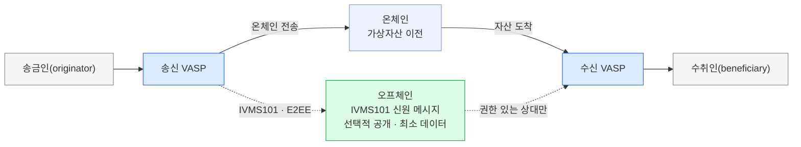

트래블룰은 임계값 이상 가상자산 이전 1건마다 송금인·수취인·양쪽 VASP의 신원 정보 묶음을 주고받게 한다.
그 정보를 담는 공통 데이터 표준이 IVMS101이며, 구현 차이는 식별·교환·검증·자기수탁의 네 난제에서 갈린다.

## 무엇을 주고받나

임계값 이상 이전 1건당 아래 정보 묶음을 교환한다. 송신 VASP(가상자산사업자)가 이 묶음을 만들어 수신 VASP에게 넘긴다.

| 묶음 | 내용 |
|---|---|
| **송금인(originator)** | 이름, 계좌/지갑주소, (관할권에 따라) 주소·생년월일·고객번호 |
| **수취인(beneficiary)** | 이름, 계좌/지갑주소 |
| **송신 VASP** | 사업자 식별 |
| **수신 VASP** | 사업자 식별 |

송금인 정보는 관할권마다 요구 범위가 다르다. 이름과 계좌/지갑주소는 공통이고, 주소·생년월일·고객번호는 관할권에 따라 추가로 붙는다.

## 데이터 표준 — IVMS101

교환 정보의 형식은 **IVMS101(interVASP Messaging Standard)** 이 정한다. 2020년 발표된 국제 공통 데이터 표준으로, 이름·주소·식별자 같은 필드의 구조와 표기를 하나로 맞춘다.

- 모든 주요 솔루션이 이 표준을 쓴다. 표준이 있어야 **솔루션·관할권이 달라도 필드가 맞는다** — 서로 다른 시스템 사이의 **공통 언어** 역할을 한다.
- 표준이 정하는 건 데이터의 모양이다. 그 데이터를 실제로 누구와, 어떻게 주고받느냐는 별개 문제이며, 여기서 프로토콜·솔루션 선택이 갈린다.

## 선택적 공개 — 노출 최소화

신원 정보는 개인식별정보(PII)다. 그래서 **선택적 공개(selective disclosure)** 가 권장된다.

- 신원 정보를 온체인 정산 메시지 본문에 싣지 않고 **별도로** 전달한다.
- **권한 있는 상대에게만**, 그것도 **필요한 최소한**만 넘긴다.
- 목적은 데이터 노출 최소화다. 자산 이전은 온체인에서 일어나지만 신원 정보는 그 흐름과 분리해 오프체인에서 주고받는다.

## 구현 차이를 가르는 4대 난제

정보 묶음과 표준이 정해져 있어도 실제 구현은 아래 네 가지에서 갈린다.

1. **카운터파티 VASP 식별·발견** — 이 지갑주소가 어느 VASP 소속인가? 상대 VASP를 먼저 찾아내야 정보를 보낼 곳이 정해진다.
2. **안전한 교환** — PII를 어떻게 **종단간 암호화(E2EE)** 로 주고받나?
3. **검증** — 상대가 진짜 인가받은 VASP인가?
4. **자기수탁 지갑(개인지갑)** — 상대가 VASP가 아니면 어떻게 하나? 이 경우는 6장 개인지갑에서 따로 다룬다.

## 자산 이전과 신원 교환의 분리

자산은 온체인으로 이동하고, 신원 정보는 그와 **분리된 오프체인 채널**로 송신 VASP에서 수신 VASP에게 간다. 신원 메시지는 IVMS101 형식으로 표준화되고, 종단간 암호화로 보호되며, 선택적 공개 원칙에 따라 권한 있는 상대에게 최소한만 전달된다. 온체인 트랜잭션 본문에는 신원 정보가 실리지 않는다.

## 이어지는 장

- 신원 정보를 실제로 주고받는 프로토콜·네트워크(솔루션 지형)는 3장에서 다룬다.
- 상대가 VASP가 아닌 자기수탁 지갑(개인지갑)인 경우는 6장에서 다룬다.
- 선택적 공개를 온원장에서 구현하는 방식(캔톤네트워크의 선택적 공개·규제기관 옵저버)은 8장에서 다룬다.
