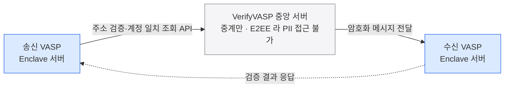

트래블룰 데이터 교환은 원장 밖(off-chain) 메시징 프로토콜이 담당하는 게 일반적이며, 데이터 표준은 셋 다 IVMS101(interVASP Messaging Standard) 로 같고 통신 아키텍처만 다르다.
국내는 VerifyVASP 와 CODE 로 양분되고 글로벌 축은 Notabene 등 레그테크 SaaS 다.

## 왜 원장 밖 프로토콜인가

트래블룰이 요구하는 것은 송금인(originator)·수취인(beneficiary) 의 개인식별정보(PII) 를 송신 VASP 가 수신 VASP 에 전달하는 일이다. 이 데이터는 블록체인에 올릴 수 없다 — 개인정보를 공개 원장에 새기는 순간 그 자체가 규정 위반이자 프라이버시 사고가 된다.

그래서 실제 데이터 교환은 원장 밖(off-chain) 메시징 프로토콜이 담당한다. 온체인 거래는 그대로 흐르고, 그와 짝을 이루는 PII 메시지는 별도 채널로 VASP 끼리 주고받는다. 세 진영 모두 데이터 표준은 IVMS101 로 같다. 갈리는 것은 통신 아키텍처 — 상대 VASP 를 어떻게 찾고, 데이터를 어떤 경로로 암호화해 보내느냐다.

## 국내 3종 — VerifyVASP · CODE · Notabene

국내 시장은 두나무 자회사 람다256 이 주도하는 VerifyVASP 연합과, 빗썸·코인원·코빗이 합작한 CODE 진영으로 나뉜다. 여기에 글로벌 레그테크 Notabene 이 SaaS 로 얹힌다.

| 비교 축 | VerifyVASP | CODE | Notabene |
|---|---|---|---|
| 주체 | 람다256(두나무 자회사) 주도 연합 | 빗썸·코인원·코빗 합작법인 | 글로벌 레그테크 기업 |
| 구현 | 비블록체인 API + Enclave 서버 (각 VASP 인프라 설치형) | Corda 프라이빗 블록체인 → 상호연동 과정에서 비블록체인으로 재개발 | 멀티 프로토콜 SaaS |
| 데이터 보안 | 종단간 암호화(E2EE) — 중앙 서버는 복호화 불가 | 노드 간 직접 합의 (중개자 배제) | 기업별 룰 엔진·오케스트레이션 |
| 상호운용 | CODE 와 상호연동 완료 | VerifyVASP 와 직접 통신 | 글로벌 규격 연계 |

CODE 는 원래 Corda 기반 프라이빗 블록체인으로 출발했으나, VerifyVASP 와 상호연동하는 과정에서 비블록체인 방식으로 재개발했다. 두 국내 진영의 상호연동은 2022-04-25 0시에 완료됐고, 이로써 4대 거래소 간 100만원 이상 입출금이 재개됐다. 당초 특금법 시행(2022-03-25) 과 동시에 연동될 예정이었으나 약 한 달 지연됐다.

## VerifyVASP 동작 구조

VerifyVASP 의 핵심은 각 VASP 가 자기 인프라에 직접 두는 Enclave 서버다. 중앙 서버는 데이터를 보관하거나 열어보지 않고 중계만 한다.

거래가 발생하면 송신 VASP 의 Enclave 가 수신 VASP 로 주소 검증·계정 일치 조회 API 를 보낸다. 이 메시지는 종단간 암호화되어 있어 중앙 서버는 중계 경로에 있으면서도 PII 에 접근하지 못한다. Enclave 를 각 VASP 가 소유하므로 평문 데이터는 양쪽 당사자 인프라 안에서만 열린다.

## 글로벌 프로토콜·네트워크

국외에는 서로 다른 발견·거버넌스 모델을 가진 프로토콜과 네트워크가 여럿 공존한다.

| 프로토콜/네트워크 | 성격 | 카운터파티 발견·검증 | 비고 |
|---|---|---|---|
| TRISA | 오픈소스, P2P 메시징 + 중앙 CA(인증서 권한) | 중앙 CA 가 VASP 공개키 인증서 목록 역할 | PII 는 VASP 끼리 직접 P2P 교환 |
| TRP(Travel Rule Protocol) | 오픈, 중앙 목록 + E2E API | 중앙 목록 서비스로 VASP 발견 | Coinbase 등 업계 컨소시엄 주도 |
| OpenVASP | 오픈, 탈중앙 발견 | 공유 인프라 최소화·메시지 표준 중심 | 프라이버시·탈중앙 강조 |
| TRUST | 폐쇄형(미국 중심) | 멤버 한정 | 미국 거래소 연합 |
| Sygna Bridge | 상용 | 자체 네트워크 | — |
| VerifyVASP | 상용, P2P·E2E, API | 검증된 VASP 네트워크(150여 곳·30여 국) | 한국계 |
| Shyft / Veriscope | 온체인 접근 | 블록체인 기반 목록 | 프로토콜 자체가 체인 |
| Notabene | 프로토콜 비종속 게이트웨이 | W3C DID·검증가능자격증명(VC) 으로 기존 프로토콜을 브릿지 | 여러 프로토콜을 한 대시보드로 |

## 공통점과 차이

거의 모든 프로토콜이 IVMS101 데이터 포맷과 E2E 암호화를 쓴다는 점은 같다. 갈리는 지점은 둘이다.

- **카운터파티 발견 방식** — 중앙 목록(TRP)냐, P2P + 중앙 CA(TRISA)냐, 온체인 목록(Shyft·Veriscope)냐.
- **거버넌스·멤버십** — 누구나 참여하는 오픈(TRISA·TRP·OpenVASP)이냐, 멤버만 들어오는 폐쇄형(TRUST)이냐, 상용 네트워크(Sygna Bridge·VerifyVASP)냐.

VerifyVASP 는 국내 3종에도 등장하고 글로벌 표에도 오르는데, 상용 P2P·E2E API 네트워크로서 검증된 VASP 를 150여 곳·30여 국 규모로 묶고 있기 때문이다.

## 상호운용 문제

핵심 난제는 단일 프로토콜이 모든 상대를 덮지 못한다는 것이다. 내가 어느 솔루션에 속하든 상대 VASP 가 다른 솔루션에 있으면 트래블룰 데이터를 주고받을 수 없다. TRISA 가 TRP·OpenVASP·Sygna Bridge 와 일부 상호운용을 달성한 것처럼 진영 간 다리를 놓는 시도가 있지만 완전하지 않다.

해법은 둘 중 하나다. VASP 가 여러 프로토콜을 동시에 지원하거나, Notabene 처럼 프로토콜에 종속되지 않는 브릿지/게이트웨이를 쓰는 것이다. Notabene 은 W3C DID·검증가능자격증명(VC) 을 활용해 기존 프로토콜들을 하나의 대시보드로 이어 붙인다.

단 게이트웨이도 모든 솔루션을 브릿지하지는 않는다 — Notabene 공개 목록에 **GTR·CODE 는 없고, VerifyVASP 는 라이브 지원 여부가 불확실**하다(벤더 확인 대상). 어느 상대까지 실제로 닿는지의 도달성은 [설계 10장 해외 솔루션 지형](../설계/10-foreign-network-landscape.md), 게이트웨이 경유 VerifyVASP 의 검증은 [설계 9장](../설계/09-gateway-verifyvasp.md)이 다룬다.

## Fireblocks 관점 — 게이트가 벤더 밖으로 나온다

Fireblocks 가 공식으로 제공하는 트래블룰 연동 제공자 목록에는 Notabene·Sumsub·GTR(TRLink)·Chainalysis·Elliptic 이 있다. 여기에 VerifyVASP 는 없다.

국내 VASP 가 VerifyVASP·CODE 솔루션을 써야 한다면, 트래블룰 게이트가 Fireblocks 벤더 표면 밖에 놓인다는 뜻이다. 출금·입금 흐름에서 벤더가 대신 처리해 주지 못하는 관문이 하나 생기는 것이다.
