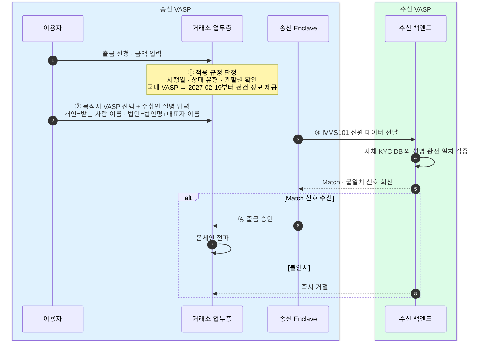

출금은 "사전 대조 후 전파"다 — 수신 VASP(가상자산사업자)의 성명 Match 신호가 와야 온체인으로 전파한다.
Match 전에는 블록체인에 아무것도 올리지 않고, 이 게이트는 블록체인 매니저 밖의 별도 서비스인 컴플라이언스 게이트에서 돈다.

## 사전 대조 후 전파

거래소의 출금 통제는 단순한 순서를 따른다. 이용자가 출금을 신청해도 곧바로 온체인 전파로 이어지지 않는다. 수신 VASP 가 수취인 성명이 자기 KYC 기록과 일치한다고 확인해 주는 Match 신호를 보내야 비로소 출금이 승인되고 블록체인으로 나간다. 불일치면 그 자리에서 거절한다.

이 흐름은 네 단계다.

각 단계를 풀면 이렇다.

- **① 적용 규정 판정** — 시행일·상대 유형·관할권을 확인한다. 국내 VASP 간 거래는 2027년 2월 19일부터 금액과 관계없이 정보제공 대상으로 지정한다. 해외 VASP·개인지갑 거래는 별도의 위험기반 정책으로 보낸다. 환산 금액은 의심거래 감시와 감사 재현을 위해 계속 기록한다.
- **② 수취처 데이터 매칭** — 이용자가 목적지 VASP 를 선택하고 수취인 실명을 입력한다. 개인 회원은 받는 사람 이름, 법인 회원은 법인명과 대표자 이름을 넣는다.
- **③ VASP 간 신원 상호 조회** — 송신 측 Enclave 가 IVMS101(interVASP Messaging Standard) 데이터를 수신 VASP 백엔드로 전달하고, 수신 측이 자체 KYC DB 와 성명이 완전히 일치하는지 검증한다.
- **④ 온체인 실행 결정** — Match 신호를 받았을 때만 출금을 승인하고 온체인으로 전파한다. 불일치면 즉시 거절한다.

핵심은 ③에서 ④로 넘어가는 관문이다. 신원 조회의 결과가 온체인 실행 여부를 직접 가른다.

## 수취처가 VASP 냐 개인지갑이냐

목적지 종류에 따라 확인 방식이 갈린다.

- **계정주 확인 연동 VASP 로의 출금** — "출금인 계정주 = 입금받을 계정주 동일인"인지 확인하는 방식이다.
- **개인지갑(자기수탁 지갑)으로의 출금** — VASP 간 정보 교환과 분리해, 고객·거래 위험과 지갑 소유 확인 등 승인된 위험기반 정책으로 판정한다. 2027년 시행에 필요한 세부 기준은 금융정보분석원 고시·감독규정과 함께 확정한다.

## 설계 함의

이 사전 대조는 출금 파이프라인의 **앞단 게이트**다. Match 가 떨어지기 전에는 블록체인으로 아무것도 전파하지 않는다. 그리고 이 게이트는 **블록체인 매니저 밖의 별도 서비스(컴플라이언스 게이트)**에 있다. 온체인 제출과 전파, 즉 블록체인매니저 설계의 출금 흐름은 이 게이트를 통과한 뒤에야 시작된다.
