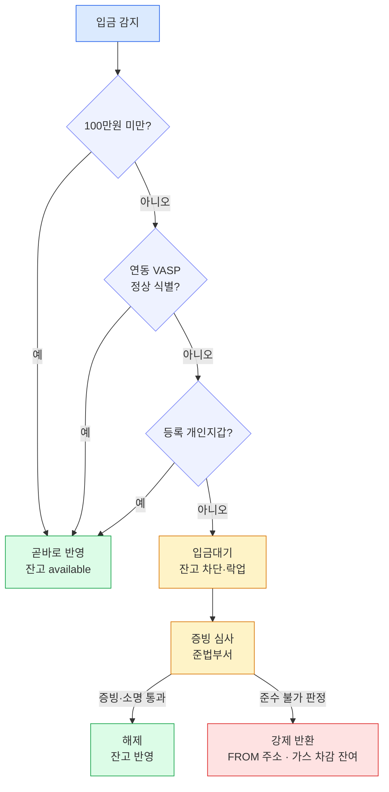

입금은 "대조 실패 시 잔고 차단(입금대기)" 로 요약된다.
트래블룰 준수가 확인되지 않은 입금은 잔고 반영을 막고 계류하며, 증빙 심사로 풀거나 원 송출처로 강제 반환한다.

## 곧바로 반영되는 3조건

입금 건이 아래 셋 중 하나에 해당하면 별도 검증 없이 곧바로 잔고에 반영한다.

- **① 100만원 미만** — 트래블룰 임계값(한국 100만원) 아래라 트래블룰 대상이 아니다.
- **② 트래블룰 연동 VASP(가상자산사업자) 발 정상 식별 메시지 인입** — 연동된 상대 VASP 가 송금인(originator)·수취인(beneficiary) 정보를 정상 식별 메시지로 실어 보낸 건.
- **③ 사전 등록된 본인 개인지갑 발** — 이용자가 미리 등록해 둔 본인 명의 자기수탁 지갑(개인지갑)에서 온 건.

## 입금대기(잔고 차단·락업)

위 3조건에 들지 않는 100만원 이상 입금은 잔고 반영을 차단하고 계류한다. 대상은 두 가지다.

- **미연동 사업자 발** — 트래블룰 메시지를 주고받을 수 없는 상대 VASP 에서 온 건.
- **미등록 개인지갑 발** — 사전 등록되지 않은 개인지갑에서 온 건.

이 건들은 잔고에 반영되지 않고 계류 상태로 묶인다. 트래블룰을 준수하지 않은 입금은 입금 반영이 불가능하다는 원칙이다.

## 수동 해제

입금대기 건은 증빙 제출과 준법부서 심사를 거쳐 수동으로 풀 수 있다. 이용자는 송신 측 고객 정보 화면·거래 원장 캡처 등 증빙을 제출하고, 준법부서가 이를 심사한다.

- **계정주 확인 연동 VASP 발** — 계정주 확인 절차를 밟아 해제한다.
- **위험평가 통과 해외 VASP 발** — 입금 출처 확인 소명으로 해제한다.

## 강제 반환

준수 불가로 판정된 건은 원 송출처로 강제 반환한다. 제3자 송금이나 미신고 해외 사업자 발 등이 여기 해당한다.

- **반환처**: 원 송출처(FROM 주소)로 되돌린다.
- **반환 금액**: 온체인 가스를 차감한 잔여만 반환한다. 전액이 아니다.
- **가격 변동 손실**: 반환 대기 중 발생하는 가격 변동 손실은 이용자 책임이다.

## 상태 흐름

입금이 감지되면 세 조건을 순서대로 검사한다. 하나라도 통과하면 곧바로 잔고에 반영해 가용(available) 상태로 만든다. 셋 다 걸리지 않는 100만원 이상 건은 입금대기로 락업되고, 증빙 심사를 거쳐 해제되거나 준수 불가 판정 시 원 송출처로 강제 반환된다.

## 설계 함의

이 "입금대기" 가 가용 전이 게이트다. 온체인 확정과 컴플라이언스 통과는 별개의 관문이다 — 블록체인매니저 설계의 입금 감지·확정으로 온체인 확정이 났더라도, 트래블룰 컴플라이언스를 통과해야 비로소 잔고가 가용(available) 으로 전이한다.

이 게이트는 블록체인매니저 설계의 입금 흐름에서 다루는 REJECTED·동결 처리와 합류한다. 트래블룰 미준수로 계류·반환되는 경로가 곧 그 흐름의 거부·동결 분기와 같은 지점에서 만난다. 자세한 설계 접점은 8장에서 다룬다.
