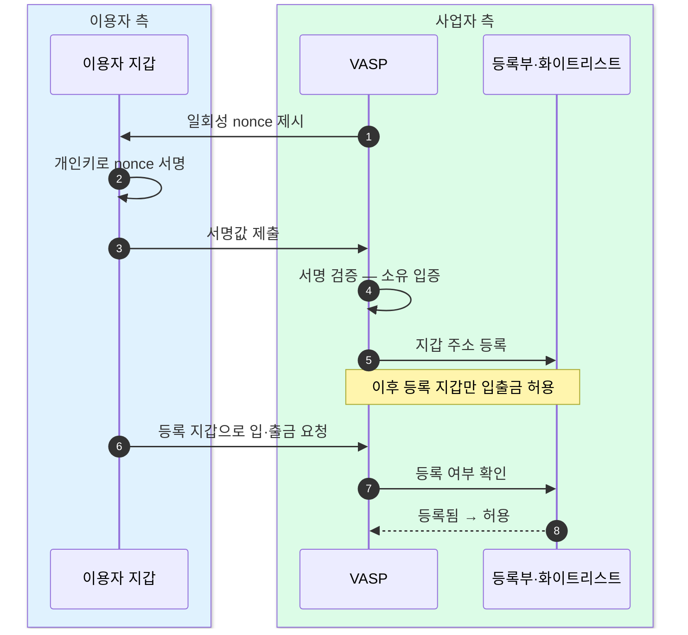

트래블룰 망은 VASP끼리 신원 정보를 나르는 체계라서, 상대가 개인 자기수탁 지갑이면 정보를 주고받을 사업자 자체가 없다.
그래서 개인지갑 통제는 망이 아니라 각 VASP의 등록부(화이트리스트)와 소유 인증 증적이 담당한다.

## 자기수탁 지갑이 트래블룰에 남기는 구멍

트래블룰은 송신 VASP와 수신 VASP가 송금인(originator)·수취인(beneficiary) 정보를 교환하는 것을 전제로 한다. 그런데 거래 상대가 VASP(가상자산사업자)가 아니라 **개인 자기수탁 지갑(개인지갑)** 이면, 정보를 교환할 상대 사업자가 존재하지 않는다.

핵심은 이렇다. 트래블룰 망(VerifyVASP · CODE · Notabene)은 개인지갑 자체를 나르지 않는다. 이 망들은 사업자와 사업자를 잇는 배관이기 때문에, 한쪽 끝이 개인지갑이면 배관에 물릴 상대가 없다. 결과적으로 자기수탁 영역은 트래블룰의 정보 교환 흐름 바깥에 놓인다.

## 관할권별 처리

자기수탁 지갑 문제를 각 관할권은 대체로 세 가지 방식으로 다룬다.

- **주소 소유 증명** — 소액 전송이나 서명으로 그 지갑이 본인 것임을 입증하게 한다.
- **자기수탁 이전 신고** — 일정액 이상의 자기수탁 지갑 이전은 신고를 요구한다.
- **비-VASP 영역 규제** — DeFi·NFT처럼 상대 사업자가 없는 영역이 가장 크게 영향을 받는다. 한국에서는 이 영향이 입출금 제한으로 이어진다.

세 방식 모두 "상대 사업자가 없으니, 지갑을 쓰는 이용자 본인에게 소유·출처를 증명시킨다"는 같은 발상을 공유한다.

## 한국 실무 — 지원 지갑 5종 (업비트 기준)

업비트가 개인지갑 등록 대상으로 지원하는 지갑은 5종이다 — 거래소마다 지원 목록이 다르므로 아래는 업비트 기준이다.

| 지갑 | 지원 환경 |
|---|---|
| 메타마스크 | PC 웹 + 모바일 앱 |
| 카이아 | PC 웹 전용 |
| 팬텀 | PC 웹 전용 |
| 폴카닷 | PC 웹 전용 |
| 케플러 | PC 웹 전용 |

메타마스크만 모바일 앱까지 연동되고, 나머지 넷은 PC 웹에서만 등록된다.

출처: [업비트 고객센터 — 개인지갑주소 등록 방법](https://support.upbit.com/hc/ko/articles/6713306957977) · [폴카닷·케플러 추가 지원 공지](https://upbit.com/service_center/notice?id=3124)

## 등록은 곧 소유 증명이다

개인지갑 등록의 본질은 "이 지갑이 정말 본인 것인가"를 암호학적으로 입증하는 절차다.

1. VASP가 이용자에게 **일회성 nonce**(무작위 도전 값)를 제시한다.
2. 이용자가 자기 지갑의 **개인키로 그 nonce에 서명**한다.
3. VASP가 서명을 검증하면, 그 지갑의 개인키를 이용자가 쥐고 있다는 사실 — 즉 소유가 암호학적으로 입증된다.

등록이 완료된 본인 지갑만 자유 입출금이 허용된다. 등록 전에 이미 입금된 건은 폐기하지 않고 **등록이 끝난 뒤 반영**한다.

VASP가 던진 nonce에 이용자가 개인키로 서명해 돌려주면, VASP는 그 서명만으로 개인키 소유를 확인하고 주소를 등록부에 올린다. 개인키 자체는 오가지 않으므로 키를 노출하지 않고도 소유를 증명하는 구조다. 등록이 끝난 뒤부터는 모든 입출금 요청마다 등록 여부를 조회해, 등록된 지갑에 대해서만 통과시킨다.

## 방어선은 망이 아니라 등록부다

트래블룰 망이 개인지갑을 나르지 못하는 이상, 개인지갑에 대한 통제는 망 바깥에서 서야 한다. 그 방어선이 바로 **각 VASP의 등록부(화이트리스트)와 소유 인증 증적**이다.

- 망은 사업자 간 정보 교환만 담당하고, 개인지갑은 사각지대로 남는다.
- 그 사각지대를 메우는 것이 등록부 — 미리 소유가 입증된 주소만 목록에 올려 두고, 그 목록에 있는 주소로만 입출금을 허용한다.
- 소유 인증 과정에서 남긴 nonce·서명 증적이 사후 감사·소명의 근거가 된다.

즉 개인지갑 리스크는 "누구인지 모르는 상대"의 문제가 아니라 "본인 것임을 미리 증명받은 지갑만 허용한다"는 사전 등록으로 다스린다.

## 교차참조

- 이 장의 등록부는 **4장 출금 실무**·**5장 입금 실무**의 통과 조건으로 작동한다.
- 자기수탁 키를 이용자가 직접 보관한다는 일반 개념은, **캔톤네트워크의 외부 파티(자기수탁)** 논의와 맞닿는다 — 키를 사업자에게 맡기지 않고 본인이 쥐는 구조라는 점에서 같은 뿌리다.
