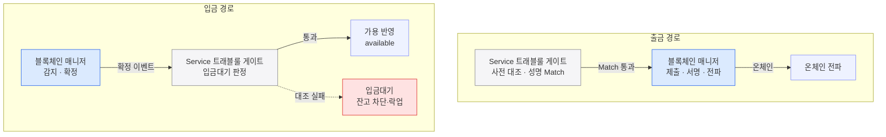

트래블룰은 온체인 규칙이 아니라 VASP(가상자산사업자) 사이의 오프체인 신원 메시징 의무이며, 그래서 설계에서는 두 개의 게이트로 나타난다.
이 장은 그 게이트를 이 저장소의 지갑 설계와 Canton PoC 맥락 어디에 두는지를 정리하는, 세트의 마지막 장이다.

## 트래블룰은 왜 "게이트"로 나타나는가

트래블룰은 체인 위에 새 규칙을 새기는 것이 아니다. 자산을 옮기는 것과 **별개로**, 송금인(originator)·수취인(beneficiary)의 신원 정보를 상대 VASP와 오프체인에서 주고받아야 하는 의무다. 온체인 전파는 그대로 두고, 그 앞뒤에 "정보 교환·대조가 끝났는가"를 묻는 검문소를 세우는 것이다.

그래서 실무의 뼈대는 두 줄로 요약된다.

- **출금 = 사전 대조 후 전파** — 수신 VASP의 성명 Match 신호가 와야 온체인 전파를 한다.
- **입금 = 대조 실패 시 잔고 차단** — 미연동·미등록 출처의 100만원 이상 입금은 입금대기(잔고 차단·락업)로 묶는다.

설계 관점에서 이 두 줄은 각각 **출금 파이프라인 앞단 게이트**(4장)와 **입금 가용 전이 게이트**(5장)로 나타난다. 첫 게이트는 온체인에 내보내기 전에 막고, 둘째 게이트는 온체인으로 들어온 뒤 가용(available)으로 넘기기 전에 막는다.

## 게이트는 어디에 두는가 — 블록체인 매니저 밖

핵심 결정은 **트래블룰 게이트를 블록체인 매니저 밖, Service 업무층에 둔다**는 것이다.

- **블록체인 매니저**는 vault·서명·온체인 감지/전파를 맡는다. 즉 "자산을 실제로 움직이는" 부분이다.
- **Service 업무층**은 그 앞뒤에서 트래블룰 대조·성명 매칭·입금대기 판정을 맡는다. 즉 "움직여도 되는가를 판단하는" 부분이다.

이 분리는 벤더 지형과도 맞물린다. Fireblocks의 공식 트래블룰 제공자 목록은 Notabene(직접)·Sumsub·GTR(TRLink)·Chainalysis·Elliptic이고, 국내에서 쓰는 **VerifyVASP는 이 목록에 없다**. 국내 망을 쓰는 순간 게이트는 벤더가 대신 처리해 주는 기능이 아니라 우리가 벤더 밖에서 직접 세워야 하는 관문이 된다. 게이트를 매니저 밖 Service 층에 두는 설계는 이 현실과 자연스럽게 들어맞는다.

위 그림에서 회색은 Service 층의 트래블룰 게이트, 파랑은 블록체인 매니저다. 출금은 게이트가 먼저 서고 매니저가 뒤따르며, 입금은 매니저가 먼저 감지·확정한 뒤 게이트가 가용 전이를 판정한다. 입금 게이트는 온체인 확정(자산이 실제로 도착했다는 사실)과 별개로 하나의 관문을 더 요구한다 — 컴플라이언스 통과가 있어야만 가용으로 넘어가고, 대조에 실패하면 잔고를 차단해 입금대기로 묶는다. 온체인에서 확정됐다고 곧바로 쓸 수 있는 잔고가 되는 것이 아니다.

## Canton과의 관계 — 두 층으로 나뉜다

Canton 자체는 트래블룰 메시징 프로토콜이 아니다. Canton이 이 그림에서 하는 역할은 두 층으로 갈린다.

### (A) 온원장(가시성) 층 — Canton이 강한 부분

Canton은 부분 트랜잭션 프라이버시·선택적 공개·규제기관 옵저버를 제공한다. 이 덕에 트래블룰이 다루는 신원·거래 데이터를 **프라이버시를 깨지 않고** 보관·감사할 수 있다. 거래에 참여하는 기관 안에서 송금인·수취인을 식별·스크리닝하되, 무관한 참여자에게는 데이터가 노출되지 않는다.

이 층의 접근 통제는 세 가지로 짜인다.

- **guardian 모델** — 암호화된 데이터에 대한 접근을 정책으로 부여한다.
- **TEE** — 위험 신호를 만드는 데 필요한 정보만 처리한다.
- **법집행기관 시한부 접근** — 필요한 때에 한해 시간 제한을 둔 접근을 연다.

### (B) VASP 간 신원 교환 층 — Canton이 직접 하지 않는 부분

송금인·수취인 정보를 상대 VASP와 실제로 교환하는 행위, 즉 IVMS101(interVASP Messaging Standard) 데이터를 주고받는 일은 Canton이 하지 않는다. 이 교환은 오프체인 프로토콜(VerifyVASP 등)이나 지갑·VASP 소프트웨어가 담당한다.

## 분담 결론

두 층을 합치면 역할 분담이 분명해진다.

- **트래블룰(신원 교환)은 지갑/VASP 층이 맡는다** — Service 업무층의 컴플라이언스 정책 엔진과 VerifyVASP 연동 등이 여기에 해당한다.
- **Canton은 정산·프라이버시·감사 층을 맡는다** — 선택적 공개·규제기관 옵저버로 데이터를 프라이버시 보존하며 보관·감사하는 토대를 댄다.

여기서 "캔톤 네이티브 트래블룰"이라는 표현을 오해하면 안 된다. 이 말은 VerifyVASP가 Canton 전용이라는 뜻이 **아니다**. VerifyVASP는 체인에 종속되지 않는 프로토콜이고, 지갑 소프트웨어가 그것을 Canton 파티 지갑에 통합해 제공한다는 의미다.

## 교차 참조

- **출금 게이트**의 구체 흐름은 4장, **입금 게이트**의 입금대기·강제 반환 처리는 5장, 자기수탁 지갑(개인지갑) 상대의 화이트리스트·소유 증명은 6장에서 다룬다.
- 이 게이트들은 **블록체인매니저 설계의 입금·출금 흐름**과 합류한다 — 출금 게이트는 제출·서명 앞에, 입금 게이트는 감지·확정 뒤 가용 전이 앞에 붙는다.
- 프라이버시·감사 층은 **캔톤네트워크의 정산·프라이버시(선택적 공개·규제기관 옵저버)**와 이어지고, 자기수탁 맥락은 캔톤네트워크의 외부 파티 키 보관·서명과 연결된다.
