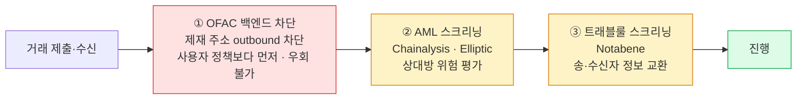

트래블룰은 VASP(가상자산사업자)끼리 송·수신자 정보를 온체인이 아니라 별도 채널로 주고받는 의무이고, Fireblocks 는 이 채널을 Notabene 연동으로 제공한다.
이 장은 거래 한 건이 지나는 컴플라이언스 관문 셋의 순서 — OFAC → AML(자금세탁방지) → 트래블룰 — 을 먼저 못 박아 이후 장들이 어디에 무엇을 얹는지의 기준으로 삼는다.

## 트래블룰이란 — 체인 밖 채널로 오가는 송·수신자 정보

트래블룰은 FATF 권고에 따라 VASP 가 특정 거래의 송신자·수신자 정보를 상대 VASP 와 교환해야 하는 의무다. 어떤 거래가 대상이고 어떤 데이터가 필요한지는 각 관할권이 정한다.

핵심 성질 하나가 이 세트 전체를 지배한다 — **온체인 거래에는 송신자 정보가 실려 있지 않다.** 그래서 트래블룰 정보는 체인 밖의 별도 채널로 오가고, 이 채널을 제공하는 것이 트래블룰 제공자다. Fireblocks 는 **Notabene** 과 연동한다.

- **premium opt-in 기능**이다 — 추가 구매·CSM 문의가 필요하다.
- 트래블룰 데이터는 **암호화되어 Notabene 에 보관**되며, **Fireblocks 는 복호화 키를 갖지 않는다.**

트래블룰이 무엇이고 어떤 데이터·관할권 규제가 걸리는지의 개념·규제 상세는 트래블룰 개념 세트로 넘긴다. 이 세트는 Fireblocks·Notabene 로 실제로 어떻게 동작하는가에 집중한다.

## 검사 순서 — 관문 셋, 트래블룰이 마지막

거래 한 건은 아래 세 관문을 차례로 지난다.

이 순서는 공식 문서로 확정된 사실이다.

- **① OFAC 백엔드 차단** — 제재 주소로의 outbound 는 백엔드에서 차단된다. 이 대조는 **사용자가 만든 Policy 규칙보다 먼저** 돌고 **우회할 수 없다.** 차단되면 거래는 **BLOCKED / Blocked By Policy** 로 떨어진다.
- **② AML 스크리닝** — Chainalysis·Elliptic 로 상대방 위험을 평가한다.
- **③ 트래블룰 스크리닝** — Notabene 로 송·수신자 정보를 교환한다. **AML 이 트래블룰보다 먼저**이므로, 상대방이 이미 AML 에서 high-risk 로 플래그되면 트래블룰 데이터 교환은 보통 진행되지 않는다.

통합 형태도 관문마다 다르다 — **AML 과 트래블룰은 각각 별도 premium 통합**이고, 상대방 신원 식별에 쓰는 **Address Registry(주소 등록부)** 는 전 워크스페이스에서 무료로 쓰는 네이티브 기능이다.

OFAC 차단·정책 게이트가 거래 흐름의 어디에 놓이는지의 상세는 4장 정책·시간 규칙에서, Notabene 을 어떻게 붙이고 데이터가 어떤 경로로 오가는지는 1장 Notabene 연동에서 이어진다.
