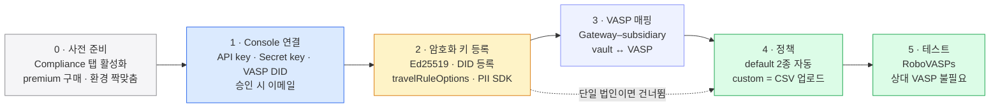

해외(Notabene) 연동 준비를 사전 준비부터 테스트까지 정리한다 — Console 연결·키 등록·정책 설정으로 이어지는 Admin 운영 작업이고, 애플리케이션 코드는 0줄이다.
이 설계는 법인 하나(한 워크스페이스에 우리 회사 하나)를 전제하므로 5단계로 끝난다 — 한 워크스페이스에서 여러 법인을 함께 운영할 때만 VASP 매핑(3단계)이 하나 더 낀다.

## 단계 한눈에 — 0~5

| 단계 | 이름 | 하는 일 | 코드 |
|---|---|---|---|
| **0** | 사전 준비 | Notabene 계정 생성·설정 + Fireblocks **Compliance 탭 활성화**. Compliance 는 premium 기능이라 Fireblocks **Support/CSM 경유로 구매**해 켠다. 연결은 **production↔production, sandbox↔sandbox** 로 환경끼리 맞물린다. | 0줄 |
| **1** | Console 연결 | Fireblocks Console 에서 **Settings > Compliance > Travel rule > Connect provider** 로 들어가 Notabene 대시보드의 **API key · Secret key · VASP DID** 를 입력한다. 승인되면 이메일로 통지된다. | 0줄 |
| **2** | 암호화 키 등록 | Notabene CLI(`npm i -g @notabene/cli`)로 **Ed25519 키**를 생성하고, JSON DID 키를 `PUT /v1/screening/travel-rule/vasp/update` 로 등록한다. SDK 에 `travelRuleOptions` 를 구성하며, 송금인(originator)/수취인(beneficiary) 개인정보 암호화는 **Notabene PII SDK(개인정보 암호화)** 가 담당한다. | CLI·API 일회성 |
| **3** | VASP 매핑 *(다중 법인만)* | Gateway VASP(부모)–subsidiary 구조를 Notabene 쪽에 만들고, **Fireblocks API 로 vault ↔ VASP 를 연결**한다. **단일 법인이면 이 단계는 없다**. | 0줄 |
| **4** | 정책 | 연결 즉시 **default 정책 2종이 자동 적용**된다(상세는 4장). custom 정책은 **CSV 템플릿 작성 → Console 업로드 → Fireblocks Support 검토 → 활성화** 순서다. | 0줄 |
| **5** | 테스트 | Notabene **RoboVASPs** 로 테스트 거래를 돌린다. **별도 상대 VASP 없이** 송·수신을 검증할 수 있다. | 0줄 |

0→1→2→4→5 가 모든 법인이 밟는 기본선이고, **3(VASP 매핑)은 다중 법인일 때만** 끼어든다 — 단일 법인은 2에서 4로 바로 건너뛴다. 위 단계들에 런타임 코드가 붙는 곳은 없고, 2단계의 CLI·API 호출도 **일회성 등록**이다.

## 다중 법인일 때 — VASP 매핑 규칙 (3단계 · 참고)

**다중 법인** = 한 Fireblocks 워크스페이스에서 여러 법인(계열사 등)을 함께 운영하는 구성이다. 법인마다 트래블룰 신고 주체(VASP)가 다르므로 Notabene 쪽 VASP 도 나뉘고, 어느 vault 가 어느 법인 것인지 매핑이 필요해진다. **우리는 법인 하나라 이 단계가 없고, 이 절은 나중에 법인이 늘 때의 참고다.**

이때는 vault 와 VASP 를 어떻게 묶느냐가 **입금 검사의 판정 기준**을 좌우한다. 규칙은 다음과 같다.

| 항목 | 규칙 |
|---|---|
| **구조** | Gateway VASP(부모) 아래 subsidiary 를 두는 계층. Notabene 쪽에 이 구조를 만든다. |
| **연결** | Fireblocks API 로 vault account ↔ VASP 를 잇는다. |
| **카디널리티** | **vault 는 단일 VASP 에만** 속한다. 반대로 **하나의 VASP 는 복수 vault** 를 가질 수 있다. |
| **입금 검사 기준** | 수신 vault 에 매핑된 **VASP 기준**으로 검사한다. 매핑이 없으면 **Gateway(부모)** 로 떨어진다. |

vault 하나가 한 VASP 에만 매핑되므로 입금이 들어온 vault 만 보면 어느 법인 소속인지 유일하게 정해지고, 미지정 vault 는 자동으로 Gateway 로 귀속된다.

## 교차참조

- **정책 2단(default 2종 + custom)의 상세**는 4장에서 다룬다.
- **개발이 붙는 유일한 지점인 출금 경로**는 2장에서 다룬다.
- **국내(VerifyVASP) 연동 준비**(Enclave 설치·수신 컴포넌트)는 13장 — 이 장(Notabene)이 SaaS 연결이라면 그쪽은 자체 인프라 설치·운영이다.
- 규제·개념 차원의 배경은 트래블룰 개념 세트의 출금 실무를 참고한다.
