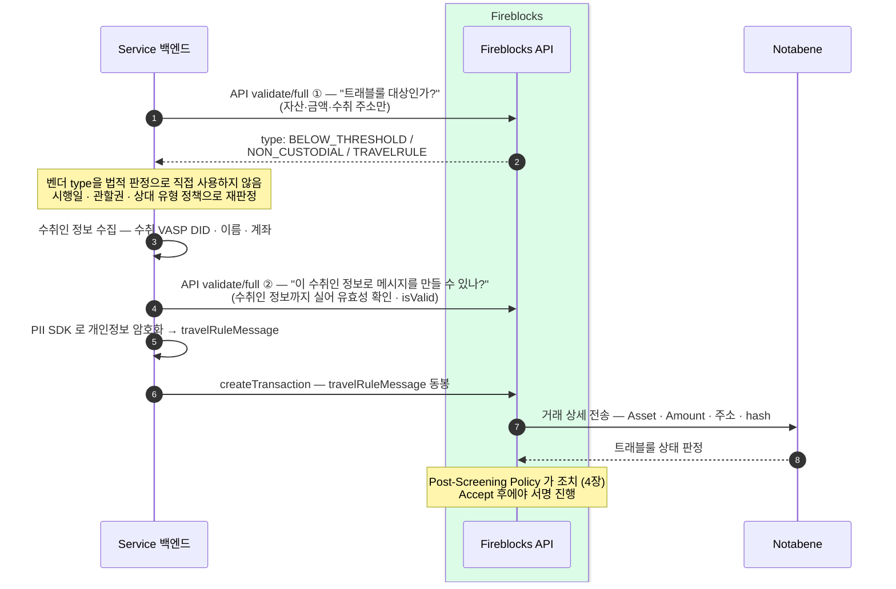

제출 전에 두 번 검증하고, 암호화한 정보를 거래에 실어 보낸다.
출금은 입금과 달리 우리 백엔드가 흐름을 주도한다 — 상대 유형과 적용 규정 판별, 수취인 정보 수집, 암호화, 동봉까지 모두 우리 코드의 몫이고 스크리닝은 서명 직전 게이트로 걸린다.
이 장은 **해외(Notabene·Fireblocks 경유)** 출금을 다룬다 — 국내(VerifyVASP·CODE) 출금은 게이트가 벤더 밖으로 나와 흐름이 달라지며 6·7장이다.

## 출금 한 건이 흐르는 길 — 두 번 검증하고 암호화해 제출한다

우리 백엔드가 Fireblocks 를 불러 벤더 분류를 받은 뒤 국내 규정·시행일·상대 유형 정책을 함께 적용한다. 정보 교환 대상이면 수취인 정보를 모아 한 번 더 검증한 뒤 개인정보를 암호화해 거래에 실어 보낸다. Fireblocks 는 그 거래 상세를 Notabene 로 넘겨 상태를 판정받고, 판정 결과에 따라 Post-Screening Policy 가 조치한다.

위 그림의 "Service 백엔드"는 우리 내부 분담을 한 참여자로 접은 것이다 — 실제로는 `validate/full` 을 **컴플라이언스 게이트가 전용 API user 로** 직접 호출하고(8장), `createTransaction` 제출은 **블록체인 매니저를 경유**한다(6장). 이 장은 벤더 메커니즘에 집중하고, 내부 분담이 펼쳐진 그림은 7.2 시나리오다.

핵심은 **벤더 분류와 법적 판정을 분리하는 것**이다. 첫 호출의 `type`은 Fireblocks·Notabene의 분류 결과일 뿐 국내 법상 면제를 확정하지 않는다. 국내 VASP 간 출금은 2027년 2월 19일부터 금액과 관계없이 정보 교환 경로로 보낸다. 개인지갑·해외 VASP는 각 유형의 위험기반 정책으로 넘긴다. 정보 교환 대상일 때 수취인(beneficiary) 정보 — 수취 VASP 의 DID(Notabene 네트워크에서 VASP 를 가리키는 식별자)·이름·계좌 — 를 모은다. DID 는 사용자가 아는 값이 아니다 — 사용자는 화면에서 **수취 거래소를 선택**하고, 백엔드가 그 선택을 **VASP 목록**(Notabene 이 운영 · Fireblocks 트래블룰 API 의 vasp 계열로 조회)에서 DID 로 변환한다. 목록에 없는 상대는 Notabene 로 식별 불가 — 도달 불가 분기(6장)로 빠진다. 이어서 두 번째 호출로 그 정보가 유효한지(`isValid`) 한 번 더 확인한 뒤에 암호화해 동봉한다. 스크리닝은 서명 앞에 놓인 게이트다 — Notabene 판정이 Accept 로 떨어져야 그제야 서명이 진행된다.

## 첫 검증 — 세 갈래로 갈린다

두 번 모두 **Fireblocks 트래블룰 스크리닝 API 의 `validate/full` 엔드포인트**를 호출한다(1장에서 키를 등록한 그 API 계열) — 거래를 만들지 않고 제출 전에 판별만 한다. 기본 `validate` 엔드포인트는 **deprecated 예고**(validate/full 로 통합 권고)라 쓰지 않는다. 1차 호출에는 거래 개요(자산·금액·수취 주소)만 보내 **대상 여부**를, 2차 호출에는 수집한 수취인 정보까지 실어 **메시지에 실을 정보의 유효성**을 확인한다 — 1차 호출이 수취인 정보 없이 `type` 판별을 돌려주는지는 테스트로 확정.

판별 입력은 **시행일·관할권·상대 유형·금액**이다. 수취 주소는 주소록·블록체인 분석으로 VASP 보관(수탁)인지 개인지갑(비수탁)인지 식별한다. `BELOW_THRESHOLD`의 기준이 보내는 쪽이라는 설명은 Notabene 제품 의미로만 보존한다. 국내 VASP 간 거래에는 2027년 2월 19일부터 금액 기준이 없으므로 이 응답을 자동 통과로 사용하지 않는다. 자동 식별이 안 되면(UNKNOWN) 수취 VASP 를 목록에서 수동 선택한다 — 위의 "사용자가 거래소를 선택 → DID 변환"이 그 자리다.

1차 응답의 `type` 이 이후 경로를 결정한다.

| type | 뜻 | 이후 |
|---|---|---|
| `BELOW_THRESHOLD` | 벤더가 보내는 쪽 정책의 임계값 미만으로 분류 | 국내 VASP라면 2027-02-19부터 무시하고 정보 교환. 그 외는 관할권 정책으로 재판정 |
| `NON_CUSTODIAL` | 수취 주소가 비수탁(개인 지갑) | 개인지갑 위험기반 확인 경로로 전달. 자동 통과 금지 |
| `TRAVELRULE` | 트래블룰 대상 | 수취인 정보 수집 → `validate/full` → 암호화 → 동봉 |

`BELOW_THRESHOLD`와 `NON_CUSTODIAL`은 제품 분류값이지 최종 허용 판정이 아니다. 게이트는 적용 정책 버전과 재판정 근거를 기록한다. 국내 VASP에 대한 `BELOW_THRESHOLD` 자동 통과는 2027년 2월 19일 0시부터 제거한다. 개인지갑은 금융정보분석원 고시·감독규정에 맞춘 별도 확인을 통과해야 한다.

## travelRuleMessage 동봉은 우리 백엔드의 책임이다

`createTransaction` 으로 나가는 outgoing 거래에 `travelRuleMessage` 가 실려 있지 않으면 스크리닝을 우회한다 — 정보가 없으니 Notabene 가 판정할 대상 자체가 없어 게이트가 그대로 열린다. 따라서 대상 거래에 암호화 메시지를 빠짐없이 동봉하는 것은 우리 백엔드의 책임이다. 개인정보는 PII SDK(개인정보 암호화) 로 암호화해 `travelRuleMessage` 에 담는다.

이 책임은 규율이 아니라 **구조로 강제한다**. ① 출금이 "트래블룰 확인 중" 단계를 통과하지 않으면 상태 흐름이 제출 단계로 넘어가지 않고, 제출 요청의 `travelRule` 필드는 게이트 판정 산출물에서만 나온다(8장). ② 우회 제출(매니저 API 직접 호출·버그)은 **서명 직전 검증**이 "트래블룰 확인 통과" 여부를 대조해 막는다 — 통과 전이면 서명이 만들어지지 않는다(블록체인매니저 설계의 출금 흐름). ③ 벤더 층에서 "대상 거래인데 메시지 없음"을 차단하는 설정이 있는지는 미확정 — 확인 항목(14장).

- **Outbound delay 기본 0초** — 출금 방향은 제공자의 즉시 응답을 그대로 쓴다. 인위적 지연 없이 판정 즉시 다음 단계로 넘어간다.
- 두 번의 검증(모두 `validate/full`)은 제출 **전**에 끝난다 — 잘못된 대상 판별이나 무효한 수취인 정보로 거래가 나가는 것을 앞단에서 막는다.

Accept 이후의 제출·서명 파이프라인은 블록체인매니저 설계의 출금 흐름을 그대로 탄다.
