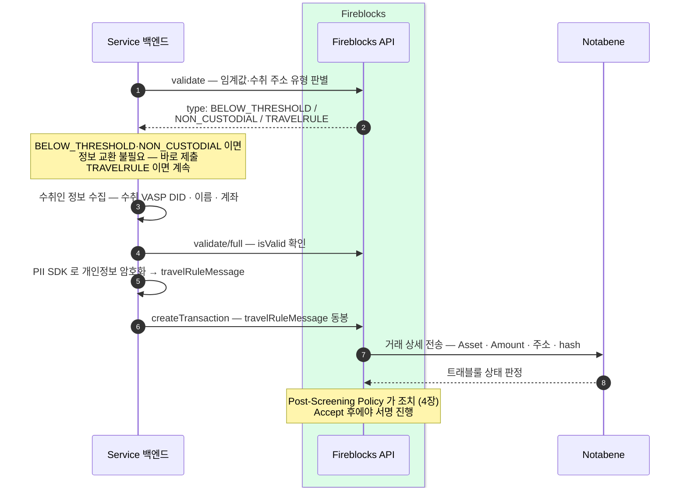

제출 전에 두 번 검증하고, 암호화한 정보를 거래에 실어 보낸다.
출금은 입금과 달리 우리 백엔드가 흐름을 주도한다 — 임계값 판별, 수취인 정보 수집, 암호화, 동봉까지 모두 우리 코드의 몫이고 스크리닝은 서명 직전 게이트로 걸린다.

## 출금 한 건이 흐르는 길 — 두 번 검증하고 암호화해 제출한다

우리 백엔드가 Fireblocks 를 불러 임계값을 판별하고, 트래블룰 대상이면 수취인 정보를 모아 한 번 더 검증한 뒤 개인정보를 암호화해 거래에 실어 보낸다. Fireblocks 는 그 거래 상세를 Notabene 로 넘겨 상태를 판정받고, 판정 결과에 따라 Post-Screening Policy 가 조치한다.

핵심은 **제출 전 검증이 두 번**이라는 점이다. 첫 `validate` 로 이 출금이 트래블룰 대상인지부터 가른다 — 임계값 미만이거나 수취 주소가 비수탁(개인 지갑)이면 정보 교환 자체가 필요 없어 곧바로 제출로 넘어간다. 트래블룰 대상일 때만 수취인(beneficiary) 정보를 모으고, `validate/full` 로 그 정보가 유효한지(`isValid`) 한 번 더 확인한 뒤에 암호화해 동봉한다. 스크리닝은 서명 앞에 놓인 게이트다 — Notabene 판정이 Accept 로 떨어져야 그제서야 서명이 진행된다.

## 첫 검증 — 세 갈래로 갈린다

`validate` 응답의 `type` 이 이후 경로를 결정한다.

| type | 뜻 | 이후 |
|---|---|---|
| `BELOW_THRESHOLD` | 임계값 미만 거래 | 정보 교환 불필요 — 바로 제출 |
| `NON_CUSTODIAL` | 수취 주소가 비수탁(개인 지갑) | 정보 교환 불필요 — 바로 제출 |
| `TRAVELRULE` | 트래블룰 대상 | 수취인 정보 수집 → `validate/full` → 암호화 → 동봉 |

`BELOW_THRESHOLD` 와 `NON_CUSTODIAL` 은 수취 VASP(가상자산사업자) 와 주고받을 정보가 없으므로 수집·암호화 단계를 건너뛴다. 한국의 임계값을 이 판별에 어떻게 적용할지는 미확정 — 확인 필요.

## travelRuleMessage 동봉은 우리 백엔드의 책임이다

`createTransaction` 으로 나가는 outgoing 거래에 `travelRuleMessage` 가 실려 있지 않으면 스크리닝을 우회한다 — 정보가 없으니 Notabene 가 판정할 대상 자체가 없어 게이트가 그대로 열린다. 따라서 대상 거래에 암호화 메시지를 빠짐없이 동봉하는 것은 우리 백엔드의 책임이다. 개인정보는 PII SDK(개인정보 암호화) 로 암호화해 `travelRuleMessage` 에 담는다.

- **Outbound delay 기본 0초** — 출금 방향은 제공자의 즉시 응답을 그대로 쓴다. 인위적 지연 없이 판정 즉시 다음 단계로 넘어간다.
- 두 번의 검증(`validate`, `validate/full`)은 모두 제출 **전**에 끝난다 — 잘못된 대상 판별이나 무효한 수취인 정보로 거래가 나가는 것을 앞단에서 막는다.

Post-Screening Policy 가 판정 결과에 어떤 조치(Accept / Reject / Alert / Freeze / Wait / Cancel)를 걸고 그 시간 규칙이 어떻게 되는지는 4장에서 다룬다. Accept 이후의 제출·서명 파이프라인은 블록체인매니저 설계의 출금 흐름을 그대로 탄다. 이 장은 Notabene 경로를 전제로 하며, 수취 VASP 가 VerifyVASP 로 도달하는 경우 흐름이 달라지는데 그 분기는 6장에서 정리한다.
