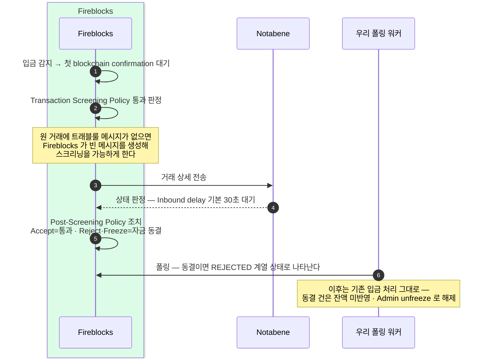

벤더 안 흐름에는 우리 코드가 없다 — Fireblocks 와 Notabene 가 검사·판정을 안에서 끝내고, 우리는 폴링으로 결과 상태만 받는다. 도착한 뒤의 가용 전이는 별개다 — 7.5 합류점의 판별(벤더 통과를 어디까지 믿을지의 정책 결정 포함)이 우리 몫이다.
동결 건은 REJECTED 계열 상태로 나타나 기존 입금 파이프라인이 그대로 흡수한다. 정책·시간 규칙은 4장이 맡고, 여기서는 한 건이 벤더 안을 지나는 순서를 정리한다.
이 장은 **해외(Notabene·Fireblocks 경유)** 입금(벤더 주도)이다 — 국내(VerifyVASP·CODE) 입금은 우리 수신 사슬이 먼저 응답하는 요청-응답형이라 다르며 6·7.3·11장이다.

## 입금 한 건이 벤더 안을 지나는 길 — 우리는 폴링으로 결과만 받는다

벤더 안에서 감지·스크리닝·판정·조치가 끝나고, 우리는 결과 상태만 받는다. 그림의 "우리 폴링 워커"는 **블록체인 매니저 내부 폴링**(블록체인매니저 설계 4장)을 접은 표현이다 — 백엔드는 매니저가 큐에 publish 한 이벤트를 consume 할 뿐이고, 내부 분담이 펼쳐진 그림은 7.4 시나리오다.

## 이후 — 기존 입금 파이프라인이 그대로 흡수한다

입금 트래블룰은 벤더 안에서 끝나고, 우리 쪽에는 폴링이 받는 상태(REJECTED·동결)로만 나타난다. 따라서 별도 처리 코드를 새로 짜지 않는다.

- **동결 건** — 잔액에 반영하지 않고 잠가 둔다. 해제는 **Admin unfreeze** 운영으로만 풀린다.
- **감지·동결·Admin unfreeze** — 이 세 단계는 이미 블록체인매니저 설계의 입금 흐름이 갖추고 있는 경로다. 트래블룰 동결도 REJECTED 계열 상태로 들어오므로 그 경로가 그대로 받아 처리한다.

시간 규칙은 하나 짚어 둔다. Inbound delay(기본 30초) 안에 판정이 나지 않으면 기본 설정에서는 통과(자금 방출) 된다 — 이 기본값과 대기·방출의 시간 규칙은 4장에서 다룬다.

## 교차참조

- **시나리오·합류점** — 이 벤더주도 흐름이 실제로 도는 모습은 7.4, 도착 후 가용 전이 판별은 7.5 (벤더 통과를 어디까지 믿을지의 정책 결정은 8장 판별 4).
- **정책·시간 규칙** (Transaction Screening / Post-Screening Policy 의 조치 매핑, Inbound delay 기본값과 방출 규칙) — 4장.
- **기존 입금·동결·Admin unfreeze 흐름** — 블록체인매니저 설계의 입금 흐름. 트래블룰 동결이 흘러 들어가는 파이프라인이다.
- **가용 전이 게이트 개념** (동결이 잔액 가용 전이를 막는 지점) — 개념 세트의 입금 실무.
