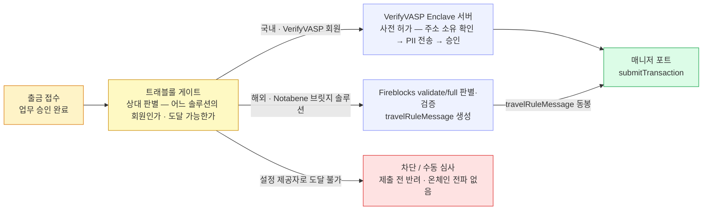

VerifyVASP 는 Fireblocks 제공자 목록에 없는 폐쇄형 트래블룰 연합이라, 국내 도입이 확정인 이상 트래블룰이 벤더 밖 우리 업무층으로 나온다.
국내 VerifyVASP·해외 Notabene 병행을 전제로 게이트를 매니저 포트 앞 별도 컴포넌트에 두는 배치를 다룬다 — 도달 경로는 **직접 연동(경로 B)으로 확정**됐고(A 불성립 확인), 가격은 미확정이다.

## VerifyVASP — 어떤 솔루션인가

여기부터 절 끝까지는 공식 문서로 확인된 **사실**이다.

VerifyVASP 는 람다256(두나무 자회사) 주도의 **폐쇄형 트래블룰 연합**이다. 150+ 회원 VASP(가상자산사업자)·30+ 관할권을 묶고, 데이터 표준은 IVMS101 이다. 구조는 두 조각으로 나뉜다.

- **설치형 Enclave 서버** — Docker 로 배포되며 **각 VASP 인프라에서 직접 운영**한다. 암호화 키와 개인정보(PII)를 이 서버가 보관한다.
- **중앙 API 서버** — VerifyVASP 가 운영하며 회원 간 메시징을 중계한다.

두 가지 제약이 도입 판단을 가른다. **비회원과는 통신할 수 없고**, **개인지갑(non-custodial)은 미지원**이다.

결정적으로, VerifyVASP 는 Fireblocks 문서의 제공자 목록에 **등재돼 있지 않다**. 그 목록은 Notabene 직접 · Sumsub·GTR(TRLink) · Chainalysis·Elliptic 이다. 우리 설계가 그리는 벤더 게이트형 출금(2장)·입금(3장)은 이 목록 위에서만 성립하므로, VerifyVASP 를 쓰려면 트래블룰이 벤더 밖으로 나오는 문제를 먼저 풀어야 한다.

## 도입 경로 — 직접 연동(B)으로 확정

세 경로를 검토했고 **B(직접 연동)로 확정**됐다. Notabene 게이트웨이 경유(9장)에 기대지 않는 이유는 라이브 지원 여부가 공개 자료로 불확실해서다.

| 경로 | 검토 결과 |
|---|---|
| **A. TRLink 파트너로 직접 지원** | **불성립 확인** — VerifyVASP 는 TRLink 파트너로 도달할 수 없다 |
| **A′. TRLink 파트너 경유 상호운용** (Sumsub·GTR ↔ VerifyVASP) | B 확정으로 검토 종료 — 프로토콜 상호운용이 자동 도달을 뜻하지 않는다는 한계도 있었다 |
| **B. 직접 연동** | **채택** — 트래블룰이 업무층으로 이동한다 |

경로 B 로 새로 지는 것은 둘이다. **운영 부담** — Enclave 서버를 우리 인프라에 설치·운영하고, 암호화 키·개인정보의 보관처가 우리 쪽에 생긴다(요건·준비 절차는 13장). **정책 틀 자체 설계** — 벤더 기본값 체계(Skip on failure(장애 시 우회)·delay·Wait)와 대시보드가 없어 대기·미수신·동결 규칙과 운영 화면을 직접 설계한다. AML(자금세탁방지, Chainalysis·Elliptic)·OFAC 차단은 별개 통합이라 그대로 남는다. 출금·입금의 실제 호출 흐름은 7.1·7.3 이다.

## VerifyVASP vs CODE — 국내 두 솔루션의 차이와 선택

국내 솔루션은 둘이다 — VerifyVASP(람다256)와 CODE(빗썸·코인원·코빗 연합). 공식 문서로 확인된 차이 중 **선택을 가른 것만** 추린다 — 식별자·목록 API·추적 키 같은 호출 수준의 차이는 실제 사용 자리(7.1·7.10~7.11)에 있다.

| | VerifyVASP | CODE |
|---|---|---|
| **구조** | 설치형 **Enclave**(키·PII 보관) + 중앙 중계 | 중앙(CodeVASP) 중계 + **CODE-Cipher**(암호화 모듈·설치형) — Enclave 급 저장소는 없음 |
| **사전 승인** | User Verification — **비동기** (UUID 즉시, 결과는 Callback) | Asset Transfer Authorization — **동기** (즉시 응답) |
| **미확인 입금 역추적** | Check Transaction Status — 입력이 verificationUuid 라 **사전 검증 기록이 있는 건만** 조회 가능 (공식 명세) | **Search VASP by TXID**(비동기) → Asset Transfer Data Request 로 사후 정보 교환 — **txid 만으로** 역추적하는 절차가 공식화 |
| **원화 환산 필드** | `tradePrice`·`tradeCurrency(KRW)`·`isExceedingThreshold` — **필수** (공식 명세 확인) | 같은 계열 필드 지원 — 차이 아님 |

**선택** — 국내 도달은 **VerifyVASP 직접 연동 하나로 간다**. CODE 회원은 두 솔루션의 상호연동(2022-04-25 완료 · VerifyVASP 목록 API 가 protocol=CODE 회원까지 반환)으로 도달하므로 CODE 직접 어댑터는 만들지 않는다. 단 **상호연동 경유의 실효**가 확인 조건이다 — 도달 범위, 그리고 CODE 전용 기능(TXID 역추적·원화 임계 필드)이 상호연동 경로에서도 동작하는지. 안 되는 것이 있으면 그때 CODE 어댑터를 추가한다(8장 구조상 어댑터 1개 — 동기라 오히려 단순).

## 병행 구성 — 상대가 어느 솔루션에 있느냐로 갈린다

여기부터는 **설계 판단**이다 — 국내 도입이 확정이라 이 판단도 확정됐다.

국내 상대 VASP 는 VerifyVASP(또는 CODE — 2022년 4월 25일부터 두 솔루션 상호 연동 완료), 해외 상대는 Notabene 으로 라우팅하는 **병행 구성으로 간다**. 해외 상대가 어느 솔루션에 있고 우리 Notabene 게이트로 도달되는지의 지형·거래소 표는 10장이다 — GTR 단독(Binance 글로벌 등) 상대는 도달 불가가 아니라 Sumsub 등 제공자 추가로 여는 문제다. 입금의 가용 전이 게이트는 **처음부터 복수 솔루션 대조로 설계**한다 — 나중 재작업을 없앤다.

여기에 하나 더 걸린다. VerifyVASP 가 개인지갑을 지원하지 않으므로, **개인지갑 입금의 인정은 별도 통제**(DAW-CORE DB 의 등록 지갑 목록 — 등록·소유 인증)가 필요하다.

## 게이트를 어디에 두나 — 블록체인 매니저 밖

트래블룰 게이트는 매니저(포트·어댑터)에도, DAW-CORE에도 넣지 않고 **별도 컴플라이언스 서비스**로 두며, **매니저 포트는 그대로** 둔다. 근거(세 안 검토)·구도는 [8장](08-gate-port.md)이 정본이고, 이 장은 병행 구성 위에서의 라우팅만 그린다.

출금 — 게이트(노랑)가 상대 솔루션을 판별해 사전 검증을 끝낸 뒤에야 매니저 포트(초록)로 넘긴다. 어느 솔루션이든 포트가 받는 것은 "승인된 이체 지시"로 동일하다. 국내는 VerifyVASP Enclave 서버가 사전 허가를, 해외는 Fireblocks 의 `validate/full` 판별·검증이 `travelRuleMessage` 생성을 맡는다(2장). 현재 설정한 제공자(Notabene)로는 도달할 수 없는 상대(빨강)는 대조 채널이 없어 **제출 전에 차단·수동 심사**로 빠지고 온체인에는 아무것도 나가지 않는다 — Sumsub 등 제공자를 추가하면 이 분기를 벗어난다(10장).

입금은 두 솔루션의 결과(우리가 구현한 수신 API 의 응답·승인, 벤더 동결 상태)가 **가용 전이 게이트 한 곳에서 합류**한다 — 합류점의 판별은 8장, 시나리오 합류는 7.5 다.

## 매니저와의 접점은 둘뿐

1. **해외(Notabene) 경로의 `travelRuleMessage` 운반** — 게이트가 만든 산출물을 제출 요청의 **옵션 필드**로 싣는다. `externalTxId` 처럼 포트는 산출물을 **싣기만 하고 내용을 모른다**.
2. **입금 벤더 동결 상태 수신** — 웹훅이 받는다. 이미 있는 경로다.

스크리닝 검증(`validate/full`)은 접점에 넣지 않는다 — 자산 불이동 + 평문 PII 동반이라, 컴플라이언스 서비스가 **전용 API user(스크리닝 용도 전용)** 로 직접 호출한다(8장). 솔루션이 추가·교체돼도 게이트만 바뀌고 포트·어댑터는 0줄이다.

## 미확정 — 확인 필요

공식 문서에 없어 도입 전 확인해야 하는 것들이다. **Fireblocks·Notabene 에 물을 것은 14장(부록 C)에 모았고**, 여기는 VerifyVASP(람다256) 몫만 남긴다.

- **가격** — 회원 가입·이용 조건.
- **VerifyVASP↔CODE 상호연동의 실효** — 주소 소유 확인·TXID 역추적·원화 임계가 경유 경로에서도 동작하는가. 안 되면 CODE 직접 어댑터 추가 판단(위 비교표·11장).
- **Enclave 운영 요건 잔존분** — HA·스케일링·권장 사양·운영 대행(managed) 옵션. 확정분 요건 표와 준비 절차는 13장.

## 이어지는 장

벤더 게이트형 **출금**의 동작은 2장, **입금**의 동작은 3장, 게이트가 따르는 **정책·시간 규칙**은 4장이다. 이 병행 구성이 실제로 도는 모습은 7장(국내·해외·직접 시나리오), 채널별로 다른 호출 모양을 한 인터페이스로 접는 것은 [8장 게이트 유연화](08-gate-port.md)에서 이어진다.
