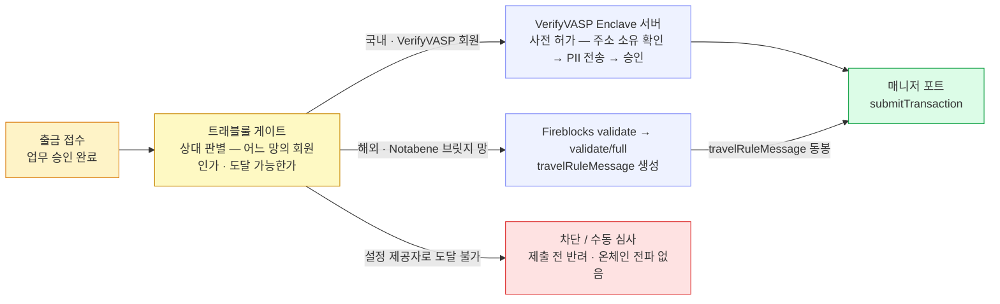
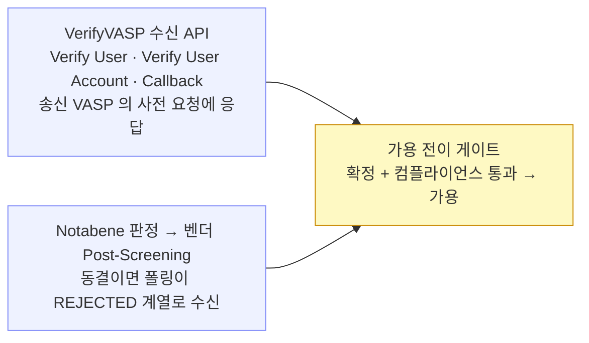

VerifyVASP 는 Fireblocks 제공자 목록에 없는 폐쇄형 트래블룰 연합망이라, 도입하면 트래블룰이 벤더 밖 우리 업무층으로 나온다.
국내 VerifyVASP·해외 Notabene 병행을 전제로 게이트를 매니저 포트 앞 별도 컴포넌트에 두는 배치를 다룬다 — 도달 경로는 **직접 연동(경로 B)으로 확정**됐고(A 불성립 확인), 가격은 미확정이다.

## VerifyVASP — 어떤 망인가

여기부터 절 끝까지는 공식 문서로 확인된 **사실**이다.

VerifyVASP 는 람다256(두나무 자회사) 주도의 **폐쇄형 트래블룰 연합망**이다. 150+ 회원 VASP(가상자산사업자)·30+ 관할권을 묶고, 데이터 표준은 IVMS101, 흐름은 **출금 전 사전 허가형**이다. 구조는 두 조각으로 나뉜다.

- **설치형 Enclave 서버** — Docker 로 배포되며 **각 VASP 인프라에서 직접 운영**한다. 암호화 키와 개인정보(PII)를 이 서버가 보관한다.
- **중앙 API 서버** — VerifyVASP 가 운영하며 회원 간 메시징을 중계한다.

두 가지 제약이 도입 판단을 가른다. **비회원과는 통신할 수 없고**, **개인지갑(non-custodial)은 미지원**이다.

결정적으로, VerifyVASP 는 Fireblocks 문서의 제공자 목록에 **등재돼 있지 않다**. 그 목록은 Notabene 직접 · Sumsub·GTR(TRLink) · Chainalysis·Elliptic 이다. 우리 설계가 그리는 벤더 게이트형 출금(2장)·입금(3장)은 이 목록 위에서만 성립하므로, VerifyVASP 를 쓰려면 트래블룰이 벤더 밖으로 나오는 문제를 먼저 풀어야 한다.

## 도입 경로 — 직접 연동(B)으로 확정

세 경로를 검토했고 **B(직접 연동)로 확정**됐다.

| 경로 | 검토 결과 |
|---|---|
| **A. TRLink 파트너로 직접 지원** | **불성립 확인** — VerifyVASP 는 TRLink 파트너로 도달할 수 없다 |
| **A′. TRLink 파트너 경유 상호운용** (Sumsub·GTR ↔ VerifyVASP) | B 확정으로 검토 종료 — 프로토콜 상호운용이 자동 도달을 뜻하지 않는다는 한계도 있었다 |
| **B. 직접 연동** | **채택** — 트래블룰이 업무층으로 이동한다. 아래 상세 |

경로 B 의 상세는 이렇다.

- **운영 부담** — Enclave 서버를 우리 인프라에 설치·운영한다. 암호화 키·개인정보의 보관처가 우리 쪽에 새로 생긴다.
- **출금** — 제출 전에 ① 수취인(beneficiary) 주소 소유 확인 → ② 암호화 개인정보 전송·사전 승인 → ③ 온체인 전송 → ④ tx hash 보고. 통과 증적을 우리 관문(업무 승인·서명 직전 검증)으로 건다.
- **입금** — 별도 메시지를 기다렸다 대조하는 방식이 아니라 **요청-응답**이다. 송신 VASP 의 사전 검증 요청에 응답하는 수신용 API 를 **우리가 구현**하고, 응답·승인 뒤 들어온 입금을 인정한다.
- **정책 틀** — 벤더 기본값 체계(Skip on failure(장애 시 우회)·delay·Wait)와 대시보드가 없다. 대기·미수신·동결 규칙과 운영 화면을 **자체 설계**한다. AML(자금세탁방지, Chainalysis·Elliptic)·OFAC 차단은 별개 통합이라 그대로 남는다.

## VerifyVASP vs CODE — 국내 두 망의 차이와 선택

국내 망은 둘이다 — VerifyVASP(람다256)와 CODE(빗썸·코인원·코빗 연합). 공식 문서로 확인된 차이가 연동 방식 선택을 가른다.

| | VerifyVASP | CODE |
|---|---|---|
| **구조** | 설치형 **Enclave**(키·PII 보관) + 중앙 중계 | 중앙(CodeVASP) 중계 + **CODE-Cipher**(암호화 모듈·설치형) — Enclave 급 저장소는 없음 |
| **식별자** | `vaspId` — 숫자 문자열 | `vaspEntityId` — 이름 그대로 (coinone·bithumb·korbit) |
| **사전 승인** | User Verification — **비동기** (UUID 즉시, 결과는 Callback) | Asset Transfer Authorization — **동기** (즉시 응답) |
| **미확인 입금 역추적** | Check Transaction Status (송신측 검증 유무 조회) | **Search VASP by TXID**(비동기) → Asset Transfer Data Request 로 사후 정보 교환 — anonymous tx 절차가 공식화 |
| **원화 임계** | `AmountUSD` 만인지 미확정 | `tradePrice`·`tradeCurrency(KRW)`·`isExceedingThreshold` — **원화 판정 직접 지원** |
| **목록 API 특기** | `protocol`(VERIFYVASP/CODE)·`vaspStatus`(INTEROPERATED 포함)·health | `allianceName`(상대의 솔루션명)·`pubkeys`·health |
| **추적 키** | verification UUID (tx hash 를 UUID 에 매핑) | `transferId` (UUID v4 · 우리가 생성) |

**선택** — 국내 도달은 **VerifyVASP 직접 연동 하나로 간다**. CODE 회원은 두 망의 상호연동(2022-04-25 완료 · VerifyVASP 목록 API 가 protocol=CODE 회원까지 반환)으로 도달하므로 CODE 직접 어댑터는 만들지 않는다. 단 **상호연동 경유의 실효**가 확인 조건이다 — 도달 범위, 그리고 CODE 전용 기능(TXID 역추적·원화 임계 필드)이 상호연동 경로에서도 동작하는지. 안 되는 것이 있으면 그때 CODE 어댑터를 추가한다(8장 구조상 어댑터 1개 — 동기라 오히려 단순).

## 해외 상대는 어느 망에 — 요지

해외 상대가 어느 망에 있고 우리 Notabene 게이트로 도달되는지의 지형·거래소 표는 **10장(해외 망 지형)**에 있다. 병행 구성에 필요한 요지만 옮기면:

- **TRUST·Sygna 등 Notabene 브릿지 망** 상대는 게이트로 도달 ○.
- **GTR 단독(Binance 글로벌)·CODE 는 Notabene 미브릿지** — 열려면 Sumsub 등 제공자를 Fireblocks TRLink 로 추가한다(도달 불가가 아니라 제공자 선택).
- **VerifyVASP 는 Notabene 라이브 여부 불확실**(9장). 그래서 국내 도달을 Notabene 에 기대지 않고 직접 연동(경로 B)을 택한다.

## 병행 구성 — 상대가 어느 망에 있느냐로 갈린다

여기부터는 **설계 판단**이다.

국내 상대 VASP 는 VerifyVASP(또는 CODE — 2022년 4월 25일부터 두 망 상호 연동 완료), 해외 상대는 Notabene 으로 라우팅하는 **병행 구성이 될 가능성**이 있다. 이렇게 될 경우, 입금의 가용 전이 게이트를 **처음부터 복수 망 대조로 설계**하는 편이 재작업을 줄인다 — 라고 제안한다.

여기에 하나 더 걸린다. VerifyVASP 가 개인지갑을 지원하지 않으므로, **개인지갑 입금의 인정은 별도 통제**(Address Registry(주소 등록부) 등록·소유 인증)가 필요하다.

## 게이트를 어디에 두나 — 블록체인 매니저 밖

트래블룰 게이트를 **블록체인 매니저(포트·어댑터)에 넣지 않는 것을 제안**한다 — 이는 설계 판단이다. 이유는 셋이다.

1. 트래블룰은 온체인 사건이 아니라 VASP 사이의 **오프체인 규제 메시징**이라, 매니저의 어휘(계정·주소·거래)에 속하지 않는다.
2. 트래블룰 제공자는 custody 벤더와 **독립적으로 바뀐다** — 교체 축이 다르다.
3. 병행 구성에선 한 출금의 처리가 상대 망에 따라 벤더 안(Notabene)과 벤더 밖(VerifyVASP)으로 갈리는데, 그 분기는 **업무 판단**이지 체인 통로의 일이 아니다.

그래서 트래블룰 게이트를 **Service 업무층**에 두고, **매니저 포트는 그대로** 둔다. 업무층 안에서도 별도 서비스가 아니라 **모듈**이다 — 근거·구도·서비스 승격 조건은 [8장](08-gate-port.md).

출금 — 게이트(노랑)가 상대 망을 판별해 사전 검증을 끝낸 뒤에야 매니저 포트(초록)로 넘긴다. 어느 망이든 포트가 받는 것은 "승인된 이체 지시"로 동일하다. 국내는 VerifyVASP Enclave 서버가 사전 허가를, 해외는 Fireblocks 의 `validate` → `validate/full` 판정이 `travelRuleMessage` 생성을 맡는다(그 벤더 게이트형 출금 자체는 2장). 현재 설정한 제공자(Notabene)로는 도달할 수 없는 상대(빨강)는 대조 채널이 없어 **제출 전에 차단·수동 심사**로 빠지고 온체인에는 아무것도 나가지 않는다. GTR 단독 상대(Binance 글로벌 등)는 Sumsub 등 제공자를 추가하면 이 분기를 벗어난다(10장).

입금 — 두 망의 결과가 **가용 전이 게이트 한 곳에서 합류**한다. VerifyVASP 쪽은 우리가 구현한 수신 API 의 응답·승인 결과이고, Notabene 쪽은 벤더 동결 상태(블록체인매니저 설계의 입금 폴링 경로 그대로)다. 이 합류점이 앞 절에서 "처음부터 복수 망 대조로 설계"하라고 제안한 자리다.

## 매니저와의 접점은 둘뿐

배치를 이렇게 잡으면 트래블룰이 블록체인 매니저에 남기는 접점은 **둘뿐**이다.

1. **해외(Notabene) 경로의 `travelRuleMessage` 운반** — 게이트가 만든 산출물을 제출 요청의 **옵션 필드**로 싣는다. `externalTxId` 처럼 포트는 산출물을 **싣기만 하고 내용을 모른다**.
2. **입금 벤더 동결 상태 수신** — 폴링이 받는다. 이미 있는 경로다.

스크리닝 검증(`validate` 계열)은 Fireblocks API 지만 접점에 **넣지 않는다** — 자산 불이동 + 평문 PII 동반이라, 게이트 모듈이 **전용 API user(스크리닝 권한만)** 로 직접 호출한다. 매니저의 관문 원칙은 "자산이 움직이는 경로"에 대한 것이다(8장).

핵심은 확장성이다 — 망이 추가·교체돼도 게이트만 바뀌고 포트·어댑터는 0줄이다. 게이트를 업무층에 둔 앞 절의 판단이 여기서 값을 낸다.

## 미확정 — 확인 필요

공식 문서에 없어 도입 전 확인해야 하는 것들이다.

- **한국 관할 임계값 적용법** — 원화 기준 적용 방법. `AmountUSD` 만 지원하는지 확인 필요.
- **TAP(거래 승인 정책)과의 선후** — 문서에 TAP 언급이 없다. 확정된 순서는 "OFAC 이 사용자 정책보다 먼저", "AML 이 트래블룰보다 먼저" 뿐이다.
- **Notabene 직접 통합 vs TRLink** — 연결 가능 목록에 Notabene·Sumsub 이 병렬로 있어 병행처럼 보이지만 명시가 없다.
- **VerifyVASP 가격** — 회원 가입·이용 조건.
- **VerifyVASP↔CODE 상호연동의 실효** — 상호연동 경유로 CODE 회원에 도달할 때 기능 손실이 없는지: TXID 역추적·원화 임계 판정이 경유 경로에서도 동작하는가. 안 되면 CODE 직접 어댑터 추가 판단(위 비교 표).
- **GTR 상대 커버리지 — 제공자 추가 판단** — Notabene 은 GTR·CODE 를 브릿지하지 않으므로 Binance 글로벌 등 GTR 단독 상대는 Notabene 게이트만으로 도달 못 한다. 열려면 Sumsub(GTR·CODE·Sygna·1,800+ VASP 커버) 또는 GTR 직접 제공자를 Fireblocks TRLink 로 추가한다 — 도달 불가가 아니라 제공자 선택. 확인 필요: Fireblocks 의 GTR 제공자가 globaltravelrule.com 의 GTR 과 동일 망인지, Sumsub 경유 시 원화 임계·역추적 등 망 전용 기능 손실 여부(10장).
- **게이트웨이 경유 VerifyVASP 도달** — VerifyVASP 를 자체 Enclave 없이 Notabene 게이트웨이로 우회 도달할 수 있는지(직접 연동 B 의 대체). **Notabene 의 VerifyVASP 라이브 지원 여부가 공개 자료로 불확실**(분석 페이지 노후)하므로 벤더 확인이 선결 — 검증 흐름·체크리스트는 9장.
- **Enclave 운영 요건** — 일부는 공식 문서로 확인됨: AWS ECR Docker 배포 · DB 5종(MySQL 기본) · Enclave 포트 21117 · **공개 HTTPS 엔드포인트 + 중앙 서버발 인바운드 허용 + IP 화이트리스트** · 키는 env 또는 HSM. 잔존 = HA·스케일링·권장 사양(문서에 없음) · 운영 대행(managed) 옵션 존재 여부 — 없으면 경로 B 는 Enclave 자체 운영이 필수(PII 를 회원 인프라에만 두는 망 구조상 대행이 어려울 수 있음).
- **가격·SLA** — premium 구독 조건, Notabene 측 계약. Notabene API 문서는 비공개라 CSM 경유로 접근한다.
- **스크리닝 전용 API user 의 권한 구성** — validate 계열만 가능한 최소 권한 role 이 있는지(8장 전용 API user 전제).

## 이어지는 장

벤더 게이트형 **출금**의 동작은 2장, **입금**의 동작은 3장, 게이트가 따르는 **정책·시간 규칙**은 4장이다. 이 병행 구성이 실제로 도는 모습은 7장(국내·해외·직접 시나리오), 채널별로 다른 호출 모양을 한 인터페이스로 접는 것은 [8장 게이트 유연화](08-gate-port.md)에서 이어진다. 게이트를 왜 업무층에 두는지의 배경은 개념 세트의 게이트 위치·Canton 관계와도 맞물린다.
