## 전체 시나리오 지도

도달 가능한 상대 × 방향을 한눈에. 입금 시나리오(7.3·7.4·7.7·7.9·7.11·A.2)는 모두 확정 후 **7.5 도착 후 판별**로 합류한다.

| 상대 유형 | 출금 | 입금 | 채널 |
|---|---|---|---|
| 국내 VerifyVASP (업비트 등) | 7.1 | 7.3 | VerifyVASP 직접 연동(자체 Enclave) |
| 국내 CODE (빗썸·코인원·코빗) | A.1 — 우리 코드는 7.1 과 동일 | A.2 — 7.3 과 동일 | 기본 VerifyVASP 상호연동 경유 · 대안 CODE 직접(CODE-Cipher, 7.10/7.11) |
| 해외 (TRUST·Sygna 등 Notabene 브릿지) | 7.2 | 7.4 | Notabene · Fireblocks 경유 |
| 해외 (같은 상대 · 대안) | 7.6 | 7.7 | Notabene 직접(Fireblocks 미경유) |
| 개인지갑(자기수탁) | 7.8 | 7.9 | Address Registry — 정보 교환 상대 없음 |
| 국내 VerifyVASP (게이트웨이 경유 · 검증) | 9장 | 9장 | Notabene 게이트웨이 — 라이브 여부 미확정 |
| ~~GTR 단독(Binance 글로벌)~~ | — | — | 제외 — Notabene 미브릿지. 열려면 Sumsub 등 제공자 추가(6장) |

국내 VerifyVASP 를 자체 Enclave 없이 **Notabene 게이트웨이로 우회**하는 후보(7.1/7.3 직접 연동의 대체)는 **9장**에서 다룬다 — 단 Notabene 의 VerifyVASP 라이브 지원 여부가 불확실(벤더 확인 대상)이라, 확인 전까지 직접 연동을 기준으로 둔다.

## 그리는 규칙 — 우리 측과 중앙을 나눈다

경로마다 어디까지가 우리 인프라이고 어디부터가 중앙(벤더·중계)인지가 다르므로, 아래 시나리오는 참여자를 두 진영으로 갈라 그린다.

- **VerifyVASP** — **우리 Enclave**(자체 인프라 · PII·암호화 키 보관 · 공개 HTTPS 수신)와 **VerifyVASP 중앙 서버**(중계만 · E2EE 라 PII 접근 불가)를 별도 참여자로 나눈다. 평문은 우리 Enclave 안에서만 열리고, 중앙은 암호화 메시지를 나르기만 한다.
- **Notabene·Fireblocks(경유)** — Enclave 급 자체 저장소가 없다. **우리 측**(Service 백엔드·트래블룰 게이트)과 **중앙 = 벤더**(Fireblocks·Notabene SaaS)로 표기한다. 트래블룰 데이터는 암호화되어 Notabene 에 보관되고 **Fireblocks 는 복호화 키를 갖지 않는다**(0장).
- **Notabene 직접(Fireblocks 미경유)** — 7.6·7.7 대안. Fireblocks 는 커스터디·서명만 남고, 트래블룰 게이트가 **Notabene SaaS 를 직접 호출**한다. Enclave 는 없이 **우리 측**(게이트)과 **중앙**(Notabene)으로 나뉘며, 벤더주도(7.2·7.4)가 아니라 VerifyVASP(7.1·7.3)처럼 **우리 게이트 주도**가 된다.

## 7.1 출금 → 국내 (VerifyVASP) — 사전 허가 왕복, 비동기 중단·재개

상대 VASP 의 승인이 나야 제출한다. 접수는 즉시(UUID), 결과는 우리 수신 사슬로 돌아오는 **비동기 중단·재개**가 이 흐름의 본체다. 우리 Enclave 가 암호화·키 보관을 맡고, 중앙 서버는 중계만 한다.

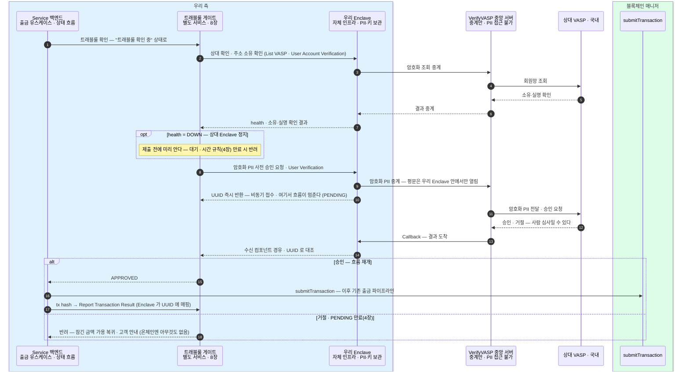

- 멈춤과 재개의 열쇠가 **UUID** 다 — 접수 때 저장하고, Callback 이 오면 그걸로 어느 출금인지 찾는다. 출금 쪽에서도 수신 사슬(Callback) 없이는 완결이 안 된다.
- 상대 확인(List VASP)은 health 사전 점검을 겸한다 — 상대가 죽어 있으면 헛요청 없이 대기로 간다.
- **우리 Enclave vs 중앙** — 암호화·키·PII 는 우리 Enclave 안에 있고, 중앙 서버는 암호화 메시지를 상대에게 나르는 중계만 한다. 그래서 중앙은 경로에 있어도 PII 를 못 본다.
- **상대가 CODE 회원(빗썸 등)이면** — List VASP 가 `protocol:CODE · vaspStatus:INTEROPERATED` 로 반환하고 VerifyVASP↔CODE 상호연동이 프로토콜 차이를 흡수한다. **우리 흐름은 위와 동일**(CODE 코드 0줄). 단 원화 임계·TXID 역추적이 경유 경로에서 되는지 확인(6장) — 안 되면 CODE 직접(7.10). 상세 시퀀스는 부록 A(11장).

## 7.2 출금 → 해외 (Notabene · Fireblocks) — 벤더가 스크리닝, 우리는 동봉

로컬 판별로 대상 여부를 가른 뒤, 대상이면 암호화 정보를 거래에 실어 벤더에 넘긴다. 왕복·대기가 없어 "트래블룰 확인 중"을 즉시 통과한다. 여기엔 우리 Enclave 가 없다 — 스크리닝은 **벤더(Fireblocks·Notabene) 안**에서 끝나고, Fireblocks 는 복호화 키를 갖지 않는다.

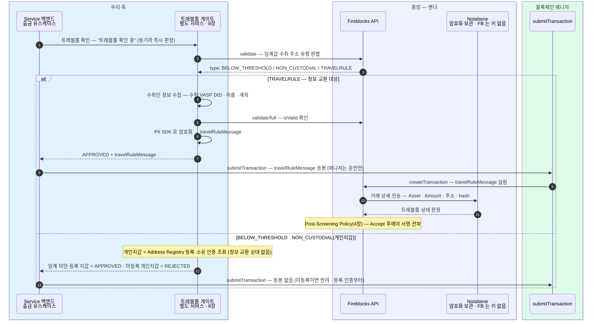

- 스크리닝은 **서명 앞에 놓인 벤더 게이트**다 — `createTransaction` 으로 넘어간 거래를 Fireblocks 가 Notabene 로 보내 판정받고, Accept 로 떨어져야 서명이 진행된다.
- `travelRuleMessage` 동봉은 **우리 게이트의 책임**이다 — 안 실리면 Notabene 가 판정할 대상이 없어 게이트가 그대로 열린다. Outbound delay 기본 0초.
- **우리 측 vs 중앙(벤더)** — 대상 판별·수취인 수집·암호화까지는 우리 게이트, 실제 스크리닝·판정은 벤더 안. VerifyVASP 와 달리 자체 Enclave 로 나눌 것이 없고, 국내와 다른 세 칸은 **확인 방식**(동기)·**동봉물**(travelRuleMessage)·**사후 보고 없음**(벤더가 이미 안다)이다.

## 7.3 입금 ← 국내 (VerifyVASP) — 자금보다 정보가 먼저 온다

요청-응답형이다 — 자금이 오기 전에 우리 수신 사슬이 먼저 응답하고, 그 기록(대기함)이 도착 후 판별(7.5)의 대조 재료가 된다. 인바운드 사슬은 **중앙 서버 → 우리 Enclave → 수신 컴포넌트 → 트래블룰 서비스 → 월렛 백엔드(귀속 확인·대기함 적재)** 다(8장).

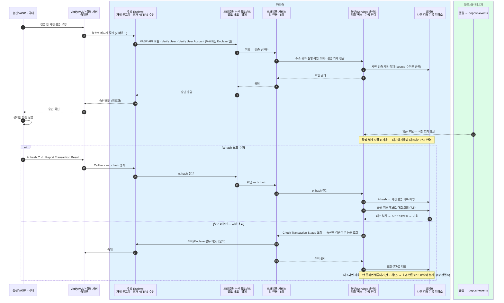

- 승인이 나야 상대가 온체인 전송을 실행한다 — 수신 사슬(**우리 Enclave → 수신 컴포넌트 → 트래블룰 서비스 → 월렛 백엔드**)이 응답을 못 하면 국내 입금 자체가 막히므로, 이 사슬의 가용성이 곧 입금 가용성이다.
- **수신 컴포넌트는 별도 배포**다 — 트래블룰 서비스의 인바운드 접점. 얇게: 검증·변환만 하고 트래블룰 서비스로 위임하며, 매칭·귀속 판단과 대기함은 월렛 백엔드다(8장).
- **우리 Enclave vs 중앙** — 공개 HTTPS 를 받는 것은 우리 Enclave(벤더 요건)이고 복호화도 여기서 한다. 중앙 서버는 송신측과 우리 Enclave 사이를 중계만 한다.
- **CODE 회원(빗썸 등) 발 입금**도 상호연동으로 VerifyVASP 인바운드로 도착한다 — 위 흐름 동일. 미확인 입금의 TXID 역추적이 경유 경로에서 되는지는 6장 상호연동 실효 확인 대상(안 되면 CODE 직접 7.11). 상세 시퀀스는 부록 A(11장).

## 7.4 입금 ← 해외 (Notabene · Fireblocks) — 벤더주도, 우리는 폴링만

입금 쪽 트래블룰에는 우리 코드가 없다 — Fireblocks 와 Notabene 가 감지·스크리닝·판정·조치를 벤더 안에서 끝내고, 우리는 폴링으로 결과 상태만 받는다. 동결 건은 REJECTED 계열로 나타나 기존 입금 파이프라인이 그대로 흡수한다.

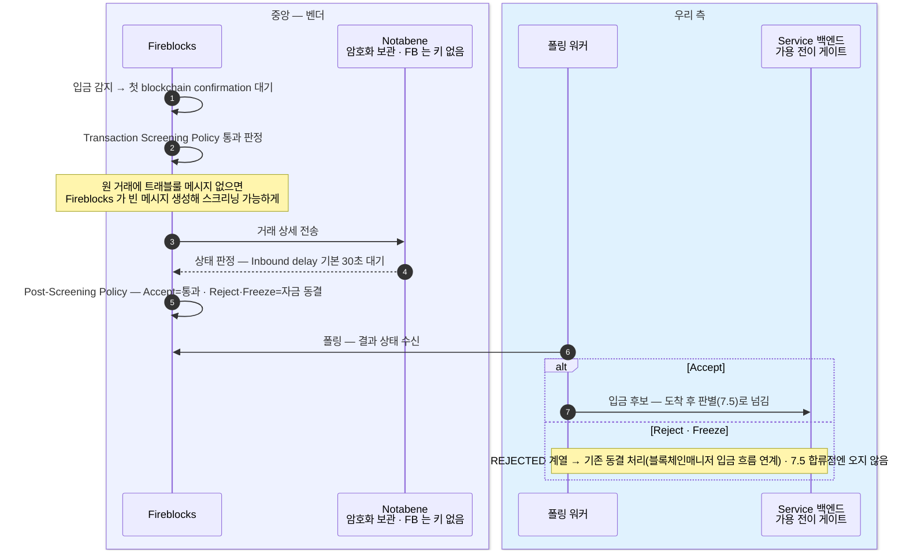

- **벤더주도** — 감지·스크리닝·판정·조치가 벤더 안에서 끝나고, 우리 폴링 워커는 결과 상태만 받는다. VerifyVASP 입금(7.3)처럼 우리 수신 사슬이 먼저 응답하는 왕복이 없다.
- **동결 = REJECTED 계열** — 잔액 미반영·락업, 해제는 Admin unfreeze 운영으로만. 감지·동결·Admin unfreeze 는 이미 블록체인매니저 설계의 입금 흐름이 갖춘 경로이므로 새 코드가 없다.
- **시간 규칙** — Inbound delay(기본 30초) 안에 판정이 안 나면 기본 설정은 통과(자금 방출). 이 기본값·방출 규칙은 4장.

## 7.5 입금 — 도착 후 판별, 합류점 하나

국내(7.3)와 해외(7.4)의 입금이 도착한 뒤 여기서 만난다. 확정 임계에 도달한 후보를 판별해 가용 전이 여부를 가른다.

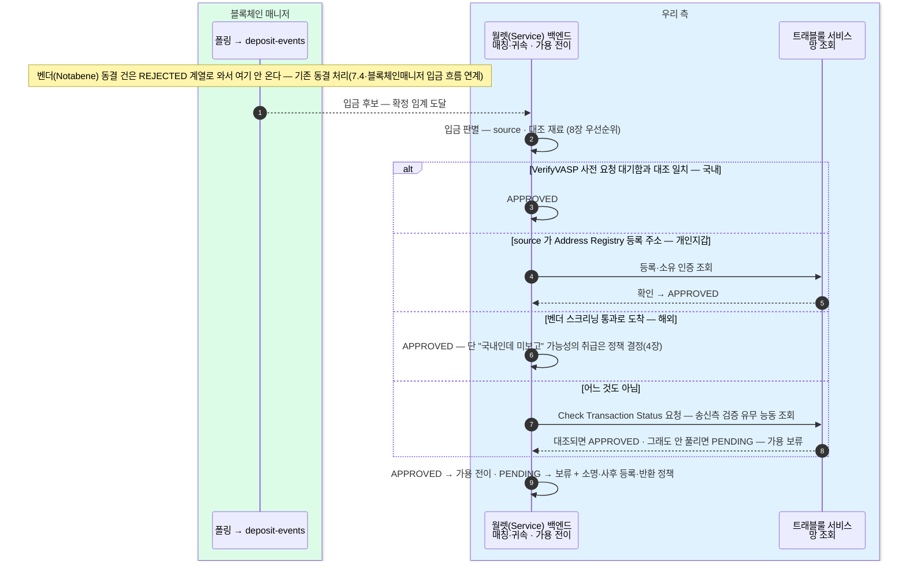

- 가용 전이 조건은 하나다 — **확정 임계 도달 AND 판별 APPROVED**(8장). 기본값은 보류로, 명시적으로 확인된 것만 가용에 보낸다.
- 판별 우선순위·정책 결정 지점(벤더 통과를 어디까지 믿나)의 정본은 8장 입금 합류점.
- 미등록 개인지갑 입금의 사후 처리(등록 유도·소명·반환)는 자체 정책 설계 대상이다 — 개인지갑 입금 흐름은 7.9.
- **설정 제공자로 도달 못 하는 상대**(예: Notabene 미브릿지 GTR 단독 — Sumsub 등 추가로 닫힘, 6장) 발 입금은 대조 채널이 없어 "어느 것도 아님" 분기에서 PENDING 으로 떨어진다 — 개념 5장의 미연동 사업자 발 입금대기(잔고 차단)와 같은 자리다. 출금은 앞단에서 차단되지만(6장 게이트) 입금은 자금이 이미 도착해 막을 수 없으므로 여기서 보류된다.

## 대안 — Fireblocks 미경유, Notabene 직접

Fireblocks 는 커스터디·서명으로만 남기고 트래블룰 게이트가 Notabene SaaS 를 직접 호출하는 경우다. 게이트가 **벤더 안(제출 뒤 스크리닝)에서 우리 게이트 앞단(제출 전 판정)으로 이동**하는 것이 핵심 차이다 — 모양은 벤더주도(7.2·7.4)가 아니라 VerifyVASP 게이트주도(7.1·7.3)에 가깝고, 다만 Enclave 가 없어 상대와의 교환·보관을 Notabene SaaS 가 맡는다. (Notabene 직접 API 의 정확한 명세·호출명은 확인 필요 — 아래는 능력 단위로만 그린다.)

## 7.6 출금 → 해외 (Notabene 직접) — 제출 전 우리 게이트가 판정

7.2 는 `createTransaction` 으로 넘긴 뒤 벤더가 스크리닝했지만, 여기선 **제출 전에** 우리 게이트가 Notabene 를 직접 호출해 판정받고, 통과해야 매니저로 제출한다. "사전 대조 후 전파"다.

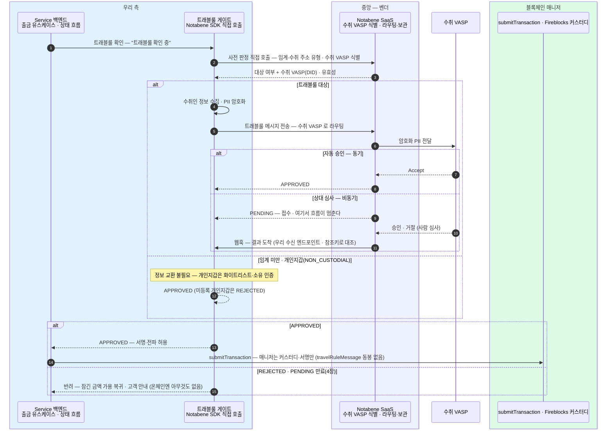

- **게이트가 서명 앞단으로 이동** — 7.2 의 `validate`·`createTransaction` 동봉·Post-Screening 경로가 사라지고, 우리 게이트가 Notabene 직접 판정 → APPROVED 여야 매니저 제출. Fireblocks 는 커스터디·서명만 한다.
- **스크리닝 우회 방지 책임이 온전히 우리 것** — 벤더가 빈 메시지를 만들어 주지 않으므로, 대상 판별·메시지 전송 누락이 곧 트래블룰 누락이 된다.
- **상대 심사면 비동기** — 7.1 VerifyVASP 처럼 수신 웹훅과 PENDING 중단·재개가 필요하다. 벤더주도(7.2) 대비 늘어나는 운영 부담이 여기 있다.

## 7.7 입금 ← 해외 (Notabene 직접) — 확정은 매니저, 대조는 월렛 백엔드

7.4 는 벤더가 감지·동결까지 했지만, 여기선 **벤더가 동결해 주지 않는다**. 온체인 확정은 블록체인 매니저가, 통지 수신·망 조회는 트래블룰 서비스가, 대조·입금대기(잔고 차단)는 월렛 백엔드가 맡는다.

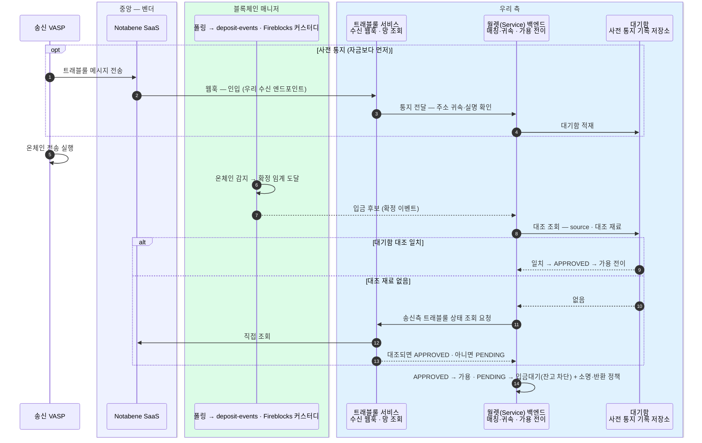

- **동결 주체가 바뀐다** — 7.4 는 Notabene·Fireblocks 가 동결해 REJECTED 계열로 넘겨줬지만, 여기선 벤더 동결이 없으므로 **입금대기(잔고 차단)가 우리 자체 상태**다. 개념 5장(입금 실무)의 입금대기·강제 반환 경로를 우리가 직접 운영한다.
- **수신 웹훅이 필요** — 7.3 VerifyVASP 의 수신 컴포넌트와 같은 역할이되 Enclave 는 없다(Notabene SaaS 보관). 사전 통지가 자금보다 먼저 오면 대기함이 도착 후 대조 재료가 된다.
- **합류점(7.5)과의 관계** — 7.5 의 "벤더 스크리닝 통과로 도착" 분기가 여기선 "Notabene 직접 조회로 대조" 분기로 바뀐다. 나머지 판별·가용 전이 규칙은 8장 그대로.

## 7.8 출금 → 개인지갑(자기수탁) — 등록·소유 인증만

여기부터는 다시 **확정 흐름**이다(위 대안 절과 무관). 상대가 VASP 가 아니라 이용자 본인의 자기수탁 지갑이다. 주고받을 상대가 없으니 IVMS101 교환 대신 **화이트리스트(Address Registry) 등록·소유 인증**으로 가른다. 로컬 확인이라 "트래블룰 확인 중"을 즉시 통과한다.

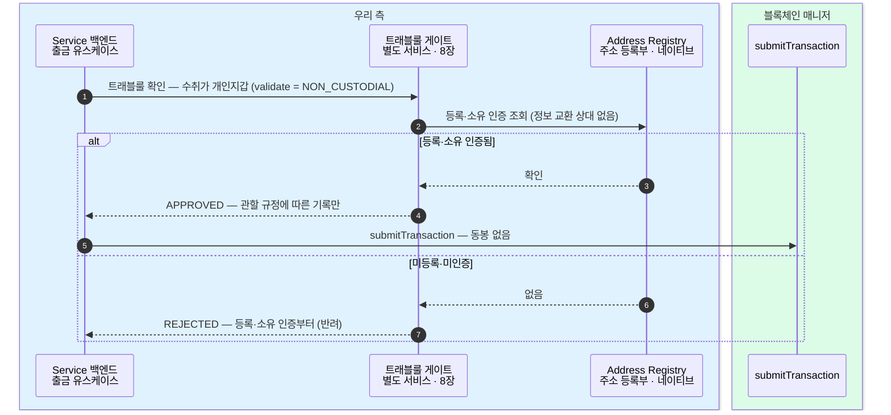

- **정보 교환이 없다** — 수취인이 VASP 가 아니라 IVMS101 을 주고받을 상대가 없다. 관할권 규정에 따라 기록만 남긴다.
- **VerifyVASP 는 개인지갑 미지원**(6장)이라, 개인지갑 상대는 망과 무관하게 이 Address Registry 통제로만 처리한다.
- 7.2·7.6 의 `NON_CUSTODIAL` 분기가 이 흐름을 가리킨다 — 여기서 단독으로 펼친다.

## 7.9 입금 ← 개인지갑(자기수탁) — source 가 등록 주소인가

입금도 대칭이다. 도착한 자금의 source 주소가 이용자가 사전 등록·소유 인증한 본인 지갑이면 곧바로 가용, 아니면 입금대기로 묶는다.

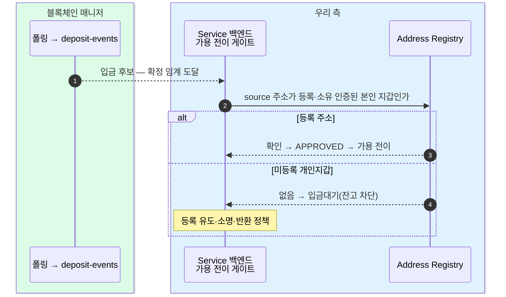

- 7.5 합류점의 "source 가 Address Registry 등록 주소 → 개인지갑 APPROVED" 분기를 단독으로 펼친 것이다.
- 미등록 개인지갑 발은 입금대기 → 등록 유도·소명·반환(자체 정책, 개념 5장). 이 사후 처리 설계는 6장이 "별도 통제 필요"라고 짚은 자리다.

## 7.10 출금 → 국내 CODE (직접 연동) — 동기 사전 승인

국내 CODE 회원(빗썸·코인원·코빗) 상대다. 기본 도달은 VerifyVASP↔CODE 상호연동 경유(6장)지만, 상호연동 실효가 부족하면 CODE 직접 어댑터를 붙인다 — 이 절이 그 직접 흐름이다. 사전 승인이 **동기**라 VerifyVASP(7.1)의 비동기 왕복이 없다.

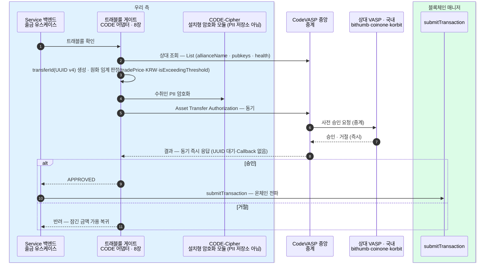

- **동기 사전 승인** — Asset Transfer Authorization 이 즉시 응답. VerifyVASP 의 UUID·Callback·중단재개(7.1)가 없어 "트래블룰 확인 중"을 바로 통과하고, 어댑터가 더 단순하다(8장).
- **Enclave 대신 CODE-Cipher** — 설치형 암호화 모듈이되 키·PII 저장소는 아니다. VerifyVASP Enclave 보다 운영 부담이 가볍다.
- **원화 임계 직접 지원**(tradePrice·KRW·isExceedingThreshold) · **transferId 는 우리가 생성**(UUID v4).
- 기본 경로는 상호연동 경유라, 이 직접 흐름은 6장 "상호연동 실효 부족 시" 대안이다.

## 7.11 입금 ← 국내 CODE (직접 연동) — 미확인은 TXID 역추적

입금도 동기 요청-응답이다. 자금 전 사전 승인을 받아 대기함에 쌓고, 도착 후 7.5 합류점에서 대조한다. 대조 재료가 없으면 TXID 로 역추적한다.

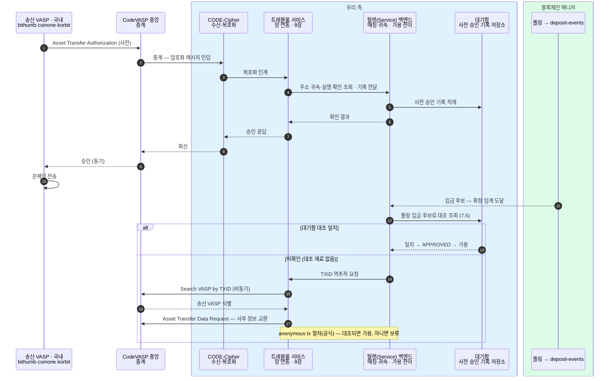

- **요청-응답(동기)** — 사전 승인을 받고 대기함 적재, 도착 후 7.5 합류점에서 대조. VerifyVASP 입금(7.3)과 같은 자리로 합류한다.
- **미확인 입금 역추적** — 대조 재료가 없으면 Search VASP by TXID(비동기) → Asset Transfer Data Request 로 사후 정보 교환. 공식화된 anonymous tx 절차이며, VerifyVASP 의 Check Transaction Status(7.3)에 대응한다.
- **포트-어댑터(8장) 관점** — CODE 는 동기라 어댑터 1개 추가로 끝난다(유스케이스·매니저 포트 0줄). "다 해야 하는" 최악(VerifyVASP+CODE+Notabene)에도 어댑터만 는다.
