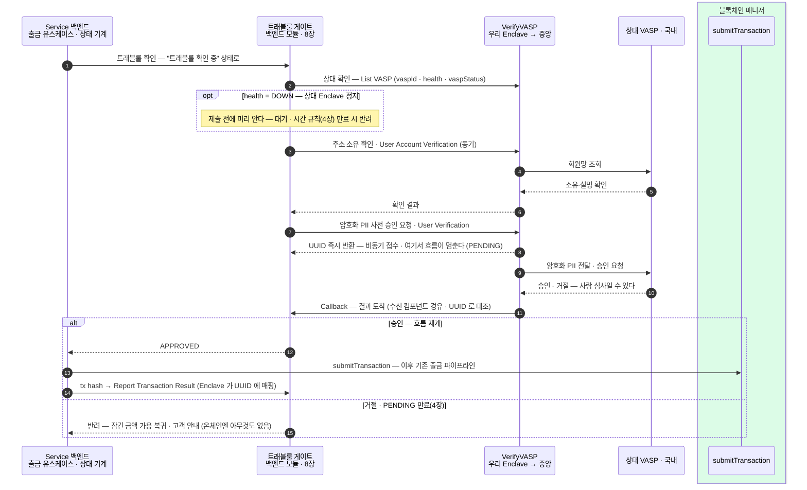
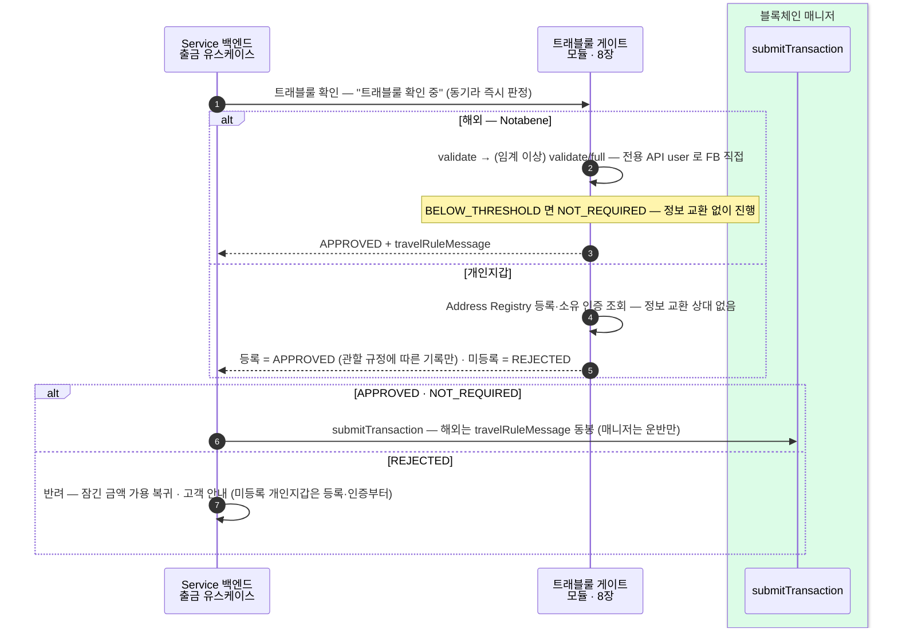
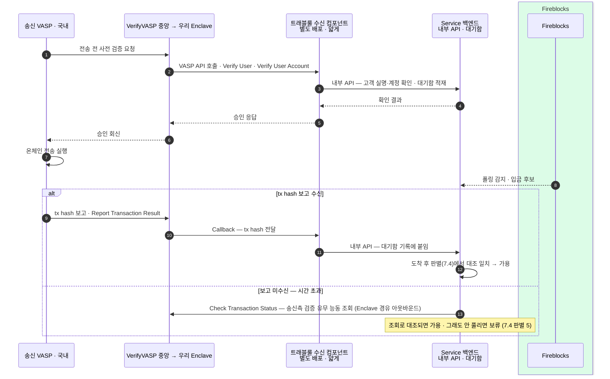
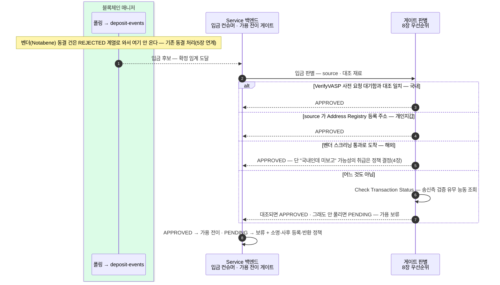

국내·해외·개인지갑 × 출금·입금의 여섯 갈래를 8장 공통 단계 위에서 넷으로 접는다.
나누는 기준은 하나다 — **채널 밖 행위자와의 왕복이 흐름의 본체면 따로 그리고, 로컬 확인이면 접는다**. 국내(VerifyVASP)는 출금·입금 모두 상대 VASP 와의 왕복·비동기가 본체라 따로, 해외·개인지갑은 로컬 동기 확인이라 접는다.

## 7.1 출금 → 국내 (VerifyVASP) — 사전 허가 왕복, 비동기 중단·재개

상대 VASP 의 승인이 나야 제출한다. 접수는 즉시(UUID), 결과는 우리 수신 API 로 돌아오는 **비동기 중단·재개**가 이 흐름의 본체다.

- 멈춤과 재개의 열쇠가 **UUID** 다 — 접수 때 저장하고, Callback 이 오면 그걸로 어느 출금인지 찾는다. 출금 쪽에서도 수신 API(Callback) 없이는 완결이 안 된다.
- 상대 확인(List VASP)은 health 사전 점검을 겸한다 — 상대가 죽어 있으면 헛요청 없이 대기로 간다.

## 7.2 출금 — 동기 채널 (해외 Notabene · 개인지갑)

로컬 확인으로 끝나 왕복·대기가 없다 — "트래블룰 확인 중" 상태를 즉시 통과한다.

채널이 갈라 놓는 것은 세 칸뿐이다 — **확인 방식**(비동기/동기), **동봉물**(해외만), **사후 보고**(국내만). 상태 전이·제출·반려 처리는 7.1 과 동일하다.

## 7.3 입금 ← 국내 (VerifyVASP) — 자금보다 정보가 먼저 온다

요청-응답형이다 — 자금이 오기 전에 우리 수신 API 가 먼저 응답하고, 그 기록(대기함)이 도착 후 판별(7.4)의 대조 재료가 된다.

- 승인이 나야 상대가 온체인 전송을 실행한다 — 수신 사슬(Enclave → 수신 컴포넌트 → 백엔드 내부 API)이 응답을 못 하면 국내 입금 자체가 막히므로, 이 사슬의 가용성이 곧 입금 가용성이다.
- **수신 컴포넌트는 별도 배포**다 — 기관 간 콜백 트래픽을 고객용 Service 백엔드와 분리(장애 격리·배포 주기). 단 얇게: 검증·변환만 하고 판단·적재는 백엔드 내부 API 로 위임한다(8장).

## 7.4 입금 — 도착 후 판별, 합류점 하나

- 가용 전이 조건은 하나다 — **확정 임계 도달 AND 판별 APPROVED**(8장). 기본값은 보류로, 명시적으로 확인된 것만 가용에 보낸다.
- 판별 우선순위·정책 결정 지점(벤더 통과를 어디까지 믿나)의 정본은 8장 입금 합류점.
- 미등록 개인지갑 입금의 사후 처리(등록 유도·소명·반환)는 자체 정책 설계 대상이다.
