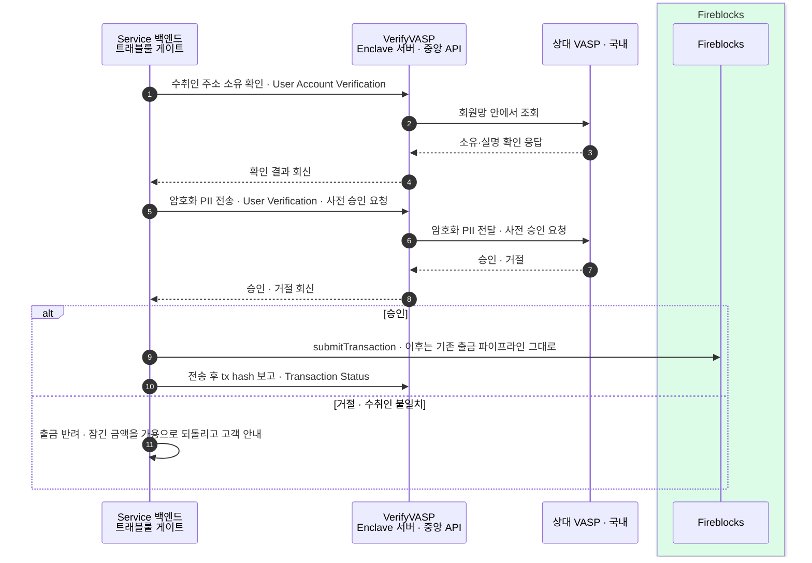
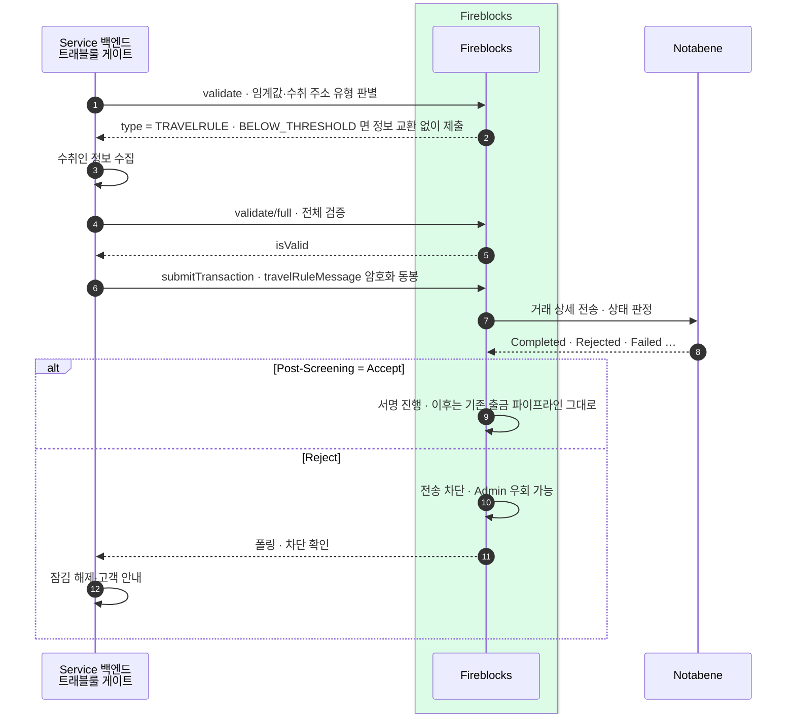
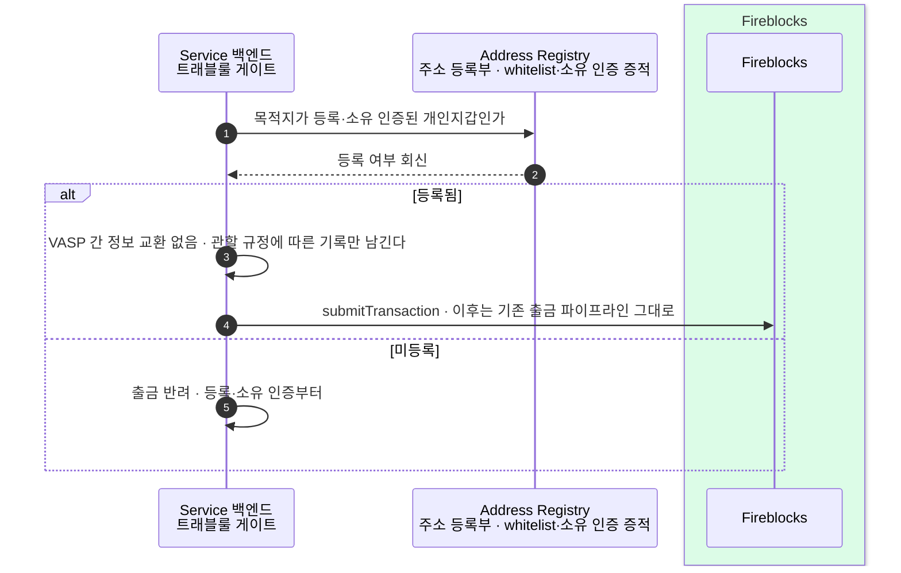
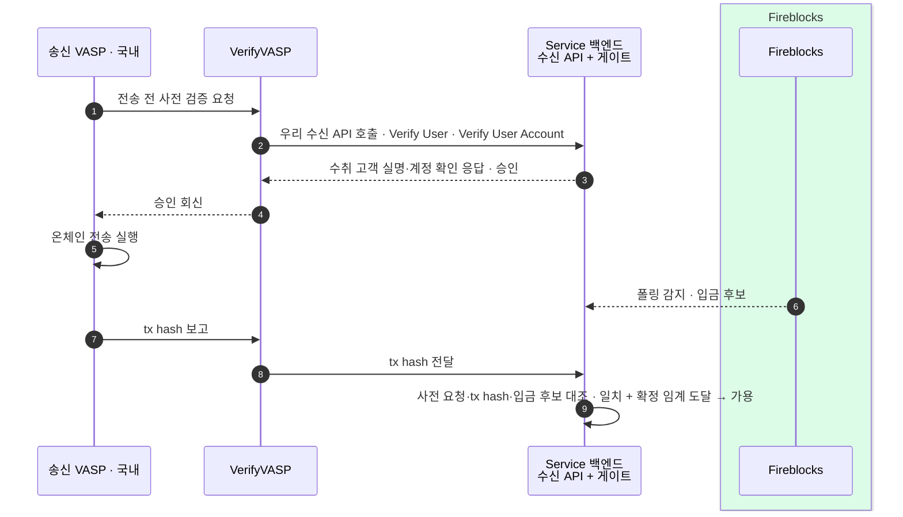
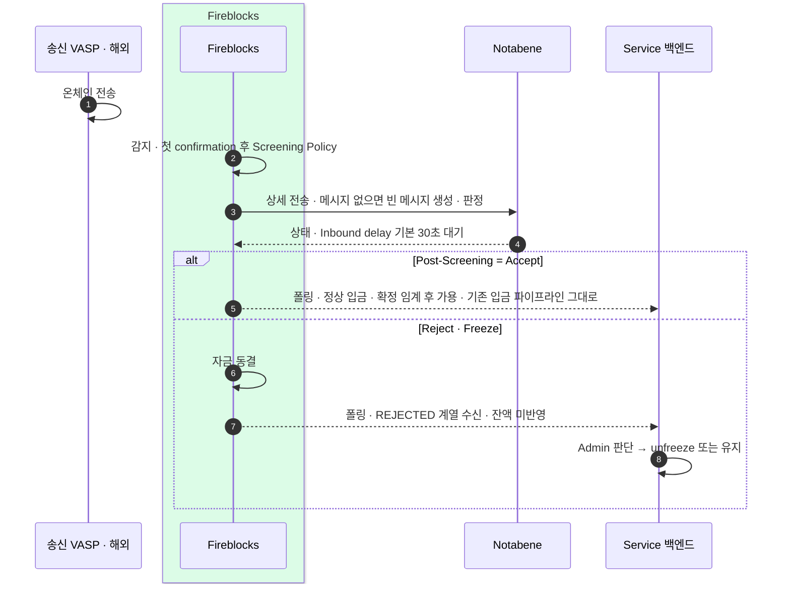
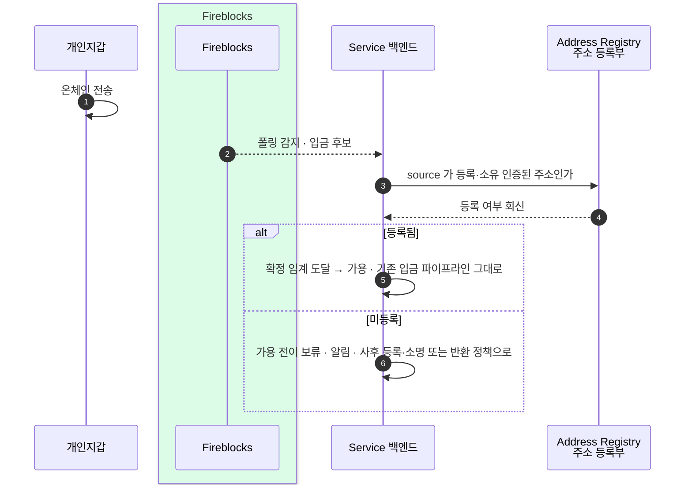

출금 셋(국내·해외·개인지갑) × 입금 셋 — 병행 구성에서 실제로 지나가는 길 전부를 시퀀스로 옮긴다.
국내는 VerifyVASP, 해외는 Notabene 으로 병행하는 구성에서 한 건이 어떤 관문을 어떤 순서로 지나는지, 승인·거절·미등록 갈래까지 여섯 그림에 담는다.

게이트를 어디 두는지·병행 구성 자체는 6장, 출금/입금에서 각 벤더가 실제로 무슨 호출을 하는지는 2·3장에서 다뤘다. 이 장은 그 조각들을 실제 한 건의 흐름으로 이어 붙인다. VASP(가상자산사업자) 간에 정보가 오가는 경로가 벤더마다 다르므로, 같은 "출금"이라도 상대가 국내냐 해외냐 개인지갑이냐에 따라 지나는 길이 완전히 갈린다.

## 7.1 출금 → 국내 VASP (VerifyVASP)

사전 허가형이다 — 상대의 승인 회신(8)이 나야 비로소 `submitTransaction` 을 제출한다. 흐름은 두 단으로 나뉜다: 먼저 수취인(beneficiary) 주소가 상대 VASP 의 실제 고객 소유인지 확인하고(1~4), 그다음 암호화된 PII 를 실어 사전 승인을 받는다(5~8). 거절이나 수취인 불일치면 온체인에는 아무것도 나가지 않으므로, 되돌릴 것은 원장의 잠김뿐이다 — 잠긴 금액을 가용으로 복귀시키고 고객에게 사유를 안내한다.

## 7.2 출금 → 해외 VASP (Notabene)

벤더 게이트형이다 — 검증(1·4~5)과 `travelRuleMessage` 동봉(6)은 우리가 하지만, 판정 후 조치(9~)는 Notabene 의 Post-Screening Policy 가 한다. 첫 `validate` 가 `BELOW_THRESHOLD` 를 돌려주면 정보 교환 없이 곧장 제출로 간다. 임계 이상이면 수취인 정보를 모아 `validate/full` 로 전체 검증을 통과시킨 뒤 `submitTransaction` 에 암호화 메시지를 실어 보낸다. 이후 FB→NB 판정에서 Accept 가 나야 서명이 진행되고, Reject 면 전송이 차단된다(Admin 우회는 가능) — 차단은 폴링으로 확인해 잠김을 풀고 고객에게 안내한다.

## 7.3 출금 → 개인지갑 (non-custodial)

두 망(국내 VerifyVASP·해외 Notabene) 모두 개인지갑을 다루지 않으므로 — VerifyVASP 는 미지원을 명시한다 — 방어선은 우리 Address Registry(주소 등록부)다. 목적지가 등록되고 소유 인증까지 끝난 개인지갑이면, VASP 간에 주고받을 상대가 없으니 정보 교환 없이 관할 규정에 따른 기록만 남기고 제출한다. 미등록이면 반려하고 등록·소유 인증부터 요구한다. 등록 시점의 소유 인증(지갑 서명)이 곧 증적이 된다 — 등록·인증 절차 자체는 별도 설계 대상이다.

## 7.4 입금 ← 국내 VASP (VerifyVASP)

요청-응답형이다 — 자금이 오기 전에 우리 수신 API 가 먼저 응답한다(2~3). 송신 VASP 가 전송에 앞서 사전 검증을 요청하면 VerifyVASP 가 우리 수신 API 를 호출하고, 우리는 수취 고객의 실명·계정을 확인해 승인을 돌려준다. 그 승인이 나야 상대가 온체인 전송을 실행한다. 이후 우리 폴링이 입금 후보를 감지하고, 상대가 보고한 tx hash 가 VerifyVASP 를 거쳐 전달된다. 가용 전이는 "온체인 확정 임계 도달 + 사전 요청과의 대조 일치" 둘 다 충족해야 한다 — 대조 실패나 보고 미수신의 처리 기준은 자체 정책 설계 대상이다.

## 7.5 입금 ← 해외 VASP (Notabene)

벤더 안에서 끝나는 형이다 — 우리 코드는 개입하지 않고, 결과가 폴링 상태로만 나타난다. 송신 VASP 의 온체인 전송을 Fireblocks 가 감지해 첫 confirmation 후 Transaction Screening Policy 를 돌리고, FB→NB 로 상세를 넘겨 판정한다(메시지가 없으면 빈 메시지를 만들며, Inbound delay 는 기본 30초). Post-Screening 이 Accept 면 확정 임계 후 가용으로, Reject·Freeze 면 자금이 동결되고 폴링에 REJECTED 계열이 잡혀 잔액에 반영되지 않는다 — 이후는 Admin 이 unfreeze 할지 유지할지 판단한다. 기존 입금 파이프라인(감지·동결·Admin unfreeze)이 이 흐름을 그대로 흡수한다.

## 7.6 입금 ← 개인지갑

망 밖에서 오는 유일한 길이다 — 개인지갑이 온체인으로 보내면 우리 폴링이 입금 후보로 감지한다. 판별 재료가 송금인(originator) 쪽 source 주소뿐이라, Address Registry(주소 등록부)의 소유 인증 증적이 곧 인정 기준이 된다. source 가 등록·소유 인증된 주소면 확정 임계 도달 후 가용으로 전이하고, 미등록이면 가용 전이를 보류한 채 알림을 띄운다. 미등록 입금의 사후 처리(등록 유도·소명·반환)는 자체 정책 설계 대상이다.
