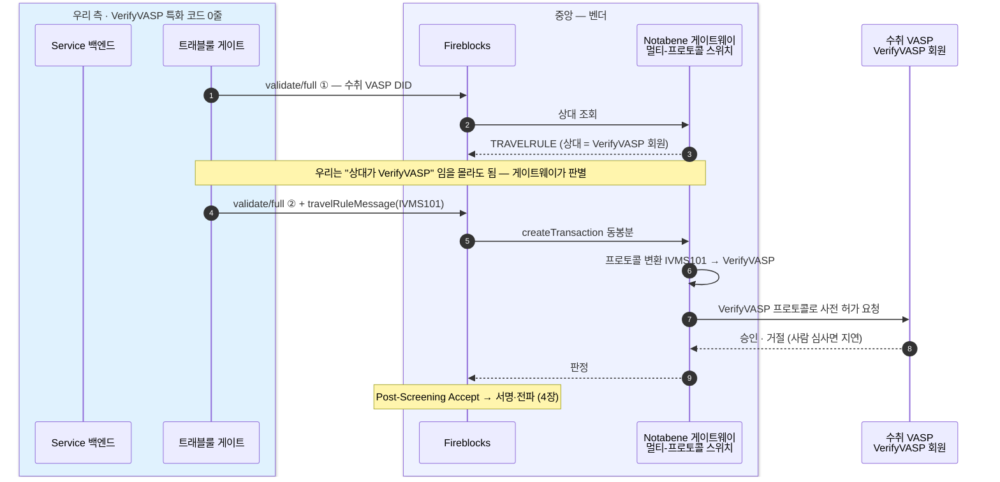
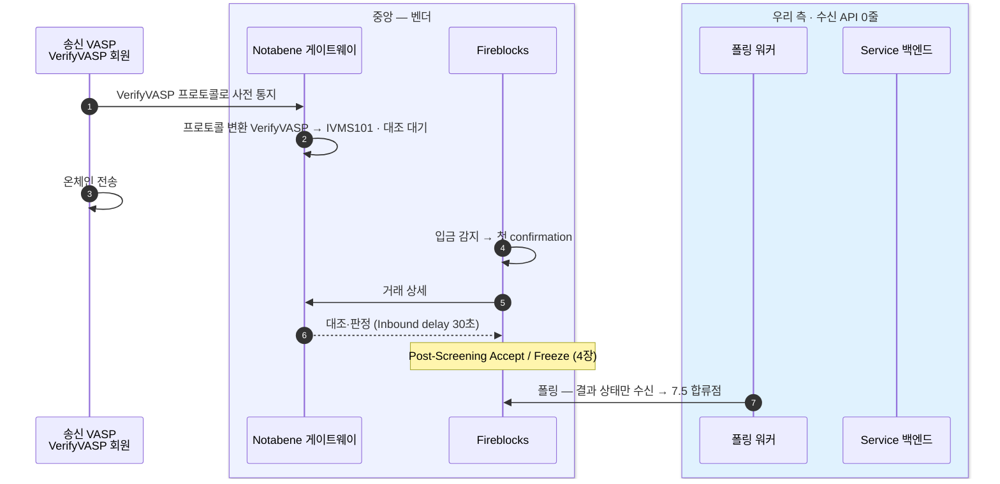

VerifyVASP 회원(국내 거래소)에 **자체 Enclave 없이 Notabene 게이트웨이로 우회 도달**할 수 있는지를 검증하는 후보다. 확정 설계가 아니라 검증 대상이며, **Notabene 의 VerifyVASP 라이브 지원 여부 자체가 공개 자료로 확정되지 않는다** — 벤더 확인이 선결이다.
검증에 통과하면 6장이 택한 국내 직접 연동(자체 Enclave·수신 컴포넌트)을 덜거나 없앨 수 있다 — 모든 상대가 해외 벤더주도 흐름(7.2/7.4) 한 벌로 처리되기 때문이다.

## 무엇을 검증하나 — 그리고 현재 상태

Notabene 게이트웨이(SafeGateway)는 **멀티-프로토콜 스위치**로 "프로토콜 계층을 추상화해 어떤 프로토콜을 쓰는 VASP 와도 트래블룰 데이터를 주고받는다"고 밝힌다([SafeGateway](https://notabene.id/solutions/safe-gateway)). 이게 참이면 **Fireblocks + Notabene 한 세트로 VerifyVASP 회원까지 도달**한다 — 우리 코드 관점엔 7.2/7.4(해외 벤더주도)와 동일하고, 자체 Enclave·수신 API·VerifyVASP 어댑터가 **0**이다. 그게 이 후보의 매력이다.

**라이브 여부는 도입 전 벤더 확인이 필요하다:**

- Notabene 은 VerifyVASP 를 **게이트웨이 지원 대상 프로토콜로 지목**하지만, **현재 라이브 통합 여부는 공개 자료로 확정 불가**다.
- VerifyVASP 는 폐쇄형이라 Notabene 통합에 **소스 보안 검토**가 걸린다(공개 페이지 기준). 통합에 수개월이 드는 게 통례.
- 따라서 이 장의 흐름은 **라이브 확인 전까지 미가용으로 간주**하고, 라이브 여부·도달 범위를 **벤더 확인으로 확정**해야 하는 검증 대상이다.

아래 흐름은 통합이 라이브라는 전제가 충족됐을 때의 그림이다.

## 출금 흐름 — VerifyVASP 회원에게 (게이트웨이 경유)

우리 게이트는 `validate/full` 판별 → 완전 검증 → `travelRuleMessage` 동봉까지 7.2 그대로 하고, 그 뒤 **프로토콜 변환·상대 통신은 게이트웨이가 삼킨다**. 7.2 와 유일하게 다른 건 회색 박스 안이고, 우리 코드에는 그 차이가 보이지 않는다.

## 입금 흐름 — VerifyVASP 회원에게서 (게이트웨이 경유)

7.3(직접 연동 입금)이 요구하던 **우리 수신 사슬(Enclave → 수신 컴포넌트 → 컴플라이언스 서비스)이 사라지고**, 7.4 처럼 폴링으로 결과만 받는다. 송신측의 VerifyVASP 사전 통지는 게이트웨이가 받아 대조 재료로 삼는다.

## 직접 연동(7.1/7.3)과의 대비

| | 게이트웨이 경유 (이 장) | 직접 연동 (7.1/7.3 · 6장 경로 B) |
|---|---|---|
| 우리 인프라 | 없음 — Fireblocks+Notabene 만 | 자체 Enclave · 수신 컴포넌트 |
| VerifyVASP 특화 코드 | 0줄 (게이트웨이가 흡수) | 어댑터 + 수신 API |
| 흐름 성격 | 벤더주도 (7.2/7.4와 동일) | 게이트주도 (사전 허가 왕복·비동기 상태) |
| 우리 코드 관점 | 해외 흐름과 구분 안 됨 | 국내 전용 상태·수신 사슬 |
| 키·PII 보관 | Notabene SaaS | 우리 Enclave |

## 검증 체크리스트

회색 박스 안이 실제로 도는지를 벤더 확인 + 테스트 거래로 검증한다.

- **① 라이브 지원 여부(선결)** — Notabene 의 VerifyVASP 통합이 실제 라이브인지 **벤더 확인**부터. 라이브 확인 후 **한국 VerifyVASP 회원(예: 업비트)까지 실제로 닿는지** 별도 확인(목록 등재 ≠ 도달).
- **② 승인 왕복 정합** — VerifyVASP 는 송신측이 자금 전 우리 승인을 기다리는 왕복이다. 이 핸드셰이크가 게이트웨이 경유로 온전히 오가나 — **특히 입금 방향**.
- **③ 시간 규칙 충돌** — VerifyVASP 승인이 사람 심사로 늘어질 때 Fireblocks **Outbound delay(최대 90분, 4장)** 안에 끝나나. 초과 시 처리.
- **④ 기능 손실** — 원화 임계 판정, 미확인 입금 역추적(Check Transaction Status 상당)이 게이트웨이 경유로 되나(6장 CODE/VerifyVASP 전용 기능 표).
- **⑤ 검증 방법** — 벤더(Notabene·Fireblocks) CSM 확인 + Notabene RoboVASPs·실제 국내 회원 상대 테스트 거래.

## 검증 결과에 따른 분기

- **라이브 확인 전** → 국내는 **6장 직접 연동을 기준**으로 둔다(게이트웨이 경유는 미확정이라 의존하지 않는다).
- **라이브·검증 통과 시** → 국내 직접 연동(자체 Enclave·수신 컴포넌트, 6장 경로 B)을 제거·축소. 국내·해외가 7.2/7.4 한 벌로 합쳐진다.
- **실패·부분** → 6장 직접 연동(자체 Enclave)을 유지. GTR 단독처럼 게이트웨이가 못 닿는 상대는 도달 불가 분기(6장 게이트)로 남는다.

## 이 페이지의 출처

- **주장·상태** — Notabene [SafeGateway](https://notabene.id/solutions/safe-gateway)(공개 웹). 라이브 상태는 벤더 확인 필요.
- **흐름** — 위 주장을 우리 스택(7.2/7.4)에 대입한 **설계 판단**. 회색 박스 내부 동작은 미검증.
- **미확정** — ①~④ 는 벤더 확인 전까지 확정 아님. 14장 문의 목록의 "게이트웨이 경유 VerifyVASP 도달"과 같은 항목이다.
