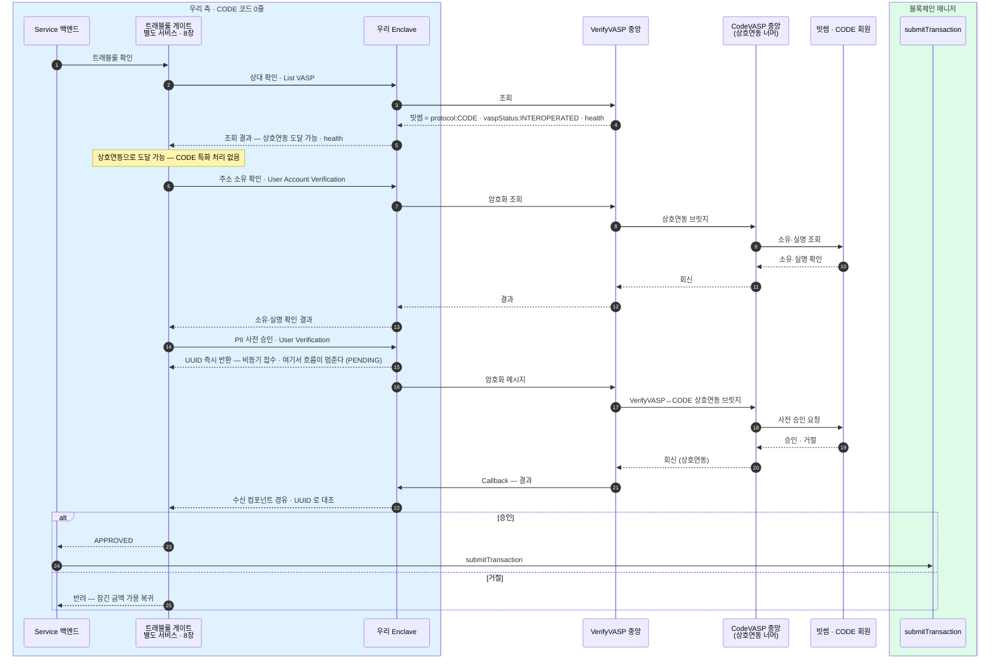
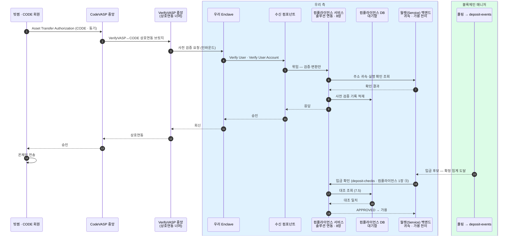

우리가 **VerifyVASP 를 연동**했을 때(6장 경로 B), 국내 상대가 VerifyVASP 회원이냐 CODE 회원(빗썸·코인원·코빗)이냐에 따라 흐름을 한자리에 모은다.
두 솔루션은 2022-04-25 상호연동 완료라, CODE 회원에게도 **우리 VerifyVASP 하나로 도달**한다 — 우리 코드 관점에선 상대가 어느 솔루션이든 동일하고, 차이는 VerifyVASP 중앙 서버 **너머**의 상호연동이 흡수한다.

## 조합 매트릭스

| 우리 | 상대 | 출금 | 입금 |
|---|---|---|---|
| VerifyVASP | VerifyVASP 회원 | 7.1 (직접) | 7.3 (직접) |
| VerifyVASP | CODE 회원(빗썸) | **A.1** (상호연동 경유) | **A.2** (상호연동 경유) |
| (대안) CODE 직접 | CODE 회원 | 7.10 | 7.11 |

- **위 두 행의 네 칸(출금·입금 × 상대 솔루션) 모두 우리 코드는 VerifyVASP 흐름(7.1/7.3)과 같다.** CODE 상대는 List VASP 가 `protocol:CODE · vaspStatus:INTEROPERATED` 로 반환하고, 상호연동이 프로토콜 차이를 삼킨다.
- CODE 직접(7.10/7.11)은 **상호연동 실효가 부족할 때만** 붙이는 대안이다(아래 "확인할 것").

## A.1 출금 → 빗썸(CODE), 우리는 VerifyVASP — 상호연동 경유

우리 쪽은 7.1(VerifyVASP 출금)과 동일하다 — `List VASP` → `User Account Verification`(주소 소유 확인) → `User Verification`(PII 사전 승인, 비동기 UUID) → Callback. 소유 확인·사전 승인 **둘 다 상호연동 브릿지(`HUB → CV`)를 왕복**하고, 빗썸이 CODE 라는 사실은 그 뒤에 있어 우리 코드엔 안 보인다. 단 소유 확인(User Account Verification)이 상호연동 경유로 동작하는지도 실효 확인 대상이다(아래).

## A.2 입금 ← 빗썸(CODE), 우리는 VerifyVASP — 상호연동 경유

우리 수신 사슬(Enclave → 수신 컴포넌트 → 컴플라이언스 서비스 — 귀속·실명 확인은 월렛 백엔드에 조회)은 7.3(VerifyVASP 입금)과 동일하다. 빗썸이 CODE 의 동기 절차(Asset Transfer Authorization)를 쓰더라도, 상호연동이 우리에겐 VerifyVASP 인바운드로 변환해 전달한다. tx hash 보고 수신·미수신(능동 조회) 분기는 7.3 과 동일해 생략했다.

## 상호연동에서 확인할 것

"우리 코드 = 7.1/7.3"이 성립하려면 VerifyVASP 절차와 CODE 전용 기능이 **상호연동을 건너서도 동작**해야 한다(6장 미확정).

- **주소 소유 확인** — `User Account Verification`(소유 확인)이 상호연동 경유로 CODE 회원에게도 동작하는가 (A.1).
- **원화 환산 필드** — 빗썸(CODE) 발 검증이 상호연동 경유로 올 때도 원화 환산 필드(`tradePrice`·`tradeCurrency`·`isExceedingThreshold`)가 채워져 오는가. VerifyVASP 자체 명세에는 이 필드가 필수로 있다(공식 확인) — 확인 대상은 상호연동 브릿지가 값을 보존하는가다.
- **미확인 입금 역추적** — 사전 통지 기록과 대조되지 않는 입금이 빗썸에서 왔을 때, 어디서 보냈는지 거꾸로 찾아야 한다. CODE 에는 이를 위한 공식 절차가 있다 — tx hash 로 송신 VASP 를 찾고(`Search VASP by TXID`), 이어서 송금인 정보를 요청한다(`Asset Transfer Data Request`). 확인할 것은 상호연동 경유로도 이 절차가 동작하는가다 — 안 되면 VerifyVASP 쪽 도구인 `Check Transaction Status`(7.3/8장 판별 5)로 처리해야 하는데, 이 API 는 입력이 verificationUuid 뿐(공식 명세)이라 사전 검증 기록조차 없는 입금은 txid 로 찾을 방법이 없다.

하나라도 경유로 안 되면 → **CODE 직접 어댑터(7.10/7.11)** 추가가 6장의 예비책이다.
