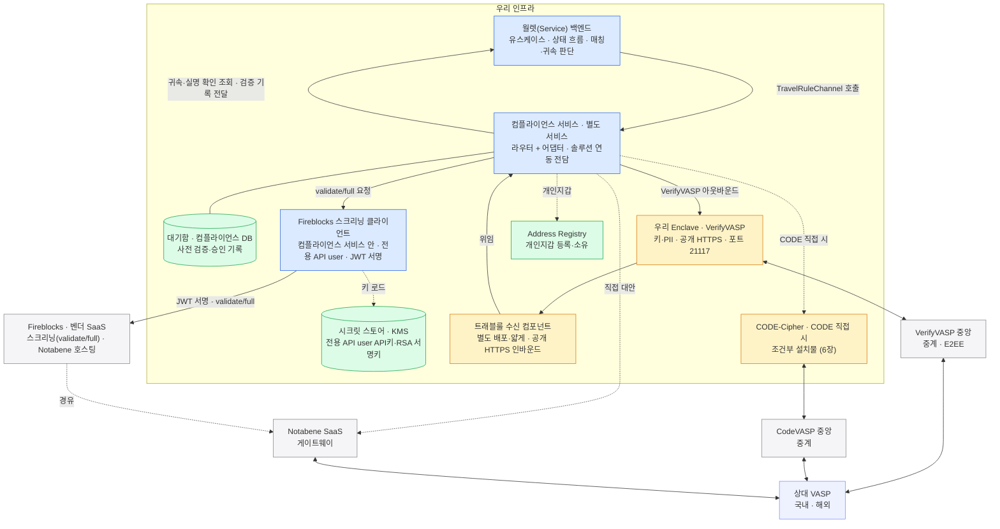

트래블룰 구성요소가 지갑 기반 배치 위 어디에 앉는지를 한 장에 그린다. 게이트를 왜 그 자리에 두는지의 근거는 6·8장이고, 이 장은 그 결론을 배치도로 요약한다.
지갑 기반 배치(커스터디·자산 이동 인프라)는 별도 물리 배치 문서에 있고, 여기서는 **트래블룰 구성요소만** 얹는다 — 제출·온체인 전파(자산 이동 경로)는 이 문서 범위 밖이다.

## 배치의 요점

색 — 파랑: 우리 서비스, 노랑: 자체 운영 설치물, 초록: 저장소, 회색: 외부 중앙. 점선은 조건부·대안 경로.

- **설치물 중 벤더가 강제하는 것은 Enclave 뿐** — 수신 컴포넌트는 인바운드 접점을 얇게 나눈 우리 선택(8·13장), CODE-Cipher 는 CODE 직접 어댑터를 붙일 때만 생긴다(6장).
- **대기함은 컴플라이언스 서비스가 보관(컴플라이언스 DB)** — 입금 도착 시 월렛의 입금 확인 질의에 대조 결과로 답한다(7.3·7.5).
- **스크리닝 호출은 자산 경로 밖** — `validate/full` 은 제출·전파를 타지 않고 전용 경로로 나간다(8장).
- **자격증명은 코드·설정 밖** — 전용 API user(스크리닝 용도 전용)의 키는 시크릿 스토어/KMS 에 두고, 서비스 안 스크리닝 클라이언트가 로드한다. 커스터디 등 다른 서비스의 자격증명과 분리.
