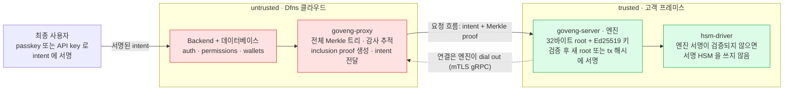
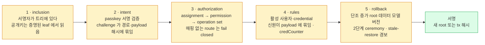

Dfns 가 제공한 "The Governance Engine" 아키텍처 슬라이드 22장(v1.0)과 같은 주제의 2쪽 요약본을 슬라이드 순서대로 옮긴 전환본이다. Dfns 는 이 구성요소를 Integrity Framework 라고도 부른다. 사용자·credential·서명 요청처럼 수탁에서 가장 민감한 상태를 고객이 통제하는 엔진이 커밋·검증·서명하게 해서, Dfns 인프라를 신뢰하지 않아도 되게 만드는 구조다.

## 읽는 방법

- 슬라이드는 이미지 중심이라 pdftoppm 으로 22장을 이미지로 뽑아 읽었고, 요약본은 pdftotext 로 추출했다. 슬라이드는 s.N, 요약본은 r.1·r.2 로 표기한다.
- 제품 우수성과 보안 보증에 관한 표현은 자료가 제시한 주장이다. 별도 근거로 검증된 결론이 아니다.
- 자료에 없는 API 명세, 성능, 가격, 지원 범위는 추가하지 않았다. 우리 설계와의 대조는 마지막 절에 저자 정리로 분리했다.
- 온프레미스 배치 개요는 이 엔진을 "선택 구성요소" 로만 언급한다([Dfns 온프레미스 배치](00-on-premise-deployment.md) p.5·p.7). 두 자료의 관계는 아래 별도 절에 적었다.

## s.1–s.2 — 표지와 구성

표지(s.1)는 "DFNS Architecture · v1.0 · Onchain Core Banking · The Governance Engine, also called the Integrity Framework" 다. 키워드는 Security Model, Trust Boundary, Merkle Commitment, Intent Verification, Root Signing.

세 부분으로 구성된다(s.2).

| 부분 | 제목 | 내용 |
|---|---|---|
| Part I | The trust model | 상태 데이터베이스가 왜 중요한지, 의지하는 단일 불변식, 신뢰 경계 양쪽의 두 구성요소 |
| Part II | The cryptographic core | Merkle commitment, 위조·롤백이 실패하는 이유, 모든 intent 가 서명 전에 검증되는 방식 |
| Part III | Keys, recovery & scope | 엔진 키, 상태 저장소와 재해 복구, 운영 중인 조직의 온보딩, 방어 범위 |

## Part I — 신뢰 모델 (s.3–s.8)

### s.4 — 상태 데이터베이스는 서명키만큼 중요하다

수탁 플랫폼은 어느 credential 이 어느 사용자의 것이고 활성 상태인지를 데이터베이스가 기록한다고 믿는다. 그 기록이 출금을 승인하므로, 데이터베이스에 쓸 수 있는 공격자는 키를 훔칠 필요가 없다.

- **제거하려는 공격**: credential 을 데이터베이스에 직접 넣거나 폐기된 것을 다시 활성화해서, 고객이 승인한 적 없는 서명을 승인받는 것.
- **엔진이 바꾸는 것**: 그 데이터베이스에 두었던 신뢰를 제거한다. 위조되거나 롤백된 상태는 서명 시점에 거부되고, 조용히 통과하지 않는다.

### s.5 — 핵심 불변식

권위 있는 서명된 root 는 고객이 통제하는 엔진이 보관하고, 엔진은 그 root 해시만 유지한다. 신뢰할 수 없는 쪽이 재구성해 롤백할 수 있는 트리는 엔진에 없다. 자료는 보안 논증 전체가 이 불변식 하나로 환원된다고 적었다.

### s.6 — 신뢰로 나눈 두 구성요소

| 항목 | Proxy (untrusted) | Engine (trusted) |
|---|---|---|
| 도는 곳 | Dfns 인프라 | 고객 프레미스 |
| 하는 일 | 플랫폼 데이터베이스를 폴링해 Merkle proof 를 만들고, 고객이 서명한 intent 를 묶어 엔진을 호출하고, 검증된 결과를 돌려 반영 | 각 intent 를 검증하고 proof 를 자기 root 에 대조하고, 트리를 변경하고, 새 root 와 트랜잭션 payload 에 서명 |
| 서명키 보유 | 없음. 유효한 root 를 위조할 수 없음 | 있음. 소프트웨어 seed 또는 HSM |
| 영속 상태 | Governance DB (Postgres). 전체 Merkle 트리와 감사 추적 | 32바이트 root 해시와 래핑된 키만 (SQLite) |

### s.7–s.8 — 신뢰 경계와 연결 방향

빨간색이 Dfns 쪽(untrusted), 초록색이 고객 쪽(trusted)이다. 요청은 항상 proxy 에서 엔진 방향으로만 흐르고, 엔진은 아무것도 폴링하지 않으며 자기 비즈니스 로직을 시작하지 않는다(s.7). 요약본(r.1)의 구성요소 이름 goveng-proxy, goveng-server, hsm-driver 를 그림에 썼다.

연결 방향은 온프레미스 배치를 위해 의도적으로 뒤집혀 있다(s.8). 두 구성요소는 mutual TLS gRPC 로 말하는데, 엔진이 TLS 클라이언트로 접속한 뒤 그 인증된 연결 하나 위에서 governance 서비스를 되돌려 제공한다. 고객 프레미스는 들어오는 연결을 받지 않고 Dfns 는 안으로 들어오지 못한다. 연결마다 엔진의 현재 영속 root 와 mode 를 먼저 합의하므로, 불일치는 나중 변경 때가 아니라 접속 시점에 드러난다.

## Part II — 암호 핵심 (s.9–s.15)

### s.10 — 32바이트 root 하나가 모든 governed 상태를 고정한다

- **해시**: SHA-256 에 domain separation. leaf 와 내부 노드가 다른 prefix 로 해시되므로 leaf 가 노드로 재해석될 수 없다.
- **구조**: breadth-first 인덱스의 이진 트리(root = 0, children 2i+1 / 2i+2). 크기가 커지면 재인덱싱하며 용량이 고정돼 있지 않다.
- **leaf 내용**: 원본 레코드의 버전 범위 projection(필드 allow-list)과 엔진이 주입하는 무결성 필드(credCounter 등).
- **연산**: inclusion check, add-leaf, update-leaf 가 governance 를 구동한다. 폐기는 soft-delete 이고 leaf 는 물리적으로 제거되지 않는다.

### s.11–s.12 — root 하나로 충분한 이유

leaf 하나가 바뀌면(L3*) 새 해시가 root 까지 전파된다. 엔진은 자기가 서명한 root 만 갖고 있으므로, 변조된 트리는 엔진이 서명한 적 없는 root 를 낸다. 맞지 않는 proof 는 precondition failure 로 돌아가고 그 조직의 큐는 멈춘다. 조용히 재시도되지 않는다.

결과(s.12): untrusted proxy 는 자기가 커밋하지 않은 상태의 proof 를 엔진 root 가 받아 주게 만들 수 없다. 위조 불가, 롤백 불가, 재사용 불가.

### s.13 — 모든 변경은 증명된 credential 이 승인한다

trusted 쪽에서 네 단계를 모두 통과해야 변경과 서명이 일어난다.

| 순서 | 단계 | 내용 |
|---|---|---|
| 1 | 서명자 증명 | 서명 credential 의 leaf 가 현재 root 에 포함돼 있어야 한다 |
| 2 | 서명 검증 | passkey 는 authData ‖ SHA-256(clientData) 위의 서명, key credential 은 raw clientData 위의 서명을 검증 |
| 3 | challenge 바인딩 | challenge.path == actionPath 이고 payloadHash == SHA-256(payload) 여야 한다 |
| 4 | 데이터 인지 검사 | 서명자와 사용자가 활성 상태이고, email 같은 신원 필드가 서명된 payload 와 일치해야 한다 |

### s.14 — 서명 방식은 요청이 아니라 증명된 키에서 온다

서명 scheme 은 credential 의 Merkle 증명된 공개키에서 도출되고, 요청이 보낸 알고리즘 문자열에서는 절대 오지 않는다. untrusted 쪽 공격자가 scheme 을 낮추거나 바꿀 수 없다. credential 별로 받는 scheme 은 RSA, ECDSA P-256, P-384, P-521, secp256k1, Ed25519 다.

### s.15 — credCounter, 서명된 leaf 안에 사는 카운터

사용자의 첫 credential 은 가입 때 서명된 intent 없이 추가된다. 같은 비서명 경로로 공격자가 credential 을 더 넣는 것을 막기 위해 엔진은 사용자별 카운터를 두고, 카운터가 0 이 아니게 되면 비서명 경로를 닫는다. 카운터가 서명된 leaf 의 일부라서, 엔진이 서명하지 않은 root 를 만들지 않고는 바꿀 수 없다.

- intent 없는 add_credential 은 credCounter 가 0 이 아니면 거부
- 활성 Fido2 / Key 추가 → +1, 비활성화 → -1, RecoveryKey → 변화 없음

## Part III — 키, 복구, 범위 (s.16–s.21)

### s.17 — 엔진 키가 고객의 root of trust

- **scheme**: Ed25519, 64바이트 서명. 서명 입력이 raw 의 임의 길이 메시지일 수 있어야 해서(Solana 의 non-prehashed payload 등) ECDSA 대신 골랐다.
- **보호**: 운영 환경에서는 HSM 이 모듈 안에서 개인키를 생성하고 키는 모듈을 떠나지 않으며 래핑된 blob 으로 영속된다. 소프트웨어 seed 모드는 테스트 전용이다.
- 엔진은 모든 변경 뒤에 root 에 서명하고, read-only 흐름에서는 각 트랜잭션 payload 에 같은 키로 서명한다.

### s.18 — trusted 쪽은 거의 아무것도 저장하지 않는다

- **상태 저장소**(SQLite): 현재 32바이트 root 해시, 래핑된 엔진 키. 그 외에는 없다. 전체 트리는 untrusted 쪽에 있다.
- **재해 복구**: root 와 래핑된 키를 백업 서버로 mTLS 복제하는 선택 기능. streaming liveness 모니터링이 붙는다.

### s.19 — TOFU 로 운영 중인 조직에 governance 를 켠다

고객이 시작하는 1회성 bootstrap 이 조직의 현재 사용자와 credential 을 트리에 스냅샷한다. 새 조직뿐 아니라 기존 조직에도 governance 를 켤 수 있다. 자료는 이를 Trust On First Use 라 부른다.

- **고객이 게이트**: 고객이 설정하는 플래그로 켜고, untrusted 쪽은 켤 수 없다.
- **안전한 순서**: recovery key 를 먼저 넣어 credCounter 가 올바르게 놓이게 한다.
- **대사 가능**: 감사 로그를 내서 고객이 확정 전에 pre-flight manifest 와 대조한다.

### s.20–s.21 — 방어 범위와 범위 밖

방어하는 것(s.20):

- Dfns 인프라 침해. governed 레코드 위조·변경은 proof 검증에서 거부된다.
- 상태 롤백·재사용. 엔진의 영속 root 가 유일한 권위다.
- 비서명 credential 주입. 가입 밖에서는 credCounter 가 막는다.
- scheme 다운그레이드. scheme 이 Merkle 증명된 키에 묶여 있다.

의도적으로 범위 밖인 것(s.21):

- 지갑 서명키 자체. HSM 서명 평면이고 별도 문서가 다룬다.
- Dfns 인프라의 가용성. 이 프레임워크는 무결성을 다루고 가동 시간은 다루지 않는다.
- 고객 엔진 호스트나 키의 침해. 그 호스트가 trust anchor 이고 보호는 고객 책임이다.

### s.22 — 결론

모든 서명 뒤의 신원·권한 데이터가 고객이 승인한 것과 정확히 같다는 것을 수학적으로 검증할 수 있게 한다는 것이 자료의 주장이다. 고객이 운영하는 구성요소와 고객이 가진 키로 강제되고, 변조는 조용히 통과하지 않고 큐를 멈추며, 정책·권한 governance 도 같은 서명된 commitment 를 따르도록 확장 중이다.

## 요약본 (r.1–r.2) — 슬라이드에 없는 세부

### r.1 — 엔진이 서명 전에 확인하는 것, 순서대로

사용자는 자기 passkey 또는 API key 로 intent 에 서명한다. 서명 대상은 정확한 endpoint 경로와 요청 본문의 SHA-256 이다. 서명 하나가 정확한 요청 하나를 덮으므로 재사용하거나 다른 곳으로 돌릴 수 없다. proxy 는 서명된 intent 와 Merkle proof 를 mTLS 로 엔진에 넣고, 엔진은 entity 변경이면 서명된 root 를, 트랜잭션이면 서명된 해시를 내며 그 서명은 downstream 에서 검증된다. 온프레미스 signer(hsm-driver)는 엔진의 Ed25519 서명이 검증되지 않으면 서명 HSM 을 쓰지 않는다.

노란색 다섯 단계를 순서대로 통과해야 초록색 서명 단계에 이른다. 요약본은 Dfns 가 완전히 침해돼도 governed 데이터를 위조·변경·롤백할 수 없고, 유효한 사용자 서명이 없으면 상태 변경도 트랜잭션 서명도 없다고 적었다.

### r.2 — 증명되는 것과 아직 신뢰에 맡기는 것

| 엔진이 거부하면 막힘 | 서명된 트리가 governed | 아직 governed 아님 |
|---|---|---|
| **트랜잭션 서명.** 엔진이 서명 경로 안에 있어 가장 강한 보장. 온프레미스 signer 는 엔진 서명 없이 블록체인 키를 쓰지 않는다. 공동서명 전에 서명자와 credential 이 트리에 있고 활성이며 그 route 에 권한이 있음을 증명한다. 비활성·미증명 신원은 서명을 얻을 수 없다. 다음 단계: 서명된 해시가 사용자가 승인한 정확한 트랜잭션과 일치하는지도 검증 | **인증과 권한.** 5개 데이터셋이 Merkle leaf 가 되고 각각 정확한 필드 목록으로 고정된다. 모든 변경은 사용자 서명 intent + Merkle proof + 새 엔진 서명 root 가 필요하다. 권한은 다시 강제된다. 엔진이 backend 의 권한 검사를 governed leaf 만으로 재실행한다. 삭제·보관도 governed 이고, assignment 폐기는 증명된 leaf 제거다(원문 "proven leaf removal"). s.10 은 폐기를 soft-delete 라 하고 leaf 는 물리적으로 제거되지 않는다고 적어, 두 자료의 표현이 다르다. 논리적 제거인지 실제 삭제인지는 벤더 확인이 필요하다 | **정책과 predicate.** Dfns backend 만 강제하고 leaf 가 없어 변조 증거가 없다. 정책 정의·승인·정족수는 트리 밖에 있고 엔진이 아직 평가하지 않는다. 금액 상한·시간 창 같은 permission predicate 는 데이터 모델이 안정될 때까지 보류. 조직, 리소스 소유권, SSO 설정, 토큰 해시도 밖. 로드맵은 정책 governance 이고 정의를 먼저, 승인 검증을 그 다음에 다룬다 |

governed 필드는 데이터 모델별로 고정돼 있다.

| 데이터셋 | 고정된 필드 |
|---|---|
| users | id, orgId, kind, email, username, registrationCode, registrationCodeExpirationDate, isActive, isArchived, externalId, isServiceAccount, credCounter는 엔진 주입 |
| credentials | credUuid, kind, credData, userId, isActive, origin, relyingPartyId |
| permissions | id, orgId, name, status, isImmutable, isArchived, operationSetId, kind |
| operation sets | id, orgId, name, operations |
| assignments | id, permissionId, identityId, isImmutable, isArchived |

요약본의 마지막 문장이 경계를 한 줄로 적는다. 권한은 누가 무엇을 할 수 있는지를 증명하고, predicate 와 정책은 어떤 조건에서인지를 정한다. 오늘 엔진은 앞의 것을 증명하고 뒤의 것은 Dfns 를 신뢰한다.

## 온프레미스 배치 개요와의 관계

- 온프레미스 개요는 서명 계층(L4)에 "선택으로 governance engine" 을 두고, 거버넌스 결정에 자기 키로 서명하며 HSM 계층이 있으면 그 키도 HSM 으로 래핑된다고 적었다([Dfns 온프레미스 배치](00-on-premise-deployment.md) p.5·p.7). 이 문서의 엔진 키 설명(s.17)과 맞는다.
- 슬라이드의 그림은 proxy 가 "Dfns 클라우드" 에 있는 배치를 전제한다. 완전 온프레미스에서는 플랫폼 backend 도 고객 계정 안에서 도는데, 그때 proxy 가 어디서 돌고 신뢰 경계가 어떻게 그려지는지는 두 자료 어디에도 없다. 확인 대상이다.
- 요약본의 hsm-driver 는 온프레미스 개요의 HSM 서명 경로 구성요소와 같은 이름이다. MPC 서명 경로에서 엔진 서명이 어떻게 강제되는지는 자료에 없다.

## 우리 설계와 나란히 보기 (저자 정리)

아래는 자료의 사실이 아니라 저자가 우리 BCM 설계와 나란히 놓은 것이다. [BCM 인프라 개요](../../BC/설계/01-infra.md)의 서명 경계와 [WaaS SDK QnA](../../BC/WaaS%20SDK%20QnA/01-qna.md) 4번(서명 장치와 승인 경계)의 비교 기준으로 쓴다.

| 항목 | 우리 설계 (Fireblocks 직접 연동) | Dfns Governance Engine |
|---|---|---|
| 서명 직전 고객 게이트 | 우리 인프라의 API Co-Signer 가 MPC 조각을 갖고, Callback Handler 가 서명 직전에 승인·거부 | 고객 프레미스의 엔진이 서명 경로에 있고, hsm-driver 가 엔진 서명 없이는 HSM 을 쓰지 않음 |
| 게이트가 대조하는 것 | 목적지·금액·한도를 우리 DB 의 승인 기록과 대조 | 서명자·credential·권한이 고객이 서명한 Merkle root 에 포함돼 있는지 |
| 신원·권한 데이터의 위치와 신뢰 | Fireblocks 워크스페이스(사용자·역할·TAP)를 벤더가 보관, 우리는 벤더를 신뢰 | 데이터는 Dfns backend 에 있지만 신뢰하지 않음. 고객 root 로 무결성 증명 |
| 정책 평가 | Fireblocks TAP 이 벤더 쪽에서 평가 | Dfns backend 가 평가하고 엔진은 아직 검증하지 않음(로드맵) |
| 벤더 침해 시 | Co-Signer 조각과 콜백 거부로 서명은 막히나, 사용자·정책 데이터 변조는 벤더 쪽 문제 | governed 데이터 위조·롤백은 막히나, 정책·predicate 는 막히지 않음 |
| 고객이 지켜야 할 것 | Co-Signer 장비(SGX)와 Callback Handler, 우리 DB | 엔진 호스트와 Ed25519 키(HSM), root 백업 |

두 구조는 "서명 전에 고객이 가진 것이 없으면 서명이 나지 않는다" 는 점이 같고, 무엇을 증명하는가가 다르다. 우리 콜백은 거래 내용을, Dfns 엔진은 신원·권한 데이터의 무결성을 본다. WaaS SDK 업체가 Dfns 를 쓴다면 4번 질문의 "그 키조각과 서명 직전 판단이 어디에 있나요" 는 엔진 위치만으로 답이 되지 않는다. 엔진의 Ed25519 키는 거버넌스 결정에 서명하는 키이고 실제 지갑 서명키는 HSM 이나 MPC signer 에 따로 있으며, MPC 경로에서 엔진 서명이 강제되는 방식은 자료에 없다. 엔진, HSM 또는 MPC signer 의 위치와 운영 주체를 각각 확인해야 한다.

## 자료만으로 확정할 수 없는 내용

- proxy 와 엔진 사이 gRPC 인터페이스, Governance DB 스키마, proof 형식
- 엔진이 트랜잭션 payload 를 어떤 경로로 받아 서명하는지("read-only 흐름" 의 정의)
- MPC 서명 경로에서 엔진 서명이 강제되는 방식
- 완전 온프레미스 배치에서 proxy 의 위치와 신뢰 경계
- 엔진의 고가용성 구성. 상태 저장소가 SQLite 인데 복제 외 이중화 언급이 없다
- 처리량과 지연, 큐가 멈췄을 때의 운영 절차와 복구 권한
- 엔진 키 생성·백업·로테이션 ceremony
- 정책 governance 로드맵의 시점
- assignment 폐기가 leaf 의 논리적 제거(soft-delete)인지 실제 삭제인지. s.10 과 r.2 의 표현이 다르다
- 온프레미스 개요와 이 슬라이드의 버전 관계(둘 다 v1.0 이나 발행 시점이 다름)

## 출처와 보존 범위

| ID | 자료 | 사용 범위 |
|---|---|---|
| DFNS-GOVENG-DECK-001 | Dfns 제공 "The Governance Engine" 아키텍처 슬라이드 v1.0, 22장 | 표지·구성·신뢰 모델·두 구성요소·신뢰 경계·연결 방향·Merkle commitment·intent 검증·scheme·credCounter·엔진 키·상태 저장소·TOFU·위협 모델·결론 |
| DFNS-GOVENG-SUMMARY-001 | Dfns 제공 Governance Engine 2쪽 요약 | 구성요소 이름·5단계 검증 순서·governed/비governed 구분·데이터셋별 고정 필드 |

- 파일: `blockchain-manager/sources/dfns/2026-08-26__dfns__governance-engine-architecture-deck-v1.0.pdf`, SHA-256 `5e239e6c61c0af5dc249a644b4bf6702072158b44428cebef57279ab2ba5cf64`
- 파일: `blockchain-manager/sources/dfns/2026-08-28__dfns__governance-engine-summary-2p.pdf`, SHA-256 `e2d3c3aaf4f0fa1813fbdf2dc34b14dded7d7bd3cdb140d93e639891a5bf0c65`
- 슬라이드는 pdftoppm 90dpi 이미지로 읽었고, 요약본은 pdftotext 로 추출했다. 그림 2개는 슬라이드의 Figure 1 과 요약본의 5단계를 다시 그린 것이다.
- 이 문서에는 위 두 자료와 저자 정리 절에서 밝힌 우리 설계 문서 외의 자료를 사용하지 않았다.
