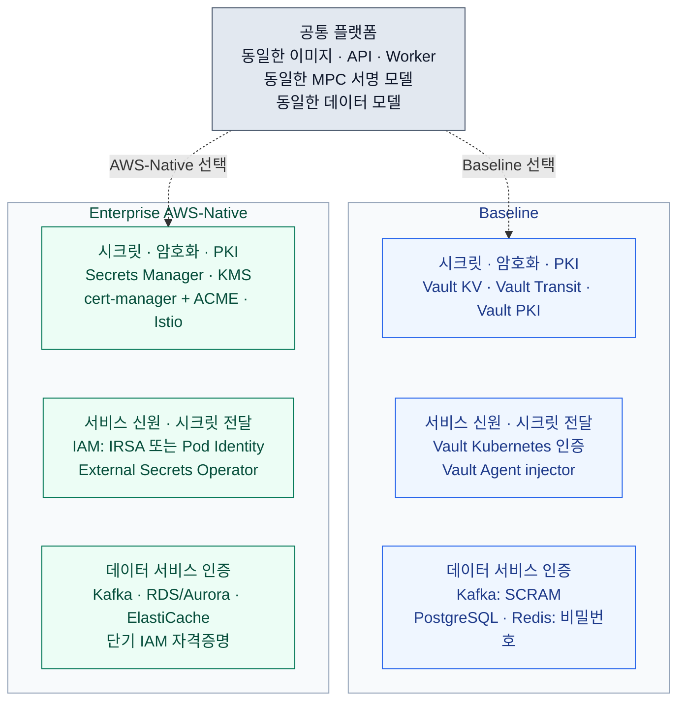

Dfns가 제공한 「Two Deployment Backends, One Platform · Deployment Guide v1.0 · September 2026」 3쪽을 페이지 순서대로 정리했다. 이 자료에 따르면 두 구성은 같은 애플리케이션 이미지·MPC 서명 모델·데이터 모델을 사용하고, 시크릿 저장·서비스 인증·인증서·데이터 서비스 연동 방식이 다르다. (p.1~2)

출처: [원본 PDF](../../../sources/dfns/2026-09-08__dfns__deployment-backends-baseline-vs-aws-native-v1.0.pdf) · [페이지별 원문 추출본](../../../sources/dfns/2026-09-14__dfns__deployment-backends-extracted.md) · [자료 색인](../../../sources/dfns/README.md). 아래 페이지 번호는 물리 페이지 기준이다. 제품 범위와 최소 릴리스는 이 자료의 설명이며, 우리 환경의 배포 검증 결과나 현재 계약 조건을 뜻하지 않는다.

## p.1 — 두 배포 백엔드의 범위

**Baseline은 고객이 직접 운영하는 HashiCorp Vault 기반**, **Enterprise AWS-Native는 AWS Secrets Manager·KMS·IAM 기반**이다. 자료는 관리형 서비스와 직접 운영하는 서비스의 대응 관계를 보여 주어, 기술팀이 자기 환경에 준비할 구성요소를 확인하도록 작성됐다.

표지는 시크릿 저장소, 서비스 신원, PKI·mTLS, Kafka 인증, 데이터베이스 인증, MPC 서명을 다룰 항목으로 제시한다. 외부 기술 평가용이며 잠재 고객·고객·파트너에게 공유할 수 있는 자료로 표기돼 있다.

## p.2 — 같은 플랫폼, 다른 기반 서비스

두 구성 모두 같은 컨테이너 이미지, MPC 서명 모델, 데이터 모델을 사용한다. 바뀌는 부분은 시크릿·서비스 신원·PKI와 데이터 서비스를 제공하는 기반 계층이다. 자료는 플랫폼이 교체 가능한 백엔드를 사용하도록 만들어졌다고 설명한다. 운영 중 백엔드를 전환하는 절차는 제시하지 않는다. (1절)

### 용어

| 용어 | 자료의 설명 |
|---|---|
| MPC 서명 모델 | Coordinator가 여러 signer를 조율해 각자의 키 조각으로 서명을 만든다. 전체 개인키를 한곳에 재구성하지 않는다. |
| Keyshares store | 각 signer의 MPC 키 조각을 보관하는 저장소. 서비스별 데이터베이스와 함께 둔다. |
| External Secrets Operator | 외부 저장소인 AWS Secrets Manager에서 시크릿을 읽어 클러스터 내부 Kubernetes Secret으로 만드는 컨트롤러. |

Enterprise AWS-Native 구성에는 Vault가 없다. 서비스는 고정 비밀번호 대신 유효기간이 짧은 IAM 자격증명으로 의존 서비스에 인증한다. (1절 요약)

### 구성요소별 비교

아래 구성도는 원문 p.2 2절와 p.3 3~5절를 바탕으로 재구성했다. 위쪽은 공통 플랫폼, 아래 두 열은 선택할 배포 프로필이다. 연결선은 구성 선택을 나타낸다.

아래 표는 p.2 2절의 11개 비교 항목을 옮겼다.

| 항목 | Baseline | Enterprise AWS-Native |
|---|---|---|
| 시크릿 저장소 | HashiCorp Vault KV | AWS Secrets Manager |
| 봉투 암호화·KMS | Vault Transit | AWS KMS |
| 서비스 신원 | Vault Kubernetes 인증, 서비스마다 역할 1개 | AWS IAM, IRSA 또는 Pod Identity |
| 클러스터에 시크릿 전달 | Vault Agent injector | External Secrets Operator |
| PKI·mTLS | Vault PKI | ACME를 사용하는 cert-manager와 Istio 메시 |
| Kafka 인증 | SCRAM, 비밀번호 방식 | IAM, `aws-msk-iam`, 비밀번호 없음 |
| 데이터베이스 인증 | PostgreSQL 비밀번호 | RDS 또는 Aurora IAM 인증, TLS 검증 실패 시 연결 차단(fail-closed) |
| 캐시 인증 | Redis 비밀번호 | ElastiCache IAM |
| 이벤트 처리 | Kafka | Kafka만 사용, SQS·SNS·DynamoDB 미사용 |
| 호스팅 | {{단일 테넌트::Dfns를 도입하는 한 고객 조직(예: 우리 회사나 은행) 전용으로 플랫폼을 배치·운영하는 구성. 여기서 테넌트는 개인 고객이나 지갑이 아니라 도입 조직을 뜻한다.}} | 고객 소유 AWS 계정의 {{단일 테넌트::Dfns를 도입하는 한 고객 조직(예: 우리 회사나 은행) 전용으로 플랫폼을 배치·운영하는 구성. 여기서 테넌트는 개인 고객이나 지갑이 아니라 도입 조직을 뜻한다.}} |
| 최소 플랫폼 릴리스 | **1.929 이상** | **1.935 이상** |

두 프로필 모두 {{단일 테넌트::Dfns를 도입하는 한 고객 조직(예: 우리 회사나 은행) 전용으로 플랫폼을 배치·운영하는 구성. 여기서 테넌트는 개인 고객이나 지갑이 아니라 도입 조직을 뜻한다.}}이며 같은 플랫폼 이미지를 실행한다. 표의 기반 서비스와 인증 구성이 달라지고, 애플리케이션과 서명 계층은 같다. Baseline의 호스팅 행에는 AWS 이외 환경의 지원 범위나 설치 요건이 명시돼 있지 않다.

## p.3 — 공통 구성과 변경 범위

### 두 구성에서 같은 것 (3절)

- 컨테이너 이미지와 Pod 구성: 서비스·API·cron worker 구성이 같다.
- MPC 서명 모델: Coordinator·signer·전달 방식과 서명 그룹·임계값 구성이 같다. 이 자료에는 구체적인 임계값 숫자가 없다.
- 서비스 의존 순서와 초기화 작업: 데이터베이스 및 플랫폼 bootstrap 작업이 같다.
- 데이터 모델과 ingress 호스트: 서비스별 데이터베이스와 MPC keyshares store를 포함한다.

### AWS-Native에서 달라지는 것 (4절)

1. **Vault의 역할 전체를 다른 구성요소가 맡는다.** 시크릿 저장은 AWS Secrets Manager, 봉투 암호화는 AWS KMS, PKI는 cert-manager가 담당한다. External Secrets Operator가 시크릿을 클러스터에 전달한다.
2. **서비스 인증에 IAM을 사용한다.** Kafka·캐시·데이터베이스·Secrets Manager·KMS 호출은 모두 비밀번호 없는 단기 IAM 자격증명을 사용한다고 설명한다.
3. **이벤트 처리는 Kafka로 통일한다.** Dfns 호스팅 SaaS에서 사용하던 SQS·SNS·DynamoDB 경로를 끄고 Kafka와 PostgreSQL을 사용한다.
4. **고객 소유 AWS 계정에서 운영한다.** Dfns는 이미지·chart·설정을 제공하고, 고객은 인프라를 운영한다.

### 배포 시 확인할 것 (5절)

**배포 키트의 기본 프로필은 Baseline(Vault + SCRAM)**이다. AWS-Native를 사용하려면 설정을 명시적으로 덮어써야 하며 플랫폼 릴리스 1.935 이상이 필요하다.

자료는 대상 환경에서 다음 항목을 끝까지 검증하는 별도 자체 점검표가 함께 제공된다고 안내한다. 점검표 자체는 이번 PDF에 포함돼 있지 않다.

- Kafka·캐시·데이터베이스의 IAM 연결
- External Secrets Operator 동기화
- 인증서 발급

아키텍처 그림에서 애플리케이션과 서명 계층은 두 구성에서 같고, 시크릿·서비스 신원 계층과 시크릿 bootstrap 흐름을 구성별로 다르게 그린다고 설명한다. 이 3쪽 PDF에는 해당 배치도가 실려 있지 않다.

## 기존 온프레미스 개요와의 관계

[Dfns 온프레미스 배치 개요](00-on-premise-deployment.md)의 p.5·p.7·p.14는 시크릿 백엔드를 Vault 또는 AWS 네이티브로 선택한다고 설명한다. 이번 자료는 그 선택에 따라 달라지는 시크릿 전달·서비스 인증·PKI 구성과 최소 릴리스를 구체화한다. (배포 백엔드 p.2~3)

온프레미스 개요 p.14는 백엔드를 초기 배포 시 고정하고 백엔드 간 마이그레이션은 없다고 명시한다. 이번 자료의 “교체 가능한 백엔드” 설명에는 운영 중 전환 지원이나 마이그레이션 절차가 없으므로, 기존 전환 제약을 해소한 것으로 기록하지 않는다.

온프레미스 개요 p.12의 Vault 초기화·recovery key 보관 절차는 Vault를 사용하는 흐름이다. 이번 자료는 AWS-Native에 Vault가 없고 시크릿 bootstrap 흐름도 다르다고 설명하지만, 대체 bootstrap의 상세 절차는 제공하지 않는다. (배포 백엔드 p.2 1절·p.3 5절)

## 자료만으로 확정할 수 없는 내용

- Baseline의 AWS 외 환경 지원 여부와 해당 환경의 배포·지원 요건
- AWS-Native 설정 override의 정확한 키·값, IAM 정책과 역할 범위, bootstrap 실행 순서
- 인증서 발급 대상·CA 구성·수명·로테이션 및 cert-manager와 Istio의 상세 역할 분담
- 안내된 자체 점검표와 프로필별 배치도 원본
- 이 백엔드 구분이 Hybrid MPC, full quorum의 고객 측 서명 인프라에도 적용되는지
- HSM 서명 경로·Governance Engine에 적용할 때의 구체 구성. 이번 자료의 공통 서명 모델 설명은 MPC 기준이다.
- 프로필별 자원 규모·성능·비용·고가용성·재해 복구 절차와 서비스 버전 조합

위 항목은 자료에 답이 없거나 상세가 부족해 남기는 확인 질문이며, 미지원으로 판정한 항목이 아니다.
