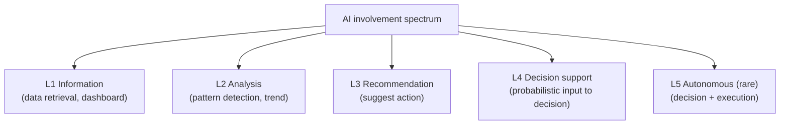
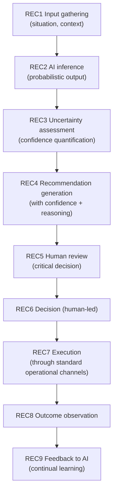
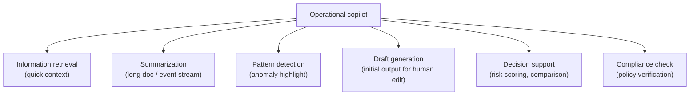
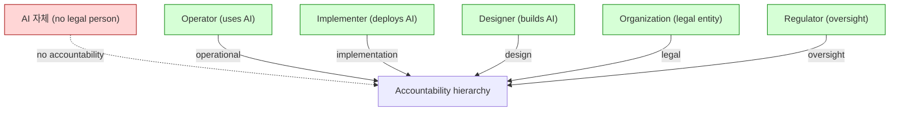
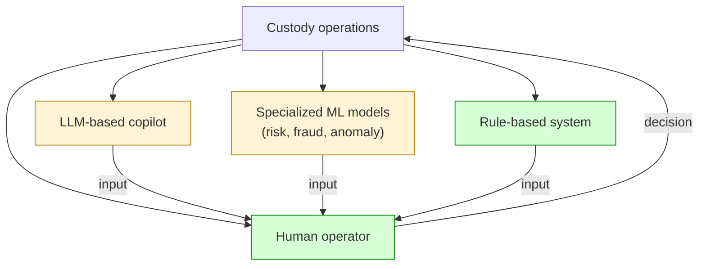
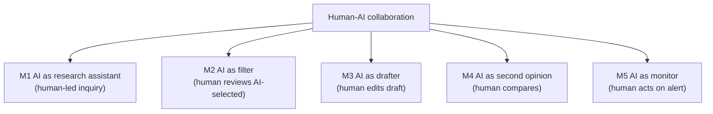

# Custody Wallet — AI-assisted Operational Governance Reasoning

> **본 문서의 위치 (Frontier Cluster D30)**: D3 governance + D12 operational + D29 autonomous treasury 위의 **AI-assisted decision support specialization**. "AI replaces governance" 가 아닌 **probabilistic coordination under accountability**.

> **본 문서가 답하는 핵심 질문**: 왜 AI-assisted governance 가 decision automation 가 아닌가? 왜 recommendation 이 authority 와 다른가? 왜 prediction 이 institutional truth 가 아닌가? 왜 AI visibility 가 AI understanding 가 아닌가? 왜 explainability 가 accountability 와 다른가?

---

## 0. 핵심 명제 (10초 이해)

1. **AI-assisted governance = probabilistic operational coordination under uncertainty + evidence incompleteness + institutional accountability** (core thesis).
2. **5-tier "≠" 명제 (D30 cluster invariant)**:
   - Recommendation ≠ Authority
   - Prediction ≠ Institutional truth
   - AI visibility ≠ AI understanding
   - Operational assistance ≠ Governance delegation
   - Explainability ≠ Accountability
3. **AI 의 role spectrum** — Information / Analysis / Recommendation / Decision support / (rare: Autonomous).
4. **Human-in-the-loop = default + mandatory for high-stakes**.
5. **AI 의 limit awareness** — uncertainty quantification + scope limitation + adversarial robustness.
6. **Explainability ≠ accountability** — explanation 이 있어도 accountability 의 transfer 안 됨.
7. **Hallucination + bias 의 mitigation** — multi-source verification + human review.
8. **Operational copilot** vs **decision-maker** 의 boundary.
9. **Regulatory landscape** — AI governance 의 evolving regulation.
10. **AI custody integration 의 cautious adoption**.

---

## 1. AI Role Spectrum

### 1.1 5-level AI involvement

### 1.2 각 level 의 institutional fit

| Level | Custody use case |
|---|---|
| L1 | Operational dashboards, search |
| L2 | Trend analysis, anomaly detection |
| L3 | Suggested response to incident, optimization |
| L4 | Risk scoring input, compliance flagging |
| L5 | Limited scope (e.g. spam filtering, simple alerts) |

### 1.3 "Recommendation ≠ Authority"

(§0 명제)

- Recommendation: AI 의 suggested action.
- Authority: who decides + executes.
- 차이:
  - Recommendation 은 input
  - Authority 는 still human / institution
  - "AI says X" ≠ "Institution did X"
- → Recommendation 의 framing 의 critical.

### 1.4 Human-in-the-loop 의 default

(★ Hypothesis — operational best practice)

- High-stakes decisions: human-in-the-loop 의 mandatory.
- Low-stakes / routine: 더 자동화 가능.
- → Stakes-aware automation level.

### 1.5 Custody AI 의 evolving landscape

- 현재: limited (mostly L1-L2).
- Emerging: L3 recommendation systems.
- Future: L4 decision support.
- → Gradual adoption 의 ongoing.

---

## 2. AI 의 Limit Awareness

### 2.1 AI 의 fundamental limitations

```mermaid
graph TB
    LIM["AI limitations"]

    L1["Hallucination<br/>(plausible but false output)"]
    L2["Bias<br/>(training data bias propagation)"]
    L3["Out-of-distribution<br/>(novel scenarios)"]
    L4["Causality blindness<br/>(correlation, not causation)"]
    L5["Lack of context<br/>(institutional knowledge)"]
    L6["Adversarial vulnerability<br/>(prompt injection, evasion)"]
    L7["Confidence miscalibration<br/>(overconfidence)"]
    L8["Update drift<br/>(model 의 evolving)"]
```

### 2.2 "AI visibility ≠ AI understanding"

(§0 명제)

- AI visibility: AI 가 producing output.
- AI understanding: human 의 AI 의 reasoning 의 comprehension.
- 차이:
  - Black-box AI: output visible, reasoning invisible
  - Even XAI: explanation 이 simplified, actual reasoning 의 partial
- → AI 의 "understanding" 의 illusion.

### 2.3 "Prediction ≠ Institutional truth"

(§0 명제)

- AI prediction: probabilistic output.
- Institutional truth: organization 의 official position / fact.
- 차이:
  - Prediction = inference (sometimes wrong)
  - Truth = evidence-backed + accountable
- → AI prediction 의 official status 의 careful handling.

### 2.4 Uncertainty quantification

- AI 의 output 의 uncertainty range:
  - Confidence interval
  - Calibration metrics
  - Out-of-distribution detection
- → Decision-maker 의 uncertainty awareness.

### 2.5 Scope limitation

- 각 AI system 의 scope (boundary):
  - Specific domain (custody compliance, not general advice)
  - Specific data (training distribution)
  - Specific time period (training cutoff)
- → Out-of-scope 의 explicit refusal.

---

## 3. Recommendation System Design

### 3.1 Recommendation lifecycle

### 3.2 Recommendation 의 components

| Component | 의미 |
|---|---|
| Action | Suggested action |
| Reasoning | Why this recommendation |
| Confidence | Probability / range |
| Alternative | Other options |
| Risk | Identified risks |
| Source | Input data + model version |

### 3.3 Recommendation 의 friction

- 너무 strong (high-confidence framing) → human 의 자동 acceptance (rubber-stamp).
- 너무 weak (low-confidence) → human 의 ignore.
- Balance: actionable + verifiable.

### 3.4 Multi-source verification

- AI 의 recommendation 의 cross-check:
  - Multiple AI model
  - Rule-based system
  - Human expertise
- → Single-source 의 risk.

### 3.5 Bias detection + mitigation

- Training data 의 bias.
- Output 의 systematic bias.
- Mitigation:
  - Diverse training data
  - Bias audit
  - Output sampling + review
  - Disparate impact analysis

---

## 4. Operational Copilots

### 4.1 Copilot 의 role

### 4.2 Custody copilot use cases

(★ Hypothesis — emerging adoption)

- Incident response: 빠른 historical incident retrieval, runbook navigation.
- Compliance review: large data set 의 initial flag.
- Customer support: query 의 initial classification.
- Audit preparation: evidence retrieval + summarization.
- Policy authoring: draft generation.
- Risk assessment: scenario analysis.

### 4.3 "Operational assistance ≠ Governance delegation"

(§0 명제)

- Operational assistance: AI 가 task 의 helper.
- Governance delegation: decision authority 의 transfer.
- 차이:
  - Copilot 은 task helper (still human in charge)
  - Governance 는 decision authority (separate from execution)
- → Copilot 의 governance role 의 limitation 명확.

### 4.4 Copilot 의 productivity benefit

- Routine task 의 acceleration (50%+ time saving 가능).
- Junior staff 의 capability extension.
- 24/7 availability.
- → ROI 의 가능성.

### 4.5 Copilot 의 risk

- Over-reliance (skill atrophy).
- False confidence (hallucination).
- Information leakage (sensitive data in prompts).
- Adversarial input (prompt injection).
- → Operational discipline.

---

## 5. Accountability Boundary

### 5.1 Accountability hierarchy

### 5.2 "AI accountability" 의 false framing

- AI 는 legal person 아님 (current).
- "AI made wrong decision" → AI 의 accountability 아닌 operator/organization 의.
- 따라서 "AI replaces human decision" framing 의 problematic.
- → Human / organization accountability 의 retention.

### 5.3 "Explainability ≠ Accountability"

(§0 명제)

- Explainability: AI 의 reasoning 의 articulation.
- Accountability: 누가 responsible for outcome.
- 차이:
  - Explanation 가 perfect 해도 outcome 의 responsibility 는 still human/org
  - Explanation 의 absence 는 accountability 더 어려움 (defending decision)
- → 둘은 다른 layer.

### 5.4 Audit trail of AI decision

- AI 의 contribution 의 audit trail:
  - Input
  - Model version
  - Output (recommendation + confidence)
  - Human decision (followed AI or override)
  - Outcome
- → Future investigation 의 evidence.

### 5.5 Regulator's emerging view

(★ Hypothesis — evolving regulation)

- AI 의 high-stakes decision 의 explainability requirement.
- AI bias audit.
- AI training data documentation.
- AI accountability framework.
- → 향후 regulatory framework 의 expectation.

---

## 6. AI 의 Operational Integration

### 6.1 Integration architecture

### 6.2 Hybrid system architecture

- LLM (broad context, language understanding)
- Specialized ML (narrow, high-accuracy)
- Rule-based (deterministic policy)
- Human (judgment, accountability)

→ Each layer 의 strength 결합.

### 6.3 Data sensitivity

- Custody 의 sensitive data:
  - Customer identity
  - Transaction details
  - Internal procedure
- AI 의 use 시:
  - Training data 의 sanitization
  - Prompt data 의 protection
  - Output 의 data leakage 방지
- → Privacy-aware AI integration.

### 6.4 Prompt injection 의 risk

(D14 의 AI-specific application)

- Adversarial prompt 로 AI 의 unintended behavior:
  - Override safety guidelines
  - Extract sensitive info
  - Generate misleading output
- Mitigation:
  - Input sanitization
  - Output validation
  - Sandbox + monitoring

### 6.5 AI 의 update + versioning

- AI model 의 update:
  - 새 capability 추가
  - 기존 behavior 변경 (sometimes)
  - Drift 처리
- Operational consistency 요구.
- → Version control + change management.

---

## 7. Human-AI Collaboration

### 7.1 Collaboration model

### 7.2 Collaboration boundary

| Task | AI role | Human role |
|---|---|---|
| Routine review | Filter / first pass | Validate AI's selection |
| Novel scenario | Limited (out-of-distribution) | Primary judgment |
| Compliance decision | Provide context / flag | Decide + accountable |
| Customer interaction | Initial response (clear cases) | Escalation cases |
| Forensic | Pattern detection | Investigation + narrative |
| Strategic | (very limited) | Primary |

### 7.3 Trust calibration

- AI trust 의 gradual build:
  - Initial: AI output 의 100% human verify
  - Calibrated: selective verification based on confidence
  - Mature: spot-check + monitoring
- → Continuous calibration.

### 7.4 Skill development under AI

- AI assistance + human capability 의 dynamic:
  - AI 가 augments → human 의 higher-level tasks 수행
  - AI 가 substitutes → human 의 skill atrophy
- → Intentional skill maintenance.

### 7.5 Documentation of AI use

- Each AI interaction 의 record:
  - What was asked
  - What was answered
  - Who acted on it
  - Outcome
- → Long-term institutional memory.

---

## 8. Frontier Risks

### 8.1 AI-specific risks

```mermaid
graph TB
    R["AI risks"]

    R1["Hallucination cascade<br/>(false output 의 sequential reliance)"]
    R2["Adversarial manipulation<br/>(prompt injection, data poisoning)"]
    R3["Vendor lock-in<br/>(specific AI platform 의존)"]
    R4["Capability gap<br/>(AI 의 inability + human 의 atrophy)"]
    R5["Information leakage<br/>(sensitive data through AI)"]
    R6["Decision drift<br/>(over time, AI 의 behavior 변화)"]
    R7["Regulatory uncertainty<br/>(AI governance landscape evolving)"]
    R8["Concentration risk<br/>(few AI providers dominate)"]
    R9["Speed mismatch<br/>(AI 의 fast vs human 의 slow review)"]
    R10["Trust over-extension<br/>(AI 의 capability beyond actual)"]
```

### 8.2 Mitigation strategy

| Risk | Mitigation |
|---|---|
| Hallucination | Multi-source verification + human review for high-stakes |
| Adversarial | Input sanitization + output validation + sandbox |
| Lock-in | Multi-vendor + interface abstraction |
| Capability gap | Mandatory manual exercise + skill development |
| Leakage | Data classification + AI access control + audit |
| Drift | Version pinning + monitoring + revalidation |
| Regulatory | Engagement + flexibility + documentation |
| Concentration | Vendor diversity (if possible) |
| Speed | Calibrated review + tiered urgency |
| Over-trust | Transparency + limitation disclosure |

---

## 9. Operational Fragility Map

```mermaid
graph TB
    F1["F1. Hallucination on critical decision"]
    F2["F2. AI vendor failure / outage"]
    F3["F3. Prompt injection compromise"]
    F4["F4. Over-reliance + skill atrophy"]
    F5["F5. Data leakage through AI"]
    F6["F6. Bias propagation in decisions"]
    F7["F7. Regulatory enforcement against AI use"]
    F8["F8. AI drift / unexpected behavior change"]
    F9["F9. Accountability gap in AI-influenced decision"]
    F10["F10. AI cost escalation"]

    F1 -->|mitigation| M1["Verification + human review + uncertainty awareness"]
    F2 -->|mitigation| M2["Multi-vendor + fallback to manual"]
    F3 -->|mitigation| M3["Input filtering + sandbox + access control"]
    F4 -->|mitigation| M4["Mandatory manual exercise + cross-training"]
    F5 -->|mitigation| M5["Data classification + privacy-preserving AI"]
    F6 -->|mitigation| M6["Bias audit + disparate impact analysis"]
    F7 -->|mitigation| M7["Regulator engagement + compliance documentation"]
    F8 -->|mitigation| M8["Version pinning + revalidation + monitoring"]
    F9 -->|mitigation| M9["Clear accountability + audit trail + insurance"]
    F10 -->|mitigation| M10["Budget + cost monitoring + tier optimization"]
```

---

## 10. Limitations

### 10.1 Recommendation ≠ Authority

§1.3.

### 10.2 Prediction ≠ Truth

§2.3.

### 10.3 Visibility ≠ Understanding

§2.2.

### 10.4 Assistance ≠ Delegation

§4.3.

### 10.5 Explainability ≠ Accountability

§5.3.

### 10.6 AI 의 evolving capability

- 본 문서 의 reasoning 은 current AI capability.
- Future capability 의 different reasoning 가능.

### 10.7 Sensitive operation 의 reluctance

- Custody 의 high-stakes nature → AI adoption 의 cautious.
- 적절한 caution.

---

## 11. 3-way Frontier Burden

### 11.1 Plane × Ownership

| 영역 | SaaS | Federated | Sovereign |
|---|---|---|---|
| AI integration | Vendor partial + customer | Customer | Customer |
| Policy / governance | Customer | Customer | Customer |
| Accountability | Customer | Customer | Customer |
| Audit trail | Vendor + customer | Customer | Customer |
| Adversarial defense | Customer | Customer | Customer |
| Skill maintenance | Customer | Customer | Customer |

### 11.2 Customer AI burden (★ Hypothesis)

- SaaS: ~85%
- Federated: ~95%
- Sovereign: ~100%

### 11.3 Recommendation

| Context | 권장 |
|---|---|
| Conservative | L1-L2 only (information, analysis) |
| Standard | L3 recommendation with strong human review |
| Mature | L4 decision support with calibrated trust |
| Frontier | L5 limited autonomy + extensive safeguards (caution) |

---

## 12. Q1-Q10 Reasoning

### Q1. AI-assisted ≠ Automation

§0.1.

### Q2. Recommendation ≠ Authority

§1.3.

### Q3. Prediction ≠ Truth

§2.3.

### Q4. Visibility ≠ Understanding

§2.2.

### Q5. Assistance ≠ Delegation

§4.3.

### Q6. Explainability ≠ Accountability

§5.3.

### Q7. AI limitations

§2.

### Q8. Hybrid architecture

§6.2.

### Q9. Human-AI collaboration

§7.

### Q10. Frontier risks

§8.

---

## 13. Open Questions

| 영역 | 질문 |
|---|---|
| AI use cases | which approved? |
| AI vendor selection | criteria? |
| Data classification | for AI use |
| Prompt injection defense | which technique? |
| Output validation | how rigorous? |
| Human review threshold | per decision type |
| Audit trail format | per regulatory |
| Bias audit frequency | per system |
| AI version control | governance |
| Adversarial testing | scope? |
| Manual capability maintenance | how systematic |
| Regulatory engagement | proactive? |
| Insurance for AI | scope? |
| AI cost budget | per operation |
| Multi-vendor strategy | scope? |
| Sensitive data prohibition | which prompts? |
| AI transparency to customer | disclosure? |
| Override authority | for AI recommendations |
| AI in compliance | acceptable scope |
| Long-term AI strategy | adoption pace |

---

## 14. References + Uncertainty Boundary + Bridge

### 관련 wiki

| 참조 |
|---|
| [[docs/architecture/approval-state-machine-governance]] (D3) |
| [[docs/architecture/operational-maturity-incident-command]] (D12) |
| [[docs/architecture/security-threat-model-adversarial-resilience]] (D14) |
| [[docs/architecture/autonomous-treasury-governance]] (D29) |
| [[docs/architecture/compliance-aml-sanctions-boundary]] (D11) |

### Uncertainty Boundary

- 본 문서는 **emerging** — AI 의 institutional 적용 의 rapidly evolving.
- 5-level AI role / 8 AI limitations / 5 collaboration model / 10 frontier risk / 85% burden = **generalized AI governance pattern (Hypothesis ★)**.
- §5.5 regulatory landscape = current emerging.
- §11.2 burden 백분율 = estimate.
- §13 에 frontier policy 영역 명시.

### D31 Bridge Invariants (D27 + D28 + D29 + D30 → D31)

1. **Selective visibility** — D30 의 AI scope limitation 이 D31 의 selective disclosure 의 foundation.
2. **Confidentiality 와 audit** — D30 의 data privacy 가 D31 의 institutional privacy 로 generalize.
3. **Probabilistic trust** — D30 의 AI 의 probabilistic nature 가 D31 의 cryptographic confidentiality 의 trust 와 대비.
4. **Boundary 의 explicit definition** — D30 의 boundary 가 D31 의 confidentiality boundary 로 deepening.
5. **Auditability under confidentiality** — D30 의 audit trail 이 D31 의 confidential audit 의 base.

### Cluster progression

- D27: sovereign digital money
- D28: intent-based settlement
- D29: autonomous treasury
- D30 (this): AI-assisted governance
- D31 (next): confidential settlement
- D32: post-quantum survivability

---

**Stage 32 D30 completion timestamp**: 2026-05-20.
