# Custody Wallet — Approval State Machine & Governance Workflow Reasoning

> **본 문서의 위치**: D2 의 "Approval success ≠ Signing success" 명제를 **governance 관점으로 확장**. Approval / Quorum / Policy / Escalation / Break-glass / Audit 의 5 governance concern 을 single aggregate 안에 묶지 않고, **signing aggregate 와 분리된 governance workflow** 로 reasoning.

> **본 문서가 답하는 핵심 질문**: 왜 institutional custody 의 "approval" 은 단순 boolean (approved / rejected) 이 아닌 **state machine + evidence chain + freshness invariant + escalation tree + break-glass path** 의 복합 구조인가? 왜 governance 가 custody operational burden 의 핵심 영역인가?

---

## 0. 핵심 명제 (10초 이해)

1. **Policy pass ≠ Approval complete ≠ Signing authorized ≠ Signing success** — 4 단계 분리 reasoning.
2. **Approval aggregate ⊥ Signing aggregate** — Approval 은 human governance workflow / evidence collection / policy enforcement; Signing 은 cryptographic execution. 다른 lifetime, 다른 trust domain, 다른 audit chain.
3. **Approval evidence freshness > approval timestamp** — "누가 언제 approve 했는가" 보다 "그 evidence 가 지금 signing 을 authorize 할 만큼 fresh 한가" 가 governance core invariant.
4. **PartiallyApproved 는 1급 operational state** — quorum collection 중간 상태가 governance 의 핵심 fragility surface.
5. **Append-only governance evidence chain** — approval current state 보다 evidence chain 자체가 audit subject. delete / mutation 금지.
6. **Emergency break-glass = 위험 ↑ + audit ↑↑** — bypass 자체보다 bypass 의 audit + post-hoc review 가 governance integrity 의 마지막 방어선.
7. **Human coordination = irreducible fragility** — automation 으로 줄일 수 있는 burden 의 한계는 "human approver 의 가용성" 이라는 자연 limit.

---

## 1. Approval Workflow Layered Model (G1-G10 sub-plane)

D1a 의 9-plane + D2 의 10 sub-plane (S1-S10) 위에서 governance 가 횡단하는 10 sub-plane.

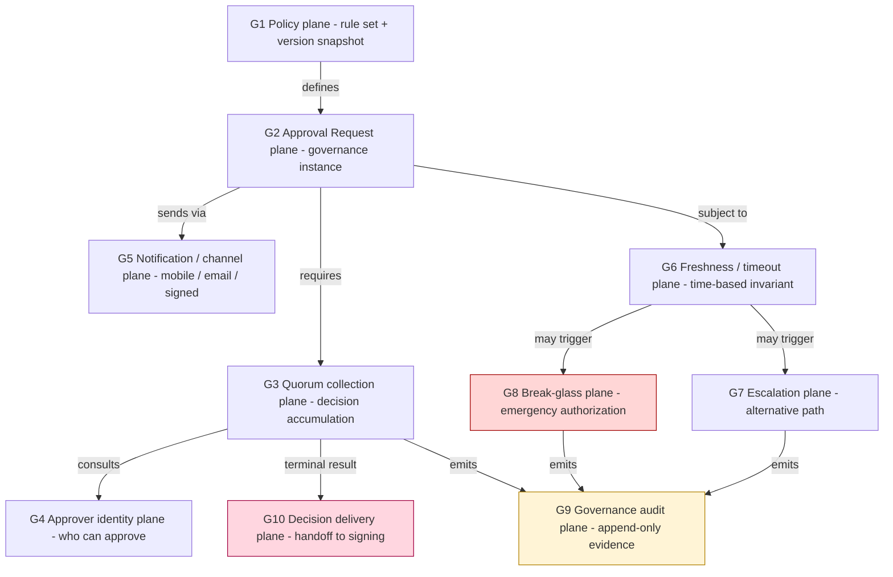

| Sub-plane | 책임 | D1a / D2 매핑 | 저장 / 실행 모델 |
|---|---|---|---|
| **G1 Policy** | rule set, version snapshot, quorum definition | D1a L5 | versioned (publish=immutable) |
| **G2 Approval Request** | ApprovalRequest aggregate root | D1a L4 / D2 S3 | state machine (mutable status) + transition log (append-only) |
| **G3 Quorum collection** | M-of-N decision accumulation | D1a L4 + L6 | append-only ApproverDecision events |
| **G4 Approver identity** | role / group / individual eligibility | D1a L1 + L5 | mutable membership + audit-emit |
| **G5 Notification channel** | mobile push / email / out-of-band | runtime + delivery log | network + delivery audit |
| **G6 Freshness / timeout** | approval window + evidence age check | runtime invariant | computed on every check |
| **G7 Escalation** | alternative approver set, role hierarchy | G1 + runtime | rule-driven, evidence-emitted |
| **G8 Break-glass** | emergency authorization | separate audit class | append-only + mandatory post-hoc review |
| **G9 Governance audit** | append-only evidence chain | D1a L6 | event store (별도 retention) |
| **G10 Decision delivery** | signed result handoff to SigningRequest | D2 S3 → S1 | cryptographic envelope |

**핵심 invariant**:
- **G3 / G9 = append-only** (governance evidence chain).
- **G6 은 runtime invariant** — 매 read 시 재계산, persisted 하지 않음 (timestamp 만 persisted).
- **G8 break-glass = 별도 audit class** — 일반 audit (G9) 와 같은 store 안이라도 retention / access / review 가 다름.
- **G10 = trust boundary** — Approval aggregate 의 출구. Signing aggregate 는 G10 의 signed evidence 만 신뢰.

---

## 2. Governance State Machine

핵심: Quorum collection 의 11 state 분리.

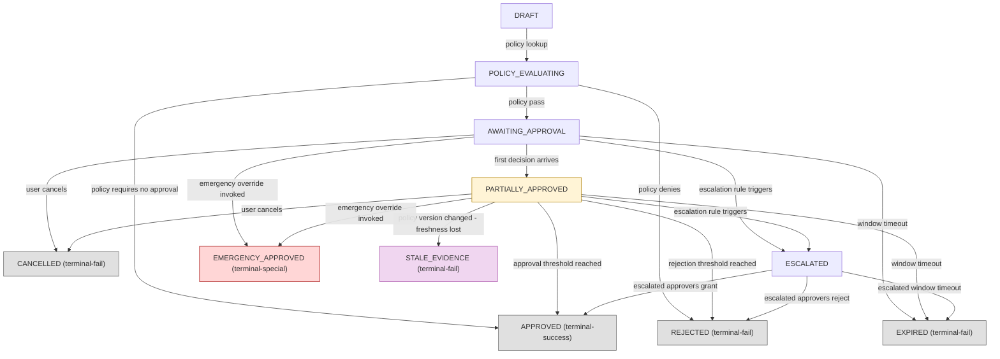

### 2.1 State 별 의미

| State | 의미 |
|---|---|
| **DRAFT** | client 가 request 생성, 아직 policy eval 시작 안 함 |
| **POLICY_EVALUATING** | policy version 조회 + rule eval (★ 이 단계에서 PolicyVersion pinned) |
| **AWAITING_APPROVAL** | quorum collection 시작, 아직 decision 0 개 |
| **PARTIALLY_APPROVED** | ≥1 approve decision 도착, 아직 threshold 미달 (★ 1급 operational state) |
| **APPROVED** | threshold 도달, decision 결과 immutable freeze |
| **REJECTED** | reject threshold 도달 또는 정책 자체 거부 |
| **EXPIRED** | approval window timeout — re-request 필요 |
| **CANCELLED** | requester 또는 admin 명시적 취소 |
| **ESCALATED** | timeout 또는 rule 로 escalation path 진입, **새로운 approver set** |
| **EMERGENCY_APPROVED** | break-glass 발동, **별도 audit class**, post-hoc review 의무 |
| **STALE_EVIDENCE** | PartiallyApproved 중 policy version 변경 → 기존 decision freshness 손실 |

### 2.2 왜 PartiallyApproved 가 1급 state 인가

- M-of-N quorum collection 의 **대부분 시간이 이 state 에서 소비**.
- Approver 별 decision arrival 이 비동기 — 이 state 가 governance fragility 의 surface.
- Race condition / approver 변경 / policy drift / freshness decay 가 **모두 이 state 에서 발생**.
- → State 자체를 monitoring / alerting / SLA 대상으로 다뤄야 함.

### 2.3 STALE_EVIDENCE 의 의미 (★ 비전통적 state)

- Approval window 내인데도 evidence 가 stale 가능 — 예: PartiallyApproved 중 policy version 이 변경되면 기존 decision 들이 새 policy 기준에서 invalid.
- 단순 timeout 과 분리: **timeout = "시간이 지났음"**, **stale = "evidence 의 기반 context 가 변했음"**.
- Anti-pattern: STALE 을 별도 state 로 두지 않고 timeout 으로 묶어버리면 governance forensic 에서 둘을 구분 못함.

---

## 3. Quorum Collection Model

### 3.1 M-of-N collection 의 본질

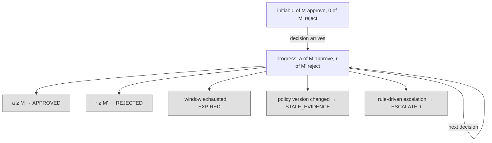

### 3.2 Threshold 의 4 모드

| 모드 | 의미 | 예 |
|---|---|---|
| **simple** | M-of-N | 3-of-5 admin |
| **weighted** | 가중치 합 ≥ threshold | role-weighted scoring |
| **role-stratified** | 각 role 에서 최소 인원 필요 | Treasury 2 + Risk 1 + Compliance 1 |
| **conditional** | tx 속성 의존 | amount > X → 추가 approver 필요 |

→ vendor 마다 지원 모드 다름. **direct-build 시 모드 선택 자체가 design decision** (★ Hypothesis level).

### 3.3 Concurrent decision race condition

**시나리오**: M=3, N=5, current state = 2 approve, 0 reject. 동시에 2 명이 approve, 1 명이 reject.

- 단순 last-write-wins → race condition.
- 해결: ApproverDecision 을 **append-only event**, threshold check 는 매 event arrival 시 atomic re-evaluation. 결과 결정 (APPROVED vs REJECTED) 은 **event ordering deterministic** 으로 처리.
- DB 수준: ApproverDecision insert 후 ApprovalRequest 의 status update 는 transaction 안에서 — race 시 둘째 transaction 은 first 의 result 를 보고 no-op.

### 3.4 Approver 변경 / role 회수

**시나리오**: Approver A 가 t1 에 approve, t2 에 role 박탈, t3 에 다른 approver 가 마지막 approve → APPROVED.

- Approver A 의 decision 은 t1 에 valid 였는가? 정책 결정 영역.
- 보수적 정책 (권장): **decision validity 는 decision 시점의 role 만 본다** — t2 의 role revocation 은 t1 의 decision 을 무효화하지 않음.
- 엄격 정책: **APPROVED 이전 시점에 어느 approver 라도 role 잃으면 stale** → STALE_EVIDENCE.
- 선택은 §11 의 org policy.

### 3.5 Duplicate decision handling

- Same approver, same request, multiple decisions arriving — 2 가지 해석:
  1. **Last decision wins** — approver 의 의사 변경 인정 (단, 새 decision 도 append-only 로 evidence)
  2. **First decision frozen** — once decided, 변경 불가 (이후 decision 은 reject + audit)
- 권장: (1) — 단 변경 시 audit 강화 + threshold 재계산.
- **Anti-pattern**: silent dedup (idempotent treatment) — governance evidence chain 단절.

---

## 4. Policy Evaluation Lifecycle

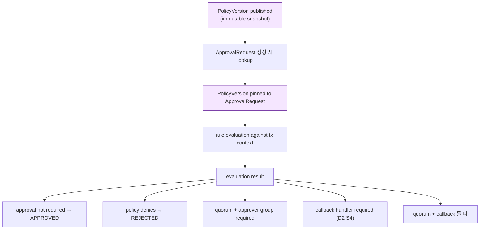

### 4.1 Policy Version Snapshot 의 중요성

- ApprovalRequest 가 어느 PolicyVersion 으로 평가됐는지 **pin 해야 함**.
- 이유: PolicyVersion 은 PartiallyApproved 동안에도 publish 가능 — pin 안 하면 mid-flight 에 정책이 바뀌어 결정 기준이 모호.
- D1a 의 L5 PolicyVersion = immutable snapshot 의 직접 활용.

### 4.2 Policy Version Drift

| 시나리오 | 처리 |
|---|---|
| PartiallyApproved 중 새 PolicyVersion publish | pinned version 유지 — 진행 중 request 는 영향 없음 |
| 새 request → 새 PolicyVersion 사용 | 자연스러운 적용 |
| Pinned version 이 retro-deprecate (보안 결함 발견) | **STALE_EVIDENCE** 전이 + admin alert |
| Pinned version 의 rule 이 evaluator bug 로 잘못 평가됨 | 재평가 필요 (governance incident) |

**핵심 invariant**: PolicyVersion 은 immutable, 단 deprecation flag 는 mutable (deprecation 은 evidence emit + downstream 통보).

### 4.3 Policy evaluation 의 4 출력

1. **Approval not required** — auto-approved (low-value tx 또는 whitelist 패턴).
2. **Policy denies** — REJECTED 직행 (blacklist / blocked address / kill-switch).
3. **Quorum + approver group required** — 일반 governance flow.
4. **Callback handler required** — customer-side gate 추가 (D2 S4).
5. **Both quorum + callback** — 두 gate 모두 통과 필요.

### 4.4 Re-evaluation 시점

- Approval 진행 중에 정책 자체는 재평가 안 함 (pinned).
- Signing retry 시: **새 ApprovalRequest 가 필요한가?** 정책 의존.
  - 정책 A: 같은 SigningRequest 의 retry 면 같은 ApprovalRequest 재사용 (단 freshness check).
  - 정책 B: 매 retry 마다 새 ApprovalRequest — 보수적, governance overhead ↑.

---

## 5. Timeout / Expiration & Approval Freshness

### 5.1 Two-clock model

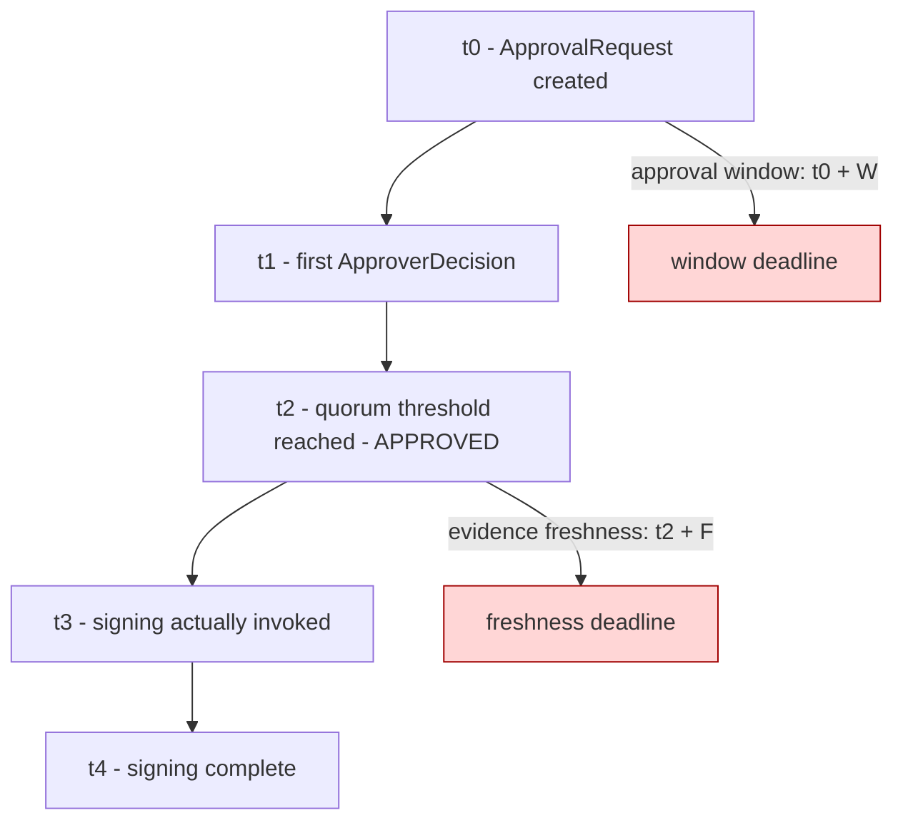

### 5.2 Approval window vs Evidence freshness — 핵심 분리

| 개념 | 측정 | 의미 |
|---|---|---|
| **Approval window (W)** | from ApprovalRequest creation | "결정을 내릴 시간" |
| **Evidence freshness (F)** | from APPROVED state entry | "결정이 signing 을 authorize 할 만큼 fresh 한가" |

→ **둘은 다른 invariant**. window 안에 결정이 나도, signing 이 freshness 윈도우 밖이면 re-approval.

### 5.3 왜 evidence freshness 가 핵심인가

- Approval 은 "t2 시점에 governance 의 의사" — t2 이후 context 변화 (tx 내용 미변, but 외부 환경: market, threat intel, regulation) 는 governance 가 모름.
- "approve 받았으니 signing 은 평생 valid" 는 위험 — late-binding signing 에 governance 가 obsolete 한 결정.
- 권장: F << W (예: W = 24h, F = 1h) — governance 결정 후 short window 안에 signing 완료 또는 re-approve.

### 5.4 Timeout check matrix

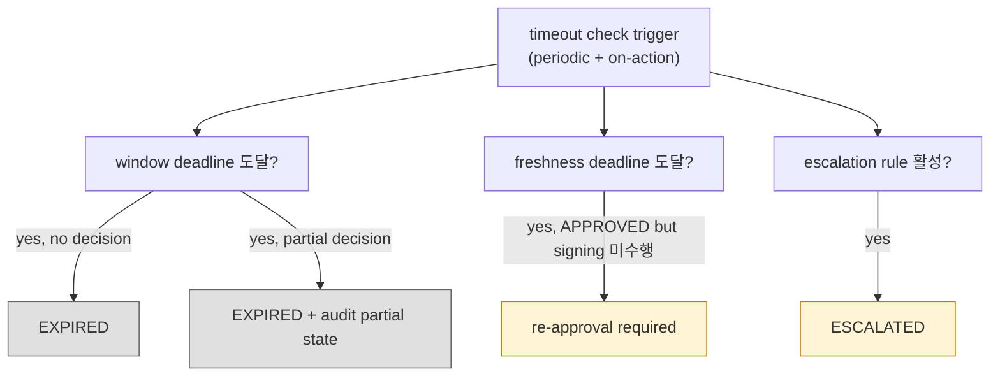

### 5.5 Timeout ambiguity (operational fragility)

- "Window timeout" 과 "freshness timeout" 을 같은 metric 으로 다루면 forensic 시 구분 불가.
- "Timeout 발생 시 자동 재청구" 는 governance abuse vector (timeout 을 evidence 갱신 수단으로 악용).
- 권장: timeout 마다 evidence emit + manual re-request 만 허용 (auto-re-issue 금지).

---

## 6. Escalation & Break-glass Flow

### 6.1 Escalation vs Break-glass — 분리

| 차원 | Escalation | Break-glass |
|---|---|---|
| **언제** | normal flow 미완료 (timeout / unavailable approver) | emergency (정상 governance 불가능한 상황) |
| **누가 authorize** | escalation rule (정책 정의) | 별도 emergency authority |
| **추가 audit** | 표준 audit | **mandatory post-hoc review** + 별도 audit class |
| **빈도 expected** | 일상적 | 드문 — frequency 자체가 anomaly signal |
| **automatic 여부** | rule-driven (자동 가능) | 절대 자동 금지 — human invocation only |
| **PolicyVersion** | 기존 pinned 유지 | break-glass policy (별도 version 또는 emergency override clause) |

### 6.2 Escalation flow

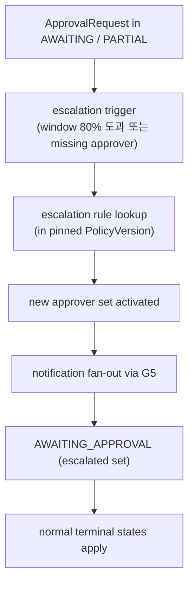

### 6.3 Break-glass flow

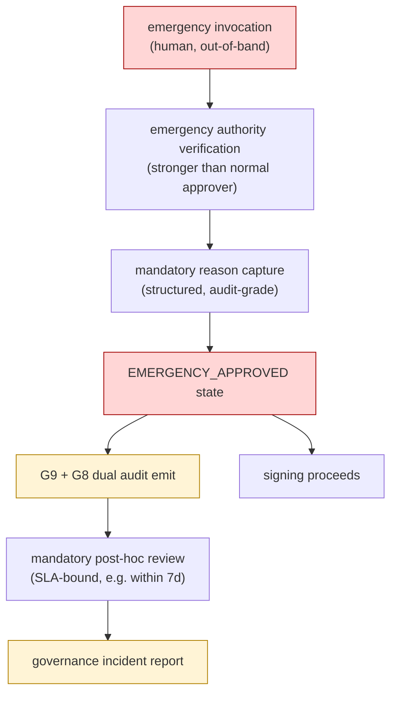

### 6.4 Break-glass 의 abuse risk

(★ Hypothesis — governance risk pattern)

- 빈번한 break-glass 사용 = governance 가 작동 안 함 (또는 abuse).
- 권장 metric: break-glass frequency 자체를 SLO 대상 — 분기당 N 회 이상이면 governance design 재검토.
- Compensating control: break-glass authority 자체도 quorum 필요 (single-person break-glass 금지).
- 모든 break-glass 는 **post-hoc review SLA 강제** — 일정 시간 내 review 안 되면 별도 incident.

### 6.5 Recovery 와의 연결 (Stage 29-31 reasoning 활용)

Recovery ceremony 의 governance burden:
- 48h approval window (Stage 29) — approval freshness 의 특수 사례.
- Once-only download fragility (Stage 30) — recovery package 가 한 번만 download 가능 = governance evidence 의 single-use property.
- Custodian distribution = quorum 의 oversized form (M-of-N 인 custodian set).

→ Recovery 는 **break-glass + 강화된 quorum** 의 결합. 일반 approval flow 보다 governance complexity 1 단계 위.

→ Reference: [[entities/fireblocks/workspace-keys-backup]] (Stage 29-31), [[entities/fireblocks/recovery-passphrase]].

---

## 7. Governance Audit Immutability

### 7.1 G9 audit chain 의 구성

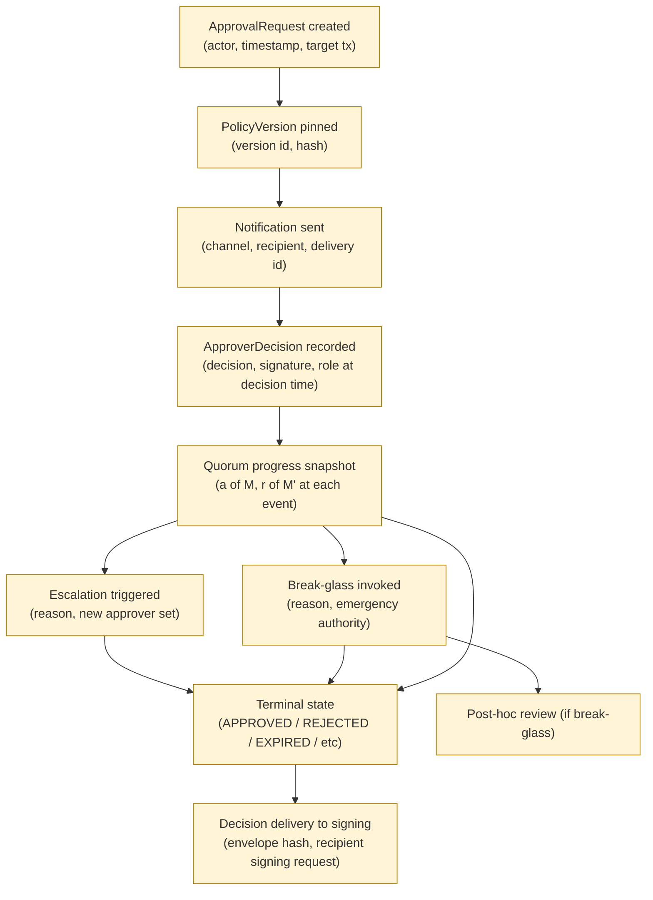

### 7.2 무엇이 audit 에 포함되어야 하는가

| 필수 항목 | 이유 |
|---|---|
| Actor identity | 누가 — accountability |
| Role / group at time of action | 당시 권한 — retroactive role 변경 불가 |
| Timestamp (monotonic + wall clock) | 언제 — replay forensic |
| PolicyVersion snapshot hash | 어떤 정책 기준 — version drift forensic |
| Quorum progress at decision time | 진행 상황 — race condition forensic |
| Cryptographic signature of decision | 부인 방지 |
| Reason text (특히 break-glass) | 정성적 forensic |
| Channel used (G5) | delivery path verification |

### 7.3 Audit current state vs evidence chain

- "현재 ApprovalRequest 가 APPROVED" 는 mutable status field.
- "어떻게 APPROVED 가 됐는가" 는 append-only event sequence (= **evidence chain**).
- 둘은 분리 — status field 는 OLTP, evidence chain 은 immutable event store (D1a L6).
- Forensic / audit 의 주체는 **evidence chain**.

### 7.4 Append-only 의 정책적 의미

- 잘못된 decision 의 "수정" 은 불가능 — 새 event 추가만 가능.
- Approver 가 mind 변경 시: 새 decision event emit + threshold 재계산.
- Decision 삭제 시도 = governance integrity 위반 = audit incident.
- → Append-only 가 governance 의 가장 강한 invariant.

---

## 8. Approval ↔ Signing Boundary

### 8.1 Trust boundary 모델

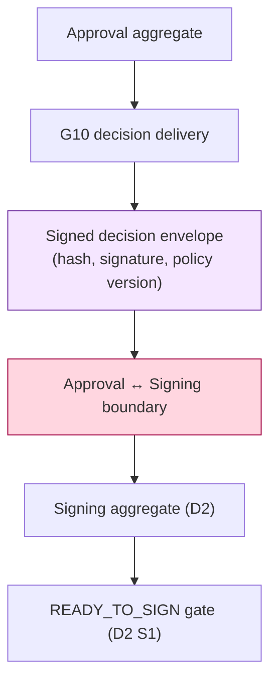

### 8.2 Boundary 의 의미

- Signing aggregate 는 Approval aggregate 의 internal state 를 **모름** — 오직 G10 의 signed envelope 만 입력.
- Envelope 검증 항목:
  - approval_request_id matches expected
  - terminal state == APPROVED (또는 EMERGENCY_APPROVED)
  - signature valid (governance plane 의 signing key)
  - policy_version matches expected
  - freshness deadline 미도과
- 검증 실패 시 → signing 거부 (D2 SigningRequestStateMachine 의 SR_FAIL).

### 8.3 Why hard boundary

- 두 aggregate 가 다른 trust domain — governance (human + policy) vs signing (cryptographic + MPC).
- Approval 의 internal complexity (quorum, escalation, break-glass) 가 Signing 의 관심사 아님.
- Approval bug 가 Signing 으로 propagate 못함 — envelope verification 이 firewall.
- Re-design 가능성: Approval 의 internal model 변경 시 envelope schema 안 바뀌면 Signing 영향 없음.

### 8.4 Approval re-use across SigningRequest retry

(D2 §4.4 의 확장)

- 같은 envelope 을 여러 SigningRequest 가 consume 할 수 있는가?
- **권장: no — 1 envelope = 1 SigningRequest** (single-use property).
- 이유:
  - Replay protection (envelope nonce + signing_request_id binding).
  - Freshness invariant — envelope 의 freshness deadline 이 signing retry 동안 지나갈 수 있음.
  - Audit clarity — 어느 governance decision 이 어느 signing 을 authorize 했는지 1:1.
- 단, 정책 차원 trade-off: governance overhead vs replay safety. §11 의 org policy.

---

## 9. Operational Fragility Map

10 items — governance 가 custody burden 의 핵심 영역인 이유.

```mermaid
graph TB
    F1["F1. Partial approval 장기 정체<br/>(quorum 미충족, approver unresponsive)"]
    F2["F2. Approver role 변경<br/>(decision validity 모호)"]
    F3["F3. Policy version drift<br/>(mid-flight publish)"]
    F4["F4. Concurrent approval race<br/>(threshold check atomicity)"]
    F5["F5. Replay approval<br/>(envelope reuse 시도)"]
    F6["F6. Duplicate approval<br/>(same approver 재의사)"]
    F7["F7. Signing retry 시 재승인<br/>(정책 ambiguity)"]
    F8["F8. Timeout ambiguity<br/>(window vs freshness)"]
    F9["F9. Emergency abuse<br/>(break-glass 빈도 ↑)"]
    F10["F10. Human coordination dependency<br/>(approver 가용성 자체)"]

    F1 -->|mitigation| M1["escalation rule + SLA monitoring"]
    F2 -->|mitigation| M2["decision validity = decision-time role only"]
    F3 -->|mitigation| M3["PolicyVersion pinning at request time"]
    F4 -->|mitigation| M4["append-only events + atomic threshold check"]
    F5 -->|mitigation| M5["envelope nonce + single-use property"]
    F6 -->|mitigation| M6["last-decision-wins + audit on change"]
    F7 -->|mitigation| M7["org policy: re-approve or reuse?"]
    F8 -->|mitigation| M8["W vs F 분리 + separate audit"]
    F9 -->|mitigation| M9["break-glass quorum + frequency SLO"]
    F10 -->|mitigation| M10["irreducible — natural limit, design with awareness"]
```

### 9.1 F10 의 의미 — Human coordination as natural limit

- Automation 으로 줄일 수 있는 governance burden 의 한계는 **human approver 의 가용성**.
- 24/7 multi-timezone approver coverage = 자체 operations team 의 SLA 와 동일 problem.
- 이 fragility 는 **mitigate 가능하지만 eliminate 불가**.
- → governance design 은 이 limit 을 인정하고 (escalation / break-glass / SLA) 설계.

### 9.2 Fragility 의 분류

| 분류 | items | 성격 |
|---|---|---|
| **Concurrency** | F4, F5, F6 | technical, fully mitigatable |
| **Versioning** | F3, F7 | semi-technical, policy-driven |
| **Temporal** | F1, F8 | hybrid |
| **Human** | F2, F9, F10 | irreducible / cultural |

---

## 10. SaaS vs Self-hosted vs Direct-build Governance Burden

### 10.1 Plane × Ownership 매트릭스

| Sub-plane | Fireblocks SaaS | 설치형 WaaS / Hosted MPC | 직접 구축 |
|---|---|---|---|
| **G1 Policy plane** | Vendor engine, customer 정책 작성 | Vendor + customer policy migration | Customer 자체 engine + DSL |
| **G2 Approval Request** | Vendor | Vendor control plane | Customer |
| **G3 Quorum collection** | Vendor (with mobile UI) | Vendor + customer integration | Customer 자체 collection 서비스 |
| **G4 Approver identity** | Vendor IAM + customer SSO | Vendor IAM + customer SSO | Customer IAM |
| **G5 Notification** | Vendor (mobile push / email) | Vendor + customer channel | Customer (own push / email / Slack) |
| **G6 Freshness check** | Vendor runtime | Vendor | Customer |
| **G7 Escalation** | Vendor (rule-based) | Vendor + customer rule | Customer 자체 rule engine |
| **G8 Break-glass** | Vendor support flow + customer authority | Customer authority + vendor channel | Customer 자체 break-glass system |
| **G9 Governance audit** | Vendor + customer export | Vendor + customer mirror | Customer SIEM |
| **G10 Decision delivery** | Vendor → vendor signing | Vendor → vendor signing or self-hosted | Customer 자체 envelope + verification |

### 10.2 Operational burden 비교 (★ Hypothesis)

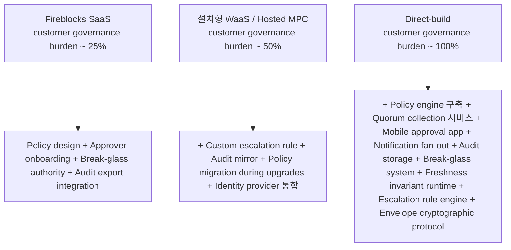

### 10.3 Governance burden 의 lock-in pivot

가장 큰 burden 영역:
1. **G1 Policy engine** — 정책 DSL / evaluator / version migration 의 자체 구축은 매우 큰 투자.
2. **G5 Notification + G3 Quorum UI** — mobile approval app 의 build / maintenance = 자체 mobile team 필요.
3. **G7 Escalation engine** — rule DSL + execution + monitoring.
4. **G9 Governance audit storage** — 규제 retention 충족 + forensic UI.

이 4 가 governance 의 ~80% (★ Hypothesis).

### 10.4 Recommendation (운영 관점)

| Context | 권장 |
|---|---|
| 자산 규모 < threshold, 운영 인력 적음, 정책 단순 | SaaS — G1 + G3 + G5 + G7 outsource 이득 극대 |
| 중견, governance 자체 control 필요 | Hosted MPC + Custom policy migration — G1 / G7 partial customer 소유 |
| 대형 / 자체 governance ecosystem 보유 / 규제 자체 대응 | Direct-build — 단 mobile approval app 자체 구축 burden 인식 필요 |
| Family office / single-user custody | governance 의 일부 (G3 quorum) 가 불필요할 수도 — 단일 approver 정책 가능 |

→ 추천 ≠ fact. Governance complexity 수용 능력 (인력 / 규제 / cost) 별 의사결정.

---

## 11. 핵심 Reasoning Question (Q1-Q10)

### Q1. Approval 의 state machine 이 왜 11 state 인가

§2.1. 단순 Pending/Approved/Rejected 3-state 가 governance fragility 를 표현 못함. 특히:
- PARTIALLY_APPROVED (quorum collection 의 대부분 시간 + fragility surface)
- STALE_EVIDENCE (policy version drift / freshness loss 의 별도 forensic state)
- ESCALATED (별도 approver set, 별도 audit context)
- EMERGENCY_APPROVED (별도 audit class + post-hoc review SLA)

위 4 state 가 없으면 governance forensic / SLA monitoring / risk metric 모두 불가능.

### Q2. Approval success ≠ Signing success — governance 관점 확장

D2 Q2 의 governance side reasoning.
- Approval = governance decision 의 evidence 보유.
- Signing = cryptographic operation 의 결과.
- Approval 후 signing 실패 시: governance 는 "허가했지만 실행 못함" — re-signing 시 새 envelope 또는 기존 envelope 재사용 결정 필요 (§8.4).
- Approval 의 evidence 가 STALE 이 되면 signing 자체가 거부 — approval result 가 영구 valid 아님.

### Q3. Quorum collection 이 어려운 이유

§3 의 5 difficulty:
1. Threshold mode 의 다양성 (simple / weighted / role-stratified / conditional)
2. Concurrent decision race condition
3. Approver role 변경 / 회수
4. Duplicate decision handling
5. Policy version drift 중 evidence 의 freshness

→ 단순 boolean OR 이 아닌 **append-only event accumulation + atomic threshold check + freshness invariant** 의 결합.

### Q4. Policy evaluation lifecycle 의 핵심 invariant

§4. **PolicyVersion pinning at request time** — mid-flight policy 변경이 진행 중 ApprovalRequest 의 평가 기준을 바꾸지 않음. 이는 D1a 의 L5 versioned-immutable 의 직접 활용.

### Q5. Approval expiration semantics

§5.2 의 two-clock model:
- **Window (W)**: 결정 시간 한도
- **Freshness (F)**: 결정 → signing 사이 max gap

→ 둘은 다른 invariant, 다른 audit, 다른 timeout state.

### Q6. Re-approval / cancellation / escalation 의 분리

| 동작 | 의미 | 결과 |
|---|---|---|
| Re-approval | 같은 tx 에 대해 새 ApprovalRequest | 새 evidence chain (단, 원본 EXPIRED audit 포함) |
| Cancellation | requester / admin 의 명시적 취소 | CANCELLED 상태, partial decision 은 audit 만 |
| Escalation | timeout / unavailable approver 시 자동 alternative path | ESCALATED 상태, 새 approver set, 같은 ApprovalRequest 의 continuation |

→ 셋은 다른 governance event, 다른 audit trail.

### Q7. Emergency break-glass 가 위험한 이유

§6.4:
- Normal governance 의 우회 — abuse 시 governance 자체 무력화.
- Frequency 가 anomaly signal — 빈번한 break-glass = governance design 문제.
- Compensating control: break-glass 자체도 quorum + mandatory post-hoc review SLA.
- 모든 break-glass 는 별도 audit class — frequency SLO 대상.

### Q8. Approval ↔ Signing coupling 의 trust boundary

§8. **Signed decision envelope = trust boundary 의 protocol**.
- Approval aggregate 의 internal state 는 signing 의 관심사 아님.
- Envelope 검증이 firewall — approval bug 가 signing 으로 propagate 못함.
- 1 envelope = 1 SigningRequest (single-use property 권장).

### Q9. Governance audit immutability 의 이유

§7. **3 motive**:
1. 부인 방지 (non-repudiation) — approver 의 decision 사후 부인 불가.
2. Forensic reconstruction — incident 발생 시 governance 의사결정의 시퀀스 재현.
3. 규제 (SOC2 / ISO27001 / SOX) — append-only governance log 요구.

→ 따라서 G9 evidence chain 은 D1a L6 의 가장 strict 한 retention + immutability 적용.

### Q10. Multi-actor coordination 의 irreducible complexity

§9.1 (F10). Human approver 의 가용성은 automation 의 자연 limit.
- Mitigation 가능: escalation, SLA monitoring, mobile app, push notification.
- Eliminate 불가: 결국 human 이 결정.
- Governance design 의 핵심은 **fragility 를 인정하고 설계** — escalation tree + break-glass path 가 그 인정의 결과.

---

## 12. Open Questions / Org Policy 영역

| 영역 | 질문 | 본 문서 범위 밖 이유 |
|---|---|---|
| Approval window (W) | 1h / 24h / 7d? per tx category? | governance 강도 + UX |
| Evidence freshness (F) | 5m / 1h / 24h? | risk appetite + tx velocity |
| Quorum threshold mode | simple / weighted / stratified / conditional? | governance design |
| Approver role 변경 시 decision validity | 시점-of-decision 또는 시점-of-approve? | 보수성 수준 |
| Duplicate decision handling | last-wins or first-frozen? | governance style |
| Signing retry 시 re-approve | 매 retry 새 envelope or 재사용? | safety vs overhead |
| Break-glass authority 구성 | single / quorum / role-stratified? | crisis governance design |
| Break-glass frequency SLO | quarter 당 N 회? | abuse detection threshold |
| Policy DSL choice | Rego / CEL / custom / vendor proprietary? | tech stack + portability |
| Notification channel diversity | push / email / SMS / signed message? | reliability + UX |
| Mobile approval app | build / buy / vendor SaaS? | mobile capability + cost |
| Audit retention 기간 | 5y / 7y / forever? | 규제 |
| Post-hoc review SLA (break-glass) | 24h / 7d / 30d? | crisis ops maturity |
| Re-approval triggers | 어떤 변화가 STALE_EVIDENCE 를 invoke 하는가? | governance sensitivity |
| Multi-jurisdiction approval | 지역별 approver 요구? | 규제 + 법인 구조 |

---

## 13. 관련 wiki / entity reference + Uncertainty Boundary

### 관련 wiki

| 참조 | 어디서 사용 |
|---|---|
| [[entities/fireblocks/admin-quorum]] | §2, §3 (Quorum collection model) |
| [[entities/fireblocks/approval-group]] | §3, §4 (approver group + quorum threshold) |
| [[entities/fireblocks/policy]] | §1, §4 (PolicyVersion pinning) |
| [[entities/fireblocks/transaction]] | §8 (Approval ↔ Signing coupling) |
| [[entities/fireblocks/workspace-keys-backup]] | §6.5 (Recovery 의 governance burden — Stage 29-31) |
| [[entities/fireblocks/recovery-passphrase]] | §6.5 (recovery governance) |
| [[entities/fireblocks/callback-handler]] | §4.3 (callback as policy gate) |
| [[vendors/fireblocks/architecture]] | §1, §2 (3-level governance reference) |
| [[vendors/fireblocks/risks]] | §6.4 (break-glass abuse), §9 (Risk-S09 / Risk-S16 governance implications) |
| [[docs/architecture/vault-wallet-ledger-db-schema]] | §1, §7 (D1a L5 PolicyVersion / L6 audit) |
| [[docs/architecture/signing-workflow-orchestration]] | §0, §8 (D2 Approval ↔ Signing boundary) |

### Uncertainty Boundary (★ 절대 유지)

- 본 문서의 **G1-G10 sub-plane / 11-state governance SM / two-clock freshness model / break-glass abuse pattern / 80% burden 분포** 는 모두 **generalized custody governance architecture pattern** (Hypothesis ★). 특정 vendor 의 internal 구현이 동일하다고 주장하지 않음.
- Fireblocks 의 3-level governance (Admin Quorum / Approval Group / Policy) 는 reference model 로 인용.
- §10.2 의 burden 백분율 (~25% / ~50% / ~100%) 는 operational reasoning estimate — 측정값 아님.
- §10.4 의 추천 architecture 는 운영 관점 권장 — fact 아님.
- §11 에 명시된 영역은 본 문서가 결정하지 않음.
- "확정 fact" 영역 (Fireblocks vendor docs 직접 인용 가능): wikilink + 출처 명시. 그 외는 generalized reasoning.

### 다음 단계 (D3 이후)

- **D1b — Blockchain Reconciliation**: D2 §7 의 watermark / depth / reorg 처리.
- **D4 — Recovery Ceremony Generalized**: §6.5 의 recovery governance burden 의 확장 — Stage 29-31 의 generalized full cycle.
- **D5 — Audit / Event Sourcing**: G9 governance audit + L6 audit 의 통합 outbox + projection pattern.
- **D6 — 3-way Decision Framework**: §10.4 의 의사결정 framework formalize.

→ D3 의 governance boundary 가 D4 (recovery) 와 D5 (audit) 의 reasoning baseline.

---

**Stage 32 D3 completion timestamp**: 2026-05-19.
