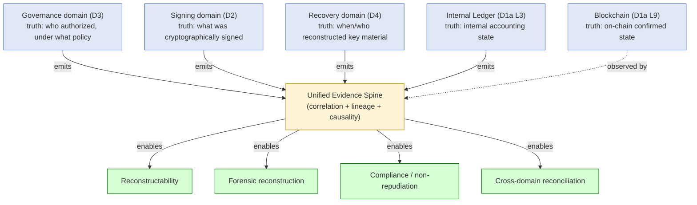
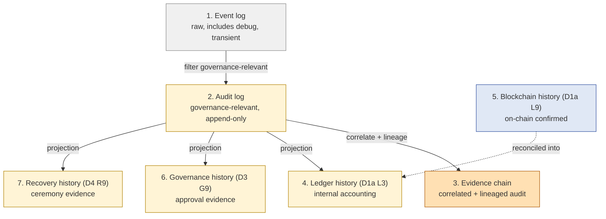
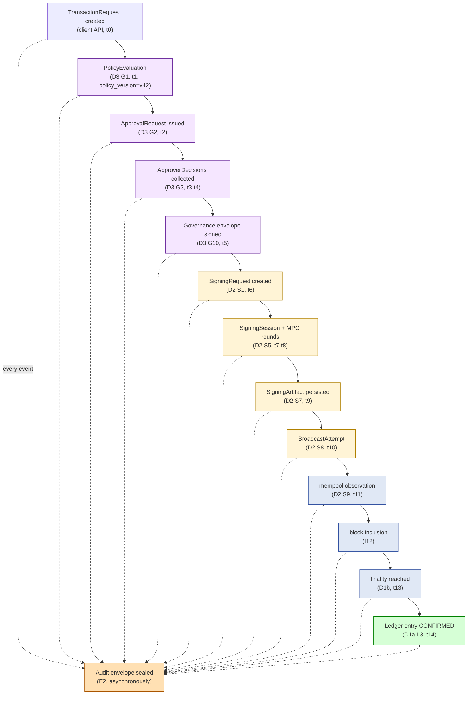
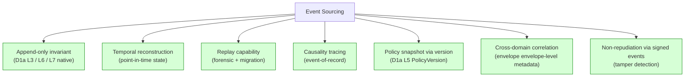
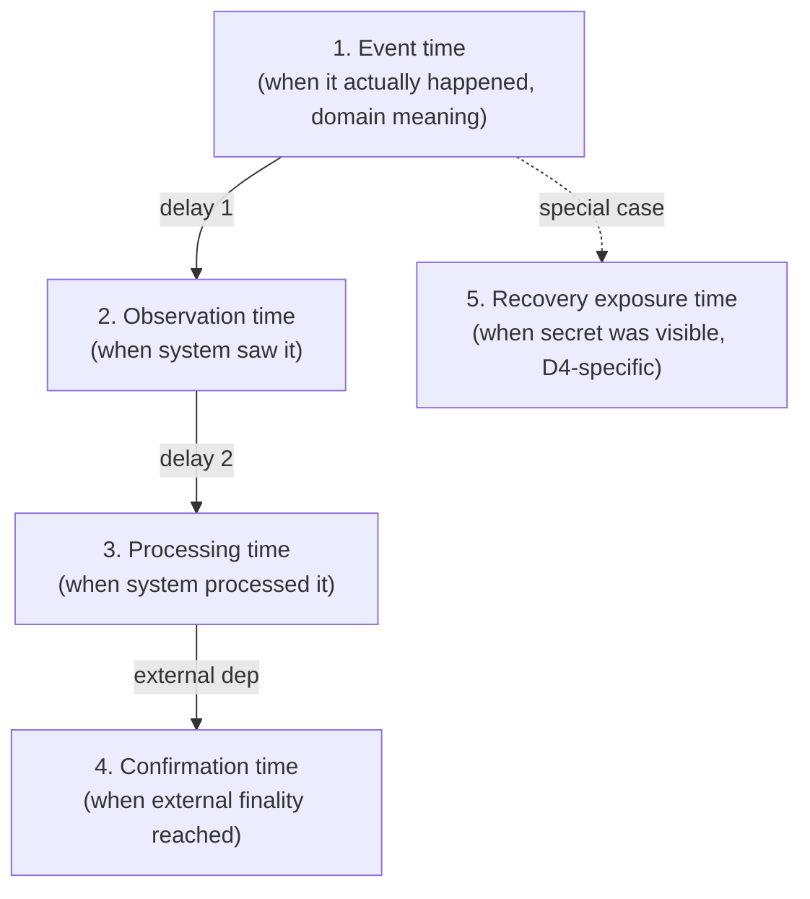
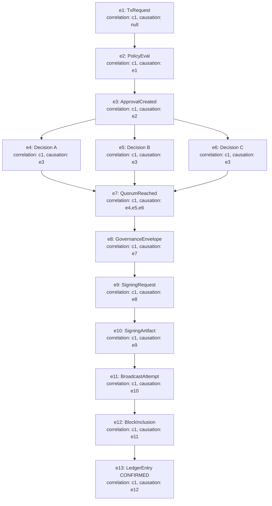
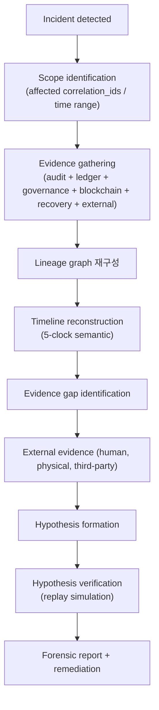
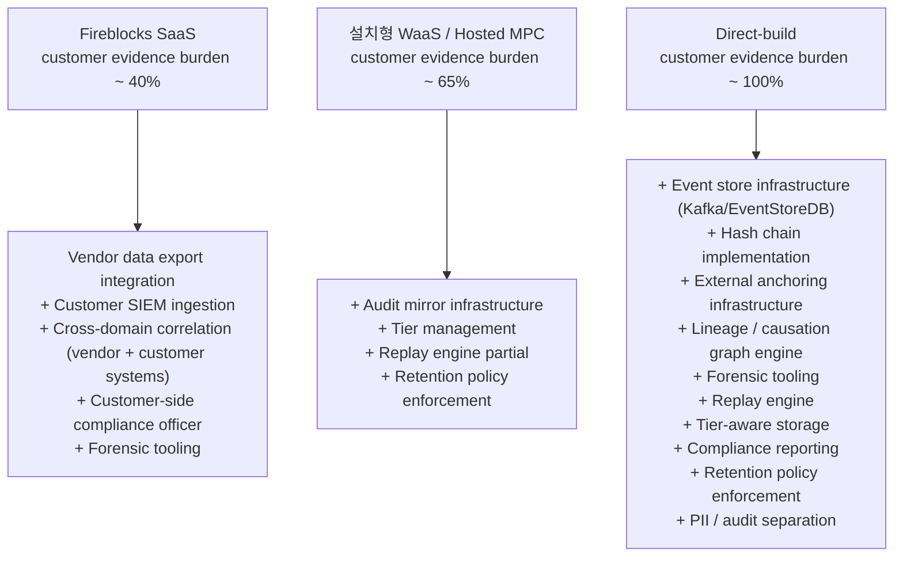

# Custody Wallet — Audit / Event Sourcing / Evidence Chain Reasoning

> **본 문서의 위치**: D1a (ledger truth) + D2 (signing truth) + D3 (governance truth) + D4 (recovery truth) 의 **5 가지 truth domain** 을 **Unified Evidence Spine** 으로 통합 reasoning. Reconstructability 가 custody invariant 의 core 인 이유 + event sourcing 의 적합성 + audit limitation 의 boundary 명시.

> **본 문서가 답하는 핵심 질문**: 왜 custody system 의 핵심 output 은 transaction 자체가 아닌 **reconstructable evidence** 인가? 왜 "현재 상태" 가 audit 에 충분하지 않은가? 왜 append-only 만으로는 tamper-proof 가 보장되지 않는가? Cross-domain truth (governance / signing / recovery / ledger / blockchain) 의 consistency 를 어떻게 정의하는가?

---

## 0. 핵심 명제 (10초 이해)

1. **Custody systems are fundamentally evidence systems.** — 본 문서의 thesis.
2. **Current state ≠ reconstructable truth** — "지금 무엇인가" 는 "어떻게 그 상태가 됐는가" 를 모른다.
3. **Audit log ≠ evidence chain** — 모든 log 가 audit-grade evidence 가 아님; correlation + lineage + causality 가 추가되어야 evidence chain.
4. **Append-only ≠ tamper-proof** — append-only 는 mutation 방지일 뿐; storage substrate 의 무결성은 별도 invariant.
5. **5 truth domains 가 독립적으로 존재** — Governance truth (D3) / Signing truth (D2) / Recovery truth (D4) / Ledger truth (D1a internal) / Blockchain truth (D1a L9 external) 의 inter-domain consistency 가 reconciliation 의 본질.
6. **Reconstructability = core custody invariant** — "what happened / who authorized / what policy / what signed / what reconstructed / what was visible" 모두 재구성 가능해야.
7. **Absence of evidence ≠ Evidence of absence** — missing event 가 "그 event 가 없었다" 의 증명 아님.
8. **Timestamp ≠ trustworthy ordering** — single clock 으로는 cross-domain ordering 결정 불가.
9. **Event sourcing 은 custody 에 적합하지만 자동 audit safety 보장 아님** — 적용 boundary 명확히.
10. **Human evidence dependency 는 irreducible** — out-of-band approval / physical ceremony / witness 등의 evidence 는 system 밖.

---

## 1. Unified Evidence Spine

5 truth domain 을 횡단하는 evidence backbone.



### 1.1 E1-E10 evidence sub-plane

| Sub-plane | 책임 | D1a-D4 매핑 | 저장 / 실행 |
|---|---|---|---|
| **E1 Event capture** | 각 domain 에서 발생하는 모든 state-affecting event 의 emission | D1a L6 + D2 S10 + D3 G9 + D4 R9 | outbox pattern + 동기 emit |
| **E2 Audit log plane** | raw event log, append-only | D1a L6 | event store (Kafka / append-only RDBMS / object store) |
| **E3 Evidence chain plane** | correlation-id 로 묶인 cross-domain event 시퀀스 | E2 위의 logical view | indexed projection |
| **E4 Causality plane** | parent-of / caused-by lineage 명시 | E3 + envelope metadata | graph index |
| **E5 Snapshot plane** | point-in-time projection (정책 / 권한 / 보유자산) | D1a L5 PolicyVersion + 별도 snapshot | versioned snapshot store |
| **E6 Retention plane** | policy-driven lifecycle (hot / warm / cold / WORM) | D1a L6 + L7 | tiered storage |
| **E7 Replay plane** | deterministic / non-deterministic reconstruction | E2 / E3 | replay engine |
| **E8 Forensic plane** | incident-driven query + reconstruction | E3 + E4 + E7 | analyst tooling |
| **E9 Cross-domain correlation** | 5 truth domain 간 event linking | E3 + E4 | correlation engine |
| **E10 Compliance / non-repudiation** | 규제 / 법적 evidence 보존 + signed proof | E2 + E5 + E6 | tamper-resistant storage + signing |

### 1.2 Spine 의 5 기능

| 기능 | 산출 |
|---|---|
| **Reconstructability** | 임의 시점 t 의 system state 재구성 |
| **Forensic reconstruction** | incident 시 "무엇이 일어났는가" 의 evidence-backed 답 |
| **Compliance / non-repudiation** | 규제 audit + 법적 절차에 제출 가능한 evidence |
| **Cross-domain reconciliation** | 5 truth domain 간 inconsistency detection + resolution |
| **Causal traceability** | event A → event B 의 lineage 추적 |

→ 위 5 기능 모두 evidence chain 의 quality (correlation 완전성 + lineage 정확성 + retention 충분성) 에 의존.

---

## 2. 7-Tier History Decomposition

"모든 log 가 audit-grade evidence 가 아님" 의 reasoning. 7 종류 history 분리.



### 2.1 분리 reasoning

| History | 무엇이 다른가 | 왜 분리해야 하는가 |
|---|---|---|
| **1. Event log** | raw — debug / transient / non-governance event 포함 | 다른 retention, 다른 access, 다른 throughput |
| **2. Audit log** | governance-relevant 만 filter; append-only invariant | regulatory requirement + retention SLA |
| **3. Evidence chain** | audit log + correlation_id + causality link + envelope | forensic / reconstruction 의 primary surface |
| **4. Ledger history (L3)** | internal accounting 의 append-only entry | 회계 무결성 + 별도 retention |
| **5. Blockchain history (L9)** | external authoritative state | system 이 mutation 불가 — observation 만 |
| **6. Governance history (G9)** | approval evidence 의 별도 chain | governance 별 retention + access policy |
| **7. Recovery history (R9)** | ceremony evidence 의 매우 strict chain | 가장 strict retention + 별도 access |

→ "모든 것을 single audit log 에 합치면 안 됨" — retention / access / throughput / regulatory requirements 가 모두 다름.

### 2.2 History 간 truth ranking

| 충돌 시 우선순위 | 이유 |
|---|---|
| Blockchain history (H5) >> Ledger history (H4) | on-chain 이 authoritative; internal ledger 가 chain 과 불일치 시 ledger 가 reconcile |
| Governance history (H6) ⊥ Signing history | 둘은 독립 truth domain — 충돌 자체가 inconsistency incident |
| Recovery history (H7) >> Governance history (H6) for ceremony evidence | recovery 의 forensic 중요도 ↑ + 별도 retention |
| Evidence chain (H3) projection: 단방향 | H3 는 H2/H4/H6/H7 의 read-only view — H3 mutation 으로 raw 영향 안 줌 |

→ Truth ranking 은 reconciliation algorithm 의 입력 — D1b 의 영역에서 활용.

### 2.3 "모든 log = evidence" 의 anti-pattern

(★ Hypothesis — operational pattern)

- Debug log 를 audit 으로 promote 하면: signal-to-noise ratio ↓ + retention cost ↑ + access policy 모호.
- Application metric 을 governance evidence 로 사용하면: timestamp ordering / completeness 보장 부족.
- ⇒ Event log → Audit log promote 는 **explicit filtering** 단계 필요 — schema 검증 + 필수 field 검증 + envelope signing.

---

## 3. Cross-Domain Event Lineage

### 3.1 5 truth domain causality chain (예시)



### 3.2 Lineage 의 6 question

(★ 본 문서의 core reasoning)

| Question | answer source |
|---|---|
| **Why** | Policy + Approval reason |
| **Who** | Approver identity at decision time |
| **Under which policy** | PolicyVersion snapshot pinned at request time |
| **From which request** | client_request_id + correlation_id |
| **Signed by which authority** | Signing envelope + signer set |
| **Affecting which ledger mutation** | LedgerEntry FK + transaction_id |

→ 위 6 question 의 답이 **단일 query 로 추출 가능** = causal traceability 의 달성.

### 3.3 Correlation ID + Causation ID 분리

| 개념 | 의미 | 예 |
|---|---|---|
| **correlation_id** | 같은 user-level operation 의 모든 event 를 그룹화 | 한 tx 의 모든 stage 가 같은 correlation_id |
| **causation_id** | 이 event 를 직접 trigger 한 parent event | ApprovalRequest 의 causation_id = TransactionRequest 의 event_id |
| **trace_id** (optional) | distributed tracing 용 — request-scope | 한 user request 의 모든 internal RPC call |

→ correlation = horizontal grouping, causation = vertical lineage. 둘 다 envelope metadata 의 mandatory field.

### 3.4 Envelope schema (필수 field)

(generalized — implementation 은 D-impl)

| Field | 목적 |
|---|---|
| event_id (UUID) | unique identity |
| event_type | schema discriminator |
| correlation_id | horizontal grouping |
| causation_id | vertical lineage |
| event_time | when it happened (도메인 의미) |
| observation_time | when system saw it |
| processing_time | when system processed it |
| actor (or signer) | who emitted |
| workspace_id / tenant_id | multi-tenant scope |
| envelope_signature | tamper detection |
| schema_version | event schema migration |

---

## 4. Event Sourcing Reasoning

### 4.1 왜 custody system 이 ES 와 잘 맞는가



### 4.2 그러나 ES ≠ automatic audit safety

(★ 핵심 명제 §0.9)

| ES 가 자동 제공 안 하는 것 | 보완 필요 영역 |
|---|---|
| Tamper detection on storage | envelope signing + WORM storage + hash chain |
| Event completeness guarantee | outbox + dedup + observability |
| Cross-domain ordering | external clock + sequencing protocol |
| Human-side evidence | physical witness + photo + signed paper |
| Deterministic replay | environment immutability + dependency pinning |
| Schema evolution safety | event versioning + migration tooling |
| Retention policy enforcement | tier-aware storage + access control |

→ ES 채택은 **starting point**, not the end. 위 7 영역의 보완이 audit-grade evidence 의 condition.

### 4.3 ES boundary (D1a §6.1 의 재확인)

| Plane | ES 적합도 | 권장 |
|---|---|---|
| L3 Ledger | **Strong** | full ES |
| L6 Audit / Webhook | **Strong** | event store |
| Approver Decision (D3 G3) | **Strong** | event store |
| Recovery Custodian Decision (D4 R3) | **Strong** | event store |
| Transaction lifecycle (D2) | **Medium** | CRUD + outbox emission |
| Signing lifecycle (D2 S1) | **Medium** | CRUD + outbox emission |
| Approval lifecycle (D3) | **Medium** | CRUD + outbox emission |
| Recovery lifecycle (D4) | **Medium** | CRUD + outbox emission |
| Recovery metadata (D4 R5) | **Weak** | CRUD + emission |

→ **Selective ES** 가 원칙. 전체 ES 강제는 reorg replay / schema evolution / migration burden 폭증.

### 4.4 Outbox pattern (cross-domain consistency 의 mechanism)

```
[OLTP transaction] {
   UPDATE aggregate state
   INSERT into outbox (event_type, correlation_id, causation_id, payload, ...)
} COMMIT

→ outbox publisher publishes to event store + downstream
→ at-least-once delivery
→ consumer 가 idempotency 보장 (event_id 기반 dedup)
```

→ Outbox 가 atomic state mutation + event emission 의 boundary. 별도 message broker 사용 시 distributed transaction 회피 핵심 패턴.

---

## 5. Temporal Semantics (5 clocks)

### 5.1 단일 timestamp 의 한계

"`t = 1716000000` 에 발생" 의 문제:
- 어느 system 의 clock 인가?
- "발생" 의 의미가 무엇인가? (요청? 처리? 완료? confirmation?)
- Cross-domain 비교 시 어느 clock 기준인가?

→ 단일 timestamp 로는 custody reconstruction 불가능.

### 5.2 5 temporal semantics



| Clock | 의미 | 예 |
|---|---|---|
| **Event time (T1)** | 도메인 관점 "발생 시각" | "user clicked submit at 10:00" |
| **Observation time (T2)** | system 이 인지한 시각 | "API ingress logged 10:00:02" |
| **Processing time (T3)** | system 이 process 시작한 시각 | "policy engine evaluated at 10:00:05" |
| **Confirmation time (T4)** | external authority (blockchain) 가 인정한 시각 | "block confirmed at 10:05:00" |
| **Recovery exposure time (T5)** | secret material 의 visible window 시각 | "key material in RAM from 10:30:00 to 10:30:15" (D4-specific) |

### 5.3 왜 5 clock 다 필요한가

| Scenario | 어느 clock 이 필요? |
|---|---|
| "user 가 언제 결정했나?" | T1 |
| "system 이 언제 그 결정을 봤나?" | T2 |
| "system delay 가 얼마인가?" | T2 - T1 |
| "blockchain 에 언제 finalize 됐나?" | T4 |
| "총 latency 는?" | T4 - T1 |
| "recovery 의 exposure 가 얼마나 지속됐나?" | T5 range |
| "incident 시 정확히 무엇이 t* 시점에 진행 중이었나?" | T1-T5 모두 |

### 5.4 Cross-domain ordering 의 문제

- Single clock (예: NTP-synced system clock) 만으로는 cross-domain ordering 부정확.
- Clock skew (ms ~ seconds) 가 cross-domain causality 를 inverted 시킬 수 있음.
- 해결 패턴:
  - **Logical clocks** (Lamport / vector clock) — system 내부 causality 만 보장
  - **Hybrid logical clocks (HLC)** — physical + logical 결합
  - **External authority** (blockchain confirmation time) — cross-domain anchoring
  - **Causation_id chain** — direct lineage, clock 없이 ordering 보장

→ 권장: **causation_id chain 을 primary**, timestamp 는 secondary metadata.

### 5.5 "Timestamp ≠ trustworthy ordering" reasoning

- Distributed system 의 clock 은 fundamentally untrusted (Lamport 1978).
- 두 다른 host 의 timestamp 비교는 "결과적으로 보였다" 일 뿐, "정말 먼저 일어났다" 의 증거 아님.
- Custody-grade audit 에서 ordering 결정은 **causation_id chain** 또는 **single-source sequence number** 에 의존.

---

## 6. Causality & Lineage

### 6.1 Event causality graph (full lineage)



### 6.2 Multi-causation events

- e7 (QuorumReached) 는 **다중 causation** (e4, e5, e6) — 여러 events 가 함께 trigger.
- causation_id 는 array 또는 별도 lineage table 로 model.
- 단순 단일 parent 모델은 fan-in event 표현 불가.

### 6.3 Lineage query 의 6 question 재구성

§3.2 의 question 을 lineage query 로:

| Question | Lineage 경로 |
|---|---|
| Why | e_target → causation chain → policy reason field |
| Who | causation chain → first ApproverDecision event → actor |
| Under which policy | causation chain → PolicyEval event → policy_version |
| From which request | correlation_id → 최초 ingress event |
| Signed by which authority | causation chain → SigningArtifact event → signer set |
| Affecting which ledger mutation | causation chain → LedgerEntry events |

→ 모든 6 question 이 **단일 correlation_id + causation graph traversal** 로 답 가능.

### 6.4 Lineage 의 storage model

(★ generalized; implementation 은 D-impl)

옵션:
- **Inline metadata** — 모든 event 의 envelope 에 causation_id field
- **Lineage table** — 별도 table 로 (event_id, parent_event_id) edge
- **Graph database** — Neo4j / similar
- **Append-only log only + offline graph build** — production cheap + analytics rebuild

→ 권장 (★ Hypothesis): inline metadata + offline graph build. Online query 는 correlation_id 의 BFS.

---

## 7. Replay / Forensic Reconstruction

### 7.1 Replay vs Deterministic Replay

| 개념 | 의미 |
|---|---|
| **Replay** | event stream 을 다시 재생 — state projection 재구축 |
| **Deterministic replay** | replay 결과가 매번 동일 — 외부 의존성 없음 |
| **Forensic reconstruction** | replay + 외부 evidence + manual analyst correlation |

→ "replay capability ≠ deterministic replay" — 외부 의존성 (외부 API call, blockchain RPC, 시간 의존 logic) 때문에 deterministic replay 어려움.

### 7.2 Replay 의 4 use case

| Use case | Replay 형태 |
|---|---|
| **State projection rebuild** | event stream → 현재 state (Ledger balance, etc.) |
| **Bug investigation** | event stream + 코드 → 어디서 잘못됐나 |
| **Forensic reconstruction** | event stream + external evidence → incident timeline |
| **Schema migration** | old event stream → new schema projection |

### 7.3 Deterministic replay 의 조건

(★ Hypothesis — ES literature)

- Pure function projection (외부 의존 없음)
- Fixed schema (또는 explicit version handling)
- Fixed code version (deterministic code)
- No wall-clock 의존 (event 의 timestamp 만 사용)
- No randomness (또는 random seed 도 event 의 일부)

→ 위 5 조건 모두 만족이 보장된 projection 만 deterministic replay 가능. Custody system 의 대부분 projection 은 deterministic replay 가능하지만, 외부 API 결과 (KYC, fraud score, market price) 의존 logic 은 외부 evidence 필요.

### 7.4 Forensic reconstruction flow



### 7.5 Forensic 의 한계

(§10 의 audit limitation 의 forensic side)

- Evidence gap 은 본질적 — system 외부 event (human 통화, physical handoff, off-system communication) 는 capture 안 됨.
- "Absence of evidence ≠ Evidence of absence" — missing event 가 event 의 부재 증명 아님.
- 따라서 forensic report 는 항상 **probabilistic** — "available evidence 로 most likely scenario".

---

## 8. Evidence Retention Lifecycle

### 8.1 Multi-tier retention model

```mermaid
graph TB
    HOT["Hot tier<br/>OLTP / hot OLAP<br/>0-90d, query latency ms"]
    WARM["Warm tier<br/>warm storage / columnar<br/>90d-2y, query latency s"]
    COLD["Cold tier<br/>object store / archive<br/>2y-7y, query latency min-h"]
    WORM["WORM tier<br/>immutable retention<br/>7y-forever, query latency h+"]
    PURGE["Purge<br/>(only when 규제 allows)"]

    HOT -->|age out| WARM
    WARM -->|age out| COLD
    COLD -->|age out / explicit promote| WORM
    WORM -.->|legal retention end (if allowed)| PURGE

    classDef immut fill:#fff4d6,stroke:#b08000
    class WORM,COLD immut
```

### 8.2 Tier 별 retention 권장

(★ Hypothesis — 규제 + operational reasoning)

| Tier | 기간 | 어떤 evidence |
|---|---|---|
| Hot | 0-90일 | recent transaction / approval / signing event |
| Warm | 90일-2년 | historical audit / governance evidence |
| Cold | 2년-7년 | compliance audit history |
| WORM | 7년-forever | recovery evidence / governance incident / 규제 mandate |

→ Recovery evidence (D4 R9) 는 **항상 WORM** 권장 — forensic 중요도 최상 + 빈도 매우 낮음.

### 8.3 Retention policy 의 dimension

| Dimension | 결정 |
|---|---|
| 기간 (years) | 규제 (지역 / 자산 종류 별 다름) |
| Access policy (who can query) | tier 별 access role |
| Immutability guarantee | WORM / hash-chain / blockchain anchor |
| Deletion 가능 여부 | 규제 mandates + GDPR / similar right to erasure |
| Export 가능 여부 | data sovereignty + regulatory submission |
| Cost (per GB·year) | operational budget |

### 8.4 Right-to-erasure tension

(★ Hypothesis — regulatory pattern)

- GDPR / similar privacy law: "user 가 own data 의 erasure 요구 가능".
- Custody audit: "evidence 는 immutable + long retention".
- → 충돌 영역 — privacy law 가 custody audit 의 immutability 와 어떻게 reconcile?
- 공통 해결 패턴:
  - PII 와 audit event 의 분리 storage (audit 은 pseudonymous, PII 는 별도 lookup table)
  - PII 의 erasure 가 audit event 의 integrity 영향 안 줌
  - 단, audit 자체에 PII 가 포함되면 deletion 불가능 — 별도 legal hold 적용

→ Schema design 시점부터 PII / audit 분리 필수 (★ Hypothesis level — 규제 영역 별 다름).

---

## 9. Operational Fragility Map

```mermaid
graph TB
    F1["F1. Cross-system clock skew<br/>(distributed timestamp 불일치)"]
    F2["F2. Missing event ingestion<br/>(outbox publisher failure)"]
    F3["F3. Duplicate event<br/>(at-least-once delivery)"]
    F4["F4. Replay inconsistency<br/>(external dependency drift)"]
    F5["F5. Event ordering ambiguity<br/>(concurrent multi-source)"]
    F6["F6. Correlation failure<br/>(correlation_id 누락 / 분기)"]
    F7["F7. Partial evidence retention<br/>(tier 간 access 불일치)"]
    F8["F8. Retention expiration<br/>(prematurely deleted evidence)"]
    F9["F9. Human-side evidence gap<br/>(off-system action)"]
    F10["F10. External dependency evidence loss<br/>(third-party API log 사라짐)"]

    F1 -->|mitigation| M1["HLC / causation_id primary / blockchain anchoring"]
    F2 -->|mitigation| M2["transactional outbox + observability metric on lag"]
    F3 -->|mitigation| M3["consumer idempotency via event_id"]
    F4 -->|mitigation| M4["dependency pinning + external evidence capture"]
    F5 -->|mitigation| M5["single-source sequence per aggregate"]
    F6 -->|mitigation| M6["envelope schema validation + lineage check"]
    F7 -->|mitigation| M7["tier-aware access policy + audit on tier transition"]
    F8 -->|mitigation| M8["explicit retention policy + legal hold mechanism"]
    F9 -->|mitigation| M9["procedural witness + signed paper + photo archive"]
    F10 -->|mitigation| M10["mirror external evidence at consumption time"]
```



### 9.1 F9 의 의미 — Human-side evidence gap

(★ Hypothesis — operational reasoning, irreducible)

- Approval / Recovery 의 일부 evidence 는 system 외부에서 발생:
  - 전화 confirmation
  - In-person ceremony
  - Physical handoff (sealed envelope)
  - Out-of-band signed paper
- 이들을 system 안으로 가져오려면 **explicit capture** 필요:
  - Signed photo upload
  - Witness signature
  - Notary attestation
  - Video recording with hash anchor
- 그러나 capture 자체도 unreliable (사람이 누락 / 위조 가능).
- → "Human-side evidence dependency" 는 system design 의 irreducible limit.

### 9.2 F10 — External dependency evidence loss

- KYC provider API call result, blockchain RPC response, market data oracle 등은 third-party 가 owner.
- Third-party 의 retention 정책에 종속 — 회사가 사라지거나 retention 만료되면 evidence 손실.
- Mitigation: **consumption time 에 mirror** — third-party 응답을 자체 audit log 에 immutable 로 저장.

### 9.3 Fragility 분류

| 분류 | items | 성격 |
|---|---|---|
| **Distributed system** | F1, F3, F5 | technical, mitigatable |
| **Pipeline reliability** | F2, F6, F7 | engineering discipline |
| **Replay limit** | F4 | semi-technical |
| **Retention governance** | F7, F8 | policy-driven |
| **Out-of-system** | F9, F10 | **irreducible** |

---

## 10. Audit Limitations (boundary 명시)

### 10.1 Append-only ≠ Tamper-proof

- Append-only 는 **mutation 방지**의 invariant — application-level enforcement.
- Tamper-proof 는 storage substrate 의 무결성 — application 보다 한 layer 아래.
- Append-only 만 적용한 시스템에서 DB admin 이 raw row 삭제 / 수정 가능.
- Tamper-resistance 보완 기술:
  - **Hash chain** — 매 event 의 hash 가 next event 에 포함
  - **External anchoring** — 주기적으로 hash chain 의 root 를 blockchain 에 commit
  - **WORM storage** — write-once-read-many storage substrate
  - **Signed envelope** — 각 event 의 envelope_signature
  - **Distributed consensus** — multi-replica with Byzantine fault tolerance

→ Tamper-proof 는 위 mitigation 의 stack — 단일 mechanism 으로 보장 불가.

### 10.2 Replay ≠ Perfect Reconstruction

- §7.3 의 deterministic replay 5 조건 — 모두 만족 어려움.
- 외부 의존 logic / wall-clock 의존 / 비결정 source 가 있으면 replay 결과 ≠ original.
- 따라서 forensic reconstruction 은 항상 **approximation** — confidence interval 표시 권장.

### 10.3 Stored Evidence ≠ Complete Truth

- Capture 된 evidence 는 ground truth 의 subset.
- 절대 capture 안 되는 것:
  - Operator 의 의도 (intent)
  - Communication 의 context (왜 그런 결정을 내렸나)
  - Concurrent system 의 internal state (외부 의존)
  - Side-channel signal (timing, power, electromagnetic)
- → Evidence 는 **best-available** approximation. Forensic 결론은 evidence 만으로 closed 안 됨.

### 10.4 Timestamp ≠ Trustworthy Ordering

- §5.5 의 재확인. Distributed system 의 timestamp 는 fundamentally untrusted.
- Custody-grade audit 에서 ordering 결정은 causation_id chain 또는 single-source sequence number.

### 10.5 Audit limitation 의 operational implication

| Limitation | Operational implication |
|---|---|
| Append-only ≠ tamper-proof | hash chain + external anchoring + WORM storage stack 필요 |
| Replay ≠ deterministic | external evidence mirror + dependency pinning |
| Stored ≠ complete | human + physical evidence capture procedure |
| Timestamp ≠ ordering | causation_id primary, timestamp secondary |
| Single audit log = not enough | 7-tier history decomposition (§2) |

---

## 11. SaaS vs Self-hosted vs Direct-build Evidence Burden

### 11.1 Plane × Ownership 매트릭스

| Sub-plane | Fireblocks SaaS | 설치형 WaaS / Hosted MPC | 직접 구축 |
|---|---|---|---|
| **E1 Event capture** | Vendor (automatic) | Vendor + customer integration | Customer |
| **E2 Audit log plane** | Vendor + customer export | Vendor + customer mirror | Customer |
| **E3 Evidence chain** | Vendor (limited) + customer correlation 보완 | Vendor + customer correlation engine | Customer |
| **E4 Causality plane** | Vendor (limited cross-domain) | Vendor + customer | Customer |
| **E5 Snapshot plane** | Vendor PolicyVersion | Vendor | Customer |
| **E6 Retention plane** | Vendor (정해진 retention) + customer extended | Vendor + customer tier mgmt | Customer |
| **E7 Replay plane** | Vendor (limited) — customer 가 자체 replay 구축 | Vendor + customer replay engine | Customer |
| **E8 Forensic plane** | Customer (with vendor support) | Customer (with vendor data) | Customer 자체 forensic team |
| **E9 Cross-domain correlation** | Customer (vendor data export) | Customer | Customer |
| **E10 Compliance / non-repudiation** | Vendor + customer compliance officer | Vendor + customer | Customer |

→ **Audit / Evidence 는 SaaS 사용해도 customer 책임이 상당히 큰 영역** — vendor 의 evidence 가 customer 의 forensic / 규제 / cross-domain reasoning 의 **input** 일 뿐, 완결되지 않음.

### 11.2 Customer evidence burden 비교 (★ Hypothesis)



### 11.3 Evidence burden 의 lock-in pivot

가장 큰 burden 영역 (direct-build 시):
1. **E2 + E6 storage infrastructure** — multi-tier + WORM + hash chain stack.
2. **E3 + E4 correlation / causality engine** — cross-domain lineage graph.
3. **E7 replay engine** — deterministic replay infrastructure.
4. **E10 compliance reporting** — 규제별 format / submission tooling.

이 4 가 burden 의 ~80% (★ Hypothesis).

### 11.4 Why Audit/Evidence 는 vendor 만으로 끝나지 않는가

(★ sovereignty 의 evidence side)

- Compliance / 규제 / 법적 절차의 evidence 의무는 **customer 의 책임**.
- Vendor 의 audit 은 vendor-scope 만 — customer 의 다른 system (CRM, KYC, finance) 의 evidence 와 통합 못함.
- 따라서 customer 는 vendor data + 자체 data 의 **cross-domain correlation engine** 을 직접 보유해야 함.

### 11.5 Recommendation (운영 관점)

| Context | 권장 |
|---|---|
| 자산 < threshold, 규제 light, single system | SaaS — vendor 의 audit 활용 + 간단한 SIEM ingestion |
| 중견, regulated industry, multiple systems | Hosted MPC + 자체 audit warehouse + cross-domain correlation |
| Heavily regulated / 대형 / multi-jurisdiction | Direct-build evidence infrastructure or hybrid + 자체 compliance team |
| Crypto exchange / very high-value | Direct-build + 외부 audit 정기 검증 + external anchoring (blockchain timestamp) |

→ 추천 ≠ fact. Evidence 의 ownership 정도가 **compliance posture 의 핵심 결정**.

---

## 12. 핵심 Reasoning Question (Q1-Q10)

### Q1. Custody system 이 evidence system 인 이유

§0.1 — core thesis. Transaction 의 결과 (fund transfer) 는 chain 이 final authority. 그러나 그 transaction 이 어떻게 발생했는가 (governance / signing / policy / authority) 는 system 의 evidence chain 만이 답할 수 있음. 규제 / 법적 / 운영 forensic / non-repudiation 모두 evidence chain 의 quality 에 의존.

### Q2. Current state ≠ Reconstructable truth

- Current state = 지금 시점의 aggregate 의 status field.
- Reconstructable truth = 임의 시점 t 에 system 이 어떤 state 였는지의 답.
- Current state 는 query 한 시점만 답 — historical reconstruction 불가능.
- Reconstructable truth 는 event chain + snapshot + lineage 의 결합 — 모든 t 에 대해 답 가능.

### Q3. Audit log ≠ Evidence chain

- §2.1 — audit log = raw governance-relevant event sequence.
- Evidence chain = audit log + correlation + causality + envelope signing + lineage graph.
- Audit log 만으로는 "어느 event 가 어느 event 를 trigger 했는가" 답 불가능.
- Evidence chain 은 forensic / reconstruction 의 primary surface.

### Q4. Ledger truth ≠ Blockchain truth

- Ledger truth (D1a L3) = internal accounting state.
- Blockchain truth (D1a L9) = on-chain confirmed state.
- 둘은 서로 reconcile 되어야 — 충돌 시 blockchain 이 authoritative (compensating ledger entry).
- 단, transient state (mempool, pre-confirmation) 에서는 두 truth 가 drift 가능 — D1b 의 reconciliation 영역.

### Q5. Approval truth ≠ Signing truth (D3 의 재확인)

- Approval truth = governance decision evidence.
- Signing truth = cryptographic operation evidence.
- 두 truth 가 충돌 가능 — 예: signing 발생했으나 approval evidence 없음 = governance incident.
- Cross-domain consistency check 가 evidence spine 의 핵심 기능 중 하나.

### Q6. Recovery evidence ≠ Recovery safety (D4 의 재확인)

- Recovery evidence chain 의 완전성 = "어떻게 ceremony 가 진행됐는가" 의 답.
- Recovery safety = "secret material 이 누출 안 됐는가" 의 보장.
- Evidence 가 complete 해도 safety 보장 안 됨 — exposure window 의 leak 은 evidence 에 안 잡힘.

### Q7. Missing event ≠ Event absence

- Evidence chain 에서 특정 event 가 안 보이는 것 ≠ 그 event 가 실제로 일어나지 않은 것.
- 가능한 이유:
  - Pipeline failure (event lost)
  - Outbox publisher down
  - Retention 만료
  - 외부 system 발생, capture 안 됨
- → Forensic 시 missing event 는 hypothesis 의 trigger, conclusion 아님.

### Q8. Replay capability ≠ Deterministic replay

- §7.1 - §7.3.
- Replay 는 event stream 재생; deterministic 은 결과의 결정성.
- 외부 의존 / wall-clock / non-determinism 이 있으면 replay ≠ original.
- Forensic 은 replay 의 approximation + external evidence 의 결합.

### Q9. Append-only ≠ Tamper-proof

- §10.1.
- Append-only 는 application-level invariant.
- Tamper-proof 는 storage substrate 의 무결성.
- 보완: hash chain + external anchoring + WORM + signed envelope + distributed consensus.

### Q10. Timestamp ≠ Trustworthy ordering

- §5.5, §10.4.
- Distributed system 의 clock 은 untrusted.
- Custody-grade ordering 은 causation_id chain 또는 single-source sequence.

---

## 13. Open Questions / Org Policy 영역

| 영역 | 질문 | 본 문서 범위 밖 이유 |
|---|---|---|
| Retention 기간 (per tier) | hot 30/90d? cold 5/7/10y? WORM forever? | 규제 + cost trade-off |
| Hash chain anchoring 주기 | hourly / daily / weekly? | infrastructure cost vs forensic granularity |
| External blockchain anchor | yes / no? which chain? | sovereignty + cost |
| Lineage storage model | inline / table / graph DB? | tech stack + query pattern |
| Replay engine 자체 구축 vs vendor | build / buy? | forensic capability + cost |
| Right-to-erasure handling | PII / audit 분리 strategy? | 규제 (GDPR / CCPA / 지역별) |
| Audit signing key 회전 주기 | quarterly / yearly / on-incident? | crypto policy |
| External evidence capture (human) | mandatory? optional? format? | governance maturity |
| Cross-domain correlation latency | real-time / batch / on-demand? | forensic SLA |
| Compliance reporting cadence | daily / monthly / on-request? | regulatory |
| Forensic team 자체 보유 vs 외주 | in-house / 외주 / hybrid? | scale + frequency |
| Schema evolution policy | strict version / backward compat? | engineering discipline |
| Multi-jurisdiction handling | data residency / cross-border? | legal + 규제 |
| Audit immutability mechanism | hash chain / blockchain anchor / WORM / 모두? | risk appetite + cost |
| Snapshot frequency | minute / hour / day? | replay performance vs storage cost |

---

## 14. 관련 wiki / entity reference + Uncertainty Boundary

### 관련 wiki

| 참조 | 어디서 사용 |
|---|---|
| [[entities/fireblocks/transaction]] | §3 (lifecycle event sequence) |
| [[entities/fireblocks/policy]] | §3, §4 (PolicyVersion snapshot) |
| [[entities/fireblocks/admin-quorum]] | §3 (governance evidence) |
| [[entities/fireblocks/approval-group]] | §3 |
| [[entities/fireblocks/callback-handler]] | §3 (callback event in lineage) |
| [[entities/fireblocks/workspace-keys-backup]] | §8.2 (recovery evidence WORM retention) |
| [[vendors/fireblocks/architecture]] | §11 (vendor evidence model reference) |
| [[vendors/fireblocks/risks]] | §10 (audit limitation reasoning) |
| [[docs/architecture/vault-wallet-ledger-db-schema]] | §1 (L3 ledger, L6 audit, L7 recovery — all evidence domain) |
| [[docs/architecture/signing-workflow-orchestration]] | §3 (signing event lineage), Q5 |
| [[docs/architecture/approval-state-machine-governance]] | §3 (governance event lineage), §6 (Q-question framework), Q5 |
| [[docs/architecture/recovery-ceremony-generalization]] | §1, §8 (recovery evidence WORM), Q6 |

### Uncertainty Boundary (★ 절대 유지)

- 본 문서의 **E1-E10 evidence sub-plane / 7-tier history decomposition / 5-clock temporal model / causation_id primary / selective ES boundary / 80% burden 분포 / human evidence irreducible** 는 모두 **generalized custody audit architecture pattern** (Hypothesis ★).
- Fireblocks 의 audit log / lifecycle events 은 reference model 로 인용 — vendor-specific 구현은 다를 수 있음.
- §11.2 의 burden 백분율 (~40% / ~65% / ~100%) 는 operational reasoning estimate — 측정값 아님.
- §11.5 의 추천 architecture 는 운영 권장 — fact 아님.
- §10 의 audit limitation reasoning 은 distributed system literature (Lamport, ES community) 의 standard 입장 (★ Hypothesis level — 특정 구현마다 detail 다름).
- §13 에 명시된 영역은 본 문서가 결정하지 않음.
- "확정 fact" 영역 (Fireblocks vendor docs 직접 인용 가능): wikilink + 출처 명시. 그 외는 generalized reasoning.

### 다음 단계 (D5 이후)

본 문서는 D5 — **Audit / Event Sourcing / Evidence Chain**. 이후:

- **D1b — Blockchain Reconciliation**: §2.2 의 truth ranking 활용, watermark / depth / reorg compensation 의 evidence-aware algorithm.
- **D6 — 3-way Custody Decision Framework**: §11.5 의 의사결정 framework formalize, evidence ownership 의 sovereignty 결정 포함.
- **D7 — Deposit Lifecycle**: deposit detection → evidence emission → ledger entry, cross-domain event lineage 의 직접 application.
- **D8 — Withdrawal Lifecycle**: D2 + D3 + D4 + D5 의 통합 outbound flow, 매 stage 의 evidence emission spec.

→ Evidence spine (D5) 는 D1b / D6 / D7 / D8 모두의 baseline. 5 truth domain 의 inter-consistency 정의가 향후 reasoning 의 input.

---

**Stage 32 D5 completion timestamp**: 2026-05-19.
