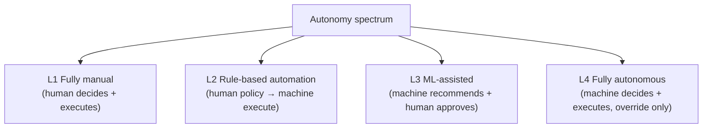
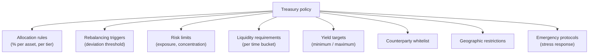
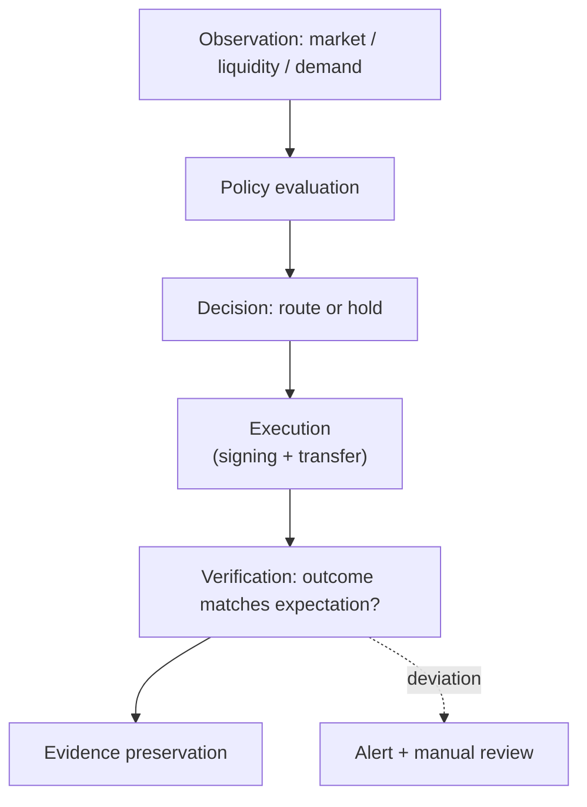
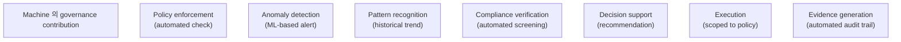
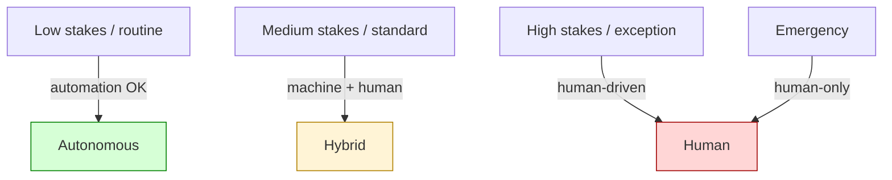
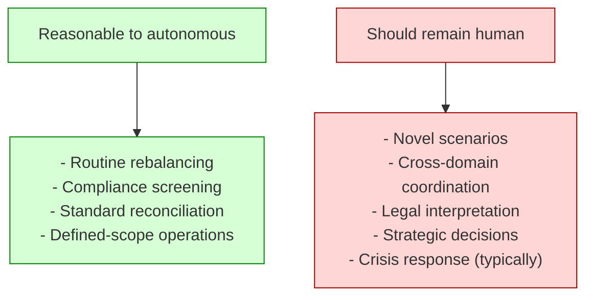
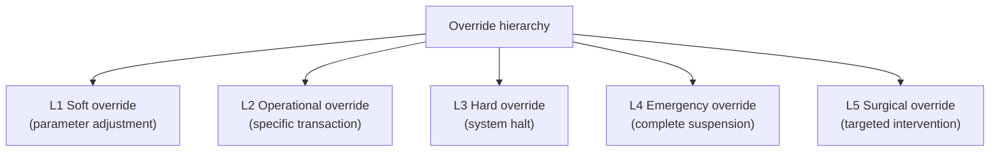
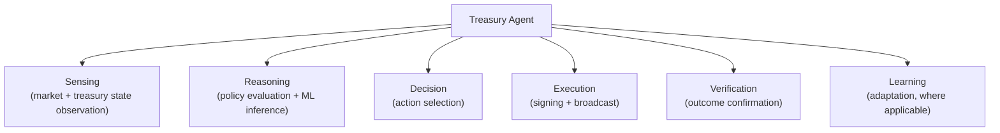

# Custody Wallet — Autonomous Treasury Governance Reasoning

> **본 문서의 위치 (Frontier Cluster D29)**: D17 treasury + D3 governance + D28 intent 위의 **autonomous treasury specialization**. Programmable treasury 의 governance dimension. "Automated balance manager" 가 아닌 **programmable governance under uncertainty**.

> **본 문서가 답하는 핵심 질문**: 왜 automation 이 governance elimination 가 아닌가? 왜 autonomous execution 이 autonomous accountability 와 다른가? 왜 treasury optimization 이 treasury safety 와 다른가? 왜 policy automation 이 policy correctness 보장 아닌가?

---

## 0. 핵심 명제 (10초 이해)

1. **Autonomous treasury = programmable governance system under uncertainty + survivability** (core thesis).
2. **5-tier "≠" 명제 (D29 cluster invariant)**:
   - Automation ≠ Governance elimination
   - Autonomous execution ≠ Autonomous accountability
   - Treasury optimization ≠ Treasury safety
   - Policy automation ≠ Policy correctness
   - Machine governance ≠ Institutional survivability
3. **Autonomy spectrum** — fully manual / rule-based / ML-assisted / fully autonomous.
4. **Accountability 의 irreducibility** — automation 도 final accountability 는 human / organization.
5. **Override mechanism = mandatory** — autonomous system 의 manual stop.
6. **Treasury agent** = programmatic entity that executes treasury policy.
7. **Boundary of autonomy** — what can be automated vs what cannot.
8. **Failure mode 의 unique nature** — autonomous failure 의 amplification + speed.
9. **Audit trail 의 enhanced importance** — autonomous decision 의 explainability.
10. **Frontier 의 cautious adoption** — gradual automation 의 wisdom.

---

## 1. Autonomy Spectrum

### 1.1 4-level autonomy

### 1.2 각 level 의 trade-off

| Level | Speed | Reliability | Accountability clarity | Risk |
|---|---|---|---|---|
| L1 Manual | Slow | Variable (human) | Clear (human) | Human error |
| L2 Rule-based | Fast | High (deterministic) | Policy author | Policy bug |
| L3 ML-assisted | Medium | Variable (recommendation) | Decision-maker | ML reliance |
| L4 Fully autonomous | Fastest | Variable | Designer + operator | Cascading + irreversible |

### 1.3 "Automation ≠ Governance elimination"

(§0 명제)

- Automation: execution 의 mechanization.
- Governance: decision authority + accountability + oversight.
- 차이:
  - Automated execution 도 governance (policy author, override authority) 필요
  - Governance 는 different layer (above execution)
- → Automation 은 execution layer, governance 는 still 존재.

### 1.4 Frontier 의 gradual adoption

(★ Hypothesis — operational reasoning)

- L4 fully autonomous 의 institutional adoption 은 cautious:
  - L2 rule-based 부터 시작
  - L3 ML-assisted 의 trial
  - L4 의 limited scope (small treasury, low-risk operations)
- → Gradual + reversible adoption.

### 1.5 Custody 의 autonomous degree

- Most custody operations = L1-L2 currently.
- Frontier 의 emerging L3-L4 = treasury rebalancing, DeFi position management 등.
- → Adoption rate 가 risk tolerance 의 함수.

---

## 2. Programmable Treasury Policy

### 2.1 Policy expression

### 2.2 "Policy automation ≠ Policy correctness"

(§0 명제)

- Policy automation: policy 의 executable 표현 + auto execution.
- Policy correctness: policy 의 actual right outcome.
- 차이:
  - Automated execution 은 written policy 만 follow
  - 만약 policy 가 wrong (logic error, missing scenario) → automated wrong execution
  - 더 빠른 wrong execution
- → Policy correctness 의 validation 의 critical.

### 2.3 Policy validation

(★ Hypothesis — emerging practice)

- Formal verification (where possible)
- Stress test (simulation)
- Shadow execution (parallel manual)
- Gradual rollout (small scope first)
- Review board (human governance over policy)
- → Multi-layer validation.

### 2.4 Policy versioning + audit

- Each policy version 의 immutable record.
- Past decision 의 reconstruction 가능.
- Policy change 의 governance trail.
- → D5 evidence 의 policy application.

### 2.5 Policy 의 dynamic update

- Static policy: 변경 안 됨.
- Dynamic: condition-based update (market 변화 따라).
- Self-adapting (ML-based): policy 가 own evolution.
- → Update mechanism 의 governance.

---

## 3. Autonomous Reserve Routing

### 3.1 Routing automation

### 3.2 Routing decision 의 inputs

| Input | Source |
|---|---|
| Treasury state | Internal ledger |
| Market data | Oracle / market feed |
| Liquidity venue state | Multi-venue monitoring |
| Counterparty status | Compliance + KYT |
| Policy version | Pinned (D3 §4) |
| Risk parameters | Real-time + historical |

### 3.3 "Treasury optimization ≠ Treasury safety"

(§0 명제 / D17 §3 의 재확인)

- Optimization: yield + efficiency.
- Safety: survivability + redemption capacity.
- Autonomous 의 risk:
  - 빠른 optimization 결정 가능
  - 그러나 safety 의 measure 가 lagging
  - → Optimization 이 safety 의 erosion 가속.

### 3.4 Real-time vs batch automation

| Approach | 의미 |
|---|---|
| Real-time | Continuous evaluation + immediate action |
| Periodic batch | Window 동안 collect + batch decision |
| Event-triggered | Specific event 시 decision |
| Hybrid | Mix of above |

### 3.5 Throttling + rate limiting

(★ Hypothesis — operational discipline)

- Maximum transactions per period.
- Maximum capital movement per period.
- Cooldown after major action.
- → Autonomous system 의 safety brake.

---

## 4. Machine-assisted Governance

### 4.1 Machine 의 governance role

### 4.2 Human-machine boundary

### 4.3 "Machine governance ≠ Institutional survivability"

(§0 명제)

- Machine governance: automated decision system.
- Institutional survivability: organization 의 resilience.
- 차이:
  - Machine 의 single-point-of-failure (bug, attack, deprecation)
  - Institution 의 resilience 는 multi-source (people, process, infrastructure)
  - Machine 의존 = single dependency
- → Survivability requires human + machine, 단일 of either 부족.

### 4.4 ML-assisted decision 의 limits

- ML model 의 limitations:
  - Training data bias
  - Out-of-distribution scenarios
  - Adversarial inputs
  - Drift over time
  - Lack of causality understanding
- → ML 은 input to decision, decision 자체 아님.

### 4.5 Explainable machine governance

(D30 의 미리보기)

- Machine decision 의 explainability:
  - Why this decision?
  - What inputs led to it?
  - What policy applied?
- → Explainability 가 governance 의 prerequisite.

---

## 5. Autonomous Execution Boundary

### 5.1 What can vs cannot be autonomous

### 5.2 "Autonomous execution ≠ Autonomous accountability"

(§0 명제)

- Autonomous execution: machine 가 act.
- Autonomous accountability: machine 가 responsibility 가 짐.
- 차이:
  - Legal accountability = organization (legal entity 의 책임)
  - Machine 은 legal person 아님 (현재)
  - Designer / operator / supervisor 의 accountability
- → "Autonomous" 의 accountability transfer false.

### 5.3 Scope of autonomous action

- Each autonomous system 의 scope (boundary):
  - Asset scope (which assets)
  - Amount scope (per transaction, per period)
  - Action scope (which operations)
  - Counterparty scope (which whitelisted)
- → Scope-violation 시 immediate halt + human escalation.

### 5.4 Sandbox / staging

- New autonomous logic 의 sandbox testing.
- Gradual scope expansion.
- → Risk reduction during deployment.

### 5.5 Kill switch / circuit breaker

- Emergency shutdown mechanism.
- Multi-party authority (single person abuse 방지).
- Tested regularly.
- → Safety prerequisite.

---

## 6. Override Mechanism

### 6.1 Override 의 multi-tier

### 6.2 Override authority

- Override 의 authority hierarchy:
  - Operator (operational only)
  - Manager (escalated)
  - Executive (system-wide)
  - Board (emergency)
- → Authority 의 graduated escalation.

### 6.3 Override audit + post-hoc review

- Each override 의 immutable record.
- Mandatory post-hoc review (override 의 abuse prevention).
- → D3 §6 break-glass 의 application.

### 6.4 Override 의 latency

- Time from issue detection → override invocation:
  - 자동 anomaly detection (seconds-minutes)
  - Manual detection (minutes-hours)
  - External signal (hours-days)
- → Autonomous system 의 failure 의 amplification 속도와 비교.

### 6.5 Override 의 friction

- Override 가 너무 easy → autonomous benefit 무력화.
- Override 가 너무 hard → emergency response 실패.
- → Balance 의 design.

---

## 7. Treasury Agent Architecture

### 7.1 Treasury agent 의 anatomy

### 7.2 Agent 의 lifecycle

| Phase | 의미 |
|---|---|
| Deployment | Initial deployment with conservative scope |
| Monitoring | Continuous observation of agent performance |
| Calibration | Parameter tuning |
| Scope expansion | Gradual increase if performing well |
| Retirement | Deprecation when better agent available |

### 7.3 Multi-agent coordination

(★ Hypothesis — emerging design)

- Multiple agents:
  - Specialization (treasury agent, rebalancing agent, hedging agent)
  - Coordination protocol (avoid conflicting actions)
- → Multi-agent system 의 complexity.

### 7.4 Agent failure mode

| Mode | 의미 |
|---|---|
| Stuck (no action when needed) | Health check + watchdog |
| Runaway (excessive action) | Rate limit + circuit breaker |
| Drift (gradually 잘못된 behavior) | Continuous evaluation |
| Adversarial (compromised) | Authentication + integrity check |
| Logic error | Testing + formal verification |

### 7.5 Agent vs solver (D28 차이)

- Solver: external party, executes user's intent.
- Agent: internal automation, executes own policy.
- → Different trust model + accountability.

---

## 8. Treasury Survivability under Autonomy

### 8.1 Autonomy 의 survivability impact

- Positive:
  - Faster response (humans 보다)
  - 24/7 availability
  - Consistency
- Negative:
  - Cascading failure speed
  - Novel scenario 에서 inability
  - Lack of judgment
  - Single dependency

### 8.2 Hybrid survivability

(★ best practice)

- Autonomous handle routine.
- Human handle novel + crisis.
- Override mechanism 의 testing.
- → Both layers 의 readiness.

### 8.3 Backup human capability

- Autonomous 가 fail 시 human 의 capability 가 atrophy 위험.
- Mandatory manual exercise (DR 의 일종).
- Knowledge preservation.
- → Skill retention 의 discipline.

### 8.4 Audit trail 의 unique requirement

- Autonomous decision 의 complete reconstruction:
  - Sensing inputs (timestamped)
  - Policy version at decision
  - Decision rationale (where logged)
  - Execution result
- → Explainability 의 evidence chain.

### 8.5 Adversarial resilience

(D14 의 autonomous 측면)

- Autonomous system 의 attack surface:
  - Sensor manipulation (false input)
  - Policy injection (compromised policy file)
  - Decision spoofing (compromised inference)
  - Execution interception
- → Multi-layer defense.

---

## 9. Operational Fragility Map

```mermaid
graph TB
    F1["F1. Policy bug<br/>(logic error in automated policy)"]
    F2["F2. Sensor manipulation<br/>(false input feeding agent)"]
    F3["F3. Runaway agent<br/>(excessive action before override)"]
    F4["F4. Skill atrophy<br/>(human capability decay)"]
    F5["F5. Cascade speed<br/>(autonomous failures propagate fast)"]
    F6["F6. Override friction<br/>(too hard to intervene)"]
    F7["F7. Multi-agent conflict<br/>(coordination failure)"]
    F8["F8. Adversarial compromise<br/>(malicious input/code)"]
    F9["F9. Policy version drift<br/>(autonomous vs intended)"]
    F10["F10. Accountability gap<br/>(no clear human responsibility)"]

    F1 -->|mitigation| M1["Formal verification + extensive testing + gradual rollout"]
    F2 -->|mitigation| M2["Multi-source sensor + integrity check + anomaly detection"]
    F3 -->|mitigation| M3["Rate limit + circuit breaker + scope limit"]
    F4 -->|mitigation| M4["Mandatory manual exercise + knowledge management"]
    F5 -->|mitigation| M5["Pre-positioned circuit breaker + multi-layer defense"]
    F6 -->|mitigation| M6["Calibrated friction + multiple authority + drills"]
    F7 -->|mitigation| M7["Coordination protocol + priority hierarchy + conflict resolution"]
    F8 -->|mitigation| M8["Security audit + adversarial testing + access control"]
    F9 -->|mitigation| M9["Policy version pinning + audit trail + compliance check"]
    F10 -->|mitigation| M10["Clear ownership + designer/operator accountability + insurance"]
```

### 9.1 분류

| 분류 | items | 성격 |
|---|---|---|
| **Logic** | F1, F9 | engineering |
| **Adversarial** | F2, F8 | security |
| **Operational** | F3, F6, F7 | discipline |
| **Skill** | F4 | organizational |
| **Speed** | F5 | architectural |
| **Accountability** | F10 | governance |

---

## 10. Limitations

### 10.1 Automation ≠ Governance elimination

§1.3.

### 10.2 Autonomous execution ≠ Autonomous accountability

§5.2.

### 10.3 Optimization ≠ Safety

§3.3.

### 10.4 Policy automation ≠ Policy correctness

§2.2.

### 10.5 Machine governance ≠ Survivability

§4.3.

### 10.6 Autonomous limit

- Not all decisions are programmable.
- Novel scenarios + ethical judgment + strategic 은 human 의 영역.

### 10.7 ML limits

- ML 은 statistical, not causal.
- Reliability is a function of distribution.

---

## 11. 3-way Frontier Burden

### 11.1 Plane × Ownership

| 영역 | SaaS | Federated | Sovereign |
|---|---|---|---|
| Autonomous agent platform | Vendor + customer | Customer | Customer |
| Policy authoring | Customer | Customer | Customer |
| Override authority | Customer | Customer | Customer |
| Audit trail | Vendor + customer | Customer | Customer |
| ML model | Vendor partial + customer | Customer | Customer |
| Adversarial defense | Customer | Customer | Customer |

### 11.2 Customer autonomy burden (★ Hypothesis)

- SaaS: ~80%
- Federated: ~90%
- Sovereign: ~100%

### 11.3 Recommendation

| Context | 권장 |
|---|---|
| Conservative | L1-L2 only |
| Standard | L2 with monitoring |
| Mature institutional | L3 ML-assisted in scope |
| Frontier | L4 limited scope + extensive safeguards |

---

## 12. Q1-Q10 Reasoning

### Q1. Automation ≠ Governance elimination

§1.3.

### Q2. Autonomous execution ≠ Accountability

§5.2.

### Q3. Optimization ≠ Safety

§3.3.

### Q4. Policy automation ≠ Correctness

§2.2.

### Q5. Machine governance ≠ Survivability

§4.3.

### Q6. Autonomy spectrum

§1.1.

### Q7. Override hierarchy

§6.

### Q8. Treasury agent anatomy

§7.

### Q9. Audit trail

§8.4.

### Q10. Hybrid survivability

§8.2.

---

## 13. Open Questions

| 영역 | 질문 |
|---|---|
| Autonomy level (per operation) | per scope |
| Policy authoring | who? |
| Policy validation | how rigorous? |
| ML model selection | which? |
| Sensor diversity | required minimum? |
| Override authority composition | who? threshold? |
| Rate limit per agent | calibration? |
| Circuit breaker triggers | which conditions? |
| Audit trail retention | per regulation |
| Adversarial testing | frequency? |
| Manual capability maintenance | exercise frequency? |
| Multi-agent coordination | protocol? |
| Failure recovery | per failure mode |
| Insurance | scope? |
| Regulatory compliance | autonomous classification |
| Public disclosure | autonomous decisions? |
| Vendor diversity | for ML / agents |
| Policy versioning | strict / lenient? |
| Sandbox / staging | scope expansion criteria |
| Wind-down plan | if autonomous fails badly |

---

## 14. References + Uncertainty Boundary + Bridge

### 관련 wiki

| 참조 |
|---|
| [[docs/architecture/treasury-optimization-capital-efficiency]] (D17) |
| [[docs/architecture/approval-state-machine-governance]] (D3) |
| [[docs/architecture/intent-based-settlement-solver-networks]] (D28) |
| [[docs/architecture/security-threat-model-adversarial-resilience]] (D14) |
| [[docs/architecture/operational-maturity-incident-command]] (D12) |

### Uncertainty Boundary

- 본 문서는 **emerging** — 본격적 autonomous treasury 의 production 의 early stage.
- 4-level autonomy / 8 policy components / 6-step agent / 5-level override / 10 fragility / 80% burden = **generalized autonomous architecture pattern (Hypothesis ★)**.
- §1.4 gradual adoption / §4.5 explainability = best practice from broader autonomous systems research.
- §11.2 burden 백분율 = estimate.
- §13 에 frontier policy 영역 명시.

### D30 Bridge Invariants (D27 + D28 + D29 → D30)

1. **Recommendation vs authority** — D29 의 autonomous decision 의 D30 의 AI-assisted recommendation 으로 generalization.
2. **Accountability transfer** — D29 의 designer accountability 가 D30 의 explainability + accountability 의 deepening.
3. **Probabilistic governance** — D29 의 ML-assisted (L3) 가 D30 의 probabilistic decision support.
4. **Human override semantics** — D29 의 override 가 D30 의 human authority 의 elaboration.
5. **Audit trail enhancement** — D29 의 decision audit 가 D30 의 explainability 의 base.

### Cluster progression

- D27: sovereign digital money
- D28: intent-based settlement
- D29 (this): autonomous treasury
- D30 (next): AI-assisted operational governance
- D31: confidential settlement
- D32: post-quantum survivability

---

**Stage 32 D29 completion timestamp**: 2026-05-20.
