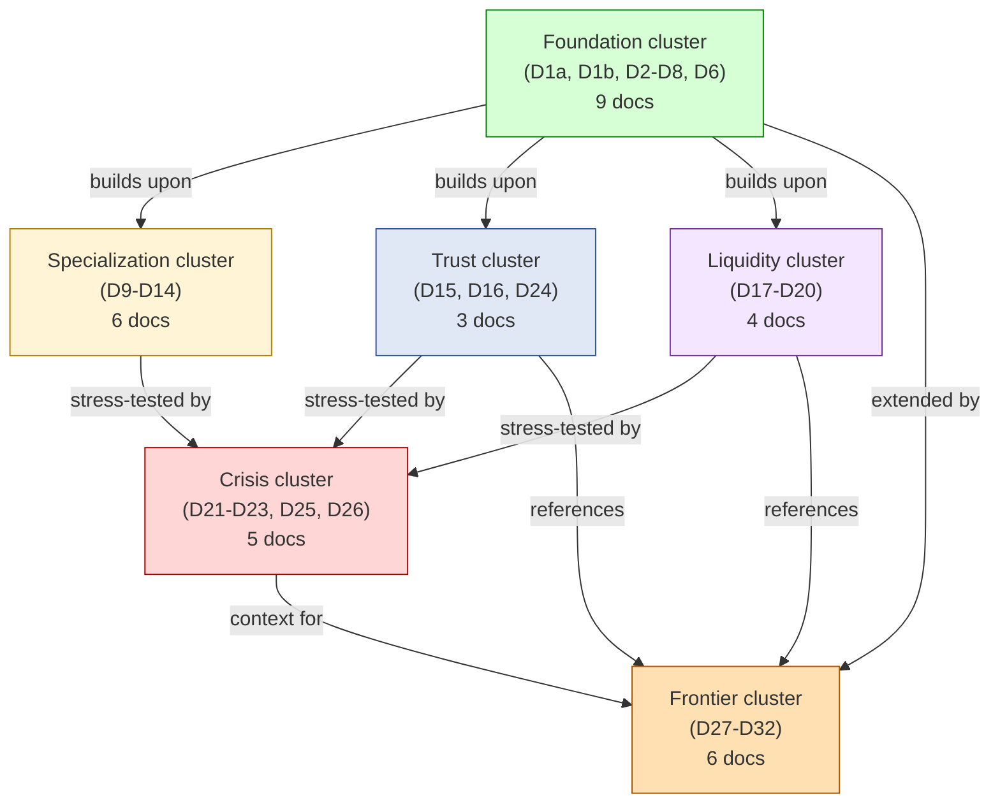
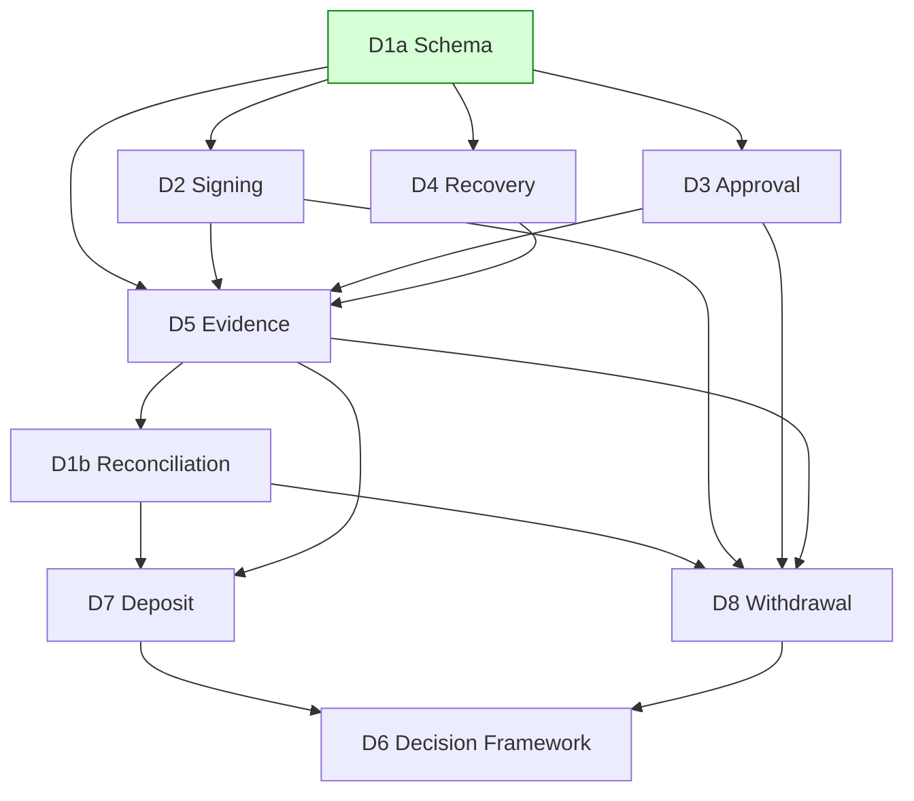
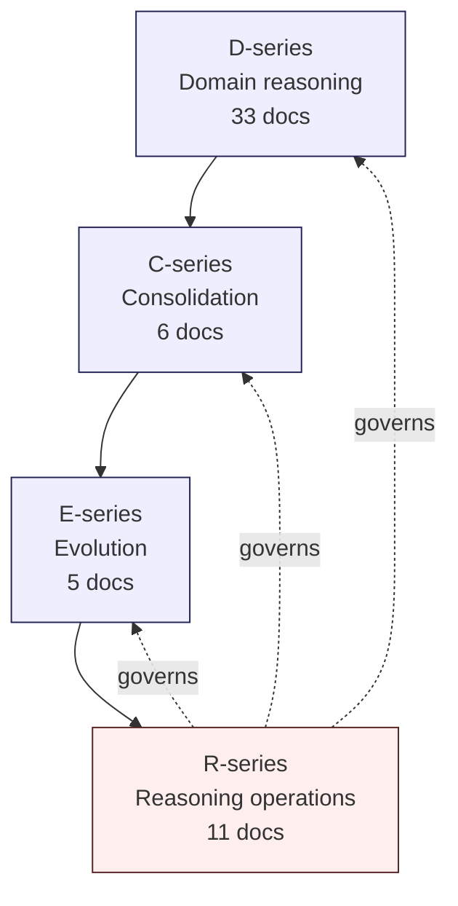
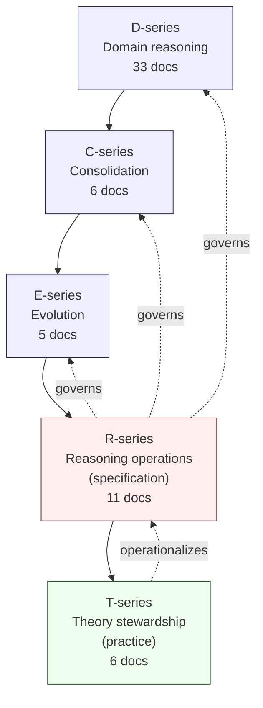

# C1 — Master Corpus Index

> **본 문서의 위치 (Consolidation C1)**: 33-document D-series corpus 의 **navigation layer**. Document list 가 아닌 **conceptual dependency map** + **reasoning progression**. C-series consolidation 의 첫 단계.

> **본 문서가 답하는 핵심 질문**: 어떤 document 가 어떤 reasoning 의 prerequisite? 어떤 reading order 가 reasoning order 와 일치하는가? 어떤 thematic group 의 documents 가 가장 tight 한 dependency 를 갖는가? 누가 (audience) 어디서 시작해야 하는가?

---

## 0. 핵심 명제 (10초 이해)

1. **Corpus index ≠ Document list** — navigation = dependency-aware reading map.
2. **5 "≠" 명제**:
   - Index ≠ Navigation
   - Category ≠ Dependency
   - Reading order ≠ Reasoning order
   - Cross-reference ≠ Conceptual inheritance
   - Corpus completeness ≠ Corpus navigability
3. **33 documents = 6 clusters + cross-cluster dependencies**.
4. **Reading order ≠ Reasoning order** — order to read vs order in which reasoning builds.
5. **Foundation cluster = mandatory prerequisite** for all others.
6. **Frontier cluster = optional, speculative** — separable from operational reasoning.
7. **Crisis cluster = inheritance from all prior clusters** — synthesis layer.
8. **Thematic shortcuts = audience-specific paths** (C5 의 미리보기).
9. **Cross-reference topology = sparse graph** — most documents depend on 2-5 others.
10. **Cluster boundaries = stable** — within-cluster dependency dense, cross-cluster sparse.

---

## 1. Corpus Structure Overview

### 1.1 6-cluster topology



### 1.2 Cluster theme summary

| Cluster | Theme | Docs | Status |
|---|---|---|---|
| Foundation | What custody is | 9 | Production-grade |
| Specialization | How custody runs | 6 | Production-grade |
| Trust | How custody is verifiable | 3 | Production-grade |
| Liquidity | How custody scales monetary | 4 | Production-grade |
| Crisis | How custody fails and survives | 5 | Production-grade |
| Frontier | How custody evolves into future | 6 | Emerging / speculative |

### 1.3 Cluster maturity gradient

- Foundation → Specialization → Trust / Liquidity / Crisis: **production-grade reasoning**.
- Frontier: **emerging + speculative** — explicitly marked.
- Maturity gradient = reading caution gradient.

---

## 2. Document Inventory

### 2.1 Foundation cluster (9 docs)

| Doc | Title | Core thesis (compressed) |
|---|---|---|
| D1a | Vault / Wallet / Ledger DB Schema | 9-plane DB / secrets DB 저장 금지 / selective ES |
| D1b | Reconciliation / Settlement / Consistency | Reconciliation = cross-truth-domain consistency proof |
| D2 | Signing Workflow + MPC Orchestration | 4 state machine 분리 / MPC retry non-idempotent |
| D3 | Approval State Machine + Governance Workflow | 11-state governance SM / two-clock freshness |
| D4 | Recovery Ceremony Generalization | Recovery = governance ceremony under cryptographic risk |
| D5 | Audit / Event Sourcing / Evidence Chain | Custody = evidence system / Unified Evidence Spine |
| D6 | 3-way Custody Decision Framework | Custody architecture = sovereignty vs operational burden |
| D7 | Deposit Lifecycle | Deposit = controlled ledger recognition |
| D8 | Withdrawal Lifecycle | Withdrawal = multi-domain state transition |

### 2.2 Specialization cluster (6 docs)

| Doc | Title | Core thesis (compressed) |
|---|---|---|
| D9 | Multi-chain Adapter Pattern | Multi-chain = semantic normalization |
| D10 | Treasury / Reserve / Mint-Burn | Stablecoin = synchronized multi-domain monetary state |
| D11 | Compliance / AML / Sanctions | Compliance = policy-constrained governance |
| D12 | Operational Maturity / Incident Command | Survivability = human-coordinated incident command |
| D13 | Cross-border Settlement / FX / Liquidity | Cross-border = multi-jurisdiction monetary coordination |
| D14 | Security / Threat Model / Adversarial Resilience | Security = adversarial state-of-mind embedded |

### 2.3 Trust cluster (3 docs)

| Doc | Title | Core thesis (compressed) |
|---|---|---|
| D15 | Transparency / Attestation / Proof Systems | Transparency = externally verifiable consistency evidence |
| D16 | Identity / KYT / Counterparty Graph | Identity = reconstructed, inferred, continuously revised |
| D24 | Regulatory Reporting / Audit Interface | Reporting = externally consumable reconstruction |

### 2.4 Liquidity cluster (4 docs)

| Doc | Title | Core thesis (compressed) |
|---|---|---|
| D17 | Treasury Optimization / Capital Efficiency | Treasury optimization = survivable liquidity allocation |
| D18 | Clearing / Prime Brokerage / Omnibus | Omnibus = delegated settlement abstraction |
| D19 | Internal Netting / Internal Settlement | Internal netting = liquidity compression |
| D20 | Cross-institution Liquidity Coordination | Cross-institution = synchronized survivability mgmt |

### 2.5 Crisis cluster (5 docs)

| Doc | Title | Core thesis (compressed) |
|---|---|---|
| D21 | Stablecoin Depeg / Crisis Handling | Depeg = synchronized multi-domain crisis |
| D22 | Consensus Failure / Chain Halt | Chain halt = settlement truth fragmentation |
| D23 | Jurisdiction Split / Regulatory Attack | Regulatory fragmentation = governance partitioning |
| D25 | Systemic Liquidity Freeze | Systemic liquidity = coordination failure |
| D26 | Custody Failure Generalization | Failures = cascading coordination across all domains |

### 2.6 Frontier cluster (6 docs)

| Doc | Title | Core thesis (compressed) |
|---|---|---|
| D27 | CBDC / Sovereign Digital Money | CBDC = programmable sovereign coordination |
| D28 | Intent-based Settlement / Solver Networks | Intent = delegated coordination market |
| D29 | Autonomous Treasury Governance | Autonomous treasury = programmable governance under uncertainty |
| D30 | AI-assisted Operational Governance | AI-assisted = probabilistic coordination |
| D31 | Institutional Privacy / Confidential Settlement | Privacy = selective visibility coordination |
| D32 | Post-quantum Custody Survivability | PQ survivability = institutional continuity under primitive disruption |

---

## 3. Reading Order vs Reasoning Order

### 3.1 "Reading order ≠ Reasoning order"

(§0 명제)

- **Reading order**: 한 사람이 차례대로 읽을 때 의 sequence.
- **Reasoning order**: concept 의 prerequisite chain.
- 차이:
  - Linear reading 이 reasoning chain 와 항상 일치 안 함
  - Some documents 가 multiple prerequisite 가짐 (graph, not chain)
  - Cross-cluster reference 가 sequence 를 disrupts

### 3.2 Canonical reading order (linear)

For first-time reader (full sequential):

```
1. D1a Vault/Wallet/Ledger Schema
2. D2 Signing Workflow
3. D3 Approval State Machine
4. D4 Recovery Ceremony
5. D5 Evidence Chain
6. D1b Reconciliation
7. D7 Deposit Lifecycle
8. D8 Withdrawal Lifecycle
9. D6 3-way Decision Framework

10. D9 Multi-chain
11. D10 Treasury / Mint-Burn
12. D11 Compliance
13. D12 Operational Maturity
14. D13 Cross-border
15. D14 Security

16. D15 Transparency
17. D16 Identity
18. D24 Reporting

19. D17 Treasury Optimization
20. D18 Omnibus / Clearing
21. D19 Internal Netting
22. D20 Cross-institution

23. D21 Stablecoin Depeg
24. D22 Chain Halt
25. D23 Jurisdiction Split
26. D25 Systemic Liquidity Freeze
27. D26 Custody Failure Generalization

28. D27 CBDC
29. D28 Intent-based
30. D29 Autonomous Treasury
31. D30 AI-assisted Governance
32. D31 Privacy / Confidential
33. D32 Post-quantum
```

### 3.3 Reasoning chain (dependency-based)

```
D1a (schema foundation)
  ↓
D2 + D3 + D4 (state machine layers: signing / governance / recovery)
  ↓
D5 (evidence integrates all)
  ↓
D1b (reconciliation crosses all truth domains)
  ↓
D7 + D8 (lifecycle applications)
  ↓
D6 (decision framework synthesis)
  ↓
D9-D14 (specialization on foundation)
  ↓
D15-D16-D24 (trust layer on foundation+specialization)
  ↓
D17-D20 (liquidity layer on foundation+specialization+trust)
  ↓
D21-D26 (crisis stress-tests all prior)
  ↓
D27-D32 (frontier extends, marked emerging)
```

### 3.4 Reading order optimization

- **Quick overview**: D6 → D26 → C1 (this) (3 docs cover scope)
- **Foundation only**: D1a → D2-D8 → D6 (skip specialization+)
- **By cluster**: Read cluster, then move to next
- **Topic-driven**: Use C5 reading paths

### 3.5 Cross-cluster bridge points

| From → To | Bridge concept |
|---|---|
| Foundation → Specialization | D6 의 3-way decision framework |
| Specialization → Trust | D5 evidence + D11 compliance |
| Trust → Liquidity | D15 transparency 의 monetary application |
| Liquidity → Crisis | D20 의 cross-institution stress |
| Crisis → Frontier | D26 의 generalization → D27+ frontier evolution |

---

## 4. Cluster Internal Dependency

### 4.1 Foundation cluster internal



### 4.2 Specialization cluster internal

- D9-D14 mostly independent (different specializations).
- Some cross-reference:
  - D10 references D9 (multi-chain in treasury)
  - D12 references D6 (operational maturity from decision framework)
  - D13 references D9, D10 (cross-border in chain + monetary)
  - D14 cross-cuts (security in every doc)

### 4.3 Trust cluster internal (sequential)

```
D15 (transparency) → D16 (identity) → D24 (reporting)
```

Each builds on previous; cluster closing at D24.

### 4.4 Liquidity cluster internal (sequential)

```
D17 (own treasury) → D18 (within institution multi-customer) → D19 (within institution multi-party) → D20 (cross-institution)
```

Scaling up sequentially.

### 4.5 Crisis cluster internal

```
D21 trust + D22 settlement + D23 governance + D25 liquidity
  ↓
D26 generalization (synthesis)
```

D26 is closing; first four are domain-specific.

### 4.6 Frontier cluster internal (sequential)

```
D27 (sovereign) → D28 (coordination) → D29 (autonomy) → D30 (AI) → D31 (privacy) → D32 (post-quantum)
```

Each adds frontier dimension.

---

## 5. Cross-cluster Reference Density

### 5.1 Reference density matrix

| From \ To | F | S | T | L | C | FR |
|---|---|---|---|---|---|---|
| F | dense | sparse | sparse | sparse | sparse | none |
| S | dense | sparse | sparse | sparse | sparse | none |
| T | dense | medium | dense | sparse | medium | sparse |
| L | dense | medium | sparse | dense | medium | sparse |
| C | dense | dense | dense | dense | medium | none |
| FR | dense | medium | medium | sparse | medium | sparse |

→ **F (Foundation)** = referenced by all others.
→ **C (Crisis)** = inherits from all prior.
→ **FR (Frontier)** = references all, but not referenced back.

### 5.2 Hub documents (most referenced)

| Doc | Reference reason |
|---|---|
| D5 Evidence | Every doc 의 evidence chain |
| D6 Decision framework | Every doc 의 burden analysis |
| D11 Compliance | Cross-cluster compliance |
| D1b Reconciliation | Every settlement-related doc |

### 5.3 Bridge documents (cross-cluster anchors)

| Doc | Bridge role |
|---|---|
| D6 | Foundation → Specialization |
| D14 | Specialization (security cross-cuts all) |
| D24 | Trust → Compliance (D11) |
| D20 | Liquidity → Crisis (cross-institution stress) |
| D26 | Crisis → Frontier (generalization) |

### 5.4 Standalone documents (least dependent)

- D1a (foundation root, depends on none)
- D27 CBDC (independent specialization)
- D31 Privacy (cryptographic standalone)

→ These can be read in relative isolation.

### 5.5 Citation pattern

- Within-cluster: dense, sequential build
- Cross-cluster: explicit reference (e.g. "D11 §10")
- Bridge invariants: D27 → D28 의 explicit bridge section.

---

## 6. Thematic Grouping (Alternative to Cluster)

### 6.1 Thematic axes

Beyond clusters, documents group by theme:

| Theme | Docs |
|---|---|
| **State machines** | D2, D3, D8, D21, D27 |
| **Evidence** | D5, D15, D24, D31 |
| **Identity** | D11, D16, D27 |
| **Liquidity** | D17, D18, D19, D20, D25 |
| **Crypto** | D2 (MPC), D4 (recovery), D14, D31, D32 |
| **Cross-domain** | D1b, D6, D11, D13, D26 |
| **Governance** | D3, D6, D12, D23, D29, D30 |
| **Operations** | D12, D17, D29, D30 |
| **Adversarial** | D14, D23, D25, D26 |
| **Failure** | D21-D26 |
| **Frontier** | D27-D32 |

### 6.2 Multi-theme documents (most integrative)

- D6: governance + operations + crisis
- D11: identity + governance + compliance + cross-domain
- D26: failure + cross-domain + crisis + survivability
- D14: cross-cutting across all docs

### 6.3 Theme-based reading

- Engineer: state machines + crypto + operations
- Compliance officer: identity + governance + evidence + failure
- Risk manager: cross-domain + liquidity + crisis + frontier
- Executive: governance + operations + cross-domain + failure

---

## 7. Reading Pathways (preview of C5)

### 7.1 5 audience starting points

| Audience | Start with |
|---|---|
| Executive | D6 (decision framework) |
| Engineer | D1a (schema) → D2 → D5 |
| Compliance officer | D11 → D24 → D16 |
| Treasury / liquidity ops | D10 → D17 → D20 |
| Crisis response | D12 → D26 → D14 |

### 7.2 Path length variance

- **Short path (3-5 docs)**: scope-limited understanding
- **Medium path (8-12 docs)**: functional understanding
- **Long path (20+ docs)**: comprehensive
- **Full corpus (33 docs)**: complete reasoning

### 7.3 Reading time estimate (★ Hypothesis)

- Short: ~2-4 hours
- Medium: ~1 day
- Long: ~3 days
- Full: ~5-7 days
- → Reading time + reflection time + cross-reference verification.

---

## 8. Navigation Aids

### 8.1 Document anatomy (consistent across all)

Every D-doc 의 standard sections:
- 0. 핵심 명제 (10초 이해)
- N. Core reasoning sections
- Operational fragility map
- Limitations
- 3-way burden comparison
- Q1-Q10 reasoning
- Open questions / org policy
- References + Uncertainty boundary
- (Cluster docs) Bridge invariants

### 8.2 Mermaid diagram pattern

- `graph TB` (universal)
- Quoted node labels
- classDef styling
- 10+ diagrams per doc

### 8.3 "≠" propositions

- Each doc 의 5+ "≠" propositions
- Total: 150+ propositions across corpus
- → C2 invariant catalog 의 input.

### 8.4 Hypothesis marking (★)

- 모든 generalized reasoning 의 ★ marker
- 모든 estimate 의 ★ marker
- 모든 emerging pattern 의 ★ marker
- → Uncertainty boundary 의 enforcement.

### 8.5 Cross-reference format

- `[[docs/architecture/...]]` for internal
- Section reference: "D5 §6.3"
- Bridge sections: explicit invariant chain

---

## 9. Corpus Coverage Map

### 9.1 What corpus covers

| Coverage area | Cluster |
|---|---|
| Custody fundamentals | Foundation |
| Operational specialization | Specialization |
| External verifiability | Trust |
| Monetary scale | Liquidity |
| Catastrophic failure | Crisis |
| Future evolution | Frontier |

### 9.2 What corpus does NOT cover

- Specific vendor product detail (intentional: generalized)
- SQL DDL or code samples (intentional: reasoning, not implementation)
- Legal counsel (legal advice is out-of-scope)
- Specific chain tutorials (generalized via D9)
- Hype / marketing framing (intentional anti-pattern)

### 9.3 Coverage limitations (explicit)

- Speculative frontier (D27-D32) = emerging only
- Implementation detail = out-of-scope (D-impl phase)
- Specific jurisdictional regulation = customer's legal counsel

---

## 10. Q1-Q10 Reasoning

### Q1. Why is corpus index ≠ document list

§0.1. Navigation requires dependency awareness.

### Q2. Reading order vs reasoning order

§3.1-§3.3.

### Q3. Cluster boundaries

§5. Within-dense, cross-sparse.

### Q4. Foundation prerequisite

§1.3, §5.1. F is referenced by all.

### Q5. Frontier separability

§1.3. Emerging + speculative, optional.

### Q6. Crisis as synthesis

§4.5, §5.1. Inherits from all prior.

### Q7. Bridge documents

§5.3. D6, D14, D24, D20, D26.

### Q8. Standalone docs

§5.4. D1a, D27, D31.

### Q9. Theme axes vs cluster

§6. Alternative grouping.

### Q10. Reading time estimate

§7.3. ★ Hypothesis estimate.

---

## 11. Open Questions

| 영역 | 질문 |
|---|---|
| Reading path completeness | per audience |
| Documentation freshness | continuous update |
| External reference linking | how strict |
| Cross-corpus integration | with industry standards |
| Visual atlas | unified diagram repository |
| Glossary | per-cluster terminology |
| Audience adaptation | translation per role |
| Print version | optimization |
| Search index | terminology-aware |
| Public vs internal version | sensitivity tier |

---

## 12. References + Uncertainty Boundary

### 관련 wiki

- All 33 D-documents
- C2-C6 (other consolidation docs)

### Uncertainty Boundary

- 본 문서는 **navigation aid** — 실제 reasoning 은 D-documents 에 있음.
- §7.3 reading time = estimate.
- §6 thematic grouping = ★ analytical choice.
- Cluster boundary 의 정의는 corpus organization 의 결정.

### Next consolidation step

- C2 — Invariant Catalog
- C3 — Cross-reference / Dependency Graph
- C4 — Anti-pattern Catalog
- C5 — Audience Reading Paths
- C6 — Open Questions / Frontier Boundary

---

**Stage 32 C1 completion timestamp**: 2026-05-20.

---

## 13. Stage 33 Amendment — R-series Registration

> **Amendment scope**: This section is **additive only**. §0-§12 above represent the C1 worldview as of Stage 32 completion (33-doc D + 6-doc C corpus). §13 registers the **R-series Reasoning Operations Layer** introduced in Stage 33, with the E-series (Stage 32 closing, 5 docs) and R-series (Stage 33, 11 docs) extending the corpus to **55 documents** across four layers.

> **R7 preservation note**: §0-§12 are deliberately not rewritten to reflect the expanded corpus. The Stage 32 worldview (corpus closing at 33 D-docs + 6 C-docs) is preserved as historical context. Stage 33 reframes the corpus structure as 4-layer (D/C/E/R), but does not erase the Stage 32 framing.

### 13.1 Corpus expansion summary (as of Stage 33)

| Layer | Docs | Concern | Status |
|-------|------|---------|--------|
| **D-series** | 33 | Domain reasoning (Foundation / Specialization / Trust / Liquidity / Crisis / Frontier clusters) | Stable; Stage 32 publication state |
| **C-series** | 6 | Consolidation / meta-architecture (index / invariants / dependencies / anti-patterns / reading paths / open questions) | Stable; Stage 32 publication state |
| **E-series** | 5 | Evolution (incident-driven / regulatory / AI pressure / frontier discipline / knowledge survivability) | Stable; Stage 32 closing |
| **R-series** | 11 | Reasoning operations (charter / retrieval / reasoning flow / contradiction / ontology / governance / decay / history / human boundary / AI constraints / failure modes) | New; Stage 33 |
| **Total** | **55** | | |

### 13.2 E-series registration (deferred from Stage 32, recorded here for completeness)

| Doc | Title | Core thesis (compressed) |
|---|---|---|
| E1 | Incident-driven Corpus Evolution | Institutional architecture theories evolve primarily through failure exposure |
| E2 | Regulatory / Sovereign Evolution | Architecture evolves through sovereign and regulatory reinterpretation of legitimacy |
| E3 | AI / Automation Evolution Pressure | AI pressure reshapes coordination, accountability, operational expectations |
| E4 | Frontier Integration Discipline | Emerging primitives must survive conservative survivability scrutiny |
| E5 | Corpus Longevity / Knowledge Survivability | Survivability of institutional knowledge is itself an architectural problem |

### 13.3 R-series registration

| Doc | Title | Core concern |
|---|---|---|
| R0 | Reasoning Operations Charter | R-series proposal + corpus lifecycle + folder topology + operational invariants |
| R1 | Retrieval Discipline Architecture | Conservative retrieval pipeline; over-retrieve, re-rank, cite, surface negatives |
| R2 | Corpus Reasoning Flow | 7-stage reasoning discipline; 6-section output template; escalation triggers |
| R3 | Contradiction Management Discipline | T1-T5 contradiction classification; preservation > resolution |
| R4 | Ontology Stability Discipline | Layer-1-to-5 ontology; sense management; conservative refactor policy |
| R5 | Evolution Governance Model | C0-C8 change classification; cycle-based cadence; rotating stewardship; audit trail |
| R6 | Knowledge Decay / Staleness Taxonomy | Class A-E decay rates; refresh cadence per class; sunset process |
| R7 | Historical Worldview Preservation | 4-layer preservation (living / amendment / snapshot / worldview annotation); no silent rewrite |
| R8 | Human Review Boundary / Escalation Criteria | Zone A / B / C operations; escalation signals; reviewer accountability |
| R9 | AI-assisted Reasoning Constraints | Forbidden actions; required disclaimers; trace requirement; calibration |
| R10 | Failure Modes of Long-lived Architecture Corpora | 12 corpus-level failure modes; compound risks; honest-failure stance |

### 13.4 Updated layer topology



- **D produces content.** C produces meta-structure. E produces evolution thesis. **R produces operational discipline** for all of the above.
- **R-series is operations, not architecture.** R does not reason about wallets, custody, signing — it reasons about how the corpus itself is queried, contested, preserved, and stewarded.

### 13.5 R-series suggested reading order

For first-time R-series readers (per R0 §9):

1. R0 (charter) → orientation
2. R10 (failure modes) → motivation
3. R1 (retrieval) → first operational discipline
4. R2 (reasoning flow) → how questions become answers
5. R8 + R9 (boundary + AI constraints) → read as a pair
6. R3 + R4 (contradiction + ontology) → slow-burn risks
7. R6 + R7 (decay + history) → multi-year horizon
8. R5 (governance) → read last, enforced first

### 13.6 What R-series is NOT

- Not a retrieval engine implementation (R0 §8).
- Not a content-management system.
- Not an AI agent specification (R9 constrains AI behavior; it does not prescribe AI agent architecture).
- Not a publishing system.
- Not a final answer (R-series itself evolves under R5 governance).

### 13.7 Stage 33 closing position

The corpus is no longer a **publication artifact**. With R-series in place, the corpus is positioned as a **governed institutional reasoning system** capable of multi-decade evolution without ontology collapse.

★ Hypothesis: the R-series cannot prevent corpus failure modes (R10). It can make them **visible**, **slow**, and **recoverable**. That is the most honest claim the Stage 33 amendment can make.

### 13.8 Items deferred from Stage 33

- Implementation of `_history/`, `_ontology/`, `_contradictions/`, `_stewardship/` operational artifacts (folder topology per R0 §4) — future stage.
- Backfill R7 snapshots for existing 44 D/C/E docs — future stage.
- Initial ontology registry seed (R4) — future stage.
- Initial contradiction registry seed (R3) — future stage.
- Stewardship council formation (R5) — institutional decision; not corpus-internal.
- AI-assistant configuration governance trail (R9 §13) — institutional decision.

These deferrals are intentional. The R-series is a **discipline specification**, not an implementation. Implementation is the work of operating stewards.

---

**Stage 33 R-series amendment timestamp**: 2026-05-20.
**Total corpus state at Stage 33**: 55 documents (33 D + 6 C + 5 E + 11 R).

---

## 14. Stage 34 Amendment — T-series Registration

> **Amendment scope**: This section is **additive only**. §0-§12 (Stage 32 worldview) and §13 (Stage 33 R-series registration) are preserved. §14 registers the **T-series Theory Stewardship Layer** introduced in Stage 34, extending the corpus to **61 documents** across **five layers**.

> **R7 preservation note**: §0-§13 are deliberately not rewritten. The Stage 32 framing (3-layer corpus closing at publication state) and Stage 33 framing (4-layer with R-series as Reasoning Operations) remain as historical context. Stage 34 reframes the corpus as 5-layer (D/C/E/R/T), but does not erase prior framings.

### 14.1 Corpus expansion summary (as of Stage 34)

| Layer | Docs | Concern | Voice |
|-------|------|---------|-------|
| **D-series** | 33 | Domain reasoning (Foundation / Specialization / Trust / Liquidity / Crisis / Frontier clusters) | Architectural |
| **C-series** | 6 | Consolidation / meta-architecture | Navigational |
| **E-series** | 5 | Evolution thesis | Historical-forward |
| **R-series** | 11 | Reasoning operations (discipline specification) | Specification |
| **T-series** | 6 | Theory stewardship (practice manual) | Practitioner |
| **Total** | **61** | | |

### 14.2 T-series registration

| Doc | Title | Core concern |
|---|---|---|
| T0 | Theory Stewardship Charter | T-series proposal + positioning + 10 stewardship spirit commitments + cadence |
| T1 | Corpus Drift Detection | Multi-cadence sampling practice; semantic erosion map; quarterly drift report; reinterpretation propagation |
| T2 | Contradiction Governance | Triage algorithm; steelman conversation; multi-perspective coexistence; unresolved tension as feature |
| T3 | Institutional Memory Survivability | Memory lifecycle (Live→Eternal); 6-class artifact taxonomy; tacit-to-explicit conversion; succession map |
| T4 | Controlled Evolution Framework | 4 evolution categories (EV1-EV4); "not yet" practice; frontier containment; maturity thresholds |
| T5 | Stewardship Failure Modes | 10 stewardship-internal failure modes (SF1-SF10); self-recognition discipline; compound failures |

### 14.3 R-series vs T-series — the read-as-a-pair model

| Question | Layer that answers |
|----------|--------------------|
| What discipline is required? | R-series |
| What does compliance look like? | T-series |
| What rule was supposed to hold? | R-series |
| What did stewards actually do? | T-series |
| Why is this artifact required? | R-series |
| How is this artifact practiced weekly? | T-series |

★ Hypothesis: institutions that adopt only R-series produce **bureaucratic** stewardship — rule-following without judgment. Institutions that adopt only T-series produce **artisanal** stewardship — craft without discipline. The pair is load-bearing; either alone is insufficient.

### 14.4 Updated 5-layer topology



- **D produces content.** C produces meta-structure. E produces evolution thesis. **R produces discipline (rules).** **T operationalizes R (practice).**
- T-series is the **practice manual** for living stewards operating the corpus under R-series discipline.

### 14.5 T-series suggested reading order

For first-time T-series readers (per T0 §14):

1. T0 (charter) → orientation
2. T5 (failure modes) → motivation
3. T1 (drift detection) → most operational practice
4. T2 (contradiction governance) → high-frequency steward activity
5. T3 (institutional memory) → multi-year horizon
6. T4 (controlled evolution) → governance practice

(Mirrors R-series reading order: charter → failure modes → operational → governance.)

### 14.6 The five-layer corpus as institutional reasoning system

- **D / C / E** answer "what the corpus says, how it's structured, why it evolves."
- **R** answers "how the corpus must be operated."
- **T** answers "how stewards practice that operation."

★ Hypothesis: a corpus that has only D/C/E is a **publication**. A corpus that adds R is a **discipline declaration**. A corpus that adds T is an **operational institution**. Stage 34 completes the transition from artifact to institution.

### 14.7 Stage 34 closing position

The corpus is no longer a publication, no longer just a discipline-bounded reasoning system — it is now positioned as an **operational institution** capable of multi-decade stewardship under disciplined practice.

★ Hypothesis: the value of D/C/E content over decades depends on R/T survival. If R/T fails (stewardship vacuum, ideology hardening, fatigue collapse), D/C/E content degrades regardless of its original quality. If R/T survives, even modestly-quality D/C/E content remains usable.

### 14.8 Stage 34 deferrals (intentional)

- Initial steward council formation — institutional decision, not corpus-internal.
- First semantic erosion map seed — written during first quarterly drift report cycle.
- First contradiction conversation logs — written as contradictions surface.
- First decision journals — begun by individual stewards as practice ramps up.
- First annual blind-reader exercise — scheduled per institutional cadence.

T-series is a **practice specification**. Implementation is the work of operating stewards.

---

**Stage 34 T-series amendment timestamp**: 2026-05-20.
**Total corpus state**: 61 documents (33 D + 6 C + 5 E + 11 R + 6 T).
