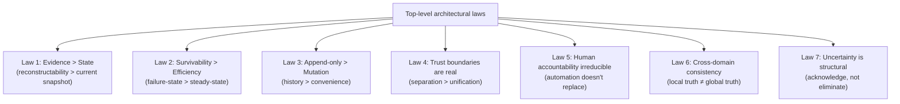

# C2 — Invariant Catalog

> **본 문서의 위치 (Consolidation C2)**: 33 documents 전체의 **invariant extraction + categorization**. Document-specific 가 아닌 **cross-corpus 의 underlying laws**. C-series 의 second step.

> **본 문서가 답하는 핵심 질문**: 모든 cluster 에서 recurring 하는 invariant 는 무엇? 다른 domain 에서도 same shape 의 "≠" propositions? 본 corpus 의 top-level architectural law 는 무엇?

---

## 0. 핵심 명제 (10초 이해)

1. **Real structure = invariant system, not document list** (core thesis).
2. **5 "≠" 명제**:
   - Recurring phrase ≠ Invariant
   - Similar concept ≠ Shared structure
   - Domain-specific insight ≠ General principle
   - Constraint ≠ Invariant
   - Pattern repetition ≠ Theoretical coherence
3. **150+ ≠ propositions** across 33 documents.
4. **7 top-level architectural laws** that hold across all clusters.
5. **8 cross-domain invariants** (specific to multiple clusters).
6. **6 anti-patterns** that emerge as recurring failure modes.
7. **Trust-boundary patterns** (B1-B9+) extending across docs.
8. **Survivability principle set** (10 principles).
9. **Temporal semantics** (5-clock model 의 extension).
10. **Invariant hierarchy** — top-level laws → cross-domain → domain-specific.

---

## 1. Top-level Architectural Laws

### 1.1 7 fundamental laws



### 1.2 각 law 의 manifestation across clusters

| Law | Foundation | Specialization | Trust | Liquidity | Crisis | Frontier |
|---|---|---|---|---|---|---|
| L1 Evidence > State | D5 | D11, D12 | D15, D24 | D17 | D26 | D30, D31 |
| L2 Survivability > Efficiency | D6 | D12, D14 | (implicit) | D17, D20 | D26 | D29, D32 |
| L3 Append-only | D1a, D5 | D11 | D15, D24 | (D18 omnibus tension) | (D26) | D29, D31 |
| L4 Trust boundaries | D2, D3, D5 | D9, D11, D14 | D15, D16 | D18, D20 | D21, D23 | D27, D28, D31 |
| L5 Human accountability | D3, D4 | D12 | D24 | D17 | D26 | D29, D30 |
| L6 Cross-domain consistency | D1b | D11, D13 | D15, D24 | D20 | D26 | (frontier inherits) |
| L7 Uncertainty structural | D5, D6 | D11, D12 | D15, D16, D24 | D17 | D26 | D27-D32 (all) |

### 1.3 Law 의 universality

- 모든 7 law 가 모든 cluster 에서 manifestation.
- → Corpus 의 underlying coherence 의 증명.

### 1.4 Law violation 의 consequence

- 각 law 위반 시 architectural failure:
  - L1 위반 → forensic inability (D26 §3)
  - L2 위반 → catastrophic fragility (D26)
  - L3 위반 → audit chain corruption (D5 §10)
  - L4 위반 → cross-domain contamination
  - L5 위반 → accountability gap (D29, D30)
  - L6 위반 → reconciliation drift (D1b §8)
  - L7 위반 → false confidence (D6 §12)

### 1.5 Law 의 trade-off

(★ Hypothesis — operational reality)

- 일부 law 의 동시 maximization 어려움:
  - L2 (survivability) vs efficiency (everywhere)
  - L3 (append-only) vs right-to-erasure (D5 §8.4)
  - L4 (trust boundaries) vs operational simplicity
- → Conscious trade-off design.

---

## 2. Cross-domain "≠" Invariant Families

### 2.1 8 invariant families

```mermaid
graph TB
    FAM["Cross-domain ≠ families"]

    F1["F1. State ≠ Truth family<br/>(current ≠ reconstructable)"]
    F2["F2. Operation ≠ Authority family<br/>(execute ≠ decide)"]
    F3["F3. Visibility ≠ Control family<br/>(see ≠ act)"]
    F4["F4. Capability ≠ Survivability family<br/>(can do ≠ will continue)"]
    F5["F5. Technical ≠ Institutional family<br/>(system ≠ organization)"]
    F6["F6. Recovery family<br/>(local ≠ global, current ≠ future)"]
    F7["F7. Disclosure ≠ Trust family<br/>(reveal ≠ verify)"]
    F8["F8. Settlement ≠ Finality family<br/>(send ≠ done)"]
```



### 2.2 Family 별 instances

**F1 State ≠ Truth**:
- Current state ≠ Reconstructable truth (D5)
- Reserve balance ≠ Circulating supply truth (D10)
- Audit log ≠ Evidence chain (D5)
- Snapshot truth ≠ Continuous truth (D15)

**F2 Operation ≠ Authority**:
- Custody visibility ≠ Settlement authority (D18)
- Recommendation ≠ Authority (D30)
- Automation ≠ Governance elimination (D29)
- Internal settlement ≠ Final settlement (D18, D19)

**F3 Visibility ≠ Control**:
- Cross-chain visibility ≠ Cross-chain control (D11)
- Cross-institution visibility ≠ Cross-institution control (D20)
- Treasury visibility ≠ Treasury mobility (D17)
- Public visibility ≠ Verifiability (D15)
- Jurisdiction visibility ≠ Jurisdiction control (D23)

**F4 Capability ≠ Survivability**:
- Recovery capability ≠ Recovery survivability (D4)
- Technical capability ≠ Organizational readiness (D6)
- Algorithm upgrade ≠ Survivability (D32)
- Partial continuity ≠ Survivability (D26)

**F5 Technical ≠ Institutional**:
- Technical failure ≠ Institutional failure (D26)
- System recovery ≠ Trust recovery (D26)
- Surviving assets ≠ Surviving institution (D26)
- Technical recovery ≠ Institutional recovery (D22)

**F6 Recovery family**:
- Recovery authorization ≠ Recovery safety (D4)
- One-time download ≠ Secure custody (D4)
- Evidence preservation ≠ Reputation preservation (D26)

**F7 Disclosure ≠ Trust**:
- Transparency ≠ Disclosure (D15)
- Selective disclosure ≠ Trust elimination (D31)
- Evidence publication ≠ Trust elimination (D15)
- Compliance evidence ≠ Legal proof (D11)

**F8 Settlement ≠ Finality**:
- Confirmation ≠ Finality (D9)
- Finality ≠ Irreversibility (D9)
- Settlement ≠ Confirmation (D1b)
- Broadcast success ≠ Settlement finality (D2, D8)
- Approval success ≠ Signing success (D3)
- Chain halt ≠ Settlement halt (D22)

### 2.3 Family 의 cross-cluster recurrence

| Family | Most prominent in |
|---|---|
| F1 State ≠ Truth | Foundation, Trust |
| F2 Operation ≠ Authority | Foundation, Frontier |
| F3 Visibility ≠ Control | Specialization, Crisis |
| F4 Capability ≠ Survivability | Foundation, Crisis, Frontier |
| F5 Technical ≠ Institutional | Crisis |
| F6 Recovery | Foundation, Crisis |
| F7 Disclosure ≠ Trust | Trust, Frontier |
| F8 Settlement ≠ Finality | Foundation, Specialization, Crisis |

### 2.4 Why these families recur

- 8 families = corpus 의 underlying tension points.
- Each 의 recurrence 는 institutional reality 의 multi-dimensional nature.
- → Family 의 conscious 인식이 reasoning 의 baseline.

---

## 3. Trust Boundary Catalog (B1-B12+)

### 3.1 Boundaries identified across corpus

| Boundary | Identified in | Description |
|---|---|---|
| **B1** | D1a | Tenant ↔ Tenant (multi-tenant) |
| **B2** | D1a | Workspace ↔ Workspace (governance) |
| **B3** | D2, D14 | TEE (cryptographic execution environment) |
| **B4** | D1a | Operational DB ↔ Audit DB |
| **B5** | D2, D14 | Callback Handler (customer-side) |
| **B6** | D1a | Internal DB ↔ Blockchain |
| **B7** | D2, D3 | Approval (governance decision) |
| **B8** | D2, D9 | RPC / Chain Provider |
| **B9** | D2 | Signer Topology (rogue signer prevention) |
| **B10** | D5, D31 | Public ↔ Internal evidence |
| **B11** | D16 | Settlement identity ↔ Operational identity ↔ Beneficial identity |
| **B12** | D23 | National ↔ Supranational sovereignty |
| **B13** | D31 | Confidentiality ↔ Auditability |
| **B14** | D32 | Classical ↔ Post-quantum crypto |

### 3.2 Boundary 의 enforcement mechanism

| Boundary | Enforcement |
|---|---|
| B1-B2 | Database separation, schema isolation |
| B3 | Hardware attestation, TEE |
| B4 | Storage separation, retention |
| B5 | Cryptographic signing, fail-closed |
| B6 | One-way write, observe-only |
| B7 | Quorum signature, append-only audit |
| B8 | Multi-RPC redundancy, attestation |
| B9 | Whitelist + attestation verification |
| B10 | Selective disclosure mechanism |
| B11 | KYC + attribution chain |
| B12 | Legal + diplomatic |
| B13 | Cryptographic (ZK / MPC / TEE) |
| B14 | Crypto-agility + migration |

### 3.3 Boundary violation = systemic risk

- 각 boundary 의 violation 의 consequence:
  - B3 violation = key leak
  - B5 violation = unauthorized signing
  - B7 violation = governance bypass
  - B10 violation = privacy breach
- → Boundary 의 explicit identification 의 architectural discipline.

### 3.4 Boundary 의 inter-dependency

- B3 (TEE) ↔ B9 (Signer Topology)
- B5 (Callback) ↔ B7 (Approval)
- B6 (Chain Provider) ↔ B11 (Identity attribution)
- → Boundary set 의 inter-relation.

### 3.5 Custody architecture = 14+ boundary system

(★ generalized claim)

- 본 corpus 가 14+ boundary 식별.
- 각 boundary 의 explicit reasoning.
- 추가 boundary 는 emerging domain 의 discovery 가능.

---

## 4. Survivability Principles

### 4.1 10 survivability principles

```mermaid
graph TB
    SURV["10 Survivability Principles"]

    S1["S1 Recovery sovereignty mandatory<br/>(vendor disappearance survivability)"]
    S2["S2 Diversification reduces correlation<br/>(multi-vendor / multi-rail / multi-jurisdiction)"]
    S3["S3 Pre-position emergency authority<br/>(crisis-time decisions need pre-decided)"]
    S4["S4 Continuous discipline > one-time setup<br/>(DR exercise / postmortem / refresh)"]
    S5["S5 Failure-state planning > steady-state optimization"]
    S6["S6 Human accountability irreducible<br/>(automation에 책임 위임 불가)"]
    S7["S7 Evidence chain > decision moment<br/>(reconstructable history)"]
    S8["S8 Coordination capacity > individual capability"]
    S9["S9 Acceptable residual risk > zero risk"]
    S10["S10 Latent failure topology recognition"]
```



### 4.2 Principle 별 manifestation

**S1 Recovery sovereignty** (D6 §4, D4):
- Vendor independence
- Custodian quorum
- Passphrase ownership
- Standardized backup format

**S2 Diversification** (D6, D14, D17, D20):
- Multi-bank, multi-chain, multi-vendor
- Multi-jurisdiction
- Multi-RPC, multi-monitor

**S3 Pre-positioned emergency** (D3 §4.4, D12 §4.3, D21):
- Crisis playbook
- Emergency authority composition
- Mutual support agreements

**S4 Continuous discipline** (D4 §6, D12 §5, D14):
- DR exercise
- Postmortem
- Knowledge management
- Stress test

**S5 Failure-state planning** (D6 §10, D26):
- Stress test
- Tabletop
- Red team

**S6 Human accountability** (D3 §9, D29 §5, D30 §5):
- Approver, custodian, investigator
- AI 의 limit
- Insider threat irreducible (D14)

**S7 Evidence chain** (D5 §1, D24):
- Append-only
- Cryptographic proof
- Reconstructable

**S8 Coordination capacity** (D20, D25):
- Cross-institution
- Federation
- Mutual support

**S9 Acceptable residual risk** (D26 §4):
- 100% survival 불가능
- Threshold definition

**S10 Latent failure topology** (D26 §3):
- Hidden coupling
- Pre-crisis invisible

### 4.3 Principles 의 hierarchy

```
Most fundamental:
  S6 Human accountability (irreducible)
  S9 Acceptable residual risk (logical limit)

Architectural:
  S1 Recovery sovereignty
  S5 Failure-state planning
  S7 Evidence chain

Operational:
  S2 Diversification
  S3 Pre-positioned emergency
  S4 Continuous discipline
  S8 Coordination capacity

Discovery:
  S10 Latent failure topology
```

### 4.4 Principle 의 ranking

(★ Hypothesis — design choice)

- High-stakes context: prioritize S1, S5, S6, S7.
- Cost-constrained: balance with S9 (acceptable residual).
- Frontier: emphasize S10 (latent topology).

---

## 5. Temporal Semantics

### 5.1 Time clocks across corpus

| Clock | Document | Meaning |
|---|---|---|
| Event time | D5 §5 | When happened (domain meaning) |
| Observation time | D5 §5 | When system saw it |
| Processing time | D5 §5 | When system processed it |
| Confirmation time | D5 §5 | When external authority confirmed |
| Recovery exposure time | D5 §5 | Secret material visible (D4-specific) |
| Approval window time | D3 §5 | Decision deadline |
| Evidence freshness time | D3 §5 | Decision-to-action gap |
| Authorization window | D4 §5 | Recovery authorization |
| Recovery window | D4 §5 | Ceremony window |
| Artifact validity | D4 §5 | Single-use validity |
| Settlement progression times | D1b §2 | 6-state settlement |

### 5.2 Temporal complexity tier

- Simple operations: 2-3 clocks (event + observation + processing).
- Settlement: 6 clocks (settlement progression).
- Withdrawal: 9 clocks (D8 §11).
- Recovery: 3 windows + multiple clocks (D4 §5).

→ Domain-specific temporal complexity.

### 5.3 Multi-clock invariant

(★ generalized)

- Single timestamp 로는 reconstruction 불가능.
- Causation_id chain primary, timestamps secondary.
- Cross-domain ordering 의 challenge.
- → Temporal multi-dimensionality.

---

## 6. Operational Burden Patterns

### 6.1 Customer burden 의 distribution (★ Hypothesis)

| Cluster | SaaS customer burden range |
|---|---|
| Foundation | ~15-35% per doc (varies by domain) |
| Specialization | ~25-80% per doc |
| Trust | ~75-95% per doc |
| Liquidity | ~70-100% per doc |
| Crisis | ~85-100% per doc |
| Frontier | ~60-100% per doc |

### 6.2 Burden 의 pattern

- Vendor 가 흡수 큰 영역: technical infrastructure (signing, broadcast, chain integration)
- Customer 가 책임 큰 영역: governance, compliance, regulator, identity, recovery
- 100% customer 영역: cross-institution, jurisdictional crisis

### 6.3 Burden 의 ceiling reasoning

- Vendor 는 own boundary 안에서만 흡수.
- Customer 의 own legal entity / regulator relationship / identity / etc. 의 vendor 의 reach 밖.
- → 100% customer 영역 의 fundamental existence.

### 6.4 SaaS vs Direct-build trade-off (D6 의 통합)

- SaaS: burden ↓ , sovereignty ↓
- Hosted MPC: middle
- Direct-build: burden ↑, sovereignty ↑

→ Sovereignty vs burden allocation (D6 thesis).

### 6.5 Burden estimates 의 limitation

- 모든 burden 백분율 = operational reasoning estimate (★ Hypothesis).
- 실제 측정 / industry survey 미수행.
- 정확한 값보다 relative ranking 이 reasoning value.

---

## 7. Cross-domain Reasoning Constants

### 7.1 Recurring concept across docs

| Concept | Documents |
|---|---|
| Append-only | D1a, D3, D4, D5, D11, D24 |
| State machine | D2, D3, D8, D21, D22, D27 |
| Cross-domain consistency | D1b, D11, D13, D26 |
| Quorum | D3, D4, D29 |
| 3-way burden | D6, every cluster doc |
| Hypothesis ★ marking | Every doc |
| Bridge invariant | Trust cluster, Liquidity cluster, Crisis cluster, Frontier cluster |
| Failure-state focus | D6, D12, D26 |
| Customer ↔ Vendor boundary | D6, every burden table |

### 7.2 Stable terminology

- "Custody architecture" — single term, consistent meaning
- "Trust boundary" — referenced as "B1-B14"
- "Evidence chain" — D5 의 generalized
- "Survivability" — D6, D26 의 generalized

### 7.3 Mermaid diagram conventions

- `graph TB` (universal)
- Quoted node labels
- classDef styling consistent
- 10+ diagrams per doc

### 7.4 Footer pattern

- References + Uncertainty boundary
- Bridge to next stage (cluster docs)
- Open questions / org policy

### 7.5 Consistency 의 maintenance

- 33 docs 의 cross-consistency:
  - Same terminology
  - Same diagram style
  - Same hypothesis marking
  - Same uncertainty framing
- → Corpus 의 internal coherence.

---

## 8. Q1-Q10 Reasoning

### Q1. Why 7 architectural laws

§1.1. Recurring across all clusters.

### Q2. 8 ≠ families

§2.1. Underlying tension points.

### Q3. 14 trust boundaries

§3. Architectural separation discipline.

### Q4. 10 survivability principles

§4.1. Failure-state preparation.

### Q5. Temporal complexity

§5. Multi-clock invariant.

### Q6. Burden distribution

§6. Customer responsibility 의 floor.

### Q7. Hypothesis marking discipline

§7.4. Uncertainty enforcement.

### Q8. Law violation consequences

§1.4. Architectural failure.

### Q9. Principle hierarchy

§4.3.

### Q10. Cross-consistency mechanism

§7.5.

---

## 9. Open Questions

| 영역 | 질문 |
|---|---|
| New invariant discovery | future research |
| Invariant violation detection | tooling? |
| Law / principle prioritization | per institution |
| Boundary enumeration completeness | new boundaries 인식 |
| Burden measurement | empirical study |
| Temporal model formalization | rigor 강화 |

---

## 10. References + Uncertainty Boundary

### 관련 wiki

- All 33 D-documents
- C1 (Master Index), C3 (Dependency Graph), C4 (Anti-pattern Catalog)

### Uncertainty Boundary

- 본 문서는 **extraction from corpus** — 정확한 catalog.
- §6.1 burden distribution = operational reasoning estimate.
- §1.5 law trade-off = design discipline.
- §4.4 principle ranking = institutional choice.

---

**Stage 32 C2 completion timestamp**: 2026-05-20.
