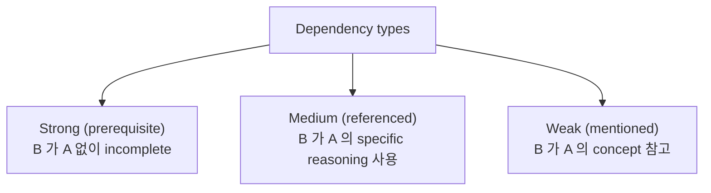
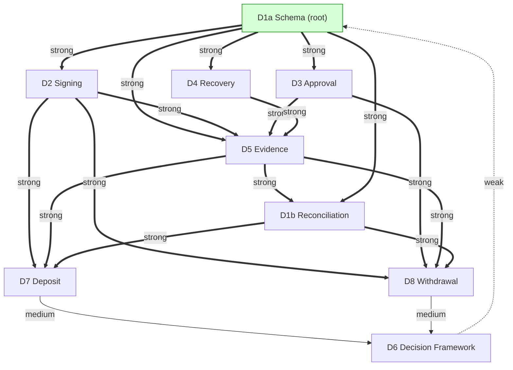
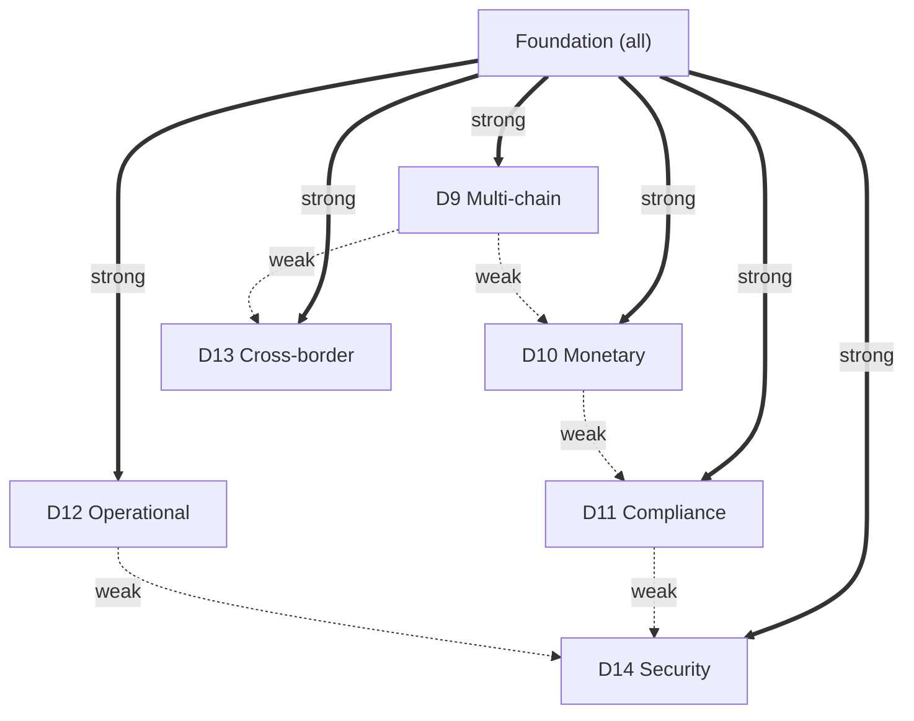
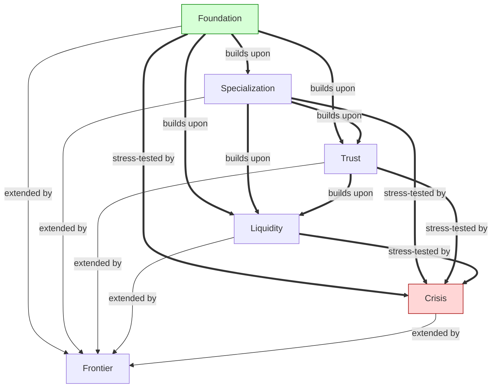
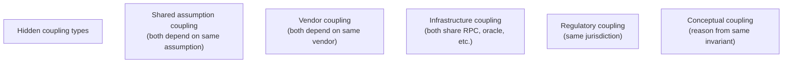
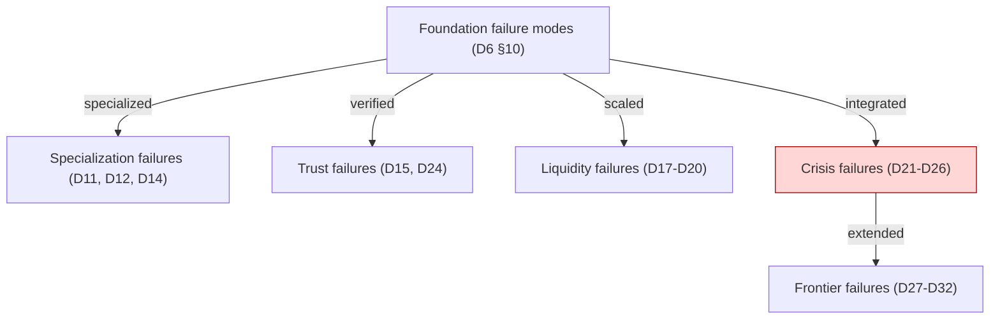

# C3 — Cross-reference / Dependency Graph

> **본 문서의 위치 (Consolidation C3)**: 33 documents 의 **conceptual dependency map**. Sequential reading order 가 아닌 **graph topology + propagation**. C-series 의 third step.

> **본 문서가 답하는 핵심 질문**: 어떤 document 가 다른 document 를 강하게 의존? 어떤 cluster interaction 이 가장 critical? 어떤 hidden coupling 이 corpus 전체에서 emerge? Failure-state inheritance 의 chain 은?

---

## 0. 핵심 명제 (10초 이해)

1. **Corpus = dependency graph, not linear book** (core thesis).
2. **5 "≠" 명제**:
   - Reference ≠ Dependency
   - Citation ≠ Inheritance
   - Shared terminology ≠ Shared reasoning
   - Sequential order ≠ Structural dependency
   - Local optimization ≠ Global consistency
3. **Dependency = "B 의 reasoning 이 A 의 reasoning 없이 incomplete"**.
4. **3-tier dependency** — Strong (prerequisite) / Medium (referenced) / Weak (mentioned).
5. **Cluster interaction topology** — Foundation 의 broadcast 역할, Crisis 의 inheritance, Frontier 의 reference.
6. **Bridge invariant chain** — explicit reasoning transition.
7. **Hidden coupling** — documented but easy-to-miss connections.
8. **Reasoning propagation** — invariant 의 across-cluster spread.
9. **Cyclic dependency** — rare, but exists in cross-references.
10. **Dependency graph 의 sparse** — most documents depend on 2-5 others.

---

## 1. Dependency Type Taxonomy

### 1.1 3-tier dependency



### 1.2 Type 별 example

| Type | Example |
|---|---|
| Strong | D2 → D1a (D2 의 signing 이 D1a 의 schema 위에) |
| Strong | D7 → D1b (deposit 이 reconciliation 위에) |
| Medium | D9 → D2 (multi-chain 이 signing 의 chain-specific 측면) |
| Medium | D11 → D5 (compliance 가 evidence chain 활용) |
| Weak | D17 → D6 (treasury 가 decision framework 의 burden 참고) |
| Weak | D27 → D10 (CBDC 가 stablecoin 대비) |

### 1.3 "Reference ≠ Dependency"

(§0 명제)

- Reference: 다른 doc 의 mention.
- Dependency: 그 doc 의 reasoning 의 활용.
- 차이:
  - Reference 만 있고 dependency 없을 수 있음 (just citation)
  - Dependency 가 있어야 actual reasoning relationship
- → Catalog 시 dependency 의 explicit identification.

### 1.4 "Citation ≠ Inheritance"

- Citation = "see also".
- Inheritance = "uses concept of".
- Inheritance 가 architectural connection 의 strong form.

### 1.5 Dependency graph 의 sparsity

- Each doc 의 typical dependency: 2-5 docs.
- Total dependencies (33 docs × ~3 avg): ~100 edges.
- Possible edges (33 choose 2): ~528.
- → Sparsity (~20% density) = good architecture sign.

---

## 2. Foundation Cluster Internal Dependencies



### 2.1 Foundation 의 dependency observations

- **D1a = root** (no foundation prerequisite).
- **D5 = hub** (most foundation docs depend on it).
- **D1b = bridge** (depends on D5, supports D7+D8).
- **D6 = synthesis** (depends on D7+D8, makes D1a-D8 의 trade-off framework).

### 2.2 Reading order 의 implication

- Start with D1a (no prerequisite).
- D2/D3/D4 의 parallel reading 가능.
- D5 의 후 D1b.
- D7/D8 의 parallel.
- D6 last (synthesis).

---

## 3. Cross-cluster Dependencies

### 3.1 Foundation → Specialization



### 3.2 Specialization 의 mutual independence

- D9-D14 가 largely independent.
- Weak cross-reference exists (D10 의 multi-chain context = D9, D13 의 chain + monetary = D9, D10).

### 3.3 Foundation → Trust

```
D5 ==> D15, D16, D24 (evidence layer 의 public-facing)
D11 ==> D16, D24 (compliance 의 identity + reporting)
D1b ==> D24 (cross-domain reconciliation 의 regulator-facing)
```

### 3.4 Foundation → Liquidity

```
D10 ==> D17 (treasury 의 base)
D8 ==> D18 (withdrawal 의 omnibus context)
D6 ==> D17 (decision framework)
D20 inherits D17, D18, D19 (within liquidity cluster)
```

### 3.5 Trust + Liquidity → Crisis

```
D15 ==> D21 (transparency in depeg)
D24 ==> D23 (reporting in jurisdictional crisis)
D17 + D20 ==> D25 (liquidity in systemic freeze)
D5 + D14 ==> D26 (evidence + security in failure)
```

### 3.6 Foundation + others → Frontier

```
D10 ==> D27 (CBDC vs stablecoin)
D8 + D20 ==> D28 (intent vs withdrawal vs cross-institution)
D17 + D3 ==> D29 (autonomous treasury vs manual governance)
D3 + D12 ==> D30 (AI-assisted vs human governance)
D5 + D15 ==> D31 (confidential evidence)
D4 + D14 ==> D32 (recovery + security 의 PQ measure)
```

---

## 4. Cluster Interaction Topology

### 4.1 Cluster-level dependency



### 4.2 Foundation 의 broadcast role

- 모든 cluster 가 Foundation 의존.
- Foundation 의 변경 시 ripple effect 전체.
- → Foundation 의 stability 의 architectural critical.

### 4.3 Crisis 의 inheritance role

- 모든 prior cluster 의 stress-test.
- Crisis cluster 의 reasoning 은 모든 prior 의 인식.
- → Crisis 의 highest reasoning complexity.

### 4.4 Frontier 의 reference role

- 모든 prior cluster 의 reference.
- 그러나 Frontier 의 변경이 backward 의 영향 안 줌.
- → Frontier 의 separability.

### 4.5 Within-cluster vs cross-cluster

| | Within-cluster density | Cross-cluster density |
|---|---|---|
| Foundation | High | (root, exports) |
| Specialization | Low | Sparse |
| Trust | Medium (sequential) | Medium |
| Liquidity | Medium (sequential) | Medium |
| Crisis | Medium (synthesis at D26) | High (inherits all) |
| Frontier | Low (independent) | Medium |

---

## 5. Bridge Invariant Chain

### 5.1 Bridge invariants identified

| Bridge | From → To | Key invariants |
|---|---|---|
| Foundation → Spec | D6 → all spec | Burden distribution framework |
| Spec → Trust | D5 / D11 → D15-D24 | Evidence + identity ↔ public-facing |
| Trust → Liquidity | D15 → D17 / D20 | Trust 의 monetary application |
| Liquidity → Crisis | D20 → D25 | Cross-institution stress |
| Crisis → Frontier | D26 → all frontier | Failure inheritance |
| Within cluster | Various | Sequential progression |

### 5.2 Bridge 의 explicit reasoning

- 각 cluster 의 closing doc 에 "Bridge invariants" section.
- 예: D24 → D17 의 "trust → liquidity" bridge.
- 예: D26 → D27 의 "crisis → frontier" bridge.

### 5.3 Bridge invariant 의 propagation pattern

```
Invariant established in Foundation
  ↓ inherited by Specialization (specialized expression)
  ↓ verified by Trust (external visibility)
  ↓ scaled by Liquidity (monetary scale)
  ↓ stress-tested by Crisis (failure-state)
  ↓ extended by Frontier (future evolution)
```

### 5.4 Example: append-only invariant propagation

```
D1a (foundation): append-only ledger
  ↓
D3 (foundation): append-only ApproverDecision
  ↓
D5 (foundation): append-only evidence chain
  ↓
D11 (spec): append-only governance audit
  ↓
D15 (trust): public append-only attestation chain
  ↓
D24 (trust): regulator-facing append-only
  ↓
D17 (liquidity): append-only treasury ledger
  ↓
D26 (crisis): append-only under crisis preserved
  ↓
D29 (frontier): append-only under autonomous
  ↓
D31 (frontier): append-only encrypted log
```

### 5.5 Bridge invariant catalog 가 corpus 의 spine

- Document = node.
- Bridge invariant = edge.
- 두 결합 = navigable corpus.

---

## 6. Hidden Coupling

### 6.1 Hidden coupling 의 5 type



### 6.2 Identified hidden couplings in corpus

| Coupling | Documents |
|---|---|
| Chain finality assumption | D8, D17, D22, D27 |
| Banking infrastructure | D10, D13, D17, D21, D27 |
| Sanctions list | D11, D14, D23 |
| Cryptographic primitive | D2, D4, D14, D31, D32 |
| Time / clock | All temporal docs |
| Audit firm trust | D5, D15, D24, D31 |

### 6.3 Coupling 의 crisis-time emergence

(D26 §3 의 reasoning)

- Hidden coupling 의 pre-crisis invisibility.
- Crisis 시 emerging:
  - Multiple institutions 의 same dependency
  - Same vendor 의 systemic failure
  - Same assumption 의 simultaneous invalidation

### 6.4 Coupling minimization architecture

| Coupling type | Mitigation |
|---|---|
| Shared assumption | Multi-source verification + monitoring |
| Vendor | Vendor diversification |
| Infrastructure | Multi-RPC, multi-region |
| Regulatory | Multi-jurisdiction subsidiary |
| Conceptual | (often necessary - documentation) |

### 6.5 Cross-cluster coupling

- 같은 invariant 의 multiple cluster 의 동시 manifestation.
- 예: append-only 가 D1a + D5 + D11 + D15 + D17 + D29 + D31 모두.
- 변경 시 cross-cluster ripple.

---

## 7. Reasoning Propagation

### 7.1 Propagation pattern

```
Invariant introduced in Document A
  ↓ documented (explicit)
  ↓ inherited by dependent Document B
  ↓ specialized (domain-specific expression)
  ↓ stress-tested by Crisis Document C
  ↓ extended by Frontier Document D
```

### 7.2 Propagation 의 fidelity

- Strong dependency: invariant 가 verbatim propagated.
- Medium dependency: invariant 가 reasoning 으로 referenced.
- Weak dependency: invariant 가 contextual hint.

### 7.3 Example: "≠ propositions" 의 propagation

```
D1a Q3: Ledger append-only? Yes (foundation)
  ↓
D5 §10.1: Append-only ≠ Tamper-proof (extension)
  ↓
D17 §7.5: Survivability is sovereign (treasury application)
  ↓
D21 §10.1: Peg deviation ≠ Insolvency (crisis application)
  ↓
D26 §0.3: Append-only ≠ Tamper-proof (re-stated, integration)
```

### 7.4 Reasoning amplification

- 일부 invariant 의 cross-cluster manifestation = amplification.
- 예: "Survivability > Efficiency" 의 every cluster 의 manifestation.
- → Reasoning 의 robustness.

### 7.5 Reasoning contradiction (rare but possible)

- 다른 cluster 의 different perspective.
- 예:
  - D31 confidentiality favors hiding
  - D24 reporting favors disclosing
- Resolution: balance via D31 §4 audit-preserving confidentiality.
- → Tension 의 explicit reasoning.

---

## 8. Failure-state Inheritance

### 8.1 Failure inheritance chain



### 8.2 Crisis cluster 의 inheritance

- D26 (closing) 가 모든 prior cluster 의 failure 인식.
- 6 failure domains (D26 §1.1) 의 cross-cluster:
  - Governance (D3, D23, D29-D30)
  - Liquidity (D17, D25)
  - Settlement (D1b, D22)
  - Evidence (D5, D15)
  - Trust (D21, D24)
  - Identity (D16)

### 8.3 Failure propagation 의 cluster across

- 단일 cluster 의 stress → adjacent cluster 의 propagation.
- 예: D21 stablecoin depeg → D25 systemic liquidity → D23 regulatory action.

### 8.4 Reasoning baseline

- Crisis cluster 의 reasoning 은 모든 prior cluster 의 reasoning 의 prerequisite.
- → Crisis 의 highest reading complexity.

---

## 9. Cyclic Dependencies

### 9.1 Rare but exist

- Most dependencies = acyclic.
- Exception 일부:
  - D5 evidence ↔ D11 compliance (mutual)
  - D14 security ↔ D5 evidence (mutual)
  - D11 compliance ↔ D24 reporting (mutual)

### 9.2 Cyclic dependency 의 handling

- Cycles 의 explicit identification.
- Conceptual seniority (어느 쪽이 더 fundamental):
  - D5 > D11 (evidence 가 compliance 의 input)
  - D14 cross-cuts (security 가 every doc 의 concern)
  - D11 > D24 (compliance evidence 가 reporting 의 source)

### 9.3 Cycle 의 architectural meaning

- Mutual dependence = tight coupling.
- 일부 unavoidable (related concept).
- → Documentation 에서 explicit handling.

### 9.4 Reading 의 cycle 처리

- Cycle 시 reader 의 first pass 만 partial.
- Second pass (다른 doc 후) 의 full understanding.
- → Iterative reading 의 nature.

### 9.5 Architectural simplification

- Cycle minimization 의 architectural discipline.
- 현재 corpus 의 cycle 적음 = healthy.

---

## 10. Q1-Q10 Reasoning

### Q1. Dependency types

§1. Strong / Medium / Weak.

### Q2. Foundation 의 broadcast role

§4.2.

### Q3. Crisis 의 inheritance

§4.3.

### Q4. Frontier 의 separability

§4.4.

### Q5. Bridge invariant chain

§5.

### Q6. Hidden coupling 의 types

§6.1.

### Q7. Reasoning propagation

§7.

### Q8. Failure inheritance chain

§8.

### Q9. Cyclic dependencies

§9.

### Q10. Sparsity 의 architectural sign

§1.5.

---

## 11. Open Questions

| 영역 | 질문 |
|---|---|
| Dependency graph 의 visualization tool | which? |
| Dependency 의 strength quantification | metric? |
| Hidden coupling discovery | systematic process? |
| Reasoning amplification 의 measurement | how? |
| Cycle prevention | design discipline? |
| Cross-corpus comparison | with other architecture corpora |

---

## 12. References + Uncertainty Boundary

### 관련 wiki

- All 33 D-documents
- C1 (Master Index), C2 (Invariant Catalog), C4-C6

### Uncertainty Boundary

- 본 문서는 **dependency catalog** — corpus 의 explicit analysis.
- §6.2 hidden coupling list = analyst observation, comprehensive 미보장.
- §7.4 reasoning amplification = analytical interpretation.
- §9 cyclic dependency = current corpus 의 observation.

---

**Stage 32 C3 completion timestamp**: 2026-05-20.
