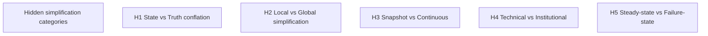
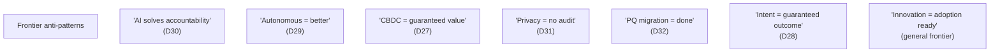
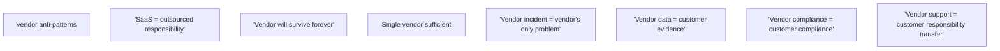

# C4 — Anti-pattern / Failure Pattern Catalog

> **본 문서의 위치 (Consolidation C4)**: 33 documents 에서 nation/identified anti-patterns 의 **catalog + hierarchy**. Corpus 의 reasoning 이 actively guards against 의 misconception. C-series 의 fourth step.

> **본 문서가 답하는 핵심 질문**: 어떤 anti-pattern 이 recurring? 어떤 illusion 이 corpus 전체에서 위험? 어떤 hidden simplification 이 architecture 의 conceptual boundary 를 정의? 어떤 misconception 이 institutional failure 의 root?

---

## 0. 핵심 명제 (10초 이해)

1. **Anti-patterns reveal corpus 의 boundaries** (core thesis).
2. **5 "≠" 명제**:
   - Simplification ≠ Clarity
   - Automation ≠ Survivability
   - Transparency ≠ Trust elimination
   - Decentralization ≠ Coordination removal
   - Evidence ≠ Reputation recovery
3. **8 illusion families** — governance / decentralization / transparency / solvency / automation / privacy / efficiency / vendor.
4. **Anti-pattern = "looks right but architecturally wrong"**.
5. **Misconception 의 propagation** — single doc 의 anti-pattern 이 across-cluster manifestation.
6. **Hype framing** = primary anti-pattern source.
7. **Marketing simplification** = institutional risk.
8. **Anti-pattern 의 boundary signal** — corpus 가 guard 하는 영역.
9. **40+ specific anti-patterns** documented across corpus.
10. **Anti-pattern reasoning** = corpus 의 protective layer.

---

## 1. Top 10 Anti-patterns (D6 §12 의 통합)

### 1.1 D6 의 original 10 anti-patterns

```mermaid
graph TB
    AP["Top 10 anti-patterns (D6)"]

    AP1["1. MPC = Solved custody"]
    AP2["2. Self-hosted = Sovereign"]
    AP3["3. SaaS = Outsourced responsibility"]
    AP4["4. Air-gap = Secure operations"]
    AP5["5. Direct-build = Institutional-grade"]
    AP6["6. Append-only = Forensic complete"]
    AP7["7. Recovery exists = Survivable"]
    AP8["8. Reconciliation automated = Safe"]
    AP9["9. Multi-sig = Governance"]
    AP10["10. More control = Better architecture"]

    classDef ap fill:#ffd6d6,stroke:#a00000
    class AP1,AP2,AP3,AP4,AP5,AP6,AP7,AP8,AP9,AP10 ap
```

### 1.2 각 anti-pattern 의 truth

| Anti-pattern | Truth |
|---|---|
| MPC = solved | MPC = 1 cryptographic primitive; governance/recon/evidence/recovery 모두 별개 |
| Self-hosted = sovereign | Self-hosted SaaS 도 vendor lock-in 잔존; recovery sovereignty 가 진짜 test |
| SaaS = outsourced responsibility | SaaS 도 customer 책임 ~25-45% |
| Air-gap = secure | Air-gap 는 1 layer; supply chain / physical / human / side-channel 잔존 |
| Direct-build = institutional-grade | Institutional-grade 는 maturity 의 함수 |
| Append-only = forensic complete | Hash chain + WORM + external anchoring + signing 필요 |
| Recovery exists = survivable | DR exercise + custodian maintenance + utility maintenance 없으면 작동 안 함 |
| Reconciliation automated = safe | Exception capacity 가 safety 결정 factor |
| Multi-sig = governance | Multi-sig = crypto primitive; governance = state machine + freshness + escalation + audit |
| More control = better | Maturity 부족 시 over-control 도 anti-pattern |

### 1.3 Anti-pattern 의 common structure

- 단일 component 의 over-attribution.
- "X가 있으면 모든 문제 해결" 의 fallacy.
- Reality: X = necessary but not sufficient.

### 1.4 Anti-pattern detection 의 indicator

- Marketing 의 superlative ("fully solved", "trustless", "guaranteed")
- Single technical solution 의 over-claim
- Operational complexity 의 minimization
- → Skeptical reading 의 trigger.

---

## 2. Illusion Families

### 2.1 8 illusion families

```mermaid
graph TB
    ILL["Illusion families"]

    I1["Governance illusion<br/>(automation = no governance)"]
    I2["Decentralization illusion<br/>(decentralized = no coordination)"]
    I3["Transparency illusion<br/>(visibility = trust eliminated)"]
    I4["Solvency illusion<br/>(reserve = solvent)"]
    I5["Automation illusion<br/>(automated = safe)"]
    I6["Privacy illusion<br/>(encrypted = auditable)"]
    I7["Efficiency illusion<br/>(faster = better)"]
    I8["Vendor illusion<br/>(SaaS = no responsibility)"]

    classDef illusion fill:#ffd6d6,stroke:#a00000
    class I1,I2,I3,I4,I5,I6,I7,I8 illusion
```

### 2.2 Family 별 manifestation

**I1 Governance illusion**:
- D3: 11-state SM, not boolean
- D29 §1.3: Automation ≠ Governance elimination
- D30: AI-assisted ≠ decision automation

**I2 Decentralization illusion**:
- D20: Federation ≠ Systemic safety
- D26: Coordination still required even decentralized
- D27: CBDC = centralized but trust 가 sovereign

**I3 Transparency illusion**:
- D15: Transparency ≠ Disclosure
- D15: PoR ≠ Solvency proof
- D15: Snapshot ≠ Continuous truth

**I4 Solvency illusion**:
- D10: PoR ≠ Solvency
- D10 §9: Mass redemption cascade
- D21: Reserve equality ≠ Confidence

**I5 Automation illusion**:
- D29 §0: Autonomous execution ≠ Autonomous accountability
- D1b §9: Reconciliation 의 manual exception 필요
- D30: Recommendation ≠ Authority

**I6 Privacy illusion**:
- D31: Privacy ≠ Opacity
- D31: Confidentiality ≠ Non-auditability
- D31: Hidden state ≠ Hidden liability

**I7 Efficiency illusion**:
- D6: Survivability > Efficiency
- D19: Efficiency ≠ Crisis survivability
- D17: Capital efficiency ≠ Liquidity safety

**I8 Vendor illusion**:
- D6 §12.3: SaaS ≠ Outsourced responsibility
- D11 §13.3: Compliance SaaS customer burden ~80%
- D24 §11.3: Reporting SaaS customer burden ~95%

### 2.3 Illusion 의 origin

(★ Hypothesis — operational reasoning)

- Marketing simplification
- New technology hype cycles
- Vendor sales pitch
- Misunderstanding of complexity
- → Illusion 의 multiple cultural source.

### 2.4 Illusion 의 institutional cost

- Adoption based on illusion → architectural failure under stress.
- Marketing-driven decision = subsequent crisis.
- → Anti-illusion discipline 의 institutional value.

### 2.5 "Simplification ≠ Clarity"

(§0 명제)

- Simplification: complexity 의 reduction.
- Clarity: structure 의 understanding.
- 차이:
  - Over-simplification = false simplicity (illusion)
  - True clarity = nuanced understanding
- → Reasoning 의 sophistication 의 value.

---

## 3. Recurring Misconception Catalog

### 3.1 Misconception list (from corpus)

```mermaid
graph TB
    MISC["Recurring misconceptions"]

    M1["'AI solves governance'<br/>(D30 anti-pattern)"]
    M2["'Trustless system'<br/>(false marketing)"]
    M3["'Decentralization solves failure'<br/>(D20 / D26 anti-pattern)"]
    M4["'More redundancy = survivability'<br/>(D26 §3 hidden coupling)"]
    M5["'Smart contracts enforce policy'<br/>(D3 의 governance 가 더 큰 영역)"]
    M6["'Encryption = security'<br/>(D14 §11.1)"]
    M7["'Compliance = security'<br/>(D14 §11.4)"]
    M8["'No incident = secure'<br/>(D14 §11.3)"]
    M9["'Pentested = hardened'<br/>(D14 §8.3)"]
    M10["'Audit pass = secure'<br/>(D14 §11.2)"]
    M11["'Fast settlement = better'<br/>(D13 §9.2)"]
    M12["'Best practice = sufficient'<br/>(D14 §11.5)"]
```

### 3.2 Misconception 의 architectural impact

각 misconception 가 specific architectural risk:

| Misconception | Architectural risk |
|---|---|
| AI solves governance | Accountability gap |
| Trustless | Vendor lock-in invisibility |
| Decentralization = no failure | Coordination collapse |
| Redundancy = survivability | Correlated stress vulnerable |
| Smart contracts = policy | Off-chain governance gap |
| Encryption = security | Other security dimension neglect |
| Compliance = security | Adversarial vulnerability |
| No incident = secure | Detection gap |
| Pentested = hardened | Point-in-time vulnerability |
| Audit pass = secure | Scope limitation |
| Fast settlement = better | Reorg risk |
| Best practice = sufficient | Threat-specific gap |

### 3.3 Misconception 의 detection 방법

| Signal | Likely misconception |
|---|---|
| "Fully solved" | Single solution illusion |
| "Trustless" | Trust relocation 미인식 |
| "Just deploy X" | Operational complexity 무시 |
| "Best in industry" | Threat-informed practice 부재 |
| "Battle-tested" | Future scenario 무시 |

### 3.4 Anti-misconception discipline

- 모든 architectural decision 의 multi-dimension analysis.
- "what could go wrong" 의 active reasoning.
- Counter-intuitive 결론 의 verification.

### 3.5 Marketing language 의 anti-pattern signal

- Superlative ("fully", "completely", "guaranteed")
- Eliminate ("eliminates risk", "trustless")
- Single-component-solves-all ("just X", "X alone")
- → Reasoning skepticism 의 trigger.

---

## 4. Hidden Simplification Catalog

### 4.1 5 categories of hidden simplification

### 4.2 각 category 의 example

**H1 State vs Truth conflation**:
- "Current ledger = truth" (D5 §10 의 limitation)
- "Account balance = ownership" (D18 §1.2 의 reasoning)
- "Address = identity" (D16 §1.3)

**H2 Local vs Global**:
- "Local optimization = system improvement" (D19 §6.4 의 reasoning)
- "Per-customer fine = aggregate OK" (D18 hidden exposure)

**H3 Snapshot vs Continuous**:
- "Audit pass = continuous compliance" (D14 §11.2)
- "PoR = solvent" (D10 §7.2, D15 §2.2)
- "KYC pass = ongoing identity" (D16 §2.4)

**H4 Technical vs Institutional**:
- "Chain finality = settlement finality" (D9 §4.2)
- "System recovery = institutional recovery" (D22 §7.3)
- "Technical = institutional failure" (D26 §1.5)

**H5 Steady-state vs Failure-state**:
- "Normal operation = survivability" (D6 §10, D26)
- "Tests pass = stress-tested" (D12 §5)

### 4.3 Hidden simplification 의 detection

- "Same concept" applied across contexts.
- Loss of nuance in cross-context use.
- Operational vs institutional 의 conflation.

### 4.4 Reasoning discipline

- Explicit naming of simplification.
- "≠ propositions" 의 active use.
- Multi-domain perspective.

---

## 5. Crisis-time Anti-patterns

### 5.1 Crisis-specific anti-patterns (D21-D26 통합)

| Anti-pattern | Source |
|---|---|
| "Silent fix is preferred" | D14 §9.4 reverse |
| "Crisis = normal accelerated" | D12 §4.1 |
| "Vendor will handle crisis" | D26 §11 (100% customer in crisis) |
| "Insurance covers everything" | D26 §11.3 limitation |
| "Recovery plan exists = OK" | D4 §11.5, D12 §5.2 |
| "Black swan can't be planned" | D26 §3.5 (latent topology) |
| "Restoration = recovery" | D22 §7.3 |
| "Public statement = communication" | D21 §6.3 |
| "Single root cause" | D26 §1.4 (cascading) |
| "Quick recovery = full recovery" | D21 §4.5 (trust hysteresis) |

### 5.2 Crisis communication 의 anti-pattern

- Silence breeds rumor.
- Premature disclosure amplifies panic.
- Inconsistent message = trust loss.
- → D21 §6.3 의 disclosure paradox.

### 5.3 Crisis decision 의 anti-pattern

- Single-decision-maker (D12 ICS 의 single IC reverse 아님).
- No pre-positioned playbook (D12 §4.3).
- Insurance over-reliance (D26 §11.3).
- → Crisis governance 의 discipline.

### 5.4 Post-crisis 의 anti-pattern

- "Lessons learned" without follow-up.
- Action items without owner.
- Returning to normal without architectural change.
- → D12 §7 의 postmortem discipline.

---

## 6. Frontier 의 Anti-pattern Risks

### 6.1 Frontier-specific anti-patterns

### 6.2 Hype cycle 의 anti-pattern

- 각 frontier 의 hype cycle:
  - 초기 over-promise
  - Disillusionment
  - Realistic adoption
- 본 corpus 의 anti-hype framing.

### 6.3 Adoption discipline

- Conservative + gradual + reversible.
- Failure-state planning before adoption.
- Skill development before deployment.
- → Frontier 의 careful approach.

### 6.4 Emerging tech 의 institutional fit

- 모든 emerging tech 가 institutional fit 아님.
- Some are speculative (frontier nature).
- Adoption decision 의 rigor.

---

## 7. Vendor-related Anti-patterns

### 7.1 SaaS / vendor anti-patterns

### 7.2 Vendor lock-in 의 invisibility

- Lock-in 의 layer:
  - Data format
  - API integration
  - Knowledge / training
  - Operational dependency
  - Recovery utility
- → 모든 layer 의 awareness.

### 7.3 Vendor disappearance scenario

(D6 §10.2)

- Vendor 의 bankruptcy / acquisition / shutdown.
- Recovery sovereignty test.
- → Vendor selection 의 due diligence + own recovery readiness.

### 7.4 Multi-vendor 의 strategy

- Single vendor 의 risk vs multi-vendor 의 complexity.
- Operational cost ↑, but resilience ↑.
- → Trade-off 의 explicit reasoning.

---

## 8. Architectural Anti-patterns

### 8.1 Design anti-patterns

```mermaid
graph TB
    DA["Design anti-patterns"]

    DA1["Single point of failure<br/>(everywhere in corpus)"]
    DA2["Tight coupling<br/>(D26 §3 hidden coupling)"]
    DA3["Premature optimization<br/>(D17 §3 의 efficiency vs safety)"]
    DA4["Over-abstraction<br/>(D28 intent abstraction limit)"]
    DA5["Under-specification<br/>(D29 §2.3 policy correctness)"]
    DA6["Implicit dependency<br/>(D3 의 dependency 의 explicitness)"]
    DA7["Magic configuration<br/>(D29 §5.2 의 scope-violation)"]
    DA8["Synchronous everywhere<br/>(D2 §6 의 non-idempotent retry)"]
```

### 8.2 Operational anti-patterns

| Anti-pattern | Documents |
|---|---|
| Alert fatigue | D12 (F1) |
| Documentation decay | D12 (F4) |
| Skill atrophy | D14 (M-skill) |
| Knowledge silo | D12 (F3) |
| Cargo-cult procedure | D12 (postmortem-only writing) |
| Crisis fatigue | D12 (F9) |
| Vendor-of-the-month | D14 (vendor diversity 의 reverse) |

### 8.3 Governance anti-patterns

| Anti-pattern | Documents |
|---|---|
| Rubber-stamp approval | D3 (M-approver training) |
| Quorum 가 single-decision-maker | D3 (governance 의 reasoning) |
| Break-glass routine use | D3 (F9), D4 (F7) |
| Override too easy | D29 (F6) |
| Authority confusion | D12 (F6) |

### 8.4 Communication anti-patterns

| Anti-pattern | Documents |
|---|---|
| Silent fix | D14 (F10) |
| Information cascade rumor | D21 (F5) |
| Inconsistent messaging | D21 (§6.3) |
| Over-disclosure 의 panic amplification | D21 (§6.3) |

### 8.5 Anti-pattern 의 universal nature

- 모든 anti-pattern = institutional failure 의 source.
- 각 corpus document 의 active guard.
- → Anti-pattern 의 catalog = institutional protection.

---

## 9. "Best Practice" 의 Limits

### 9.1 "Best practice ≠ Threat-informed practice"

(D14 §11.5 의 핵심)

- Industry best practice = generic baseline.
- Threat-informed practice = own threat model.
- 차이:
  - Best practice 가 own threat 와 mismatch 가능
  - Better practice = own threat 기반
- → Best practice 의 starting point only.

### 9.2 Best practice 의 origin

- Industry consensus.
- Historical learning.
- Regulatory guidance.
- Vendor recommendation.

### 9.3 Best practice 의 limitations

| Limitation | 의미 |
|---|---|
| Generic | Specific context 미반영 |
| Lagging | New threat 미반영 |
| Politicized | Industry favorite 의 reflection |
| Marketing-influenced | Vendor 의 shaping |
| Insufficient | Specific institutional risk 미coverage |

### 9.4 Beyond best practice

- Threat model 의 own development.
- Continuous evaluation.
- Industry research engagement.
- → Threat-informed > best practice.

### 9.5 Common best practice 의 dangerous

(★ Hypothesis — institutional risk)

- 일부 best practice 의 dangerous 한 over-application:
  - "Move fast" in custody = catastrophic
  - "Iterate" in compliance = regulatory fail
  - "MVP" in recovery = inadequate
- → Industry-specific discipline.

---

## 10. Q1-Q10 Reasoning

### Q1. Why catalog anti-patterns

§0.1. Reveal corpus boundaries.

### Q2. 8 illusion families

§2.

### Q3. Crisis-specific anti-patterns

§5.

### Q4. Frontier 의 hype risk

§6.

### Q5. Vendor lock-in invisibility

§7.2.

### Q6. Hidden simplification detection

§4.3.

### Q7. Marketing language 의 signal

§3.5.

### Q8. Best practice 의 limits

§9.

### Q9. Universal anti-pattern nature

§8.5.

### Q10. Anti-pattern 의 institutional value

§2.4.

---

## 11. Open Questions

| 영역 | 질문 |
|---|---|
| Anti-pattern discovery | systematic process? |
| Anti-pattern hierarchy | priority order? |
| Industry-wide anti-pattern catalog | shared resource? |
| Anti-pattern detection automation | feasibility? |
| Cultural anti-pattern | beyond technical |
| Anti-pattern 의 quantification | severity metric? |

---

## 12. References + Uncertainty Boundary

### 관련 wiki

- All 33 D-documents (anti-patterns scattered throughout)
- D6 §12 (top 10 anti-pattern catalog 의 origin)
- D14 §11-§12 (security anti-pattern)
- D26 (crisis 의 reverse)
- C1-C3, C5-C6

### Uncertainty Boundary

- 본 문서는 **catalog from corpus** — anti-pattern 의 explicit list.
- §3.1 misconception list = analyst observation, comprehensive 미보장.
- §6.1 frontier anti-pattern = emerging area.
- §9.5 dangerous best practice = ★ Hypothesis level.

---

**Stage 32 C4 completion timestamp**: 2026-05-20.
