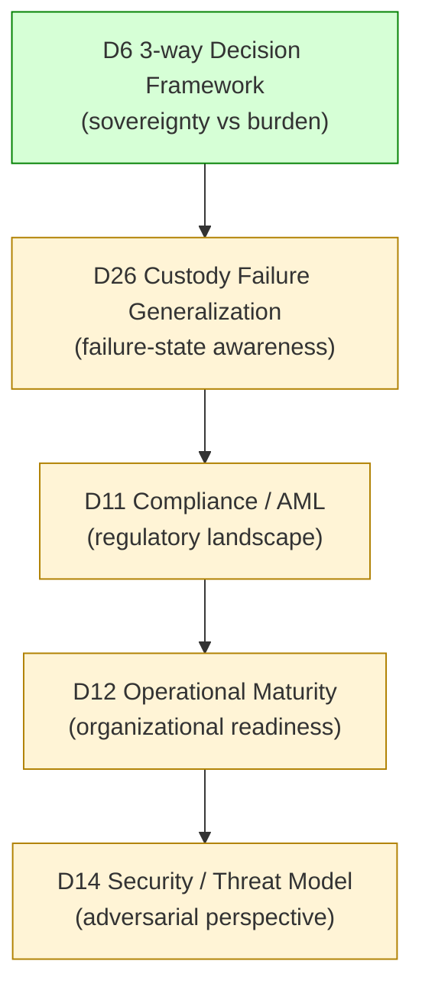
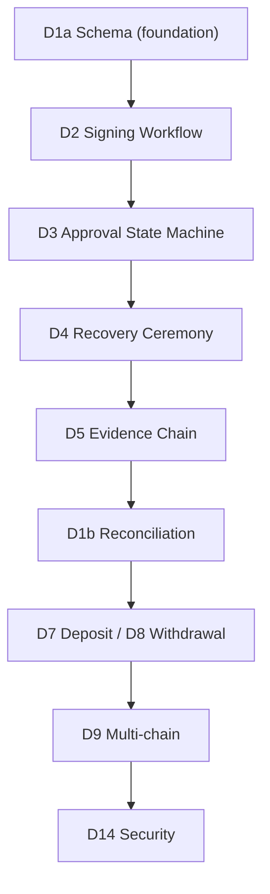
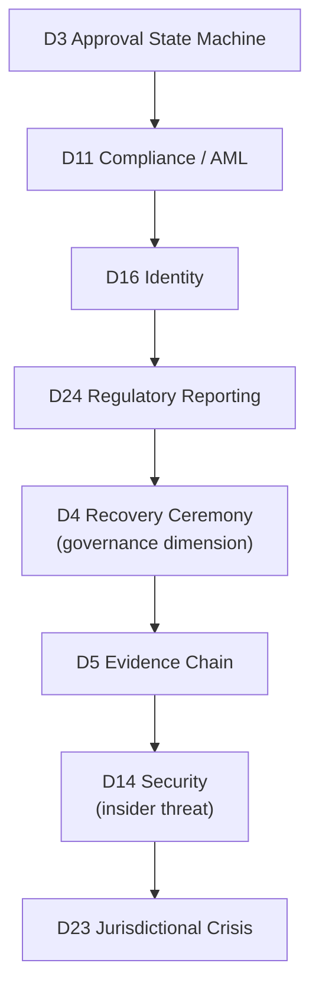
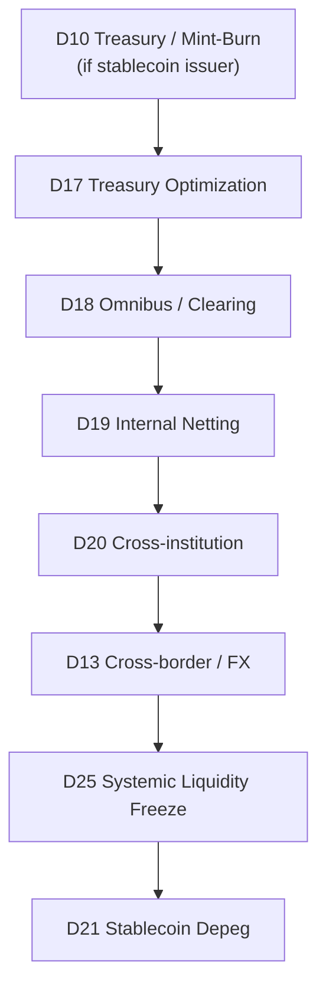
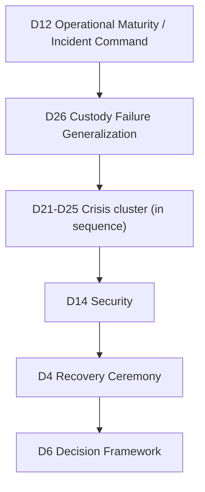
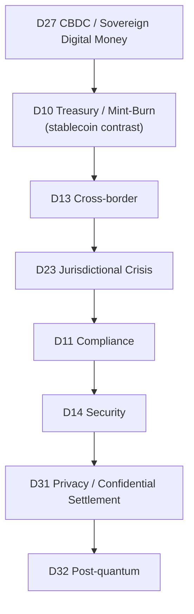
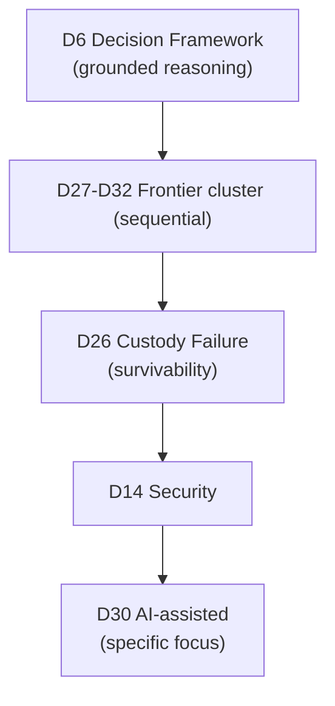
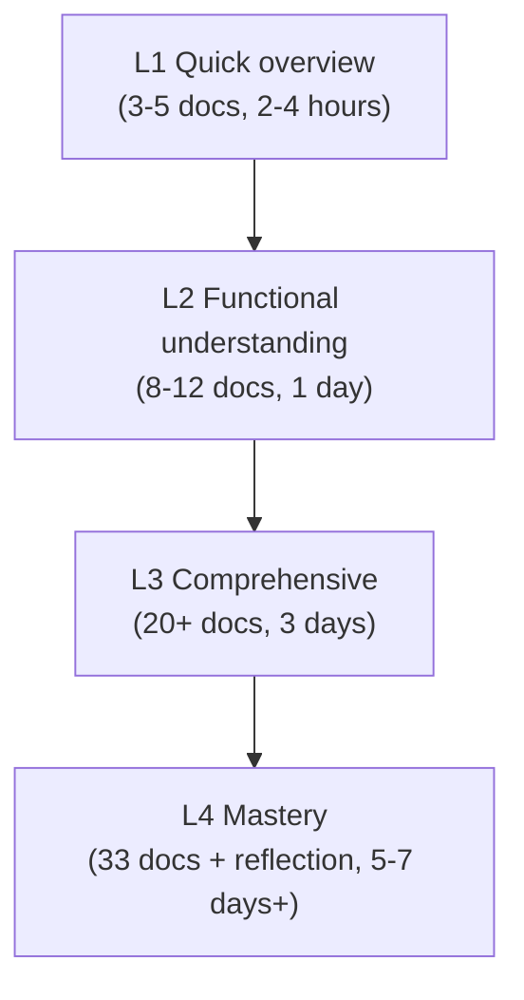

# C5 — Executive / Audience Reading Paths

> **본 문서의 위치 (Consolidation C5)**: 33 documents 의 **audience-specific navigation**. Same corpus, different reconstruction paths. C-series 의 fifth step.

> **본 문서가 답하는 핵심 질문**: 각 institutional role 의 first-read priority? 어떤 cluster 의 어떤 doc 이 어떤 audience 의 critical? Progressive learning path 의 design?

---

## 0. 핵심 명제 (10초 이해)

1. **Different audiences = different subsets of corpus** (core thesis).
2. **5 "≠" 명제**:
   - Summary ≠ Understanding
   - Audience tailoring ≠ Concept reduction
   - Reading path ≠ Knowledge completeness
   - Executive abstraction ≠ Strategic clarity
   - Technical depth ≠ Operational readiness
3. **8 audience profiles** — Executive / Engineer / Governance / Treasury / Regulator-facing / Crisis-response / Sovereign-CBDC / Frontier-research.
4. **Progressive learning ladder** — Quick overview → Functional → Comprehensive → Mastery.
5. **Path length variance** — 3-doc summary to full 33-doc corpus.
6. **Cluster relevance per audience** — different focus.
7. **Operational role alignment** — practical readiness over comprehensive theory.
8. **Cross-audience document** = D6 (decision framework) 의 critical for all.
9. **Reading time estimate** — 2 hours (overview) to 7 days (full).
10. **Re-reading discipline** — corpus 의 understanding 의 iterative.

---

## 1. Audience Profile Definition

### 1.1 8 audience profiles

```mermaid
graph TB
    AUD["Audience profiles"]

    A1["A1 Executive<br/>(CEO, COO, CFO, board)"]
    A2["A2 Engineer<br/>(architects, senior devs)"]
    A3["A3 Governance / Compliance<br/>(compliance officer, legal counsel)"]
    A4["A4 Treasury / Liquidity<br/>(treasury team, liquidity manager)"]
    A5["A5 Regulator-facing<br/>(compliance lead, regulatory affairs)"]
    A6["A6 Crisis-response<br/>(incident commander, security lead)"]
    A7["A7 Sovereign / CBDC<br/>(central bank, sovereign authority)"]
    A8["A8 Frontier research<br/>(R&D, future planning)"]
```

### 1.2 각 audience 의 focus

| Audience | Primary concern |
|---|---|
| Executive | Strategic decision + sovereignty + risk |
| Engineer | Technical architecture + implementation reasoning |
| Governance / Compliance | Policy + audit + regulatory |
| Treasury / Liquidity | Capital efficiency + survivability + coordination |
| Regulator-facing | Compliance + reporting + transparency |
| Crisis-response | Failure-state + incident command + recovery |
| Sovereign / CBDC | Sovereign monetary + cross-border |
| Frontier research | Emerging tech + survivability + future evolution |

### 1.3 Audience 의 reading discipline

- Each audience 의 own questions.
- Same doc 의 different reading focus.
- → Audience-aware reading.

### 1.4 Cross-audience document

(★ central role)

- **D6 3-way Custody Decision Framework** = critical for all 8 audiences.
- 모든 audience 가 sovereignty vs burden trade-off 의 reasoning 필요.

### 1.5 "Summary ≠ Understanding"

(§0 명제)

- Executive summary 가 understanding 보장 아님.
- Audience 별 의 specific reasoning 필요.
- → Reading 의 reflection 의 important.

---

## 2. Executive Reading Path

### 2.1 Executive 의 starting point

### 2.2 Executive 의 reading focus

| Doc | Executive question |
|---|---|
| D6 | Which model fits our institution? |
| D26 | What could destroy our institution? |
| D11 | What regulatory risk we face? |
| D12 | Are we operationally ready? |
| D14 | What adversarial scenarios? |

### 2.3 Executive 의 reading time

- 5 docs × 1-2 hours each = ~1-2 days.
- Plus reflection + discussion = 1 week.

### 2.4 Executive 의 key takeaway

- Custody architecture = sovereignty vs burden trade-off.
- Survivability > Efficiency.
- Customer responsibility 의 retention 거의 모든 model 에서.
- Crisis preparation = strategic priority.

### 2.5 Executive 의 next-level reading

- D24 Reporting (if regulatory engagement large)
- D17 + D20 Liquidity (if treasury-heavy)
- D27 CBDC (if sovereign / regulated)

---

## 3. Engineer Reading Path

### 3.1 Engineer 의 starting point

### 3.2 Engineer 의 reading focus

| Doc | Engineer question |
|---|---|
| D1a | How is system 의 data structured? |
| D2 | How does signing work? MPC mechanics? |
| D3 | How does governance flow? |
| D4 | How does recovery work? |
| D5 | How is evidence preserved? |
| D1b | How is reconciliation handled? |
| D7/D8 | How do deposit/withdrawal lifecycles work? |
| D9 | How is multi-chain handled? |
| D14 | What threats to consider? |

### 3.3 Engineer 의 reading time

- 9 docs × 2-3 hours each = ~3-4 days.
- Full foundation + key spec.

### 3.4 Engineer 의 deep-dive

- Additional spec: D10 (treasury), D11 (compliance), D12 (ops), D13 (cross-border)
- Trust cluster: D15 (transparency), D16 (identity)
- Liquidity: D17-D20 (if scaling)

### 3.5 Engineer 의 take-away

- Architecture 의 multi-layer.
- State machines 의 separation.
- Append-only invariant 의 critical.
- Cross-domain consistency 의 reasoning.

---

## 4. Governance / Compliance Reading Path

### 4.1 Path

### 4.2 Reading focus

| Doc | Question |
|---|---|
| D3 | How does approval flow + governance state machine? |
| D11 | What compliance requirements? sanctions? KYT? |
| D16 | Identity attribution + counterparty? |
| D24 | Regulatory reporting + audit reconstruction? |
| D4 | Recovery governance + custodian quorum? |
| D5 | Evidence chain for compliance? |
| D14 | Insider threat? Adversarial regulator? |
| D23 | Cross-jurisdictional regulatory conflict? |

### 4.3 Reading time

- 8 docs × 2 hours = ~2 days.

### 4.4 Key takeaway

- Compliance = layered governance.
- Identity = probabilistic, not binary.
- Audit = reconstructable evidence.
- Cross-jurisdiction = compounded challenge.

### 4.5 Deep-dive

- D15 Transparency
- D31 Confidential Settlement
- D27 CBDC (regulatory dimension)

---

## 5. Treasury / Liquidity Reading Path

### 5.1 Path

### 5.2 Reading focus

| Doc | Question |
|---|---|
| D10 | Treasury for issuance? Reserves? |
| D17 | Capital efficiency vs safety? |
| D18 | Omnibus structure? Clearing? |
| D19 | Internal netting? |
| D20 | Cross-institution coordination? |
| D13 | Cross-border + FX? |
| D25 | Systemic liquidity crisis? |
| D21 | Depeg scenarios? |

### 5.3 Reading time

- 8 docs × 2 hours = ~2 days.

### 5.4 Key takeaway

- Liquidity = routable settlement capacity.
- Efficiency vs survivability trade-off.
- Cross-institution = federation under stress.
- Crisis preparation = mandatory.

### 5.5 Deep-dive

- D6 Decision framework
- D15 Transparency / PoR
- D26 Custody Failure Generalization

---

## 6. Crisis-response Reading Path

### 6.1 Path

### 6.2 Reading focus

| Doc | Question |
|---|---|
| D12 | Incident command + ICS? |
| D26 | Failure taxonomy + cascading? |
| D21-D25 | Specific crisis scenarios? |
| D14 | Security incident response? |
| D4 | Recovery ceremony preparation? |
| D6 | Failure-state planning? |

### 6.3 Reading time

- ~10 docs × 2 hours = ~3 days.

### 6.4 Key takeaway

- Crisis = cascading multi-domain failure.
- ICS + crisis governance.
- Latent failure topology recognition.
- Recovery preparation = continuous.

### 6.5 Deep-dive

- D14 Security
- D11 Compliance (regulatory crisis dimension)
- D17 Treasury (liquidity stress)

---

## 7. Sovereign / CBDC Reading Path

### 7.1 Path

### 7.2 Reading focus

| Doc | Question |
|---|---|
| D27 | Sovereign monetary design? |
| D10 | Private stablecoin contrast? |
| D13 | Cross-border / FX? |
| D23 | Multi-jurisdictional governance? |
| D11 | AML + compliance? |
| D14 | Nation-state threat model? |
| D31 | Privacy 의 sovereign decision? |
| D32 | Long-term PQ readiness? |

### 7.3 Reading time

- 8 docs × 2 hours = ~2 days.

### 7.4 Key takeaway

- CBDC = sovereign monetary coordination.
- Programmability = policy tool + surveillance dimension.
- Cross-border = state-level negotiation.
- Long-term survivability = institutional.

---

## 8. Frontier Research Reading Path

### 8.1 Path

### 8.2 Reading focus

| Doc | Question |
|---|---|
| D6 | What is grounded reasoning baseline? |
| D27-D32 | Emerging domain understanding? |
| D26 | Survivability under frontier? |
| D14 | Adversarial frontier? |
| D30 | AI-assisted specifically? |

### 8.3 Reading time

- ~10 docs × 2 hours = ~3 days.

### 8.4 Key takeaway

- Frontier = emerging + speculative.
- Conservative adoption discipline.
- Hype avoidance = institutional value.
- Future-proofing = continuous.

---

## 9. Progressive Learning Ladder

### 9.1 4-level ladder

### 9.2 Level별 selection

**L1 Quick overview** (3-5 docs):
- D6 (decision framework)
- D26 (failure)
- C1 (index)

**L2 Functional understanding** (8-12 docs):
- Foundation foundational set (D1a, D2, D3, D5, D6)
- Plus key spec (D11, D12, D14)
- Plus crisis intro (D26)
- Plus one cluster (own choice)

**L3 Comprehensive** (20+ docs):
- All foundation
- All specialization
- Trust + Liquidity cluster
- Crisis cluster

**L4 Mastery** (33 docs):
- Full corpus
- Re-reading
- Cross-reference verification
- Discussion + reflection

### 9.3 Ladder 의 progression

- Each level 의 understanding 가 next level 의 prerequisite.
- Skipping 은 false confidence.
- → Disciplined progression.

### 9.4 Learning time estimate

(★ Hypothesis)

| Level | Time |
|---|---|
| L1 | 2-4 hours |
| L2 | 1 day |
| L3 | 3 days |
| L4 | 5-7 days + reflection |

### 9.5 Re-reading 의 value

- Initial reading = first-pass.
- Cross-reference 후 second pass = deeper understanding.
- Practical application 후 third pass = mastery.
- → Iterative learning.

---

## 10. Operational Role Alignment

### 10.1 Role × Document matrix

| Role | Foundation | Spec | Trust | Liquidity | Crisis | Frontier |
|---|---|---|---|---|---|---|
| Executive | D6 | D11, D12 | D24 | D17, D20 | D26 | optional |
| Engineer | All | D9, D14 | D15, D16 | D17 | D26 | optional |
| Compliance | D3, D5 | D11 | All | D17 | D23 | D31 |
| Treasury | D5, D8 | D10, D13 | D15 | All | D21, D25 | D27 |
| Regulator-facing | D5 | D11 | D24 | optional | D23 | D27 |
| Crisis-response | D4, D5 | D12, D14 | optional | optional | All | D32 |
| Sovereign-CBDC | D5, D6 | D10, D11, D13 | D24 | optional | D23 | D27, D32 |
| Frontier research | D6 | D14 | optional | optional | D26 | All |

### 10.2 Critical doc 의 role overlap

- D5 Evidence: critical for 거의 모든 role.
- D6 Decision framework: universal.
- D26 Failure generalization: most senior roles.

### 10.3 Role 의 evolving

- Role 의 specialization 시간에 따라 변화.
- Cross-role 의 understanding 의 value (예: engineer 의 compliance understanding).

### 10.4 Team reading discipline

- Team 의 different members 의 different focus.
- Joint reading 의 discussion 의 value.
- → Team learning 의 architectural understanding.

### 10.5 Onboarding 의 path

- New member 의 onboarding:
  - Week 1: Quick overview (L1)
  - Week 2-4: Functional understanding (L2)
  - Month 2-3: Comprehensive (L3)
  - Ongoing: Mastery + practical application
- → Structured onboarding.

---

## 11. Cross-audience Documents

### 11.1 Universal documents

| Doc | Why universal |
|---|---|
| D6 | Strategic decision framework |
| D5 | Evidence chain underlying everything |
| D26 | Failure taxonomy 통합 |
| C1 | Master index (this consolidation) |

### 11.2 Highly recommended for multiple audiences

| Doc | Audiences |
|---|---|
| D11 | Compliance + Executive + Regulator + Treasury |
| D14 | Engineer + Compliance + Crisis + Frontier |
| D17 | Treasury + Executive + Crisis |
| D24 | Compliance + Regulator + Executive |

### 11.3 Domain-specific (audience-specific)

- D2 (MPC): Engineer-only deep
- D9 (Multi-chain): Engineer + multi-chain treasury
- D27 (CBDC): Sovereign + 일부 frontier

### 11.4 Optional / specialized

- D31 (Privacy): emerging
- D32 (Post-quantum): future-planning
- D28 (Intent): emerging frontier

---

## 12. Q1-Q10 Reasoning

### Q1. Why 8 audience profiles

§1.1. Institutional role 의 reality.

### Q2. Cross-audience doc

§11.1. D5, D6, D26 의 universal value.

### Q3. Progressive ladder

§9.

### Q4. Audience-specific focus

§2-§8.

### Q5. Re-reading discipline

§9.5.

### Q6. Team learning

§10.4.

### Q7. Onboarding path

§10.5.

### Q8. Critical doc identification

§11.

### Q9. Reading time estimate

§9.4 (★ Hypothesis).

### Q10. Summary ≠ Understanding

§1.5.

---

## 13. Open Questions

| 영역 | 질문 |
|---|---|
| Audience expansion | additional role? |
| Path customization | per institution? |
| Interactive reading aid | tool? |
| Discussion format | book club? |
| Quiz / verification | learning check? |
| Multi-language | translation? |
| Visual learning | diagram-first approach? |
| Audio version | accessibility? |

---

## 14. References + Uncertainty Boundary

### 관련 wiki

- All 33 D-documents
- C1 (Master Index), C2-C4, C6

### Uncertainty Boundary

- 본 문서는 **audience guide** — 실제 reading 의 specific choices.
- §9.4 reading time = estimate.
- §10.5 onboarding path = ideal pattern, institutional reality 의 variation.
- §1.1 audience profile = analytical categorization.

---

**Stage 32 C5 completion timestamp**: 2026-05-20.
