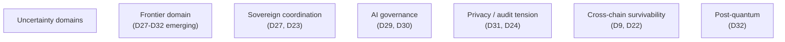
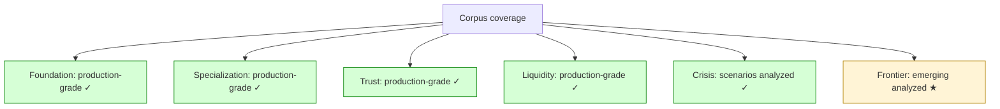
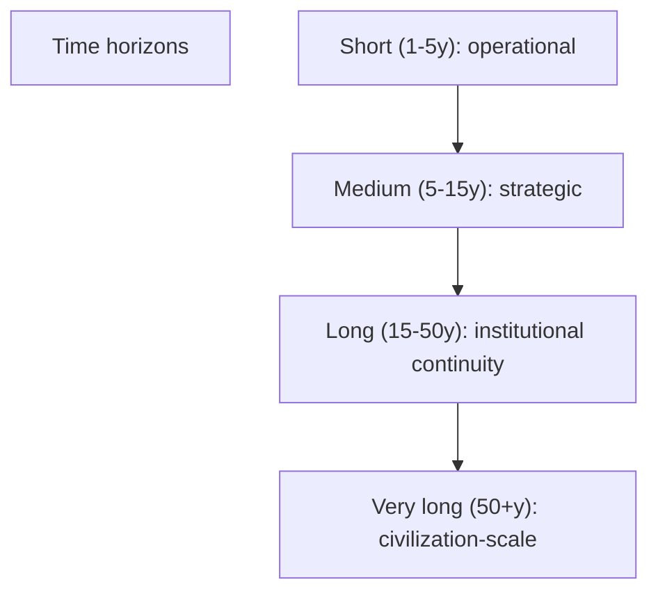
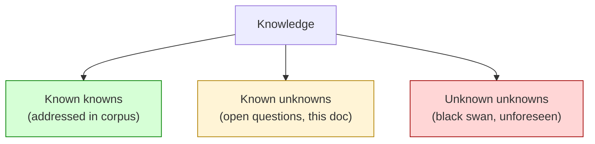
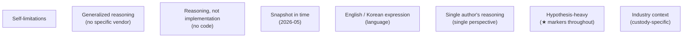
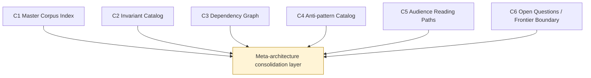
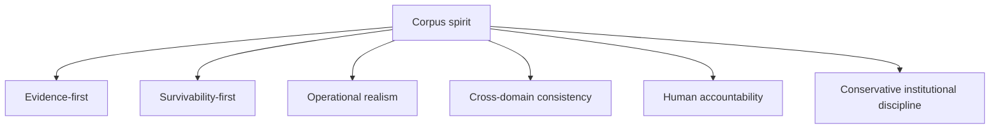

# C6 — Open Questions / Frontier Boundary

> **본 문서의 위치 (Consolidation C6 — closing)**: 33 documents 의 **explicit uncertainty boundary**. Corpus 가 의도적으로 미해결 영역 + frontier 의 ambiguity. C-series 의 final step.

> **본 문서가 답하는 핵심 질문**: 어떤 영역 의 corpus 가 unresolved? 어떤 frontier domain 의 uncertainty 가 fundamental? 어떤 question 의 future research 의 agenda? 어떤 boundary 가 corpus 의 known vs unknown 의 분리?

---

## 0. 핵심 명제 (10초 이해)

1. **Mature corpus preserves uncertainty explicitly** (core thesis).
2. **5 "≠" 명제**:
   - Open question ≠ Weakness
   - Incomplete theory ≠ Invalid theory
   - Frontier ambiguity ≠ Architectural failure
   - Uncertainty acknowledgment ≠ Lack of rigor
   - Survivability planning ≠ Predictability
3. **Uncertainty 의 explicit declaration** = corpus 의 maturity sign.
4. **6 uncertainty domain** — frontier / sovereign / AI / privacy / cross-chain / post-quantum.
5. **Civilization-scale survivability** = ultimate horizon, fundamental ambiguity.
6. **Open question catalog** = research + organizational decision space.
7. **Speculative vs operational separation** = explicit.
8. **Unknown unknowns** = acknowledged via Hypothesis ★ + scenarios.
9. **Future research agenda** = corpus 의 extension paths.
10. **Corpus 의 final discipline** = humility + ongoing learning.

---

## 1. Uncertainty Categories

### 1.1 6 uncertainty domain



### 1.2 Domain 별 uncertainty 의 nature

| Domain | Uncertainty source |
|---|---|
| Frontier | Emerging tech + adoption pattern |
| Sovereign | Geopolitics + multi-state coordination |
| AI | Capability evolving + accountability framework |
| Privacy | Regulatory + cryptographic + social |
| Cross-chain | Ecosystem fragmentation + evolution |
| Post-quantum | Timeline + algorithm + migration |

### 1.3 Uncertainty 의 reasoning value

- 모든 architecture 가 some uncertainty.
- Explicit acknowledgment 가 corpus 의 trustworthiness.
- Hidden uncertainty (false confidence) = institutional risk.

### 1.4 "Open question ≠ Weakness"

(§0 명제)

- Open question: acknowledged not-yet-answered.
- Weakness: gap that should be filled but isn't.
- 차이:
  - Open question 가 honest mature.
  - Weakness 가 oversight or laziness.
- → Open question 의 explicit articulation 의 value.

### 1.5 "Survivability planning ≠ Predictability"

(§0 명제)

- Survivability planning: prepare for unknown.
- Predictability: know what will happen.
- 차이:
  - Survivability 는 uncertainty-aware planning
  - Predictability 는 false promise
- → Plan for survival, not certainty.

---

## 2. Unresolved Question Catalog

### 2.1 Cross-cluster unresolved questions

```mermaid
graph TB
    UQ["Unresolved questions"]

    Q1["Q1 How to measure custody architecture quality?"]
    Q2["Q2 How to compare different jurisdictional regimes?"]
    Q3["Q3 What is acceptable residual risk threshold?"]
    Q4["Q4 How does institution evolve through clusters?"]
    Q5["Q5 What is the right balance of frontier adoption?"]
    Q6["Q6 How to verify cross-domain consistency at scale?"]
    Q7["Q7 What is the limit of human coordination?"]
    Q8["Q8 How does industry-wide architecture standardize?"]
```



### 2.2 Foundation-level open questions

| Question | Documents |
|---|---|
| What is optimal split between aggregate boundaries? | D1a |
| When to use ES vs CRUD+emission? | D1a §6 |
| What is acceptable approval freshness window? | D3 §5 |
| Custodian quorum 의 optimal threshold? | D4 |
| Evidence retention 의 optimal duration? | D5 §8 |

### 2.3 Specialization-level open questions

| Question | Documents |
|---|---|
| Multi-chain support priority? | D9 |
| Stablecoin reserve composition? | D10 |
| Sanctions list comprehensiveness? | D11 |
| Operational maturity assessment? | D12 |
| Cross-border banking strategy? | D13 |
| Threat model evolution? | D14 |

### 2.4 Trust-level open questions

| Question | Documents |
|---|---|
| PoR cadence balance? | D15 |
| Identity attribution confidence threshold? | D16 |
| Regulatory reporting timing? | D24 |

### 2.5 Liquidity-level open questions

| Question | Documents |
|---|---|
| Treasury tier allocation? | D17 |
| Omnibus vs segregated? | D18 |
| Netting frequency? | D19 |
| Cross-institution coordination? | D20 |

### 2.6 Crisis-level open questions

| Question | Documents |
|---|---|
| Crisis communication timing? | D21 |
| Chain selection on fork? | D22 |
| Jurisdictional default? | D23 |
| Emergency coordination authority? | D25 |
| Reconstruction prioritization? | D26 |

### 2.7 Frontier-level open questions (largest)

| Question | Documents |
|---|---|
| CBDC adoption path? | D27 |
| Intent-based standard? | D28 |
| Autonomous treasury safety? | D29 |
| AI accountability framework? | D30 |
| Privacy / audit balance? | D31 |
| PQ migration timing? | D32 |

---

## 3. Frontier Boundary Map

### 3.1 What corpus covers



### 3.2 What corpus does NOT cover

| Out-of-scope | Reason |
|---|---|
| Specific vendor product reviews | Generalized reasoning intent |
| SQL DDL / implementation code | Implementation phase, not reasoning |
| Specific jurisdiction legal advice | Legal counsel's domain |
| Specific chain tutorials | Generalized via D9 |
| Marketing / sales material | Anti-pattern (hype) |
| Operational handbook | Different document type |
| Crypto economic protocol design | Different domain (token economics) |
| Civilization-scale speculative | Beyond practical horizon |

### 3.3 Speculative-domain separation

- 본 corpus 의 Frontier cluster 도 emerging.
- 추가 speculative (e.g. interplanetary settlement):
  - 의도적 미포함
  - 본 corpus 의 scope 밖
- → Speculation 의 boundary 명확.

### 3.4 Frontier boundary 의 evolution

- Frontier 의 일부 가 maturity 시 → Specialization 으로 이동.
- 예: 5-10년 후 D27 CBDC 가 production-grade 가능.
- Corpus 의 evolution 의 reasoning.

### 3.5 Corpus 의 incremental update

- Frontier 의 maturity 시 corpus update.
- New emerging domain 의 addition.
- Outdated frontier 의 deprecation.
- → Living corpus.

---

## 4. Future Research Agenda

### 4.1 Research priorities

```mermaid
graph TB
    R["Research priorities"]

    R1["R1 Quantification metric<br/>(architecture quality, burden estimate)"]
    R2["R2 Cross-corpus comparison<br/>(other architecture frameworks)"]
    R3["R3 Empirical validation<br/>(actual institutional behavior)"]
    R4["R4 Frontier maturation<br/>(emerging domain의 production)"]
    R5["R5 Industry standardization<br/>(shared invariants)"]
    R6["R6 Adversarial scenarios<br/>(continuous threat model)"]
    R7["R7 Cross-disciplinary<br/>(financial + tech + governance)"]
    R8["R8 Educational corpus<br/>(teaching framework)"]
```



### 4.2 Quantification needs

- Burden estimate 의 empirical validation.
- Architecture maturity scoring.
- Survivability metrics.
- → Currently qualitative + reasoning-based.

### 4.3 Industry standardization opportunity

- Cross-institution shared invariants.
- Common evidence formats.
- Standardized PoR / PoL.
- Common compliance reporting.
- → Industry coordination 의 value.

### 4.4 Cross-disciplinary engagement

- Financial economics
- Distributed systems theory
- Cryptography research
- Governance theory
- Legal scholarship
- → Multi-domain expertise convergence.

### 4.5 Educational corpus

- 본 corpus 의 teaching application.
- Curriculum design.
- Practitioner training.
- → Knowledge transfer mechanism.

---

## 5. Civilization-scale Considerations

### 5.1 Long horizon survivability



### 5.2 Civilization-scale concerns

| Concern | 의미 |
|---|---|
| Sovereign currency continuity | State 의 long-term existence |
| Cryptographic primitive 의 multi-century | PQ + future primitives |
| Knowledge transmission | Generations of operators |
| Civilizational disruption | Pandemic, war, climate |
| Cultural / institutional decay | Long-term entropy |

### 5.3 Boundary of corpus 의 horizon

- 본 corpus 의 practical horizon: 1-15 years.
- Long-term (15-50y): some reasoning relevant (D32 PQ).
- Very long (50+y): speculative beyond corpus scope.

### 5.4 "Survivability planning" 의 limits

- Plan 의 plan 의 plan = infinite regress.
- Practical horizon 의 acceptance.
- → Reasonable planning 의 boundary.

### 5.5 Civilization vs institution

- Civilization 의 survival > institution 의 survival.
- Institution 의 design 가 civilization 의 part.
- → 보존 의 multi-scale.

---

## 6. Unknown Unknowns

### 6.1 Known vs unknown



### 6.2 Unknown unknowns 의 acknowledgment

- Cannot enumerate (by definition).
- 그러나 acknowledged via:
  - Hypothesis ★ marking
  - Survivability principles
  - Failure-state planning
  - Continuous learning

### 6.3 Reducing unknown unknowns

- Diverse perspective (audience reading paths)
- Red team / threat model evolution
- Industry engagement
- Historical learning (D26 §5.4 의 narrative)
- → Active discipline.

### 6.4 Embracing unknown unknowns

- Acceptance 의 strategy:
  - Robust failure-state planning
  - Resilient organizational design
  - Continuous adaptation
- → Anti-fragility design (where possible).

### 6.5 Survivability 의 ultimate test

- Unknown unknown 의 first encounter:
  - Survival = corpus 의 framework 의 success
  - Failure = framework 의 incompleteness 의 visible
- → Black swan 시 의 institutional behavior 가 ultimate test.

---

## 7. Corpus Maintenance

### 7.1 Living document discipline

- Corpus 의 ongoing update.
- Frontier 의 maturation 에 따라 cluster 의 evolution.
- New anti-pattern 의 catalog.
- Reading path 의 refresh.

### 7.2 Update triggers

| Trigger | Action |
|---|---|
| Major incident in industry | D26 + cluster update |
| New regulation | D11, D24 update |
| New chain / protocol | D9 extension |
| AI capability advance | D30 update |
| PQ standard finalization | D32 update |
| Frontier maturation | Cluster reorganization |

### 7.3 Corpus governance

- Editor / maintainer 의 role.
- Contribution process.
- Versioning (corpus 의 own).
- → Sustainable corpus.

### 7.4 Backward compatibility

- Past version 의 reasoning 유지.
- Update 의 explicit changelog.
- → Reasoning continuity.

### 7.5 Industry feedback

- Industry practitioners 의 input.
- Academic engagement.
- Regulatory comment.
- → External validation.

---

## 8. Corpus 의 Self-limitations

### 8.1 Explicit limitations



### 8.2 Generalization 의 limit

- Generalization 의 strength: pattern recognition.
- Limit: institution-specific reasoning required.
- → Corpus = framework, not blueprint.

### 8.3 Time 의 limit

- 본 corpus 의 reasoning 은 current state.
- Future 의 different reasoning 가능.
- → Time-bounded document.

### 8.4 Single perspective limit

- Single author 의 perspective.
- Multi-author / multi-stakeholder review 의 value.
- → Future enrichment.

### 8.5 Practical application limit

- Reasoning ≠ Implementation.
- Implementation 의 own challenges.
- → Implementation phase (D-impl) 의 reasoning.

---

## 9. Q1-Q10 Reasoning

### Q1. Why explicit uncertainty

§0.1. Maturity over false confidence.

### Q2. 6 uncertainty domains

§1.1.

### Q3. Frontier boundary 의 evolving

§3.4.

### Q4. Out-of-scope catalog

§3.2.

### Q5. Civilization horizon

§5.

### Q6. Unknown unknowns

§6.

### Q7. Living document

§7.1.

### Q8. Self-limitations

§8.

### Q9. Industry standardization opportunity

§4.3.

### Q10. Survivability ultimate test

§6.5.

---

## 10. Open Questions (meta-level)

| 영역 | 질문 |
|---|---|
| Corpus quality measurement | metric? |
| Corpus completeness | when 'done'? |
| Multi-author corpus | governance? |
| Translation | which languages? |
| Industry-wide adoption | how to facilitate? |
| Educational integration | curriculum? |
| Regulatory acknowledgment | feedback loop? |
| Open-source corpus | license? contribution? |
| Living document version | management |
| Cross-corpus integration | with peer corpora? |

---

## 11. Cluster Closing Summary (C1-C6)

### 11.1 6-document consolidation integration



### 11.2 C-series 의 cumulative contribution

- C1: navigation map
- C2: invariant extraction
- C3: dependency analysis
- C4: anti-pattern catalog
- C5: audience guide
- C6: uncertainty boundary

→ 33 D-docs 의 from "list" → "coherent corpus".

### 11.3 Architecture corpus 의 final structure

```
33 D-documents (foundation + specialization + trust + liquidity + crisis + frontier)
  +
6 C-documents (consolidation: index + invariant + dependency + anti-pattern + audience + uncertainty)
  =
39 total documents 의 generalized custody architecture corpus
```

### 11.4 Corpus 의 publication-grade refinement

- 33 D + 6 C = navigable, coherent, audience-aware, uncertainty-honest corpus.
- "Publication-grade" 의 minimum:
  - Internal consistency ✓
  - Cross-reference 충분 ✓
  - Reader navigation 가능 ✓
  - Uncertainty explicit ✓
  - Anti-pattern guard ✓
- → Corpus 의 mature state.

### 11.5 Corpus 의 limits 의 explicit acknowledgment

- Generalized reasoning (no specific implementation).
- Single perspective (single author).
- Time-bounded (2026-05).
- Hypothesis-heavy (★ markers).
- Custody-specific (industry context).
- → Honest declaration.

---

## 12. Final Spirit

### 12.1 Corpus 의 spirit

(★ 본 corpus 의 underlying philosophy)



### 12.2 Discipline 의 active maintenance

- No hype.
- No vendor dependence.
- No ideology-first framing.
- No "final truth" claim.
- No reduction of uncertainty.

### 12.3 Reader 의 responsibility

- Critical reading (corpus 의 own critique).
- Institutional application (corpus 의 own context).
- Continuous learning (corpus 의 update).
- Industry engagement (cross-corpus).

### 12.4 Corpus 의 ongoing nature

- 본 corpus 의 closing은 publication, not completion.
- Living document 의 continuation.
- → Reader 의 own work 의 prerequisite.

### 12.5 Final invitation

> 본 corpus 의 reading 가 institutional custody architecture 의 starting point.
> Reader 의 own institutional context 의 application + adaptation + critique 가 corpus 의 utility.
> Continuous engagement + industry coordination = corpus 의 evolution.
> Conservative survivability discipline = institutional architecture 의 underlying invariant.

---

## 13. References + Final Uncertainty Boundary

### 관련 wiki

- All 33 D-documents
- C1-C5 (other consolidation docs)

### Final Uncertainty Boundary

- 본 C6 가 corpus 의 final consolidation 이지만 corpus 의 evolution 의 starting point.
- §5.4 civilization horizon = beyond corpus 의 practical scope.
- §6.2 unknown unknowns = irreducible.
- §4 future research agenda = corpus 의 extension paths.
- §11.5 corpus limits = explicit declaration.

### Total corpus state

**33 D-documents + 6 C-documents = 39 documents**
- D-series: generalized custody architecture reasoning
- C-series: corpus consolidation + meta-architecture

### Architecture corpus 최종 정의 (sentence)

> The architecture corpus is a navigable map of evidence-first survivability reasoning for institutional custody systems — preserved as a network of conceptual dependencies, recurring invariants, anti-pattern warnings, audience-aware pathways, and explicit uncertainty boundaries — under conservative institutional discipline that retains human accountability, acknowledges deep uncertainty, and refuses hype.

---

**Stage 32 C6 completion timestamp**: 2026-05-20.
**Stage 32 C-series consolidation 완성 timestamp**: 2026-05-20.
**Stage 32 D-series + C-series 39-document corpus 완성**.
