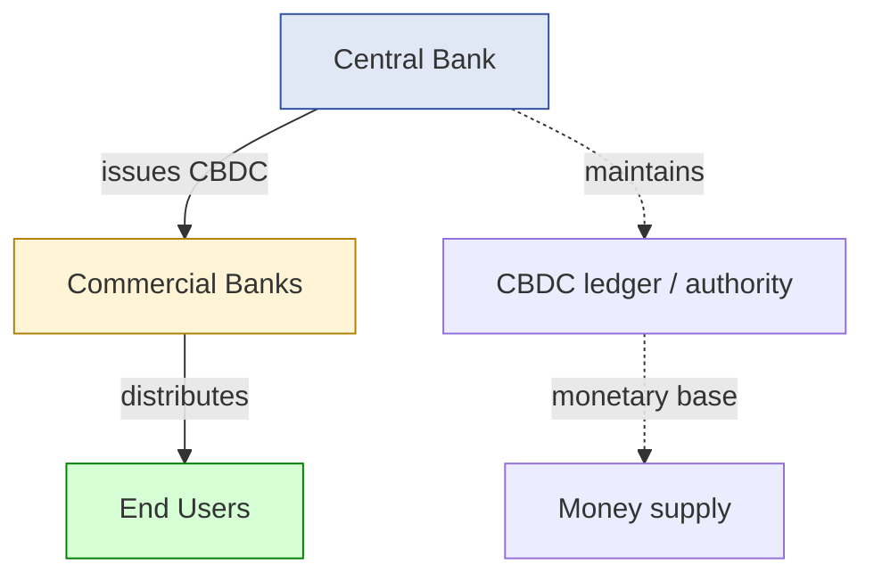
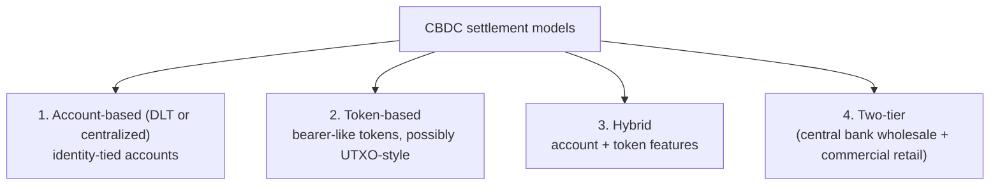
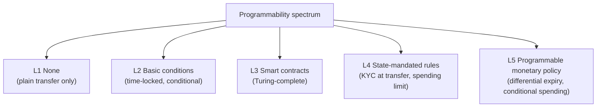
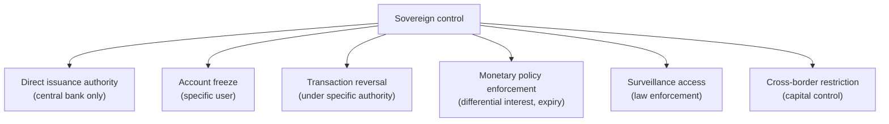
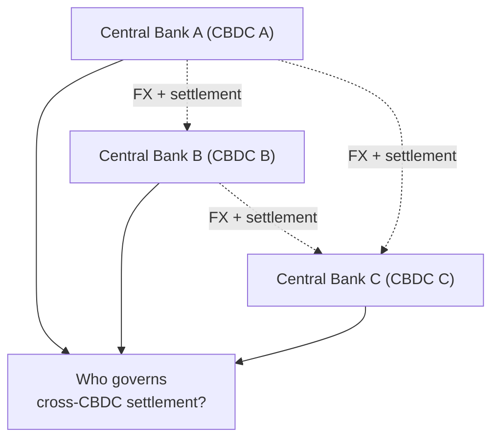
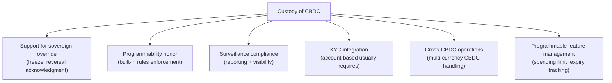

# Custody Wallet — CBDC / Sovereign Digital Money Reasoning

> **본 문서의 위치 (Frontier Cluster D27)**: D10 monetary + D11 compliance + D13 cross-border + D23 jurisdictional 위의 **sovereign-issued digital money specialization**. Stablecoin (D10) 와 대비되는 **state liability digital money**. Frontier cluster 의 첫 단계 — sovereign monetary system 의 architecture.

> **본 문서가 답하는 핵심 질문**: 왜 CBDC 가 digital fiat token 가 아닌가? 왜 programmable money 가 monetary efficiency 와 다른가? 왜 sovereign control 이 institutional survivability 가 아닌가? 왜 state visibility 가 economic certainty 보장 아닌가?

---

## 0. 핵심 명제 (10초 이해)

1. **CBDC = programmable sovereign monetary coordination system** (core thesis).
2. **5-tier "≠" 명제 (D27 cluster invariant)**:
   - Digital fiat ≠ CBDC
   - Programmable money ≠ Monetary efficiency
   - Sovereign control ≠ Institutional survivability
   - State visibility ≠ Economic certainty
   - CBDC interoperability ≠ Monetary unification
3. **CBDC = state liability** (vs stablecoin = issuer liability) — fundamental risk difference.
4. **2 CBDC type** — Wholesale (interbank) / Retail (consumer-facing).
5. **3-layer sovereignty stack** — Central bank issuance / Commercial bank distribution / End user holding.
6. **Programmability 의 sovereign dimension** — state-controlled rules embedded in money.
7. **Surveillance boundary** — settlement visibility 의 state capability.
8. **Cross-border CBDC interoperability** = multi-sovereign coordination challenge.
9. **State freeze authority** = built-in, vs stablecoin 의 issuer-level freeze (D11 §4).
10. **Frontier 위 custody implication** — CBDC custody 의 unique governance + technical model.

---

## 1. CBDC 의 Generalized Definition

### 1.1 CBDC = state liability digital money

### 1.2 "Digital fiat ≠ CBDC"

(§0 명제)

- Digital fiat: digital representation of fiat (bank deposits 도 digital fiat).
- CBDC: central bank liability + sovereign-issued + programmable platform.
- 차이:
  - Bank deposits = commercial bank liability (fractional reserve)
  - CBDC = central bank direct liability (sovereign, no intermediary risk)
  - Programmability dimension (smart features)
- → CBDC 는 monetary base 의 redesign, fiat 의 digitization 만 아님.

### 1.3 Wholesale vs Retail CBDC

| Type | 의미 | Use case |
|---|---|---|
| **Wholesale (wCBDC)** | Interbank settlement only | RTGS replacement, cross-border interbank |
| **Retail (rCBDC)** | General public access | Consumer payment, savings |

차이:
- wCBDC: limited participant, less privacy issue, banking infrastructure modernization
- rCBDC: broad participant, privacy + surveillance + financial inclusion 의 tension

### 1.4 CBDC vs Stablecoin (D10 의 대비)

| Aspect | CBDC | Stablecoin (private) |
|---|---|---|
| Issuer | Central bank | Private issuer |
| Liability | Sovereign | Issuer |
| Backing | Direct monetary base | Reserve (often) |
| Default risk | Sovereign default (very low) | Issuer default (variable) |
| Programmability | State-controlled | Issuer-controlled |
| Privacy | State-policy | Issuer / community |
| Cross-border | Inter-state coordination | Market-driven |

### 1.5 "Programmable money ≠ Monetary efficiency"

(§0 명제)

- Programmable money: smart contract-like features embedded in money.
- Monetary efficiency: transaction cost / latency / scale.
- 차이:
  - Programmability 가 efficiency 를 향상 가능 (instant settlement, smart escrow)
  - 그러나 complexity 의 추가 = potential overhead
  - Programmability features 의 governance + maintenance burden
- → Programmability 는 capability, efficiency 는 outcome — not equivalent.

---

## 2. CBDC Settlement Architecture

### 2.1 Settlement model variants

### 2.2 각 model 의 trade-off

| Model | Privacy | Efficiency | Audit | Implementation |
|---|---|---|---|---|
| Account-based | Low (identity-tied) | High (lookup) | Easy | Banking-like |
| Token-based | Higher (bearer) | Medium | Harder | New design |
| Hybrid | Variable | Variable | Variable | Most complex |
| Two-tier | Distributed | Familiar | Layered | Compatible with banking |

### 2.3 Central bank infrastructure 의 nature

(★ Hypothesis — emerging design)

- 가능한 backends:
  - Permissioned DLT (R3 Corda, Hyperledger Fabric 등)
  - Centralized database
  - Hybrid (settlement on DLT, ID on centralized)
- 결정 factor:
  - Resilience requirement
  - Throughput requirement (retail vs wholesale)
  - Privacy model
  - Interoperability with existing banking

### 2.4 Settlement finality 의 sovereign property

- CBDC finality = sovereign-defined (다른 chain 의 probabilistic 와 다름).
- 즉시 final (central bank 의 ledger update).
- 그러나 sovereign authority 의 retroactive change 가능 (theoretically).
- → Sovereign finality 의 unique nature.

### 2.5 Two-tier model (most likely)

(★ Hypothesis — emerging consensus among central banks)

- Central bank → wholesale CBDC to commercial banks.
- Commercial bank → retail CBDC to consumers.
- Existing banking infrastructure 활용.
- → Disruption minimized, but bank role 유지.

---

## 3. Programmability Dimension

### 3.1 Programmability 의 spectrum

### 3.2 State-mandated programmability

(★ Hypothesis — controversial design choice)

- Possible features:
  - KYC requirement at transfer
  - Spending limit (per category, per period)
  - Geographic restriction (foreign use 차단)
  - Expiration (use-by date)
  - Conditional spending (welfare 만 food)
  - Negative interest rate (programmatic deduction)
- → Strong policy tool, but surveillance/control 측면 의 controversy.

### 3.3 Privacy implications

| Programmability level | Privacy impact |
|---|---|
| L1 None | Cash-like privacy (high) |
| L2 Basic | Some transaction visibility |
| L3 Smart contracts | Variable (depending on design) |
| L4 State-mandated rules | High surveillance |
| L5 Programmable policy | Maximum surveillance |

### 3.4 "Programmable money ≠ Better money"

- Programmability 의 trade-off:
  - Benefit: efficiency, automation, policy precision
  - Cost: privacy, freedom of use, complexity, attack surface
- → Programmability level 의 societal decision.

### 3.5 Custody implication of programmability

- CBDC custody 의 unique aspect:
  - Built-in rules 의 honor 필요
  - Smart contract-like state management
  - Sovereign override 의 acknowledgment
- → Traditional custody (D1a-D8) 의 modification 필요.

---

## 4. Sovereign Authority

### 4.1 State control 의 mechanism

### 4.2 "Sovereign control ≠ Institutional survivability"

(§0 명제)

- Sovereign control: state 의 monetary policy + freeze + override 권한.
- Institutional survivability: institution (commercial bank, custodian) 의 ongoing operation.
- 차이:
  - Sovereign override 가 institution 의 operation disrupt 가능
  - 예: capital control 시 commercial bank 의 cross-border 활동 정지
  - 예: account freeze 시 customer asset 의 freeze (legitimate or political)
- → Sovereignty 와 institutional autonomy 의 trade-off.

### 4.3 Authoritarian abuse risk

(★ Hypothesis — frontier governance concern)

- CBDC 의 capability:
  - Mass freeze (specific population)
  - Programmatic restriction (geographic, demographic)
  - Surveillance scale
- 정부 vs 시민 power balance 의 shift.
- → Democratic / institutional safeguards 의 importance.

### 4.4 "State visibility ≠ Economic certainty"

(§0 명제)

- State visibility: every transaction observable.
- Economic certainty: economic outcome 의 predictability.
- 차이:
  - Visibility 가 monetary surveillance 위해 사용 가능 (정책 결정)
  - 그러나 economic outcome 은 multi-factor (visibility 만으로 결정 X)
- → Visibility 는 input, certainty 는 outcome.

### 4.5 Sovereign vs private monetary system 의 stress dynamics

(D21 cluster 의 sovereign 측면)

- Private stablecoin: trust collapse via redemption pressure.
- CBDC: sovereign authority 가 stress (capital flight 시 capital control).
- → Stress 의 source + response 모두 sovereign nature.

---

## 5. Cross-border CBDC Coordination

### 5.1 Inter-state CBDC coordination challenge

### 5.2 "CBDC interoperability ≠ Monetary unification"

(§0 명제)

- Interoperability: CBDCs can exchange.
- Monetary unification: single currency / monetary policy.
- 차이:
  - Interoperability 는 technical (bridge, exchange).
  - Unification 은 sovereignty merger (Euro 같은 monetary union).
  - Interoperable but each sovereign 의 own policy.
- → Interoperability 는 technology, unification 은 politics.

### 5.3 Cross-CBDC settlement model

| Model | 의미 |
|---|---|
| **Hub** | 단일 central platform (예: BIS' mBridge, Multi-CBDC project) |
| **Bilateral** | 두 central bank 의 direct relationship |
| **DEX-like** | Decentralized exchange of CBDCs |
| **Stablecoin bridge** | Private stablecoin 이 intermediary |

### 5.4 Cross-border capital control 의 friction

- 각 state 의 own capital control:
  - Restricted convertibility
  - Reporting requirement
  - Tax (withholding)
- CBDC programmability 가 capital control 의 automated enforcement.

### 5.5 Geopolitical dimension

(★ Hypothesis — frontier geopolitics)

- CBDC = digital sovereignty 의 tool.
- State 간 의 monetary competition.
- USD 의 reserve currency status 의 challenge possibility.
- → CBDC 는 monetary policy + geopolitics.

---

## 6. Custody Implications

### 6.1 Custody of CBDC 의 unique requirements

### 6.2 D1a-D8 의 CBDC modification

| Foundation aspect | CBDC modification |
|---|---|
| D1a vault hierarchy | Sovereign-aware account structure |
| D2 signing | Sovereign authority 의 signature 인정 |
| D3 governance | Programmable policy 통합 |
| D5 evidence | State-mandated reporting |
| D7 deposit / D8 withdrawal | Sovereign rule honor |
| D11 compliance | Tighter integration (CBDC = compliance native) |

### 6.3 CBDC custody 의 simplified role

(★ Hypothesis — emerging model)

- Stablecoin custody: issuer + custody = independent.
- CBDC custody: sovereign + commercial bank + 자체 가 layered.
- 가능한 model:
  - Commercial bank 가 CBDC 의 distributor + custodian
  - Specialized CBDC custodian (예: institutional)
  - Self-custody (retail CBDC 일 경우)

### 6.4 Sovereign override implementation

- Custody system 이 sovereign freeze / reversal 을 honor:
  - Technical mechanism (smart contract function, ledger update)
  - Customer notification
  - Audit trail
- → D11 §4 의 freeze authority 의 sovereign-grade.

### 6.5 Programmable CBDC 의 custody complexity

- Custody 가 built-in rule 의 enforcement 필요:
  - Spending limit tracking
  - Expiry 의 advance warning
  - Conditional 의 evaluation
- → Custody system 의 추가 logic.

---

## 7. CBDC 의 Crisis Implications (Crisis cluster 연결)

### 7.1 CBDC + D21 (depeg)

- CBDC 의 peg = monetary base = always 1:1 with fiat.
- Depeg 의 concept N/A (theoretically).
- 그러나 capital flight (CBDC → 외화) 시 stress.

### 7.2 CBDC + D22 (chain halt)

- CBDC 의 backend (DLT or centralized) 의 halt 가능.
- Central bank 의 emergency procedure 의존.
- → Single point of failure (centralized) vs decentralized resilience.

### 7.3 CBDC + D23 (jurisdictional)

- CBDC 는 jurisdictional 자체 — own jurisdiction 의 own CBDC.
- Cross-jurisdictional conflict 가 sovereign vs sovereign.
- → State-level diplomatic / treaty 의 영역.

### 7.4 CBDC + D25 (systemic liquidity)

- Central bank = lender of last resort (built-in).
- Crisis 시 의 CBDC injection 가능.
- → CBDC 의 systemic stabilization 의 tool.

### 7.5 CBDC + D26 (failure generalization)

- Sovereign failure (state collapse) 시 CBDC 의 운명.
- Historical: state collapse 의 currency 의 fate (e.g. Soviet 의 ruble).
- → CBDC 는 sovereign survival 과 운명 공동.

---

## 8. Operational Fragility Map (CBDC-specific)

```mermaid
graph TB
    F1["F1. Sovereign abuse<br/>(authoritarian programmability)"]
    F2["F2. Centralized infrastructure failure<br/>(single point of failure)"]
    F3["F3. Cross-CBDC coordination breakdown<br/>(state-level dispute)"]
    F4["F4. Surveillance over-reach<br/>(privacy violation, civic resistance)"]
    F5["F5. Capital flight<br/>(programmability 의 evasion 시도)"]
    F6["F6. Programmability complexity<br/>(unintended consequence)"]
    F7["F7. Commercial bank disintermediation<br/>(retail CBDC 의 banking sector impact)"]
    F8["F8. Tech standard fragmentation<br/>(다른 country 의 다른 standard)"]
    F9["F9. Legal challenge<br/>(constitutional, fundamental rights)"]
    F10["F10. Geopolitical weaponization<br/>(CBDC 의 international leverage)"]

    F1 -->|mitigation| M1["Constitutional safeguards + independent oversight"]
    F2 -->|mitigation| M2["Distributed architecture + resilience design"]
    F3 -->|mitigation| M3["Bilateral / multilateral treaty + BIS coordination"]
    F4 -->|mitigation| M4["Privacy-preserving design + audit framework"]
    F5 -->|mitigation| M5["Diversification + foreign exchange access"]
    F6 -->|mitigation| M6["Conservative programmability + reversal mechanism"]
    F7 -->|mitigation| M7["Two-tier model + commercial bank preservation"]
    F8 -->|mitigation| M8["Standardization effort (BIS, IMF)"]
    F9 -->|mitigation| M9["Legal framework + judicial review"]
    F10 -->|mitigation| M10["Multi-currency holding + diplomatic engagement"]
```

### 8.1 분류

| 분류 | items | 성격 |
|---|---|---|
| **Sovereign abuse** | F1, F4, F10 | political, irreducible 일부 |
| **Technical** | F2, F6, F8 | engineering |
| **Economic** | F5, F7 | structural |
| **Legal** | F9 | jurisdictional |
| **Coordination** | F3 | international |

---

## 9. Limitations

### 9.1 Digital fiat ≠ CBDC

§1.2.

### 9.2 Programmable money ≠ Efficiency

§1.5.

### 9.3 Sovereign control ≠ Institutional survivability

§4.2.

### 9.4 State visibility ≠ Economic certainty

§4.4.

### 9.5 Interoperability ≠ Unification

§5.2.

### 9.6 CBDC 의 still-emerging nature

- 본 문서 의 reasoning 은 emerging design (실제 production CBDC 미수)
- Implementation 별 different reality.
- → Speculative + analytical.

### 9.7 Sovereign trust 의 limits

- Sovereign liability = sovereign default risk (rare but exists).
- Currency replacement 의 historical precedent.

---

## 10. 3-way Frontier Burden (D27 측면)

### 10.1 Reframed 3-way for frontier

| Model | 의미 |
|---|---|
| **SaaS-like managed future infra** | Vendor 의 CBDC integration platform 사용 |
| **Federated / semi-sovereign** | Commercial bank 의 standard CBDC role |
| **Fully sovereign institutional stack** | Direct central bank integration / regulator-grade |

### 10.2 Plane × Ownership

| 영역 | SaaS | Federated | Sovereign |
|---|---|---|---|
| CBDC integration | Vendor | Customer + standard | Customer 자체 |
| Programmability enforcement | Vendor + sovereign rules | Customer | Customer |
| Sovereign override handling | Vendor + customer | Customer | Customer |
| Surveillance compliance | Customer | Customer | Customer (direct) |
| Cross-CBDC operations | Vendor partial | Customer | Customer |

### 10.3 Customer CBDC burden (★ Hypothesis)

- SaaS: ~60% (vendor 의 base integration; customer 의 own policy + governance + sovereign relationship)
- Federated: ~80%
- Sovereign: ~100%

### 10.4 Recommendation

| Context | 권장 |
|---|---|
| Commercial bank | Standard CBDC role + vendor / 자체 |
| Specialized custodian | Vendor + own programmability rules |
| Cross-border institutional | Multi-CBDC platform + diplomatic relationship |
| Sovereign actor | Direct integration |

---

## 11. Q1-Q10 Reasoning

### Q1. Digital fiat ≠ CBDC

§1.2.

### Q2. Programmable ≠ Efficient

§1.5.

### Q3. Sovereign control ≠ Survivability

§4.2.

### Q4. Visibility ≠ Certainty

§4.4.

### Q5. Interoperability ≠ Unification

§5.2.

### Q6. CBDC vs stablecoin 차이

§1.4.

### Q7. Wholesale vs retail

§1.3.

### Q8. Two-tier model

§2.5.

### Q9. Programmability spectrum

§3.1.

### Q10. Sovereign override

§4.

---

## 12. Open Questions

| 영역 | 질문 |
|---|---|
| CBDC adoption timeline | per country |
| Wholesale vs retail priority | strategy |
| Programmability level | conservative vs aggressive |
| Privacy framework | tiered? |
| Cross-CBDC standard | which? |
| Commercial bank role | preservation vs disruption |
| Self-custody allowance | retail CBDC self-custody? |
| Foreign holding | rules per CBDC |
| Surveillance balance | civic acceptance |
| Programmability sunset | reversal mechanism |
| Emergency monetary policy | CBDC tool |
| Constitutional challenge | fundamental rights |
| Geopolitical strategy | per country |
| Stablecoin coexistence | regulatory |
| Cybersecurity | nation-state threat |
| International coordination | BIS, IMF role |
| Privacy-preserving design | adoption |
| Migration from existing | smooth transition |
| Public education | adoption challenge |
| Failure recovery | sovereign failure scenarios |

---

## 13. References + Uncertainty Boundary + Bridge

### 관련 wiki

| 참조 |
|---|
| [[docs/architecture/treasury-reserve-mint-burn]] (D10 — stablecoin 대비) |
| [[docs/architecture/compliance-aml-sanctions-boundary]] (D11) |
| [[docs/architecture/cross-border-settlement-fx-liquidity]] (D13) |
| [[docs/architecture/jurisdiction-split-regulatory-attack]] (D23) |
| [[docs/architecture/systemic-liquidity-freeze]] (D25) |

### Uncertainty Boundary

- 본 문서는 **emerging/speculative** — production CBDC 가 limited 상태.
- 2 CBDC type / 4 settlement model / 5-level programmability / 6 sovereign control mechanism / 10 fragility / 60% burden 분포 = **generalized CBDC architecture pattern (Hypothesis ★)**.
- Historical 의 monetary system + ongoing CBDC research 참조.
- §10.3 burden 백분율 = estimate.
- §12 에 frontier policy 영역 명시.

### D28 Bridge Invariants (D27 → D28)

D27 의 핵심 산출 + D28 으로의 bridge:

1. **Sovereign coordination authority** — D27 의 single-sovereign authority 가 D28 의 multi-party coordination 으로 generalized.
2. **Settlement abstraction** — D27 의 programmability 가 D28 의 intent-based abstraction 의 foundation.
3. **Delegated execution** — D27 의 commercial bank distribution 이 D28 의 solver-like delegation.
4. **Coordination boundary** — D27 의 sovereign vs market boundary 가 D28 의 user vs solver boundary 로 mirror.
5. **Intent expression** — D27 의 programmable money 가 user-expressible intent 의 first step.

### Cluster D27→D28→D29→D30→D31→D32 progression

- D27 (this): sovereign digital money
- D28 (next): intent-based settlement + solver networks
- D29: autonomous treasury governance
- D30: AI-assisted operational governance
- D31: institutional privacy / confidential settlement
- D32: post-quantum custody survivability

---

**Stage 32 D27 completion timestamp**: 2026-05-20.
