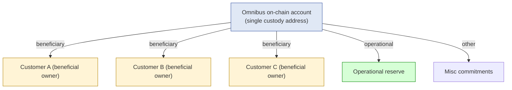
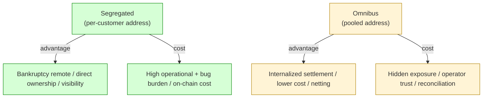
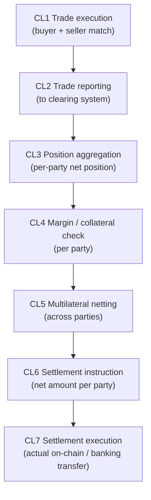
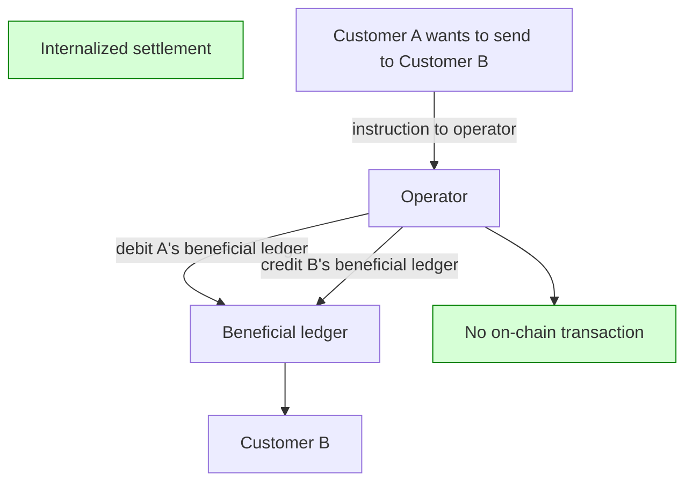
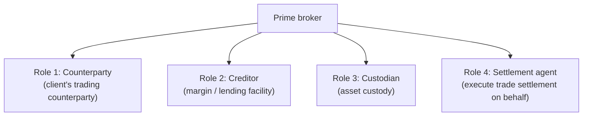
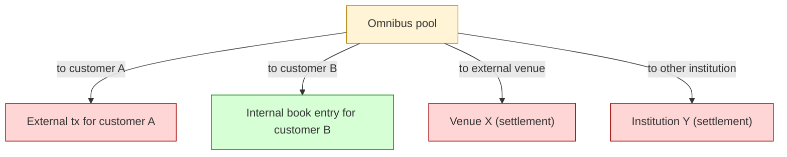
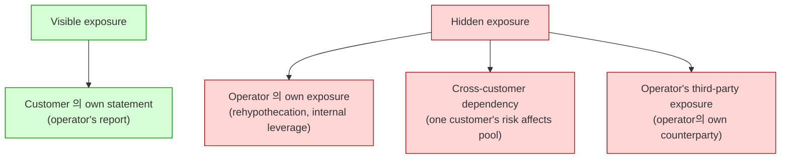
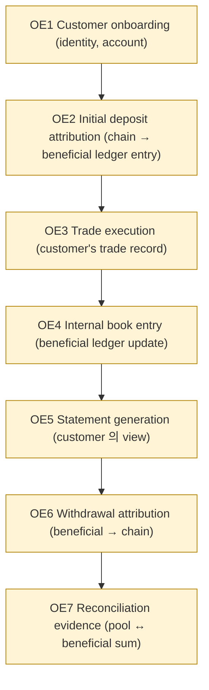

# Custody Wallet — Clearing / Prime Brokerage / Omnibus Semantics Reasoning

> **본 문서의 위치 (Liquidity Cluster D18)**: D17 treasury optimization 의 자연스러운 emerge form — omnibus + clearing + prime brokerage. D10 treasury + D11 compliance + D16 identity 의 institutional intermediary application. Single account 가 multiple beneficial owner 를 represent 하는 abstraction.

> **본 문서가 답하는 핵심 질문**: 왜 omnibus 가 pooled custody 가 아닌가? 왜 omnibus balance 가 economic ownership 가 아닌가? 왜 internal settlement 가 economic finality 가 아닌가? 왜 clearing efficiency 가 risk reduction 보장 아닌가? 왜 prime broker 가 neutral intermediary 가 아닌가?

---

## 0. 핵심 명제 (10초 이해)

1. **Omnibus = delegated settlement abstraction under layered ownership** (core thesis).
2. **Prime brokerage = coordinated exposure and settlement delegation** (secondary thesis).
3. **5-tier "≠" 명제 (D18 cluster invariant)**:
   - Omnibus balance ≠ Economic ownership
   - Custody visibility ≠ Settlement authority
   - Internal settlement ≠ Economic finality
   - Clearing efficiency ≠ Risk reduction
   - Prime broker ≠ Neutral intermediary
4. **Omnibus 의 3-layer model** — Custody layer (on-chain) / Beneficial layer (off-chain claim) / Operational layer (settlement instruction).
5. **Internalized settlement = exposure transfer without external chain settlement** — efficiency 의 source + risk 의 source.
6. **Clearing = batch + netting + multi-party settlement** — single settlement venue 의 efficiency aggregation.
7. **Prime broker = client 의 counterparty + creditor + custodian + settlement agent** — 4 role 의 결합.
8. **Hidden exposure concentration = omnibus 의 core risk** — visible balance 와 actual exposure 의 gap.
9. **Bilateral settlement vs Omnibus internalized** — same economic intent 의 different settlement model.
10. **Omnibus 의 customer burden ~80% in SaaS** — vendor 가 custody, customer 가 ownership claim + beneficiary management.

---

## 1. Omnibus Ownership Map

### 1.1 Omnibus 의 3-layer ownership

| Layer | Nature |
|---|---|
| **Custody layer** | On-chain control (single address / single key set) |
| **Beneficial layer** | Off-chain ownership claim (database mapping customer → balance share) |
| **Operational layer** | Settlement instruction (who instructs movement, on whose behalf) |

### 1.2 "Omnibus balance ≠ Economic ownership"

(§0 명제)

- On-chain: omnibus address 의 total balance.
- Economic ownership: sum of customer 의 beneficial claims + operational allocation + other.
- 차이:
  - 둘이 일치해야 (otherwise drift)
  - On-chain visible, beneficial 은 off-chain ledger 의존
- → Omnibus 의 reconciliation = on-chain balance ↔ beneficial sum.

### 1.3 Beneficial claim 의 record

| Source | 의미 |
|---|---|
| Internal beneficial ledger | 자체 DB의 customer balance |
| Customer agreement | Legal contract 의 ownership claim |
| Statement | Periodic statement to customer |
| Tax record | Customer-specific tax basis |
| Regulatory disclosure | Per-customer reporting |

### 1.4 "Custody visibility ≠ Settlement authority"

(§0 명제)

- Custody visibility = on-chain 의 balance.
- Settlement authority = beneficial owner 의 권한 + omnibus operator 의 settlement decision.
- 차이:
  - Omnibus operator 가 settlement instruction 발행 (customer's behalf)
  - Customer 가 직접 settle 할 수 없음 (key 보유 안 함)
- → Omnibus = "trust the operator" model.

---

## 2. Omnibus vs Segregated 비교 (D10 §4.1 의 omnibus 측면)

### 2.1 비교 matrix

### 2.2 Customer protection 의 차이

| Dimension | Segregated | Omnibus |
|---|---|---|
| On-chain ownership clarity | High | Low (operator control) |
| Bankruptcy remoteness | Easier (asset 분리) | Difficult (commingling) |
| Customer 의 freeze 가능성 | Low | High (operator decision) |
| Audit transparency | Direct | Indirect (beneficial ledger 필요) |

### 2.3 Operational efficiency 의 차이

| Dimension | Segregated | Omnibus |
|---|---|---|
| Cross-customer transfer | On-chain tx (cost) | Internal book entry (zero on-chain cost) |
| Settlement netting | Difficult | Easy |
| Mass operations | Expensive | Efficient |
| Customer count scalability | Limited (on-chain cost) | High |

### 2.4 Hybrid pattern

(★ Hypothesis — operational pattern)

- 일부 institution: high-value customer = segregated, retail = omnibus.
- Per-customer choice (paid feature for segregated).
- Regulatory requirement (특정 jurisdiction 의 mandate).
- → Customer tier 별 다른 model.

---

## 3. Clearing Lifecycle

### 3.1 Clearing 의 7-phase

### 3.2 Clearing 의 efficiency source

| Mechanism | Efficiency |
|---|---|
| Multilateral netting | Many bilateral 의 sum 보다 적은 settlement |
| Margin posting | Pre-positioned collateral 의 즉시 settlement |
| Standardized format | Process efficiency |
| Batch processing | Per-tx overhead 감소 |

### 3.3 Clearing 의 risk concentration

(★ Hypothesis — financial industry pattern)

- Clearing house (central counterparty, CCP) = single point of risk concentration:
  - 모든 party 의 net exposure 가 CCP 에 집중
  - CCP failure = systemic event
- Mitigation:
  - CCP 의 own capital (default fund)
  - Mutualized loss (member contribution)
  - Liquidity facility (central bank backstop)

### 3.4 "Clearing efficiency ≠ Risk reduction"

(§0 명제)

- Efficiency = settlement 수 감소, processing time 단축.
- Risk reduction = exposure 의 actual 감소.
- 차이:
  - Netting 은 bilateral exposure 감소, but CCP 에 concentration
  - Margin posting 은 collateralization, but margin call failure risk
  - → Risk 의 transformation, elimination 아님.

### 3.5 Internalized settlement vs External clearing

| Type | 의미 |
|---|---|
| **Internalized** | Operator 내부의 book entry만 (no external chain) |
| **External clearing** | CCP 통과 (다수 party 의 multi-lateral) |
| **Bilateral** | Direct counterparty + chain settlement |

→ Each model 의 efficiency × risk × visibility trade-off.

---

## 4. Internalized Settlement

### 4.1 Internalized settlement 의 model

### 4.2 Internalized settlement 의 benefits

| Benefit | 의미 |
|---|---|
| Zero on-chain cost | Gas / fee 미발생 |
| Instant settlement | Sub-second (DB write only) |
| Privacy | On-chain visibility 안 됨 |
| Netting opportunity | Multi-customer 의 batch |
| Reduced load on chain | Throughput 개선 |

### 4.3 "Internal settlement ≠ Economic finality"

(§0 명제)

- Internal book entry = operator 의 own ledger 의 update.
- Economic finality = 자산의 real economic transfer.
- 차이:
  - Customer A 의 claim 이 customer B 로 transfer (internal)
  - 둘 다 omnibus 안에서 claim — actual underlying asset 은 omnibus address 에 stay
  - → "Settlement" 는 claim 의 transfer, asset 의 transfer 아님
- 시사점:
  - Operator failure 시 internal book entry 의 enforceability 의문
  - Customer A 의 외부 (다른 institution 으로) transfer 시 actual chain settlement 필요

### 4.4 Internalized settlement 의 risks

| Risk | 의미 |
|---|---|
| Operator trust | Internal book entry 의 enforceability |
| Reconciliation drift | On-chain ↔ beneficial ledger consistency |
| Hidden exposure | Customer 의 actual exposure visibility ↓ |
| Cross-operator transfer | 다른 institution 으로 시 chain settlement 필요 (latency 회귀) |
| Compliance complexity | Travel rule + KYT 의 application |

### 4.5 Internalized 와 cross-customer mass operations

- 같은 institution 안의 cross-customer transfer 가 internal 만으로 처리.
- 예: exchange 의 trading 의 settlement (trader A 의 BTC ↔ trader B 의 USDT) = internal.
- → 대부분 의 활동이 internalized — chain 의 의외로 적은 사용.

---

## 5. Prime Brokerage

### 5.1 Prime broker 의 4-role 결합

### 5.2 "Prime broker ≠ Neutral intermediary"

(§0 명제)

- Neutral intermediary 의 가정: 모든 client equally treated, conflict 없음.
- Prime broker 의 reality:
  - Counterparty role 의 conflict of interest (own book vs client book)
  - Creditor role 의 collateral 의 prime broker 의 control
  - Custodian role 의 commingling
  - Settlement agent 의 timing discretion
- → Client 는 prime broker 의 trust 필요 — 일반 custody trust 보다 강함.

### 5.3 Rehypothecation

(★ Hypothesis — financial industry pattern, often regulated)

- Rehypothecation = client 의 collateral 을 prime broker 가 다른 곳에 use (lending / collateral / etc.).
- 효과: prime broker 의 capital efficiency ↑.
- 위험: client 의 asset 의 visibility ↓ + recovery 위험.
- 규제: jurisdiction 별 different rule (limit, disclosure).

### 5.4 Prime broker 의 default risk

(★ Hypothesis — historical pattern)

- Prime broker default scenarios (예: Lehman 2008 의 prime brokerage):
  - Client asset 의 commingling 으로 recovery 어려움
  - Client 가 prime broker 의 채권자 와 함께 wait
  - Recovery duration 길음 + partial recovery
- → Prime broker 선택은 own custody 보다 strict due diligence.

### 5.5 Prime broker disclosure

- Regulatory requirement (jurisdiction 별):
  - Rehypothecation limit
  - Asset segregation
  - Recovery process
  - Conflict of interest

→ Client 의 due diligence input.

---

## 6. Pooled Liquidity Routing

### 6.1 Pooled liquidity 의 routing

### 6.2 Routing decision logic

| Destination | Routing |
|---|---|
| Same omnibus customer | Internal book entry (no chain) |
| Different operator's customer | External chain tx (banking / blockchain) |
| External venue (CEX / DEX) | Venue-specific (deposit address) |
| Other institution (peer-to-peer) | Direct chain or banking |

### 6.3 Pool 의 utilization optimization

- Same-pool transfer = 0 cost
- External-pool transfer = cost
- Optimization: routing 의 same-pool 우선
- → Operator 의 own scale 이 utilization 결정.

### 6.4 Liquidity reuse boundary

(★ §0.10 의 D19 bridge 미리보기)

- Internal book entry 는 omnibus 의 underlying 을 move 안 함.
- 따라서 single underlying asset 이 multiple customer 의 claim 을 동시 satisfy 가능 (시점 별).
- → "Liquidity reuse" — but liquidity 의 actual create 아님 (D19 §3 reasoning).

### 6.5 Pool 의 segregation 정도

| Strict | Loose |
|---|---|
| Per-customer sub-account | Single pool |
| On-chain segregation | Off-chain ledger |
| Real-time reconciliation | Periodic |
| Per-customer audit | Aggregate audit |

→ Trade-off: cost vs visibility.

---

## 7. Hidden Exposure Concentration

### 7.1 Visible vs hidden exposure

### 7.2 "Hidden exposure concentration" reasoning

(§0.8)

- Customer 는 own claim 의 visibility 만.
- 실제 risk:
  - Operator 가 customer A 의 collateral 을 rehypothecate 했는지
  - Cross-customer net exposure 가 어떻게 결합되는지
  - Operator 의 own counterparty 의 default risk 가 어떻게 propagate 되는지
- → Customer 의 visible exposure 와 actual exposure 의 gap.

### 7.3 Disclosure 의 한계

- Regulator 가 강제하는 disclosure 의 scope:
  - High-level (aggregate)
  - Periodic (quarterly)
  - Material change (incident)
- 그러나 detail (specific cross-customer dependency) 은 보통 disclosed 안 됨.

### 7.4 Mitigation: customer-side due diligence

- Operator 의 selection 의 due diligence:
  - Regulatory status
  - Capital adequacy
  - Past incident
  - Audit history
- 그러나 hidden exposure 완전 visibility 불가.

### 7.5 "Omnibus reconciliation drift"

(★ fragility)

- On-chain balance ↔ sum of beneficial claims 의 daily reconciliation.
- Drift detection:
  - 일치 = normal
  - Mismatch (small) = operational error / fees
  - Mismatch (material) = significant issue
- → Drift 가 hidden exposure 의 indicator.

---

## 8. Omnibus Evidence Chain (D5 의 omnibus 측면)

### 8.1 Per-customer evidence in omnibus

### 8.2 Customer 의 evidence access right

- Statement (periodic)
- Transaction history
- Audit confirmation
- Recovery cooperation (operator failure 시)
- → Customer 의 forensic capability + recovery rights.

### 8.3 Operator 의 evidence obligation

- Append-only beneficial ledger (D1a 의 append-only)
- Per-customer audit trail
- On-chain ↔ beneficial reconciliation evidence
- Regulatory reporting (D24)

### 8.4 Cryptographic proof of inclusion (D15 §2.3 의 omnibus 적용)

- Merkle tree of customer balances → root published.
- Customer 가 own balance + Merkle proof 받음 → inclusion verify.
- → Omnibus 의 cryptographic transparency.

---

## 9. Operational Fragility Map

```mermaid
graph TB
    F1["F1. Hidden exposure concentration<br/>(rehypothecation, cross-customer)"]
    F2["F2. Omnibus reconciliation drift<br/>(on-chain ↔ beneficial mismatch)"]
    F3["F3. Delegated settlement ambiguity<br/>(who's accountable for what)"]
    F4["F4. Internal liquidity illusion<br/>(internalized settlement 의 false sense of finality)"]
    F5["F5. Pooled insolvency propagation<br/>(operator default → all customers affected)"]
    F6["F6. Visibility fragmentation<br/>(customer 의 own view 만)"]
    F7["F7. Cross-customer dependency<br/>(one customer's loss propagates)"]
    F8["F8. Operator conflict of interest<br/>(prime broker own book vs client)"]
    F9["F9. Beneficial ledger bug<br/>(software 의 internal accounting error)"]
    F10["F10. Regulatory action on omnibus<br/>(jurisdictional freeze 의 cross-customer impact)"]

    F1 -->|mitigation| M1["Disclosure regulation + audit + due diligence"]
    F2 -->|mitigation| M2["Daily reconciliation + drift alert + auto-resolution"]
    F3 -->|mitigation| M3["Clear operating agreement + responsibility matrix"]
    F4 -->|mitigation| M4["Periodic external settlement + chain anchor"]
    F5 -->|mitigation| M5["Customer protection scheme + segregation tiers"]
    F6 -->|mitigation| M6["Cryptographic inclusion proof (Merkle) + audit"]
    F7 -->|mitigation| M7["Per-customer risk limit + concentration metric"]
    F8 -->|mitigation| M8["Conflict-of-interest policy + segregation of duties"]
    F9 -->|mitigation| M9["Multi-eye review + reconciliation + testing"]
    F10 -->|mitigation| M10["Multi-jurisdiction + legal counsel + customer notification"]
```

### 9.1 분류

| 분류 | items | 성격 |
|---|---|---|
| **Concentration** | F1, F5, F7 | structural, partly disclosure-mitigable |
| **Reconciliation** | F2, F9 | engineering discipline |
| **Visibility** | F4, F6 | transparency layer (D15) |
| **Trust** | F3, F8 | governance + legal |
| **External** | F10 | regulatory |

---

## 10. Limitations

### 10.1 Omnibus balance ≠ Economic ownership

§1.2.

### 10.2 Custody visibility ≠ Settlement authority

§1.4.

### 10.3 Internal settlement ≠ Economic finality

§4.3.

### 10.4 Clearing efficiency ≠ Risk reduction

§3.4.

### 10.5 Prime broker ≠ Neutral intermediary

§5.2.

### 10.6 Customer trust on operator is irreducible

- Omnibus 의 fundamental assumption — operator integrity.
- 완전 trust elimination 불가능 — only diversification + transparency + regulation.

### 10.7 Cross-operator transfer 의 chain settlement 회귀

§4.5. Internal settlement 의 efficiency 는 same-operator 안에서만.

---

## 11. 3-way Omnibus Burden

### 11.1 Plane × Ownership

| 영역 | SaaS | Hosted MPC | Direct-build |
|---|---|---|---|
| Omnibus address custody | Vendor | Vendor + customer | Customer |
| Beneficial ledger | Customer (or vendor 일부) | Customer | Customer |
| Customer attribution | Customer | Customer | Customer |
| Clearing engine | Vendor + customer | Customer | Customer |
| Internal settlement | Vendor + customer | Customer | Customer |
| Reconciliation | Customer (vendor data + own) | Customer | Customer |
| Prime brokerage governance | Customer | Customer | Customer |
| Customer disclosure | Customer | Customer | Customer |

### 11.2 Customer omnibus burden (★ Hypothesis)

- SaaS: ~80% (vendor 가 custody address; nearly all beneficial + reconciliation 은 customer)
- Hosted: ~90%
- Direct-build: ~100%

### 11.3 Recommendation

| Context | 권장 |
|---|---|
| Limited customer base | Segregated (no omnibus) |
| Exchange / trading platform | Omnibus + internalized settlement |
| Prime brokerage | Full prime model + risk function |
| Stablecoin issuer | Mostly segregated reserve; omnibus for operational only |

---

## 12. Q1-Q10 Reasoning

### Q1. Omnibus ≠ Pooled custody

§0.1, §1. Delegated settlement abstraction with layered ownership.

### Q2. Custody visibility ≠ Settlement authority

§1.4. On-chain visibility ≠ instruction authority.

### Q3. Internal settlement ≠ Economic finality

§4.3. Claim transfer ≠ asset transfer.

### Q4. Clearing efficiency ≠ Risk reduction

§3.4. Efficiency = transformation; risk = elimination ≠ same.

### Q5. Prime broker ≠ Neutral intermediary

§5.2. 4-role conflict.

### Q6. Segregated vs omnibus trade-off

§2. Protection vs efficiency.

### Q7. Hidden exposure concentration

§7.2. Visible ≠ actual exposure.

### Q8. Rehypothecation reasoning

§5.3. Capital efficiency vs client visibility loss.

### Q9. Cryptographic transparency (Merkle PoL)

§8.4. Inclusion proof 의 verifier-side capability.

### Q10. Cross-operator transfer 의 chain 회귀

§4.5. Internal settlement 의 scope limit.

---

## 13. Open Questions / Org Policy

| 영역 | 질문 |
|---|---|
| Segregation policy | per-customer / pooled? |
| Sub-account structure | hierarchy depth? |
| Rehypothecation policy | allowed? limit? |
| Reconciliation cadence | hourly / daily? |
| Cryptographic inclusion proof | Merkle / ZK / none? |
| Cross-customer risk limit | concentration metric? |
| Prime brokerage scope | which clients? |
| Conflict-of-interest policy | enforcement? |
| Internal settlement evidence | retention? |
| Customer disclosure | what / when? |
| Margin policy | initial / variation? |
| Default handling | sequence? customer protection? |
| Multi-jurisdiction omnibus | segregation requirement? |
| Cryptographic anchor cadence | for omnibus PoL |
| Customer statement format | standardized? |
| Audit firm engagement | scope? |
| Cross-operator integration | bilateral / consortium? |
| Prime broker selection | due diligence criteria? |
| Counterparty exposure limit | per counterparty? |
| Internal settlement throughput | target TPS? |

---

## 14. References + Uncertainty Boundary + Bridge

### 관련 wiki

| 참조 |
|---|
| [[docs/architecture/treasury-reserve-mint-burn]] §4.1 (segregated vs omnibus) |
| [[docs/architecture/vault-wallet-ledger-db-schema]] §1 (L1 tenancy + L2 hierarchy) |
| [[docs/architecture/transparency-attestation-proof-systems]] §2.3 (Merkle PoL) |
| [[docs/architecture/identity-kyt-counterparty-graph]] §1 (3-layer identity 의 omnibus 적용) |
| [[docs/architecture/treasury-optimization-capital-efficiency]] §1 (treasury tier) |

### Uncertainty Boundary

- 3-layer ownership / 4-role prime / 7 clearing phase / 4 hidden exposure / 10 fragility / 80% burden = **generalized omnibus architecture pattern (Hypothesis ★)**.
- §5.3 rehypothecation = regulated, jurisdiction-specific detail.
- §11.2 burden 백분율 = estimate.
- §13 에 org policy 영역 명시.

### D19 Bridge Invariants (D17 + D18 → D19)

1. **Internal settlement dependency** — D18 의 internalized settlement 가 D19 의 netting 의 foundation. Multi-party internal settlement = netting.
2. **Exposure compression logic** — D18 의 omnibus efficiency + D19 의 multilateral netting = aggregated compression.
3. **Netting opportunity** — Same-operator 의 multi-customer 의 bilateral position 의 netting → D19.
4. **Bilateral settlement redundancy** — Direct bilateral settlement 의 inefficiency 가 netting 의 motivation → D19.
5. **Liquidity reuse boundary** — Internal book entry 의 reuse 의 한계가 D19 의 reasoning.

### Cluster D17→D18→D19→D20 progression

- D17: treasury optimization
- D18 (this): omnibus + clearing + prime brokerage
- D19 (next): internal netting + internal settlement
- D20 (closing): cross-institution coordination

---

**Stage 32 D18 completion timestamp**: 2026-05-20.
