# Custody Wallet — Compliance / AML / Sanctions Boundary Reasoning

> **본 문서의 위치**: D1a-D10 의 generalized custody + chain + monetary specialization 위에서 **compliance 영역으로 specialize**. AML/KYT/Sanctions/Travel rule/Freeze 가 단순 "filter" 가 아닌 **policy-constrained state transition governance across financial / legal / settlement domains**. D3 governance + D7/D8 lifecycle + D5 evidence + D9 cross-chain + D10 monetary 의 compliance dimension.

> **본 문서가 답하는 핵심 질문**: 왜 compliance 는 "차단 / 통과" 의 binary filter 가 아닌가? 왜 monitoring 이 enforcement 아닌가? 왜 risk score 가 ground truth 아닌가? 왜 cross-chain visibility 가 cross-chain control 아닌가? 왜 compliance evidence 가 legal proof 가 아닌가?

---

## 0. 핵심 명제 (10초 이해)

1. **Compliance = policy-constrained state transition governance across financial / legal / settlement domains.** — 본 문서의 thesis.
2. **Compliance ≠ Filter** — binary block/pass 가 아닌 multi-stage governance lifecycle (screen → score → review → hold → escalate → freeze → report).
3. **20-tier "≠" 명제** — monitoring / detection / observation / freeze / blacklist / approval 각각이 enforcement / attribution / authority / settlement / proof / safety 가 아님.
4. **6 freeze type** — Soft / Hard / Treasury-level / Smart-contract / Redemption / Jurisdiction-scoped 각각 다른 authority + survivability.
5. **Travel rule = cross-domain identity coordination problem** — single VASP 의 own 문제 아닌 counterparty + jurisdiction + privacy 의 결합.
6. **Risk score = probabilistic heuristic ≠ ground truth** — graph analysis / mixer / bridge / privacy chain 의 한계.
7. **Cross-chain visibility ≠ Cross-chain control** — observe 가능해도 freeze 가능 아님 (wrapped / bridge / privacy chain).
8. **Compliance evidence ≠ Legal proof** — operational evidence 가 court-admissible evidence 와 다른 layer.
9. **Compliance burden = SaaS 에서도 customer 의 거의 100%** — vendor 가 monitoring tool 제공하지만 escalation / decision / regulatory relationship 은 customer.
10. **Compliance system = evidence-producing governance system** — output 은 freeze action 뿐 아니라 regulator submission evidence chain.

---

## 1. Compliance Boundary Architecture

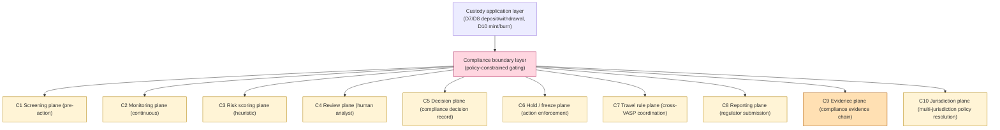

### 1.1 10 compliance sub-plane

| Sub-plane | 책임 | Authority |
|---|---|---|
| **C1 Screening** | pre-action check (sanctions / blacklist) | Own + sanctions list provider |
| **C2 Monitoring** | continuous transaction monitoring | Own + monitoring vendor |
| **C3 Risk scoring** | heuristic risk assessment (graph analysis) | Own + scoring vendor |
| **C4 Review** | human analyst investigation | Own (analyst team) |
| **C5 Decision** | compliance decision (approve / hold / freeze / report) | Own (compliance officer) |
| **C6 Hold / freeze** | enforcement action | Own + chain authority (if smart contract) |
| **C7 Travel rule** | counterparty VASP coordination | Own + counterparty VASP |
| **C8 Reporting** | regulator submission (SAR / CTR / STR / etc.) | Own (compliance officer) |
| **C9 Evidence** | compliance evidence chain | Own |
| **C10 Jurisdiction** | multi-jurisdiction policy resolution | Own + legal counsel |

### 1.2 Compliance boundary 의 unique 위치

- D3 governance + D5 evidence 의 **specialized application**.
- 그러나 다음 dimension 에서 unique:
  - **External authority** (regulator) — own governance 가 아닌 external 의 demand
  - **Legal substance** — operational decision 이 legal consequence
  - **Jurisdiction multiplicity** — single org 도 multi-jurisdiction 가능
  - **Privacy tension** — compliance vs user privacy
  - **Adversarial environment** — bad actors 가 actively 회피 시도

### 1.3 "Compliance ≠ Filter" reasoning

- Naive view: "차단 / 통과" binary filter.
- Reality: multi-stage lifecycle:
  - Pre-action screening (Cl)
  - Continuous monitoring (C2)
  - Risk scoring (C3)
  - Human review (C4)
  - Decision (C5)
  - Action (C6: hold / freeze / report)
  - Escalation
  - Reporting (C8)
  - Evidence preservation (C9)
- → 단일 filter 아닌 **layered governance lifecycle**.

---

## 2. AML / KYT Lifecycle

### 2.1 Deposit-side AML lifecycle

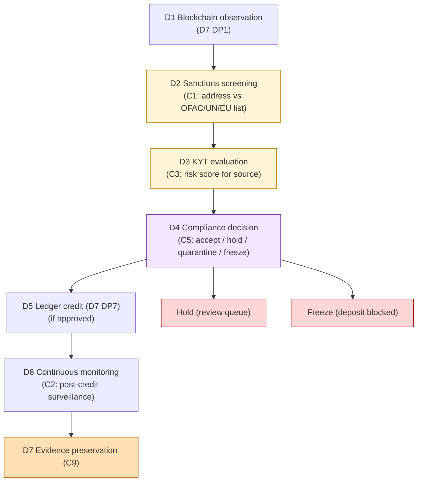

### 2.2 Withdrawal-side AML lifecycle

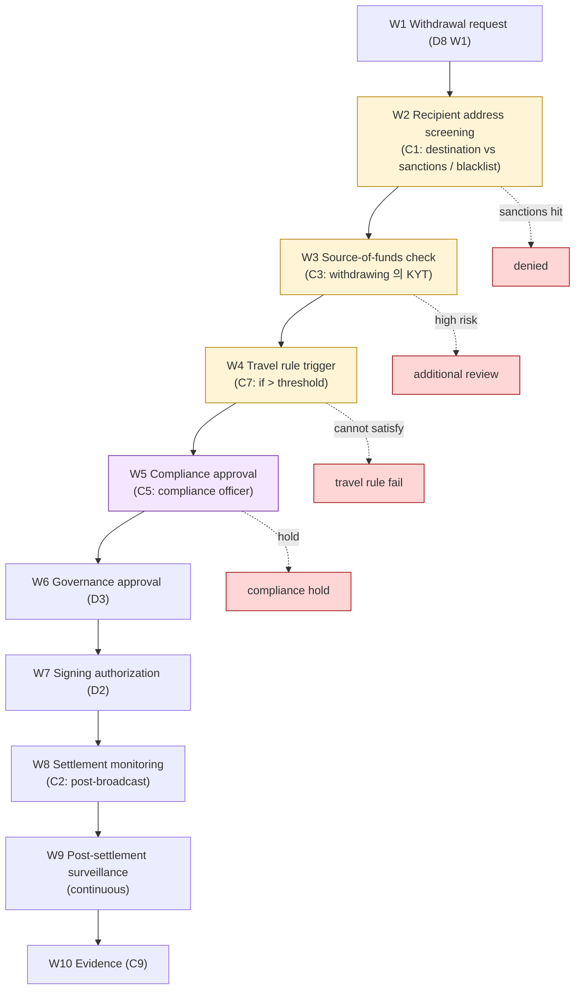

### 2.3 KYT = Know-Your-Transaction

- KYT ≠ KYC (KYC = know-your-customer).
- KYT 는 **transaction-level**: 이 transaction 의 source / destination 의 risk profile.
- KYC + KYT 는 different layer:
  - KYC: identity verification (one-time on onboard)
  - KYT: transaction risk continuous (per-transaction)

### 2.4 "KYT ≠ Economic attribution"

(§0 명제 / §3)

- KYT 는 **chain-side observable behavior 만** — heuristic analysis.
- Economic attribution = 실제 누구의 자금인가의 ground truth.
- KYT 가 "high risk" 표시해도 actual entity 모름.
- 따라서 KYT 는 **probabilistic signal**, definitive attribution 아님.

### 2.5 KYT 의 6 source

(★ Hypothesis — operational pattern)

| Source | 의미 |
|---|---|
| Sanctions match | Direct address on OFAC/UN/EU list |
| Mixer / coinjoin | Tornado Cash / Wasabi / Samourai 등 의 known address |
| Darknet market | Hydra / Silk Road / 등 의 known address |
| Hack / theft | known exploit addresses |
| Sanctioned jurisdiction | IP / address cluster 의 high-risk jurisdiction |
| Anomaly pattern | unusual amount / velocity / timing |

### 2.6 KYT response (3-tier)

| Response | 의미 |
|---|---|
| **Accept** | risk score ≤ threshold; ledger credit / signing 진행 |
| **Hold** | medium risk; analyst review queue; pending decision |
| **Freeze / Reject** | high risk; immediate hold; potential SAR |

---

## 3. Sanctions Enforcement Semantics

### 3.1 Sanctions list type

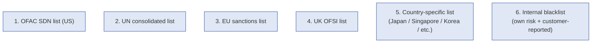

### 3.2 Sanctions check layers

| Layer | 검사 |
|---|---|
| Address screening | recipient/source address 가 list 에 있는가 |
| Beneficial ownership | known wallet 의 beneficial owner 가 list 에 있는가 (KYC 의 결합) |
| Cluster analysis | address 가 sanctioned entity 의 cluster 에 속하는가 (heuristic) |
| Indirect exposure | N-hop 거리 안에 sanctioned address 있는가 |
| Behavioral | sanctioned-pattern (예: mixer through, jurisdiction signal) |

### 3.3 "Sanctions screening ≠ Complete detection"

(§0 명제)

- Screening 의 한계:
  - **List lag**: 새 sanctioned address 가 list update 까지 시간 (hours-days)
  - **Address rotation**: bad actor 가 fresh address 생성 (sanctioned 안 됨)
  - **Cluster ambiguity**: 진짜 sanctioned 와 의도하지 않은 cluster overlap
  - **Privacy chain**: Monero / Zcash / privacy-enabled tx 는 screening 어려움
  - **Cross-chain obfuscation**: bridge 를 통한 sanctions evasion

### 3.4 "Sanctions match ≠ Confirmed bad actor"

- Address 가 list 에 있으면 sanctions hit.
- 그러나 false positive 가능:
  - List 자체의 error (gov agency 의 wrong attribution)
  - Address ownership 변경 (이전 owner 가 listed, 현재 다른 owner)
  - Cluster heuristic 의 over-broad classification
- → Match 후에도 **human review** 필요.

### 3.5 Sanctions enforcement action

| Action | Authority |
|---|---|
| **Block tx** | own technical capability |
| **Freeze account** | own (if controlled) + smart contract authority |
| **Report to authority** | own compliance + regulator interaction |
| **Asset confiscation** | **only by legal order** — own 의 권한 아님 |

→ Freeze ≠ Confiscation (§0 명제).

---

## 4. Freeze Authority Model (6 freeze type)

### 4.1 6 freeze type

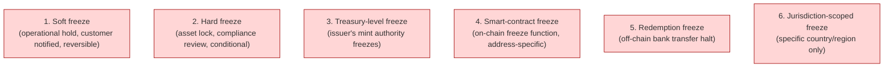

### 4.2 6 freeze type 의 trade-off

| Type | Scope | Authority | Reversibility | Survivability |
|---|---|---|---|---|
| Soft freeze | own custody | own ops | high (own decision) | own |
| Hard freeze | own custody | compliance officer | medium | own + audit |
| Treasury-level | issuer's tokens | treasury committee (D10) | medium | mint authority dependent |
| Smart-contract | on-chain global | contract owner (mint authority) | high (if contract upgrade) | smart contract risk |
| Redemption freeze | banking rail | own ops + bank | medium | banking dependency |
| Jurisdiction-scoped | per region | regional compliance officer | high | jurisdiction-specific |

### 4.3 "Freeze capability ≠ Legal authority"

(§0 명제)

- Technical freeze 가능 (smart contract function, off-chain ops) ≠ legal 으로 freeze 할 권한.
- Freeze 가 legal 권한 없이 수행되면 wrongful freeze — customer lawsuit risk.
- 권한:
  - **Internal policy** (own customer agreement 에 명시)
  - **Regulatory order** (court order, regulator instruction)
  - **Sanctions law** (OFAC 등의 legal obligation)
- → Freeze 결정은 technical capability + legal authority 의 결합.

### 4.4 "Freeze ≠ Confiscation"

- Freeze = asset 의 movement 일시 차단 (still owned by holder).
- Confiscation = asset 의 ownership transfer (state / authority 로).
- 차이:
  - Freeze 는 own 권한 가능 (terms of service 에 따라)
  - Confiscation 은 **only legal order** (court order)
- → Freeze 후 confiscation 가능성을 customer 에게 알릴 의무 (legal procedure).

### 4.5 "Blacklist ≠ Prevented settlement"

(§0 명제)

- Blacklist 에 address 등록 = own screening 에서 차단.
- 그러나:
  - Custody system 안에서만 차단 (다른 system 은 통제 못함)
  - Blacklisted address 가 다른 wallet 으로 fund transfer 후 우리에게 deposit 가능 (mixer / new address)
  - Cross-chain bridge 를 통한 우회 가능
- → Blacklist 는 own scope 의 mitigation, complete prevention 아님.

### 4.6 Smart-contract freeze 의 power + risk

(D10 §6.4 의 압축)

- Stablecoin contract 의 freeze function:
  - Power: specific address 의 token transfer 차단 — sanctioned address 등에 매우 강력
  - Risk: **emergency authority abuse** — own admin 의 권한 lawsuit 위험
- Mitigation: multi-sig + post-hoc review SLA + transparency report.

### 4.7 "Emergency freeze abuse" pattern

(★ §11 fragility)

- Emergency authority 가 자주 사용되면 abuse signal.
- 예:
  - 경쟁 entity 의 customer freeze
  - 정치적 이유 freeze
  - Operational mistake (잘못된 freeze)
- → Frequency SLO + transparency report + 외부 audit.

---

## 5. Blacklist / Denylist Governance

### 5.1 Blacklist source

| Source | Update cadence | Authority |
|---|---|---|
| Sanctions lists (OFAC etc.) | Daily | Government agencies |
| Industry shared lists | Variable | Industry consortium |
| Vendor monitoring | Real-time | Monitoring vendor (Chainalysis / TRM / Elliptic / etc.) |
| Internal investigation | On-demand | Own analyst team |
| Customer-reported | Variable | Customer / partner |

### 5.2 Blacklist lifecycle

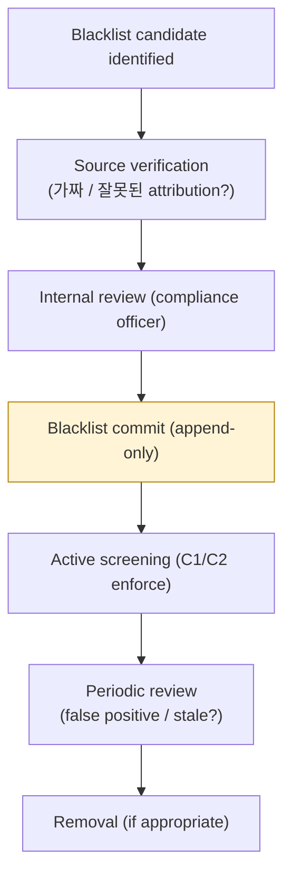

### 5.3 Blacklist 의 false positive 처리

- Customer 가 자신의 address 가 blacklisted 라고 claim:
  - Address ownership 증명 (signed message)
  - Source-of-funds documentation
  - KYC 강화 review
  - 결과: removal / 유지 / further investigation
- → False positive 처리 SLA + transparency = customer trust.

### 5.4 Denylist (own) vs Sanctions list (regulatory)

| 차원 | Denylist | Sanctions list |
|---|---|---|
| Authority | Own | Regulatory |
| Liability | Own (lawsuit risk) | Regulatory (mandatory) |
| Removal | Own decision | Regulatory action |
| Transparency | Optional | Often public |
| Cross-vendor sharing | Variable | Yes (international cooperation) |

---

## 6. Travel Rule Integration

### 6.1 Travel Rule = cross-domain identity coordination

(§0.5 명제)

- FATF Travel Rule: VASP (Virtual Asset Service Provider) 간 transfer 시 originator + beneficiary identity 정보 exchange 의무.
- Threshold: typically $1,000 / $3,000 (jurisdiction-specific).
- Counterparty 가 VASP 여야 — un-hosted wallet 의 travel rule 대응은 jurisdiction-별 다름.

### 6.2 Travel rule lifecycle

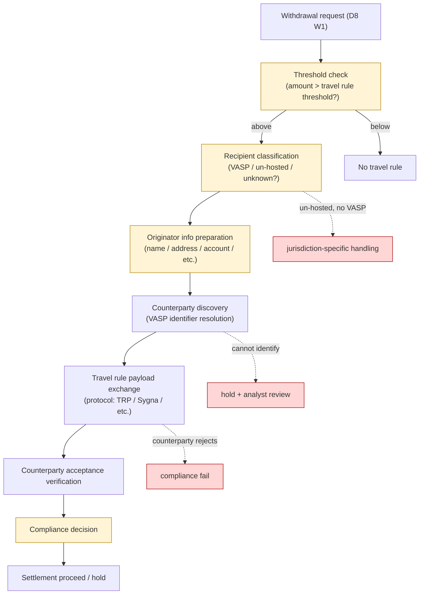

### 6.3 Travel rule 의 5 fragility

(§0.5 expansion)

| Fragility | 이유 |
|---|---|
| **Counterparty identification** | Address 로부터 VASP 식별 어려움 — multiple VASP 의 hot wallet 공유 |
| **Payload exchange protocol** | TRP / Sygna / Notabene / etc. — fragmentation 으로 interop 부족 |
| **Off-chain identity dependency** | Chain artifact 와 identity 의 disconnect |
| **Settlement timing mismatch** | Travel rule exchange (seconds-minutes) vs settlement (chain time) |
| **Privacy vs compliance** | Customer privacy + counterparty privacy + compliance 의무의 tension |

### 6.4 "Travel rule compliance ≠ Counterparty trust"

(§0 명제)

- Travel rule payload 의 exchange = process compliance.
- 그러나 received payload 의 accuracy = counterparty 의 KYC quality 의존.
- Counterparty 가 잘못된 / 가짜 identity 제공 가능.
- → Travel rule 은 minimum standard, not absolute trust.

### 6.5 Un-hosted wallet 대응

- Un-hosted wallet (self-custody, no VASP) 에 대한 travel rule:
  - Jurisdiction 별 다름:
    - US: 일부 threshold 이상 의 un-hosted withdrawal 의 추가 declaration
    - EU: MiCA + TFR (Transfer of Funds Regulation) 더 strict
    - Other: 다양
- → Un-hosted wallet 대응 = jurisdiction-specific policy.

### 6.6 Travel rule 의 interoperability problem

(★ Hypothesis — industry pattern)

- 여러 protocol (TRP / Sygna / Notabene / Codefi / Veriscope / etc.) 가 존재.
- 각 VASP 가 다른 protocol 사용 가능.
- Interoperability gap 시:
  - Manual exchange (email, etc.)
  - Hold transfer until counterparty 가 같은 protocol 지원
  - 결과: cross-VASP transfer 의 friction

---

## 7. Risk Scoring Semantics + Limitations

### 7.1 Risk scoring source

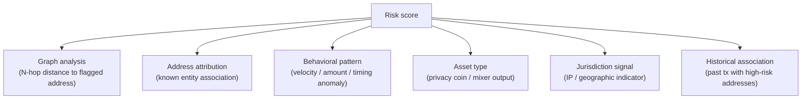

### 7.2 "Risk score ≠ Ground truth"

(§0 명제)

- Risk score 는 **probabilistic heuristic**:
  - Graph analysis 의 over-broad cluster (innocent address 포함)
  - Mixer 통과 후 cluster 정보 loss
  - Bridge cross-chain attribution 의 single fault
  - Privacy chain (Monero) 의 scoring 자체 어려움
- → Risk score 는 signal, decision driver 가 아닌 **input to decision**.

### 7.3 "Address cluster ≠ Entity identity"

(§0 명제 / mandatory contrasts)

- Cluster heuristic: 같은 entity 가 사용 가능한 address set.
- 한계:
  - Heuristic error (false positive)
  - Multi-entity wallet (exchange hot wallet)
  - Address reuse pattern variation
- → Cluster ≠ entity. Entity attribution 은 추가 evidence 필요.

### 7.4 "On-chain traceability ≠ Economic traceability"

- On-chain: tx graph traceability (chain visibility).
- Economic: 실제 자금의 economic flow (off-chain bank, OTC desk, hawala 등 포함).
- 차이:
  - On-chain tx 의 sender = 그 chain 의 address 만, 실제 economic actor 모름
  - Off-chain settlement (OTC) 는 on-chain visible 안 됨
- → On-chain 만 분석 = partial view.

### 7.5 False positive / false negative trade-off

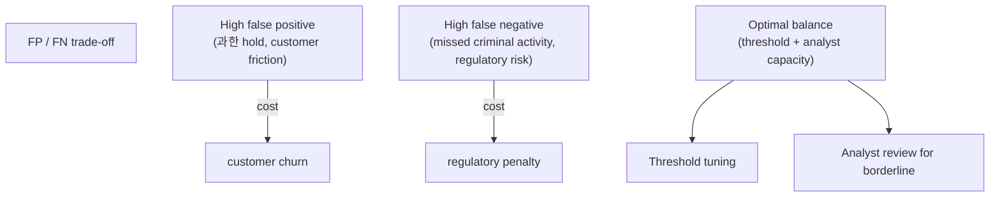

### 7.6 Analyst fatigue (★ operational fragility)

- High FP → analyst review queue 폭증 → fatigue → missed real threats (FN 증가).
- 일종의 alarm fatigue.
- Mitigation:
  - Threshold tuning (auto-resolve low-risk)
  - Tooling 개선 (analyst productivity)
  - Tiered review (low / medium / high)
  - Analyst team sizing

---

## 8. Cross-chain Compliance Reasoning

### 8.1 Cross-chain visibility vs control

(§0.7)

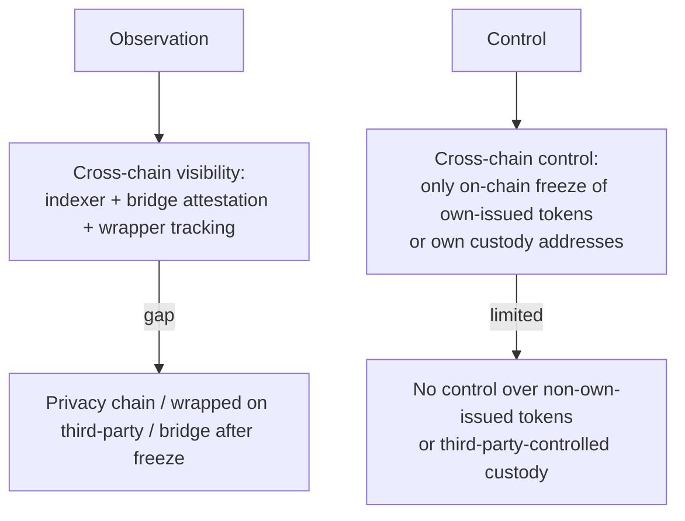

### 8.2 "Cross-chain visibility ≠ Cross-chain control"

- Visibility: can observe (tx happened on chain X, mirror on chain Y).
- Control: can prevent (freeze, block).
- 차이:
  - Wrapped asset 의 freeze 는 wrapper issuer 만 가능 (own 의 권한 아님)
  - Bridge 통과 후 freeze 어려움 (bridge attestation 의존)
  - Privacy chain (Monero, Zcash) 는 observation 자체 어려움

### 8.3 Cross-chain attribution challenge

- 같은 entity 가 multi-chain 에서 활동:
  - Address A on Ethereum
  - Address B on BSC
  - Address C on Solana
  - Bridge: A → B (track 가능?)
- Cross-chain attribution = entity 가 모든 chain 의 address 의 economic actor 임을 증명 필요.
- → Single-chain attribution 보다 어려움 multiplicative.

### 8.4 Privacy chain / mixer 의 한계

| Chain / mechanism | 한계 |
|---|---|
| Monero | Ring signature + stealth address → on-chain anonymity |
| Zcash (z-address) | zk-SNARK shielded pool → no on-chain visibility |
| Tornado Cash | Mixer pool (sanctioned in US, controversial) |
| CoinJoin (BTC) | Multi-input merge |
| Cross-chain bridge with privacy | Compound effect |

→ Compliance 의 coverage gap. Mitigation: 이러한 chain/protocol 의 customer 차단 정책.

### 8.5 Rollup visibility gap

(D9 §8.6 의 compliance side)

- L2 의 tx 는 L1 보다 fast inclusion, 그러나 indexing maturity 가 낮을 수 있음.
- Sequencer 의 own monitoring 의존.
- Cross-rollup tx (L2 A → L2 B via L1) 의 attribution 복잡.

---

## 9. Compliance Evidence Chain

### 9.1 Compliance event sequence

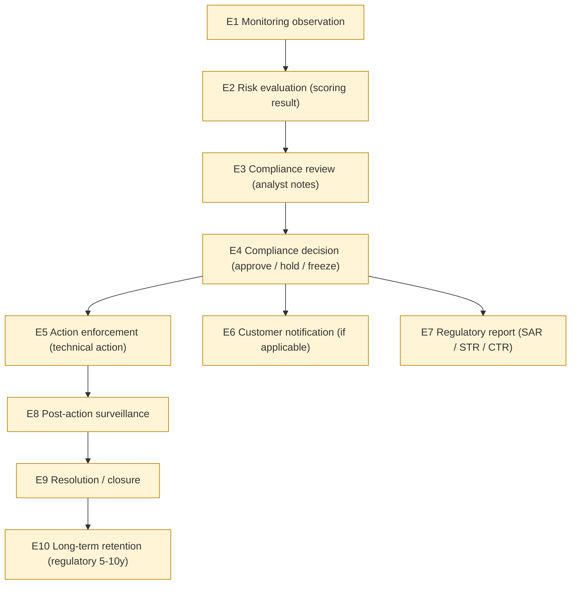

### 9.2 "Compliance evidence ≠ Legal proof"

(§0 명제)

- Compliance evidence = operational decision 의 audit trail.
- Legal proof = court-admissible evidence (chain of custody, expert witness, etc.).
- 차이:
  - Operational evidence 가 admissibility 갖추려면 추가 procedure (notarization, signing, chain of custody)
  - Legal proceeding 에서 evidence 의 weight = procedure 의 함수
- → Compliance evidence 는 starting point — legal proof 로 elevate 시 추가 layer.

### 9.3 SAR / STR / CTR 등 regulatory report

| Report | 의미 |
|---|---|
| **SAR** (Suspicious Activity Report) | US 의 suspicious activity 통보 의무 |
| **STR** (Suspicious Transaction Report) | 다른 jurisdiction 의 동등 |
| **CTR** (Currency Transaction Report) | US 의 $10,000+ cash threshold |
| Other jurisdictions | 각각의 reporting regime |

### 9.4 Regulatory evidence retention

- 보통 5-7-10 years retention (jurisdiction-specific).
- Compliance evidence chain 의 immutability 요구.
- D5 §8 의 multi-tier retention 의 compliance application — 가장 strict.

### 9.5 Cross-jurisdictional evidence

- 같은 transaction 이 multiple jurisdiction 에서 regulatory interest.
- Each jurisdiction 의 reporting 의무 다름.
- → Evidence preparation 의 jurisdiction-specific formatting.

---

## 10. Jurisdictional Variance

### 10.1 Multi-jurisdiction stack

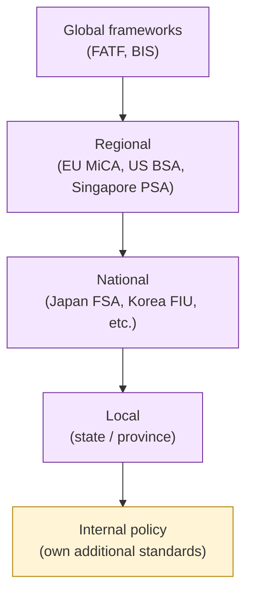

### 10.2 Jurisdiction conflict scenarios

| Conflict | 예 |
|---|---|
| Two jurisdictions 의 reporting requirement 충돌 | Privacy regulation (GDPR) vs reporting obligation (FinCEN) |
| Sanctions list 의 차이 | US sanctions vs EU sanctions 불일치 |
| Freeze authority 충돌 | US court order vs local law |
| Customer 가 multi-jurisdiction | 어느 regulator 가 priority |
| Cross-border investigation | mutual legal assistance treaty |

### 10.3 "Jurisdiction conflict" handling

- 보통 most strict jurisdiction 의 rule 적용.
- 그러나 conflict 시 legal counsel + 외부 advisor 의 의사결정.
- Operational decision 도 conflict 발생 가능 (예: US 가 freeze 요청, EU 가 사면).
- → Multi-jurisdiction org 의 compliance team 의 critical 역할.

---

## 11. Operational Fragility Map

```mermaid
graph TB
    F1["F1. False positive overload<br/>(analyst review queue 폭증)"]
    F2["F2. Analyst fatigue<br/>(alarm fatigue → missed real threats)"]
    F3["F3. Jurisdiction conflict<br/>(multi-jurisdiction 의 충돌)"]
    F4["F4. Emergency freeze abuse<br/>(freeze authority 의 misuse)"]
    F5["F5. Incomplete attribution<br/>(cluster ambiguity, mixer)"]
    F6["F6. Cross-chain visibility gaps<br/>(wrapped, bridge, privacy chain)"]
    F7["F7. Delayed regulatory escalation<br/>(SAR submission 지연)"]
    F8["F8. Monitoring vendor dependency<br/>(vendor SLA / outage)"]
    F9["F9. Evidence retention mismatch<br/>(regulator 요구 와 own retention 차이)"]
    F10["F10. Human escalation irreducibility<br/>(analyst + compliance officer + legal counsel)"]

    F1 -->|mitigation| M1["Threshold tuning + tiered review + auto-resolve"]
    F2 -->|mitigation| M2["Tooling 개선 + team sizing + analyst rotation"]
    F3 -->|mitigation| M3["Legal counsel + most-strict default + post-conflict review"]
    F4 -->|mitigation| M4["Multi-sig emergency authority + post-hoc review + transparency"]
    F5 -->|mitigation| M5["Multi-source attribution + manual review + customer cooperation"]
    F6 -->|mitigation| M6["Cross-chain vendor + manual investigation + policy adjustment"]
    F7 -->|mitigation| M7["SAR pipeline automation + SLA + dashboard"]
    F8 -->|mitigation| M8["Multi-vendor + own fallback heuristic + vendor SLA"]
    F9 -->|mitigation| M9["Worst-case retention + per-jurisdiction policy"]
    F10 -->|mitigation| M10["Irreducible — team sizing + continuous training"]
```

### 11.1 분류

| 분류 | items | 성격 |
|---|---|---|
| **Quality** | F1, F2, F5 | tuning + tooling |
| **Authority** | F3, F4, F7 | governance + legal |
| **Coverage** | F6, F8 | vendor + technical |
| **Process** | F9 | policy |
| **Human** | F10 | **irreducible** |

---

## 12. Limitations

### 12.1 Monitoring ≠ Enforcement

(§0 명제)

- Monitoring 은 observation; enforcement 는 action.
- Observation 후 enforcement decision = compliance officer + legal authority.

### 12.2 Automated screening ≠ Compliance completeness

(§0 명제)

- Automated tool 가 100% catch 보장 안 함.
- New patterns, novel evasion, privacy chain 모두 gap.
- Manual investigation + human judgment irreducible.

### 12.3 Regulatory request ≠ Governance authorization

- Regulator 의 request 가 무조건 internal action 의 authorization 아님.
- Internal governance (legal counsel, executive) 가 verify 후 act.
- 잘못된 / 위조된 regulatory request 가능.

### 12.4 Address ownership ≠ Beneficial ownership

(§0 명제 / D7 §3.5 의 compliance 측면)

- Address ownership = chain-side fact (key holder).
- Beneficial ownership = 실제 자금의 economic owner.
- 차이: shell address (nominee), corporate structure, trust 등.

### 12.5 On-chain traceability ≠ Economic traceability

§7.4. On-chain 만으로는 full economic flow 미보임.

### 12.6 Compliance approval ≠ Regulatory safety

(§0 명제)

- Own compliance team 의 approval = internal due diligence.
- 그러나 regulator 가 retrospective 으로 다르게 판단 가능.
- → Approval 후에도 regulatory risk 잔존.

---

## 13. SaaS vs Hosted vs Direct-build Compliance Burden

### 13.1 Compliance plane × Ownership

| 영역 | SaaS | Hosted MPC | Direct-build |
|---|---|---|---|
| Sanctions screening | Vendor + customer | Vendor + customer | Customer (own + vendor data) |
| KYT / risk scoring | Vendor monitoring | Vendor + customer | Customer (multi-vendor) |
| Analyst team | **Customer** | Customer | Customer (larger) |
| Compliance officer | **Customer** | Customer | Customer |
| Decision authority | **Customer** | Customer | Customer |
| Freeze enforcement | Vendor + customer (own contract) | Customer | Customer |
| Travel rule integration | Vendor partial + customer | Customer | Customer |
| Regulatory reporting | **Customer** (compliance officer) | Customer | Customer |
| Evidence retention | Vendor + customer | Customer | Customer |
| Jurisdictional policy | **Customer** (legal counsel) | Customer | Customer |
| Regulator relationship | **Customer** | Customer | Customer |

→ Compliance 는 거의 모든 영역에서 customer 책임 — vendor 가 tooling 제공이지만 decision + relationship 은 customer.

### 13.2 Compliance customer burden (★ Hypothesis)

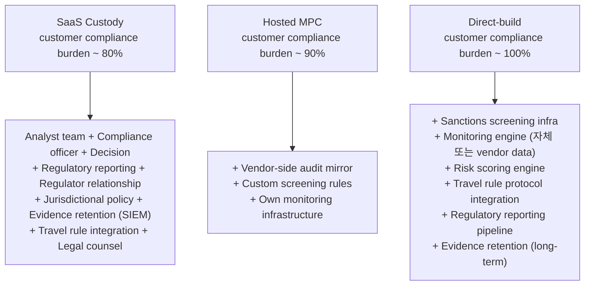

### 13.3 Compliance 는 SaaS 에서도 customer 책임 가장 큰 영역

(§0.9)

- D6 일반: SaaS burden ~25-45%.
- D10 treasury: ~60%.
- **D11 compliance: ~80%** — 가장 vendor 흡수가 적은 영역.
- 이유:
  - Regulator relationship 은 vendor 가 대리 못함
  - Compliance officer 의 legal liability 는 customer 의 책임
  - Jurisdictional policy 의 결정 = legal entity 의 의무
  - Analyst team 의 사고 = customer's own employees

### 13.4 Compliance lock-in pivot

가장 큰 customer burden (direct-build 시):
1. **Analyst team + compliance officer + legal counsel** — 가장 큰 staffing cost
2. **Multi-jurisdiction policy + regulator relationship** — legal
3. **Monitoring vendor integration + evidence retention** — operational
4. **Travel rule protocol fragmentation** — interoperability

이 4 가 burden 의 ~80% (★ Hypothesis).

### 13.5 Recommendation

| Context | 권장 |
|---|---|
| Small org, light regulation | SaaS + customer compliance officer (single role) |
| Medium org, regulated jurisdiction | SaaS or Hosted MPC + dedicated compliance team |
| Heavily regulated (US/EU custody) | Hosted MPC or Direct-build + 자체 compliance department |
| Multi-jurisdiction, large scale | Direct-build + jurisdiction-specific compliance teams + outside counsel |

→ 추천 ≠ fact. Regulatory exposure 의 핵심 결정 factor.

---

## 14. 핵심 Reasoning Question (Q1-Q10)

### Q1. Compliance ≠ Filter 의 이유

§0.2, §1.3. Multi-stage governance lifecycle (screen → monitor → score → review → decide → act → escalate → report → retain). Single filter 가 아닌 layered.

### Q2. Monitoring ≠ Enforcement

§12.1. Monitoring = observation; enforcement = action with authority. 별도 phase + governance.

### Q3. KYT ≠ Economic attribution

§2.4. KYT = chain-side heuristic; economic attribution = actual entity (off-chain identity 필요).

### Q4. Risk score ≠ Ground truth

§7.2. Probabilistic heuristic; graph / mixer / privacy / cross-chain 한계. Decision driver 아닌 input.

### Q5. Sanctions screening ≠ Complete detection

§3.3. List lag / address rotation / cluster ambiguity / privacy chain / cross-chain obfuscation.

### Q6. Freeze ≠ Confiscation

§4.4. Freeze = movement 차단 (own 가능); Confiscation = ownership transfer (legal order only).

### Q7. Travel rule ≠ Counterparty trust

§6.4. Process compliance ≠ payload accuracy. Counterparty 의 KYC quality 의존.

### Q8. Cross-chain visibility ≠ Cross-chain control

§8.2. Observe 가능해도 freeze 가능 아님 (wrapped / bridge / privacy chain).

### Q9. Compliance evidence ≠ Legal proof

§9.2. Operational audit trail ≠ court-admissible (chain of custody / notarization 추가 필요).

### Q10. Compliance SaaS 에서도 customer 책임 큰 이유

§13.3. Regulator relationship + compliance officer liability + jurisdictional policy + analyst team = vendor 흡수 못함.

---

## 15. Open Questions / Org Policy 영역

| 영역 | 질문 | 본 문서 범위 밖 이유 |
|---|---|---|
| Sanctions list source | OFAC / UN / EU / 모두? | jurisdiction |
| KYT vendor | Chainalysis / TRM / Elliptic / multi? | partnership + cost |
| Risk score threshold | accept / hold / freeze threshold? | risk appetite |
| Travel rule protocol | TRP / Sygna / Notabene / 모두? | partnership |
| Travel rule threshold | $1000 / $3000? | regulatory + jurisdiction |
| Un-hosted wallet policy | accept / hold / reject? per jurisdiction | regulatory |
| Mixer policy | block / hold / accept / case-by-case? | risk tolerance |
| Privacy chain policy | support / not support? | risk tolerance |
| Freeze authority composition | who can freeze? quorum? | governance |
| Emergency freeze frequency SLO | annual cap? | abuse prevention |
| SAR submission SLA | hours / days? | regulatory |
| Analyst team sizing | per N transactions? | scale |
| Tiered review thresholds | low / medium / high? | quality |
| False positive tolerance | %? | UX vs safety |
| Cross-jurisdictional priority | most strict / specific? | legal counsel |
| Customer cooperation requirement | KYC refresh frequency? | UX vs risk |
| Evidence retention (compliance) | 5y / 7y / 10y? | regulatory |
| Cross-vendor sanctions sharing | participate? | industry |
| Compliance vendor diversity | multi-vendor? primary? | resilience |
| Customer-facing transparency | report frequency? format? | trust |

---

## 16. 관련 wiki / entity reference + Uncertainty Boundary

### 관련 wiki

| 참조 | 어디서 사용 |
|---|---|
| [[entities/fireblocks/policy]] | §1 (compliance policy) |
| [[entities/fireblocks/transaction]] | §2 (lifecycle) |
| [[entities/fireblocks/admin-quorum]] | §4 (freeze authority) |
| [[vendors/fireblocks/architecture]] | §13 (vendor reference) |
| [[vendors/fireblocks/risks]] | §12 (limitation reasoning) |
| [[docs/architecture/vault-wallet-ledger-db-schema]] | §1 (L5 policy + L6 audit) |
| [[docs/architecture/signing-workflow-orchestration]] | §2 (W7 signing authorization) |
| [[docs/architecture/approval-state-machine-governance]] | §4 (freeze governance + break-glass) |
| [[docs/architecture/audit-event-sourcing-evidence-chain]] | §9 (evidence chain) |
| [[docs/architecture/reconciliation-settlement-consistency]] | §7 (multi-domain) |
| [[docs/architecture/deposit-lifecycle]] | §2.1 (D7 DP4 risk gating) |
| [[docs/architecture/withdrawal-lifecycle]] | §2.2 (D8 W2 governance + recipient screening) |
| [[docs/architecture/multi-chain-adapter-pattern]] | §8 (cross-chain visibility) |
| [[docs/architecture/treasury-reserve-mint-burn]] | §4.6 (smart-contract freeze, T9 abuse) |
| [[docs/architecture/three-way-custody-decision-framework]] | §13 (3-way compliance burden) |

### Uncertainty Boundary (★ 절대 유지)

- 본 문서의 **10 compliance sub-plane / 6 freeze type / 6 risk source / 6 blacklist source / 5 travel rule fragility / 10 operational fragility / 80% burden 분포** 는 모두 **generalized compliance architecture pattern** (Hypothesis ★).
- §3.1 sanctions list 와 §6.2 travel rule protocol 은 **시간에 따라 변화** — 현재 industry snapshot.
- §13.2 burden 백분율 (~80% / ~90% / ~100%) = operational reasoning estimate.
- §13.5 추천 = 운영 권장.
- §10 jurisdictional variance = regulatory landscape (변화 빠름).
- 본 문서는 **특정 jurisdiction 의 법률 자세한 설명 아님** — generalized pattern. Specific compliance 은 legal counsel.
- §15 에 명시된 영역은 본 문서가 결정하지 않음.

### 다음 단계 (D11 이후)

- **D12 — Operational Maturity / Incident Command**: D6 의 organizational maturity 의 detail. Incident response / forensic / postmortem / red team / threat model + crisis governance.
- D13 — Cross-border Settlement / FX / Liquidity Routing

### Architecture reasoning layer 누적 (D1a-D10 + D11)

**12 문서 = generalized + chain specialization + monetary specialization + compliance specialization**.

| 문서 | 핵심 명제 |
|---|---|
| D1a | 9-plane DB |
| D2 | 4 state machine |
| D3 | 11-state governance SM |
| D4 | Recovery = governance ceremony |
| D5 | Custody = evidence system |
| D1b | Reconciliation = cross-truth-domain consistency proof |
| D7 | Deposit = controlled ledger recognition |
| D8 | Withdrawal = multi-domain state transition |
| D6 | Custody architecture = sovereignty vs operational burden |
| D9 | Multi-chain = semantic normalization |
| D10 | Stablecoin = synchronized multi-domain monetary state management |
| **D11** | **Compliance = policy-constrained state transition governance across financial, legal, settlement domains** |

→ D11 = D3 governance + D5 evidence + D7/D8 lifecycle + D9 multi-chain + D10 monetary 의 compliance dimension. Custody architecture 의 legal / regulatory application.

---

**Stage 32 D11 completion timestamp**: 2026-05-19.
